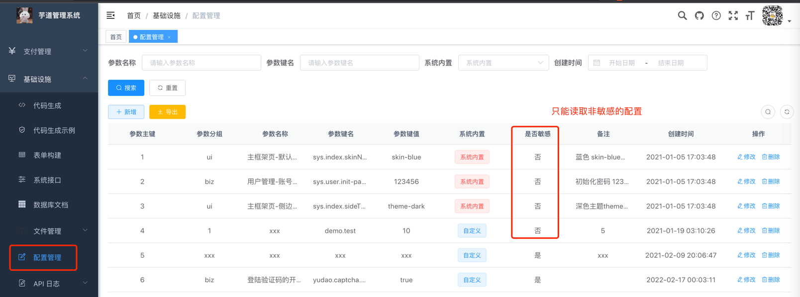

目录

# 通用方法

本小节，分享前端项目的常用方法。

## [#](#_1-tab-对象) 1. `$tab` 对象

`@tab` 对象，由 [`plugins/tab.js` (opens new window)](https://github.com/yudaocode/yudao-ui-admin-vue2/blob/master/src/plugins/tab.js) 实现，用于 Tab 标签相关的操作。它有如下方法：

① 打开页签

```js
this.$tab.openPage("用户管理", "/system/user");

this.$tab.openPage("用户管理", "/system/user").then(() => {
  // 执行结束的逻辑
})

```
② 修改页签

```js
const obj = Object.assign({}, this.$route, { title: "自定义标题" })
this.$tab.updatePage(obj);

this.$tab.updatePage(obj).then(() => {
    // 执行结束的逻辑
})

```
③ 关闭页签

```js
// 关闭当前 tab 页签，打开新页签
const obj = { path: "/system/user" };
this.$tab.closeOpenPage(obj);

// 关闭当前页签，回到首页
this.$tab.closePage();

// 关闭指定页签
const obj = { path: "/system/user", name: "User" };
this.$tab.closePage(obj);

this.$tab.closePage(obj).then(() => {
    // 执行结束的逻辑
})

```
④ 刷新页签

```js
// 刷新当前页签
this.$tab.refreshPage();

// 刷新指定页签
const obj = { path: "/system/user", name: "User" };
this.$tab.refreshPage(obj);

this.$tab.refreshPage(obj).then(() => {
    // 执行结束的逻辑
})

```
⑤ 关闭所有页签

```js
this.$tab.closeAllPage();

this.$tab.closeAllPage().then(() => {
    // 执行结束的逻辑
})

```
⑥ 关闭左侧页签

```js
this.$tab.closeLeftPage();

const obj = { path: "/system/user", name: "User" };
this.$tab.closeLeftPage(obj);

this.$tab.closeLeftPage(obj).then(() => {
    // 执行结束的逻辑
})

```
⑦ 关闭右侧页签

```js
this.$tab.closeRightPage();

const obj = { path: "/system/user", name: "User" };
this.$tab.closeRightPage(obj);

this.$tab.closeRightPage(obj).then(() => {
    // 执行结束的逻辑
})

```
⑧ 关闭其它页签

```js
this.$tab.closeOtherPage();

const obj = { path: "/system/user", name: "User" };
this.$tab.closeOtherPage(obj);

this.$tab.closeOtherPage(obj).then(() => {
    // 执行结束的逻辑
})

```
## [#](#_2-modal-对象) 2. `$modal` 对象

`@modal` 对象，由 [`plugins/modal.js` (opens new window)](https://github.com/yudaocode/yudao-ui-admin-vue2/blob/master/src/plugins/modal.js) 实现，用于做消息提示、通知提示、对话框提醒、二次确认、遮罩等。它有如下方法：

① 提供成功、警告和错误等反馈信息

```js
this.$modal.msg("默认反馈");
this.$modal.msgError("错误反馈");
this.$modal.msgSuccess("成功反馈");
this.$modal.msgWarning("警告反馈");

```
② 提供成功、警告和错误等提示信息

```js
this.$modal.alert("默认提示");
this.$modal.alertError("错误提示");
this.$modal.alertSuccess("成功提示");
this.$modal.alertWarning("警告提示");

```
③ 提供成功、警告和错误等通知信息

```js
this.$modal.notify("默认通知");
this.$modal.notifyError("错误通知");
this.$modal.notifySuccess("成功通知");
this.$modal.notifyWarning("警告通知");

```
④ 提供确认窗体信息

```js
this.$modal.confirm('确认信息').then(function() {
    // ...
}).then(() => {
    // ...
}).catch(() => {});

```
⑤ 提供遮罩层信息

```js
// 打开遮罩层
this.$modal.loading("正在导出数据，请稍后...");

// 关闭遮罩层
this.$modal.closeLoading();

```
## [#](#_3-auth-对象) 3. `$auth` 对象

`@auth` 对象，由 [`plugins/auth.js` (opens new window)](https://github.com/yudaocode/yudao-ui-admin-vue2/blob/master/src/plugins/auth.js) 实现，用于验证用户是否拥有某（些）权限或角色。它有如下方法：

① 验证用户权限

```js
// 验证用户是否具备某权限
this.$auth.hasPermi("system:user:add");
// 验证用户是否含有指定权限，只需包含其中一个
this.$auth.hasPermiOr(["system:user:add", "system:user:update"]);
// 验证用户是否含有指定权限，必须全部拥有
this.$auth.hasPermiAnd(["system:user:add", "system:user:update"]);

```
② 验证用户角色

```js
// 验证用户是否具备某角色
this.$auth.hasRole("admin");
// 验证用户是否含有指定角色，只需包含其中一个
this.$auth.hasRoleOr(["admin", "common"]);
// 验证用户是否含有指定角色，必须全部拥有
this.$auth.hasRoleAnd(["admin", "common"]);

```
## [#](#_4-cache-对象) 4. `$cache` 对象

`@auth` 对象，由 [`plugins/cache.js` (opens new window)](https://github.com/yudaocode/yudao-ui-admin-vue2/blob/master/src/plugins/cache.js) 实现，基于 session 或 local 实现不同级别的缓存。它有如下方法：

对象名称

缓存类型

session

会话级缓存，通过 [sessionStorage (opens new window)](https://developer.mozilla.org/zh-CN/docs/Web/API/Window/sessionStorage) 实现

local

本地级缓存，通过 [localStorage (opens new window)](https://developer.mozilla.org/zh-CN/docs/Web/API/Window/localStorage) 实现

① 读写 String 缓存

```js
// local 普通值
this.$cache.local.set('key', 'local value')
console.log(this.$cache.local.get('key')) // 输出 'local value'

// session 普通值
this.$cache.session.set('key', 'session value')
console.log(this.$cache.session.get('key')) // 输出 'session value'

```
② 读写 JSON 缓存

// local JSON值

```js
this.$cache.local.setJSON('jsonKey', { localProp: 1 })
console.log(this.$cache.local.getJSON('jsonKey')) // 输出 '{localProp: 1}'

// session JSON值
this.$cache.session.setJSON('jsonKey', { sessionProp: 1 })
console.log(this.$cache.session.getJSON('jsonKey')) // 输出 '{sessionProp: 1}'

```
③ 删除缓存

```js
this.$cache.local.remove('key')
this.$cache.session.remove('key')

```
## [#](#_5-download-对象) 5. `$download` 对象

`$download` 对象，由 [`plugins/download.js` (opens new window)](https://github.com/yudaocode/yudao-ui-admin-vue2/blob/master/src/plugins/download.js) 实现，用于各种类型的文件下载。它有如下方法：

方法列表

```js
this.$download.excel(data, fileName);
this.$download.word(data, fileName);
this.$download.zip(data, fileName);
this.$download.html(data, fileName);
this.$download.markdown(data, fileName);

```

在 [`user/index.vue` (opens new window)](https://github.com/yudaocode/yudao-ui-admin-vue2/blob/master/src/views/system/user/index.vue#L581-L594) 页面中，导出 Excel 文件的代码如下图：

