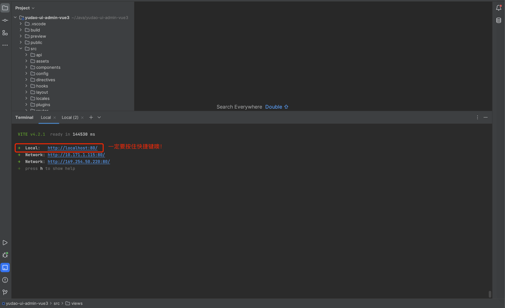
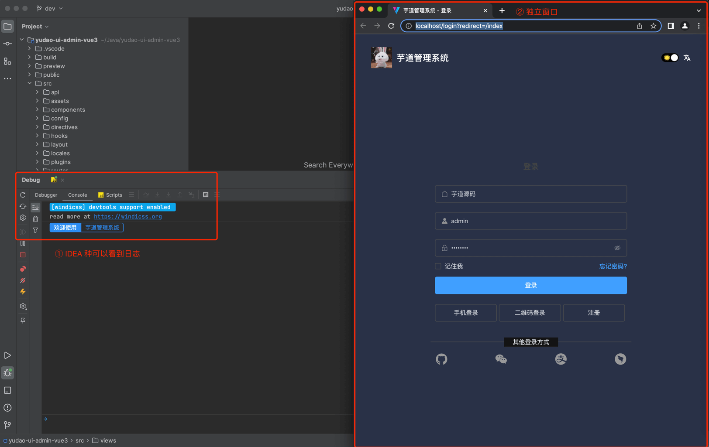
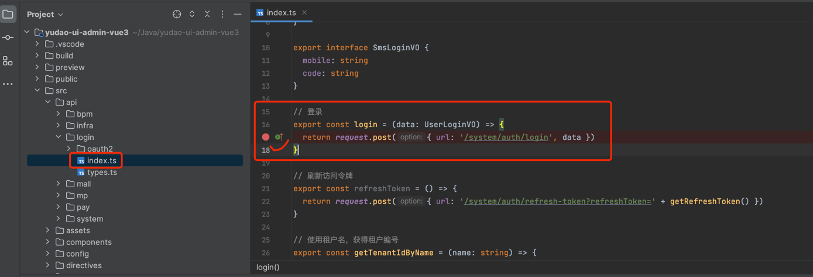
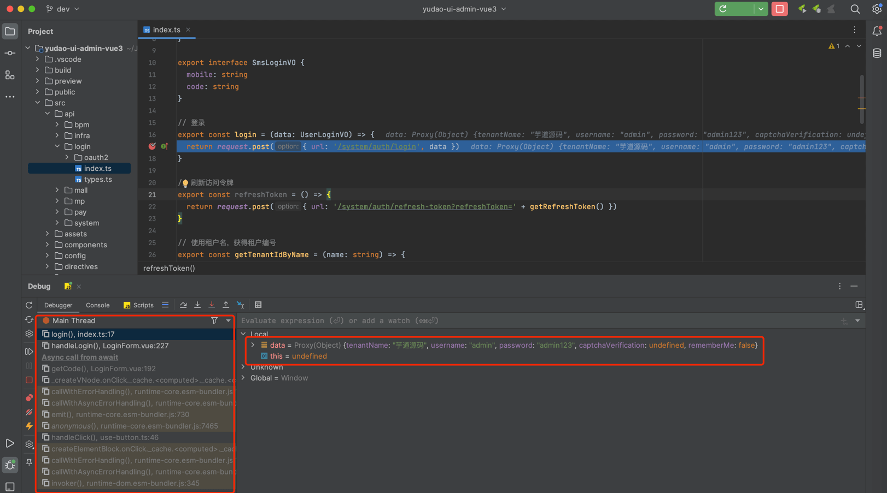
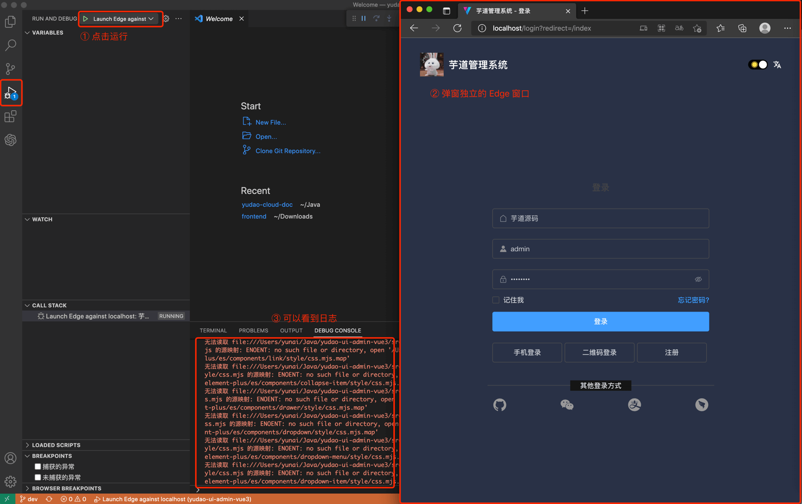
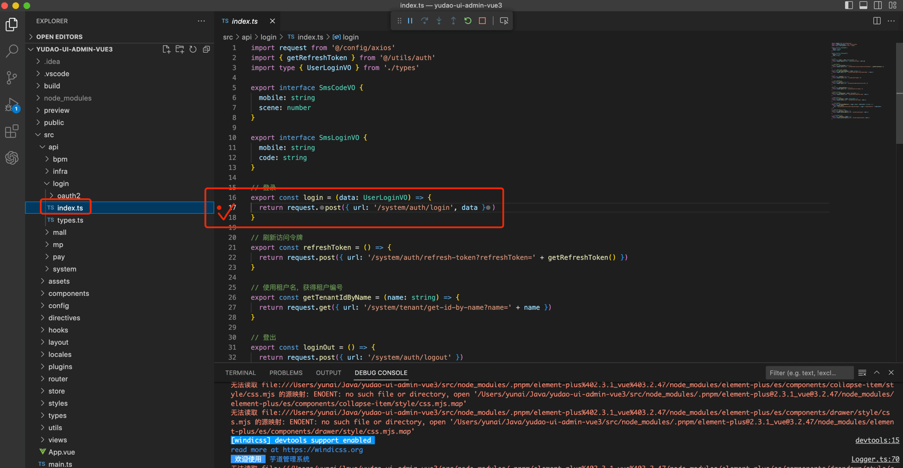
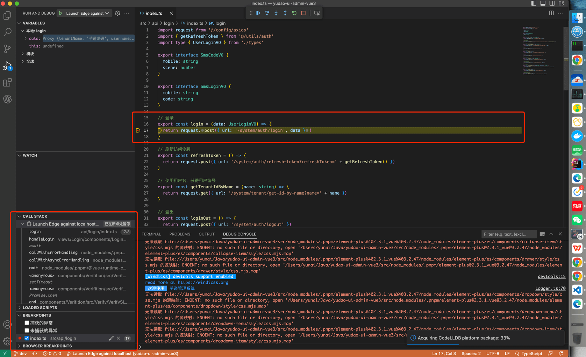

目录

# IDE 调试

除了使用 Chrome 调试 JS 代码外，我们也可以使用 IDEA / WebStorm 或 VS Code 进行代码的调试。

## [#](#_1-idea-调试) 1. IDEA 调试

友情提示：WebStorm 也支持。

① 使用 npm 命令将前端项目运行起来，例如说 `npm run dev`。耐心等待项目启动成功~

② 点击链接，Windows 需按住 Ctrl + Shift + 鼠标左键，MacOS 需要按住 Shift + Command + 鼠标左键。如下图所示：

③ 点击后，会跳出一个独立的 Chrome 窗口。如下图所示：

④ 打个断点，例如说 `/src/api/login/index.ts` 的登录接口。如下图所示：

⑤ 使用管理后台进行登录，可以看到成功进入断点。如下图所示：

## [#](#_2-vs-code-调试) 2. VS Code 调试

① 使用 npm 命令将前端项目运行起来，例如说 `npm run dev`。耐心等待项目启动成功~

② 点击 VS Code 左侧的运行和调试，然后启动 Launch，之后会跳出一个独立的 Edge 窗口。如下图所示：

③ 打个断点，例如说 `/src/api/login/index.ts` 的登录接口。如下图所示：

④ 使用管理后台进行登录，可以看到成功进入断点。如下图所示：

