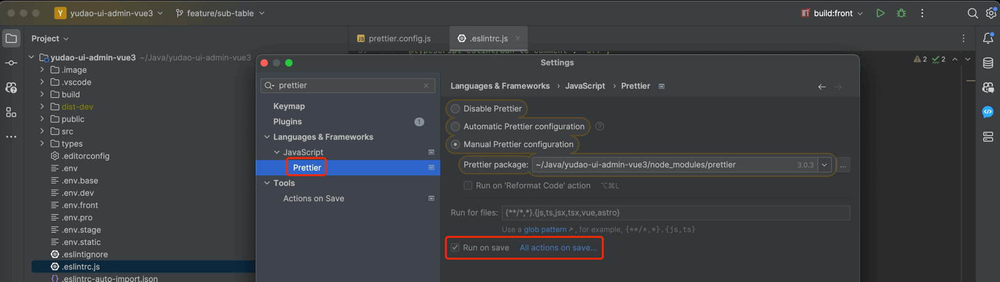
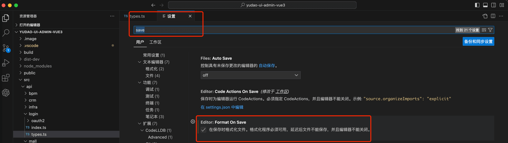
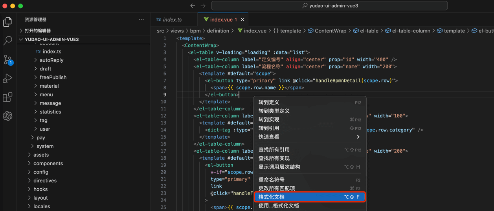

目录

# 代码格式化

项目使用 [Prettier (opens new window)](https://prettier.io/) 进行代码格式化，配置文件在 [`prettier.config.js` (opens new window)](https://github.com/yudaocode/yudao-ui-admin-vue3/blob/master/prettier.config.js)。

## [#](#_1-如何开启) 1. 如何开启？

考虑到 Prettier 在检测到格式不正确时，会弹窗错误提示，影响大家开发效率，所以目前 **默认关闭** 。

如果想要开启，只修改修改 [`.eslintrc.js` (opens new window)](https://github.com/yudaocode/yudao-ui-admin-vue3/blob/master/.eslintignore) 文件，将 `'prettier/prettier': 'off'` 删除即可。

## [#](#_2-自动格式化) 2. 自动格式化

JetBrains 和 VS Code 可以通过安装 Prettier 插件，实现按照 Prettier 自动格式化。这样，无论 Prettier 无论是否开启，都可以保证格式化的一致性。

### [#](#_2-1-jetbrains-端) 2.1 JetBrains 端

① 安装 [Prettier 插件 (opens new window)](https://plugins.jetbrains.com/plugin/10456-prettier)。默认 IDEA 和 WebStorm 已经安装，所以这步可以省略。

② 打开 Prettier 配置，勾选上 `Run on save` 选项。如下图所示：

之后，保存页面，页面代码自动格式化。

## [#](#_2-2-vs-code-端) 2.2 VS Code 端

① 安装 [Prettier 插件 (opens new window)](https://marketplace.visualstudio.com/items?itemName=esbenp.prettier-vscode)。需要手动安装！

② 打开 VS Code 配置，搜索 save 后，勾选上 `Format On Save` 选项。如下图所示：

③ 随便打开一个 Vue 文件，右键选择 `Format Document` 或者 `格式化文档`，然后选择 Prettier 即可。如下图所示：

之后，保存页面，页面代码自动格式化。