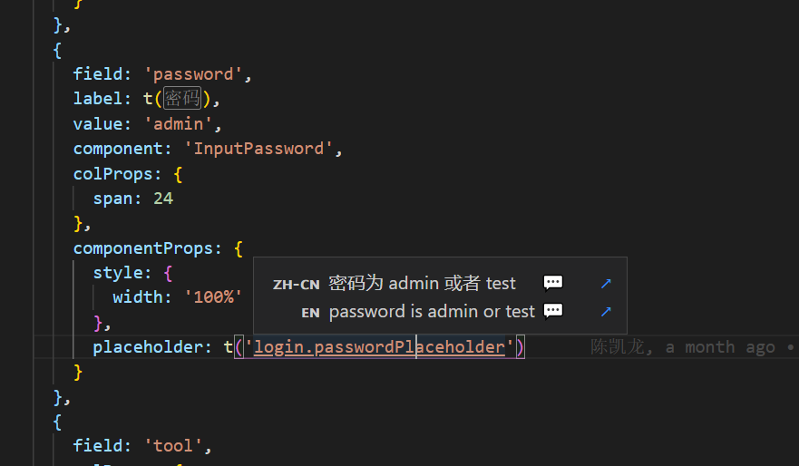

目录

# 国际化

友情提示：

该章节，基于 [《vue element plus admin —— 国际化》 (opens new window)](https://element-plus-admin-doc.cn/dep/i18n.html) 的内容修改。

如果你使用的 vscode 开发工具，则推荐安装 [I18n-ally (opens new window)](https://marketplace.visualstudio.com/items?itemName=Lokalise.i18n-ally) 这个插件

## [#](#_1-i18n-ally-插件) 1. I18n-ally 插件

安装了该插件后，你的代码内可以实时看到对应的语言内容



## [#](#_2-配置默认语言) 2. 配置默认语言

在 [src/store/modules/locale.ts (opens new window)](https://github.com/yudaocode/yudao-ui-admin-vue3/blob/master/src/store/modules/locale.ts) 内配置 `currentLocale` 为其他语言。

查看代码

```js
import { defineStore } from 'pinia'
import { store } from '../index'
import zhCn from 'element-plus/es/locale/lang/zh-cn'
import en from 'element-plus/es/locale/lang/en'
import { CACHE_KEY, useCache } from '@/hooks/web/useCache'
import { LocaleDropdownType } from '@/types/localeDropdown'

const { wsCache } = useCache()

const elLocaleMap = {
  'zh-CN': zhCn,
  en: en
}
interface LocaleState {
  currentLocale: LocaleDropdownType
  localeMap: LocaleDropdownType[]
}

export const useLocaleStore = defineStore('locales', {
  state: (): LocaleState => {
    return {
      currentLocale: {
        lang: wsCache.get(CACHE_KEY.LANG) || 'zh-CN',
        elLocale: elLocaleMap[wsCache.get(CACHE_KEY.LANG) || 'zh-CN']
      },
      // 多语言
      localeMap: [
        {
          lang: 'zh-CN',
          name: '简体中文'
        },
        {
          lang: 'en',
          name: 'English'
        }
      ]
    }
  },
  getters: {
    getCurrentLocale(): LocaleDropdownType {
      return this.currentLocale
    },
    getLocaleMap(): LocaleDropdownType[] {
      return this.localeMap
    }
  },
  actions: {
    setCurrentLocale(localeMap: LocaleDropdownType) {
      // this.locale = Object.assign(this.locale, localeMap)
      this.currentLocale.lang = localeMap?.lang
      this.currentLocale.elLocale = elLocaleMap[localeMap?.lang]
      wsCache.set(CACHE_KEY.LANG, localeMap?.lang)
    }
  }
})

export const useLocaleStoreWithOut = () => {
  return useLocaleStore(store)
}

```
## [#](#_3-语言文件) 3. 语言文件

在 [src/locales (opens new window)](https://github.com/yudaocode/yudao-ui-admin-vue3/blob/master/src/locales/) 可以配置具体的语言。

目前项目中的语言都是没有拆分的，全部放一起，后续会考虑拆分出来，比较好维护。

## [#](#_4-语言导入逻辑说明) 4. 语言导入逻辑说明

在 [src/plugins/vueI18n/index.ts (opens new window)](https://github.com/yudaocode/yudao-ui-admin-vue3/blob/master/src/plugins/vueI18n/index.ts#L13) 内可以看到

```js
const defaultLocal = await import(`../../locales/${locale.lang}.ts`)

```

这会导入 `src/locales` 文件语言包。

## [#](#_5-使用) 5. 使用

引入项目自带的 `useI18n`

**注意不要引入 vue-i18n 的 useI18n**

```js
import { useI18n } from '/@/hooks/web/useI18n'

const { t } = useI18n()

const title = t('common.menu')

```

## [#](#_6-切换语言) 6. 切换语言

切换语言需要使用 [src/hooks/web/useLocale.ts (opens new window)](https://github.com/yudaocode/yudao-ui-admin-vue3/blob/master/src/hooks/web/useLocale.ts#L19-L35)

```js
import { useLocale } from '@/hooks/web/useLocale'
const { changeLocale } = useLocale()

changeLocale('en')

```

## [#](#_7-新增新语言) 7. 新增新语言
### [#](#_7-1-语言文件) 7.1 语言文件

在 [src/locales (opens new window)](https://github.com/yudaocode/yudao-ui-admin-vue3/blob/master/src/locales/) 增加对应语言的文件即可

### [#](#_7-2-新增语言) 7.2 新增语言

目前项目自带的语言只有 `zh_CN` 和 `en` 两种

如果需要新增，按以下操作即可

1.  在 [src/locales (opens new window)](https://github.com/yudaocode/yudao-ui-admin-vue3/blob/master/src/locales/) 下语言文件
2.  在 [types/global.d.ts (opens new window)](https://github.com/yudaocode/yudao-ui-admin-vue3/blob/master/types/global.d.ts#L15) 给 `LocaleType` 添加对应的类型
3.  在 [src/store/modules/locale.ts](hhttps://github.com/yudaocode/yudao-ui-admin-vue3/blob/master/src/store/modules/locale.ts#L26-L38) `localeMap` 中添加对应语言

## [#](#_8-远程读取语言数据) 8. 远程读取语言数据

目前项目会在 `src/main.ts` 内等待 `setupI18n` 这个函数执行完之后才会渲染界面，所以只需在 setupI18n 内的 `createI18nOptions` 发送 ajax 请求，将对应的数据设置到 i18n 实例上即可。

```js
const createI18nOptions = async (): Promise<I18nOptions> => {
  const localeStore = useLocaleStoreWithOut()
  const locale = localeStore.getCurrentLocale
  const localeMap = localeStore.getLocaleMap
  // 这里改为远程请求即可。
  const defaultLocal = await import(`../../locales/${locale.lang}.ts`)
  const message = defaultLocal.default ?? {}

  setHtmlPageLang(locale.lang)

  localeStore.setCurrentLocale({
    lang: locale.lang
    // elLocale: elLocal
  })

  return {
    legacy: false,
    locale: locale.lang,
    fallbackLocale: locale.lang,
    messages: {
      [locale.lang]: message
    },
    availableLocales: localeMap.map((v) => v.lang),
    sync: true,
    silentTranslationWarn: true,
    missingWarn: false,
    silentFallbackWarn: true
  }
}

```

### [#](#_8-1-uselocale) 8.1 useLocale

代码: [src/hooks/web/useLocale.ts (opens new window)](https://github.com/yudaocode/yudao-ui-admin-vue3/blob/master/src/hooks/web/useLocale.ts#L19-L35)

当手动切换语言的时候会触发 `useLocale` 函数，useLocale 也是异步函数，只需等待接口返回响应的数据后，再进行设置即可

```js
export const useLocale = () => {
  // Switching the language will change the locale of useI18n
  // And submit to configuration modification
  const changeLocale = async (locale: LocaleType) => {
    const globalI18n = i18n.global
    
    // 改为远程获取
    const langModule = await import(`../../locales/${locale}.ts`)

    globalI18n.setLocaleMessage(locale, langModule.default)

    setI18nLanguage(locale)
  }

  return {
    changeLocale
  }
}

```