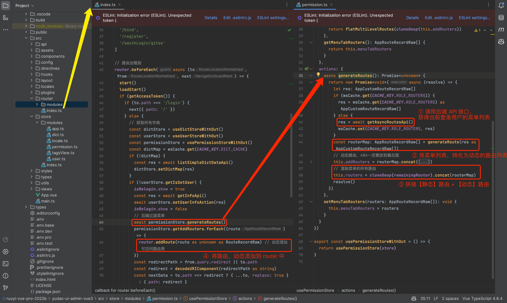
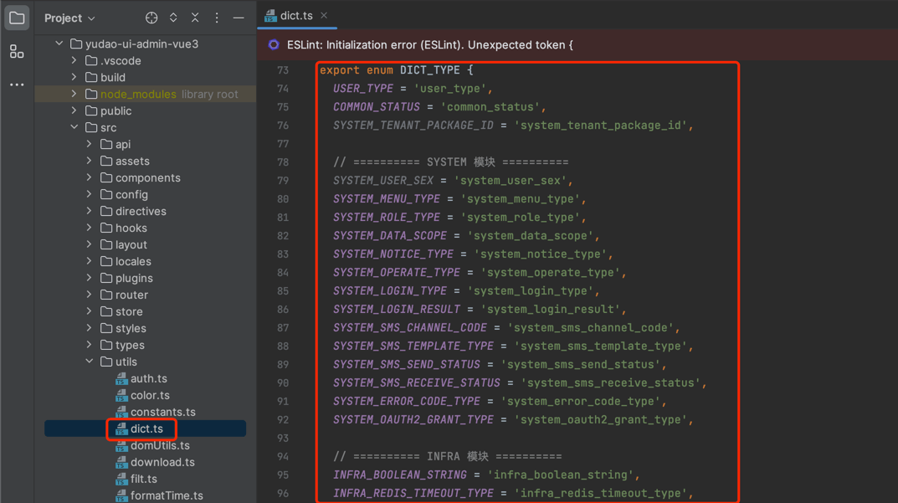
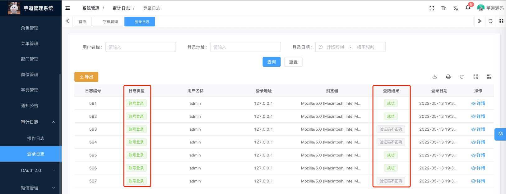
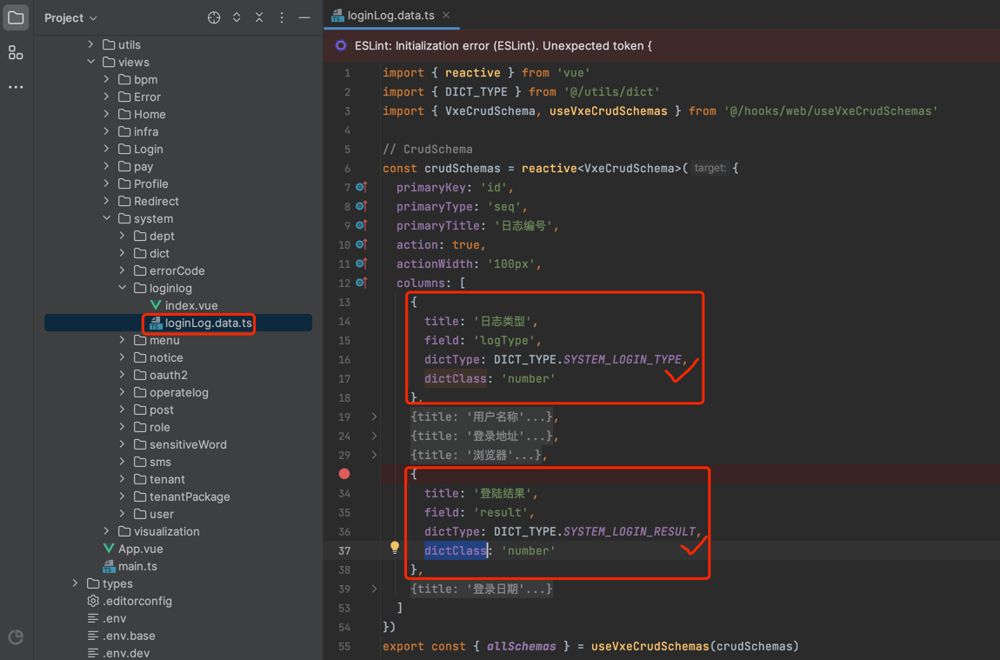

目录

# 字典数据

本小节，讲解前端如何使用 \[系统管理 -> 字典管理\] 菜单的字典数据，例如说字典数据的下拉框、单选 / 多选按钮、高亮展示等等。


## [#](#_1-全局缓存) 1. 全局缓存

用户登录成功后，前端会从后端获取到全量的字典数据，缓存在 store 中。如下图所示：



这样，前端在使用到字典数据时，无需重复请求后端，提升用户体验。

不过，缓存暂时未提供刷新，所以在字典数据发生变化时，需要用户刷新浏览器，进行重新加载。

## [#](#_2-dict-type) 2. DICT\_TYPE

在 [`dict.ts` (opens new window)](https://github.com/yudaocode/yudao-ui-admin-vue3/blob/master/src/utils/dict.ts#L73-L125) 文件中，使用 `DICT_TYPE` 枚举了字典的 KEY。如下图所示：



后续如果有新的字典 KEY，需要你自己进行添加。

## [#](#_3-dicttag-字典标签) 3. DictTag 字典标签

[`<dict-tag />` (opens new window)](https://github.com/yudaocode/yudao-ui-admin-vue3/blob/master/src/components/DictTag/index.ts) 组件，翻译字段对应的字典展示文本，并根据 `colorType`、`cssClass` 进行高亮。使用示例如下：

```html
<!--
    type: 字典 KEY
    value: 字典值
-->
<dict-tag :type="DICT_TYPE.SYSTEM_LOGIN_TYPE" :value="row.logType" />

```



【推荐】注意，一般情况下使用 CRUD schemas 方式，不需要直接使用 `<dict-tag />`，而是通过 `columns` 的 `dictType` 和 `dictClass` 属性即可。如下图所示：



## [#](#_4-字典工具类) 4. 字典工具类

在 [`dict.ts` (opens new window)](https://github.com/yudaocode/yudao-ui-admin-vue3/blob/master/src/utils/dict.ts#L23-L71) 文件中，提供了字典工具类，方法如下：

```js
// 获取 dictType 对应的数据字典数组【object】
export const getDictOptions = (dictType: string) => {{ /** 省略代码 */ }

// 获取 dictType 对应的数据字典数组【int】
export const getIntDictOptions = (dictType: string) => { /** 省略代码 */ }

// 获取 dictType 对应的数据字典数组【string】
export const getStrDictOptions = (dictType: string) => { /** 省略代码 */ }

// 获取 dictType 对应的数据字典数组【boolean】
export const getBoolDictOptions = (dictType: string) => { /** 省略代码 */ }

// 获取 dictType 对应的数据字典数组【object】
export const getDictObj = (dictType: string, value: any) => { /** 省略代码 */ }

```

结合 Element Plus 的表单组件，使用示例如下：

```html
<template>
  <!-- radio 单选框 -->
  <el-radio 
    v-for="dict in getIntDictOptions(DICT_TYPE.COMMON_STATUS)"
    :key="dict.value" 
    :label="parseInt(dict.value)"
  >
    {{dict.label}}
  </el-radio>
    
  <!-- select 下拉框 -->
  <el-select v-model="form.code" placeholder="请选择渠道编码" clearable>
    <el-option 
      v-for="dict in getStrDictOptions(DICT_TYPE.SYSTEM_SMS_CHANNEL_CODE)"
      :key="dict.value" 
      :label="dict.label" 
      :value="dict.value"
    />
  </el-select>
</template>
<script setup lang="tsx">
import { DICT_TYPE, getIntDictOptions, getStrDictOptions } from '@/utils/dict'
</script>

```