目录

# 系统组件

## [#](#_1-常用组件) 1. 常用组件
### [#](#_1-1-editor-富文本组件) 1.1 Editor 富文本组件

基于 [wangEditor (opens new window)](https://www.wangeditor.com/) 封装

*   Editor 组件：位于 [src/components/Editor (opens new window)](https://github.com/yudaocode/yudao-ui-admin-vue3/blob/master/src/components/Editor/index.ts) 内
*   详细文档：[vue-element-plus-admin-doc/components/editor.html (opens new window)](https://element-plus-admin-doc.cn/components/editor.html)
*   实战案例：[src/views/system/notice/form.vue (opens new window)](https://github.com/yudaocode/yudao-ui-admin-vue3/blob/master/src/views/system/notice/form.vue#L14)

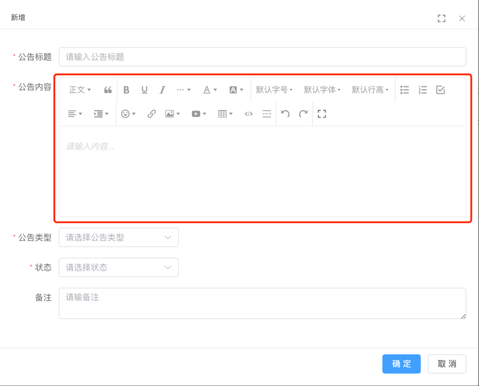

### [#](#_1-2-dialog-弹窗组件) 1.2 Dialog 弹窗组件

对 Element Plus 的 Dialog 组件进行封装，支持最大化、最大高度等特性

*   Dialog 组件：位于 [src/components/Dialog (opens new window)](https://github.com/yudaocode/yudao-ui-admin-vue3/blob/master/src/components/Dialog/index.ts) 内
*   详细文档：[vue-element-plus-admin-doc/components/dialog.html (opens new window)](https://element-plus-admin-doc.cn/components/dialog.html)
*   实战案例：[src/views/system/dept/DeptForm.vue (opens new window)](https://github.com/yudaocode/yudao-ui-admin-vue3/blob/master/src/views/system/dept/DeptForm.vue#L2)

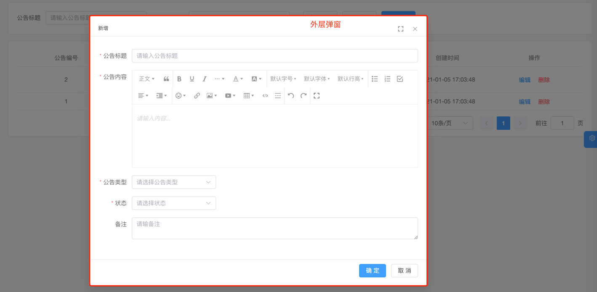

### [#](#_1-3-contentwrap-包裹组件) 1.3 ContentWrap 包裹组件

对 Element Plus 的 ElCard 组件进行封装，自带标题、边距

*   ContentWrap 组件：位于 [src/components/ContentWrap (opens new window)](https://github.com/yudaocode/yudao-ui-admin-vue3/blob/master/src/components/ContentWrap/index.ts) 内
*   实战案例：[src/views/system/post/index.vue (opens new window)](https://github.com/yudaocode/yudao-ui-admin-vue3/blob/master/src/views/system/post/index.vue#L2)

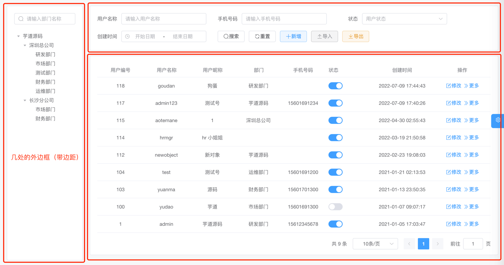

### [#](#_1-4-pagination-分页组件) 1.4 Pagination 分页组件

对 Element Plus 的 [Pagination (opens new window)](https://element-plus.org/zh-CN/component/pagination.html) 组件进行封装

*   Pagination 组件：位于 [src/components/Pagination (opens new window)](https://github.com/yudaocode/yudao-ui-admin-vue3/blob/master/src/components/Pagination/index.vue) 内
*   实战案例：[src/views/system/post/index.vue (opens new window)](https://github.com/yudaocode/yudao-ui-admin-vue3/blob/master/src/views/system/post/index.vue#L101-L107)

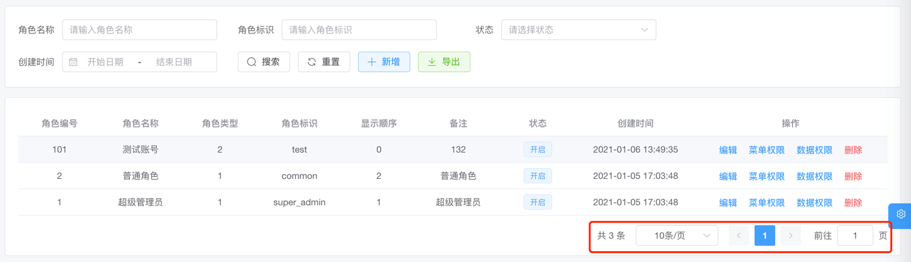

### [#](#_1-5-uploadfile-上传文件组件) 1.5 UploadFile 上传文件组件

对 Element Plus 的 [Upload (opens new window)](https://element-plus.org/zh-CN/component/upload.html) 组件进行封装，上传文件到文件服务

*   UploadFile 组件：位于 [src/components/UploadFile/src/UploadFile.vue (opens new window)](https://github.com/yudaocode/yudao-ui-admin-vue3/blob/master/src/components/UploadFile/src/UploadFile.vue) 内
*   实战案例：暂无

### [#](#_1-6-uploadimg-上传图片组件) 1.6 UploadImg 上传图片组件

对 Element Plus 的 [Upload (opens new window)](https://element-plus.org/zh-CN/component/upload.html) 组件进行封装，上传图片到文件服务

*   UploadImg 组件：位于 [src/components/UploadFile/src/UploadImg.vue (opens new window)](https://github.com/yudaocode/yudao-ui-admin-vue3/blob/master/src/components/UploadFile/src/UploadImg.vue) 内
*   实战案例：[src/views/system/oauth2/client/ClientForm.vue (opens new window)](https://github.com/yudaocode/yudao-ui-admin-vue3/blob/master/src/views/system/oauth2/client/ClientForm.vue#L20)

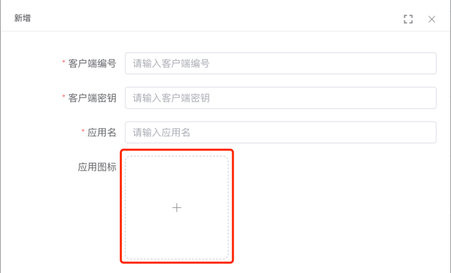

## [#](#_2-不常用组件) 2. 不常用组件
### [#](#_2-1-echart-图表组件) 2.1 EChart 图表组件

基于 [Apache ECharts (opens new window)](https://echarts.apache.org/zh/index.html) 封装，自适应窗口大小

*   EChart 组件：位于 [src/components/EChart (opens new window)](https://github.com/yudaocode/yudao-ui-admin-vue3/blob/master/src/components/Echart/index.ts) 内
*   详细文档：[vue-element-plus-admin-doc/components/echart.html (opens new window)](https://element-plus-admin-doc.cn/components/echart.html)
*   实战案例：[src/views/mp/statistics/index.vue (opens new window)](https://github.com/yudaocode/yudao-ui-admin-vue3/blob/master/src/views/mp/statistics/index.vue#L49)

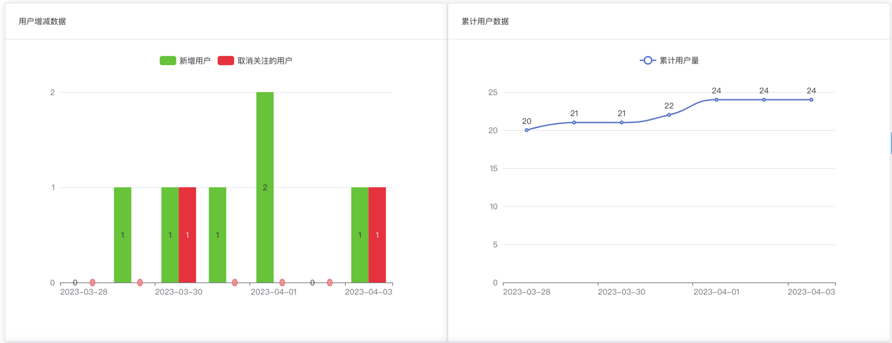

### [#](#_2-2-inputpassword-密码输入框) 2.2 InputPassword 密码输入框

对 Element Plus 的 Input 组件进行封装

*   InputPassword 组件：位于 [src/components/InputPassword (opens new window)](https://github.com/yudaocode/yudao-ui-admin-vue3/blob/master/src/components/InputPassword/index.ts) 内
*   详细文档：[vue-element-plus-admin-doc/components/input-password.html (opens new window)](https://element-plus-admin-doc.cn/components/input-password.html)
*   实战案例：[src/views/Profile/components/ResetPwd.vue (opens new window)](https://github.com/yudaocode/yudao-ui-admin-vue3/blob/master/src/views/Profile/components/ResetPwd.vue)

### [#](#_2-3-contentdetailwrap-详情包裹组件) 2.3 ContentDetailWrap 详情包裹组件

用于展示详情，自带返回按钮。

*   ContentDetailWrap 组件：位于 [src/components/ContentDetailWrap (opens new window)](https://github.com/yudaocode/yudao-ui-admin-vue3/blob/master/src/components/ContentDetailWrap/index.ts) 内
*   详细文档：[vue-element-plus-admin-doc/components/content-detail-wrap.html (opens new window)](https://element-plus-admin-doc.cn/components/content-detail-wrap.html)
*   实战案例：暂无

### [#](#_2-4-imageviewer-图片预览组件) 2.4 ImageViewer 图片预览组件

将 Element Plus 的 [ImageViewer (opens new window)](https://element-plus.org/zh-CN/component/image.html#image-viewer-attributes) 组件函数化，通过函数方便创建组件

*   ImageViewer 组件：位于 [src/components/ImageViewer (opens new window)](https://github.com/yudaocode/yudao-ui-admin-vue3/blob/master/src/components/ImageViewer/index.ts) 内
*   详细文档：[vue-element-plus-admin-doc/components/image-viewer.html (opens new window)](https://element-plus-admin-doc.cn/components/image-viewer.html)
*   实战案例：暂无

### [#](#_2-5-qrcode-二维码组件) 2.5 Qrcode 二维码组件

基于 [qrcode (opens new window)](https://www.npmjs.com/package/qrcode) 封装

*   Qrcode 组件：位于 [src/components/Qrcode (opens new window)](https://github.com/yudaocode/yudao-ui-admin-vue3/blob/master/src/components/Qrcode/index.ts) 内
*   详细文档：[vue-element-plus-admin-doc/components/qrcode.html (opens new window)](https://element-plus-admin-doc.cn/components/qrcode.html)
*   实战案例：暂无

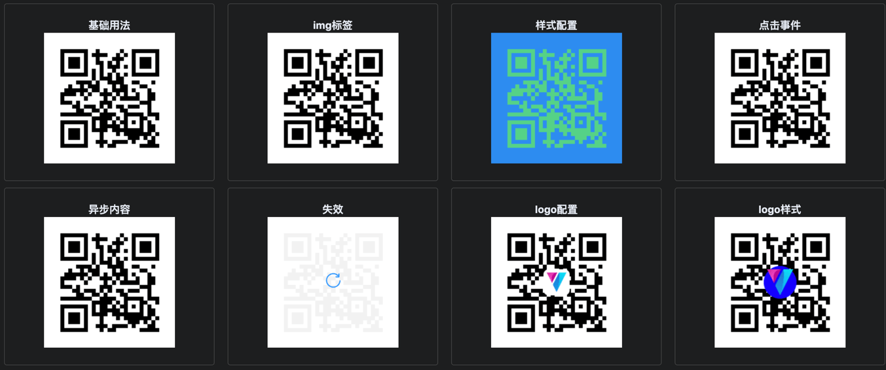

### [#](#_2-6-highlight-高亮组件) 2.6 Highlight 高亮组件

*   Highlight 组件：位于 [src/components/Highlight (opens new window)](https://github.com/yudaocode/yudao-ui-admin-vue3/blob/master/src/components/Highlight/index.ts) 内
*   详细文档：[vue-element-plus-admin-doc/components/highlight.html (opens new window)](https://element-plus-admin-doc.cn/components/highlight.html)
*   实战案例：暂无

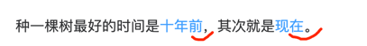

#### [#](#_2-6-1-infotip-信息提示组件) 2.6.1 Infotip 信息提示组件

基于 Highlight 组件封装

*   Infotip 组件：位于 [src/components/Infotip (opens new window)](https://github.com/yudaocode/yudao-ui-admin-vue3/blob/master/src/components/Infotip/index.ts) 内
*   详细文档：[vue-element-plus-admin-doc/components/infotip.html (opens new window)](https://element-plus-admin-doc.cn/components/infotip.html)
*   实战案例：暂无

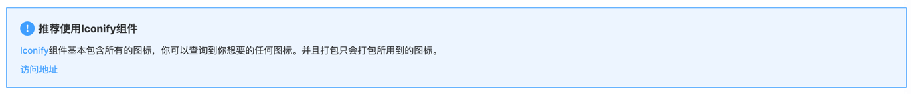

### [#](#_2-7-error-缺省组件) 2.7 Error 缺省组件

用于各种占位图组件，如 404、403、500 等错误页面。

*   Error 组件：位于 [src/components/Error (opens new window)](https://github.com/yudaocode/yudao-ui-admin-vue3/blob/master/src/components/Error/index.ts) 内
*   详细文档：[vue-element-plus-admin-doc/components/error.html (opens new window)](https://element-plus-admin-doc.cn/components/error.html)
*   实战案例：[403.vue (opens new window)](https://github.com/yudaocode/yudao-ui-admin-vue3/blob/master/src/views/Error/403.vue)、[404.vue (opens new window)](https://github.com/yudaocode/yudao-ui-admin-vue3/blob/master/src/views/Error/404.vue)、[500.vue (opens new window)](https://github.com/yudaocode/yudao-ui-admin-vue3/blob/master/src/views/Error/500.vue)

### [#](#_2-8-sticky-黏性组件) 2.8 Sticky 黏性组件

*   Sticky 组件：位于 [src/components/Sticky (opens new window)](https://github.com/yudaocode/yudao-ui-admin-vue3/blob/master/src/components/Sticky/index.ts) 内
*   详细文档：[vue-element-plus-admin-doc/components/sticky.html (opens new window)](https://element-plus-admin-doc.cn/components/sticky.html)
*   实战案例：暂无

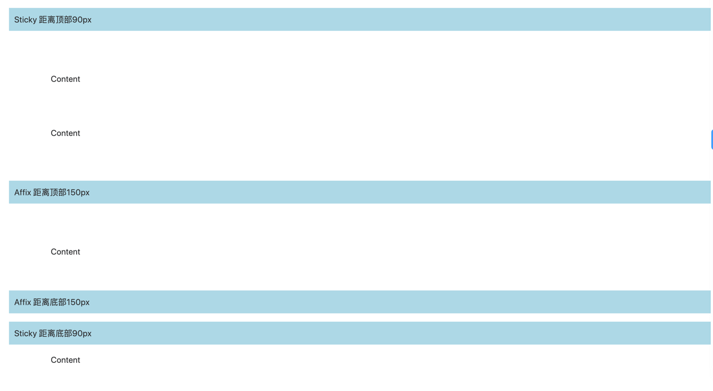

### [#](#_2-9-countto-数字动画组件) 2.9 CountTo 数字动画组件

*   CountTo 组件：位于 [src/components/CountTo (opens new window)](https://github.com/yudaocode/yudao-ui-admin-vue3/blob/master/src/components/CountTo/index.ts) 内
*   详细文档：[vue-element-plus-admin-doc/components/count-to.html (opens new window)](https://element-plus-admin-doc.cn/components/count-to.html)
*   实战案例：暂无

### [#](#_2-10-usewatermark-水印组件) 2.10 useWatermark 水印组件

为元素设置水印

*   useWatermark 组件：位于 [src/hooks/web/useWatermark.ts (opens new window)](https://github.com/yudaocode/yudao-ui-admin-vue3/blob/master/src/hooks/web/useWatermark.ts) 内
*   详细文档：[vue-element-plus-admin-doc/hooks/useWatermark.html (opens new window)](https://element-plus-admin-doc.cn/hooks/useWatermark.html)
*   实战案例：暂无

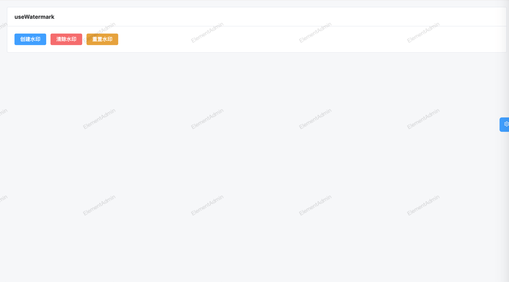

### [#](#_2-11-form-create-动态表单生成器) 2.11 form-create 动态表单生成器

详细文档：[http://www.form-create.com/ (opens new window)](http://www.form-create.com/)

① 实战案例 - 表单设计：[src/views/infra/build/index.vue (opens new window)](https://github.com/yudaocode/yudao-ui-admin-vue3/blob/master/src/views/infra/build/index.vue)

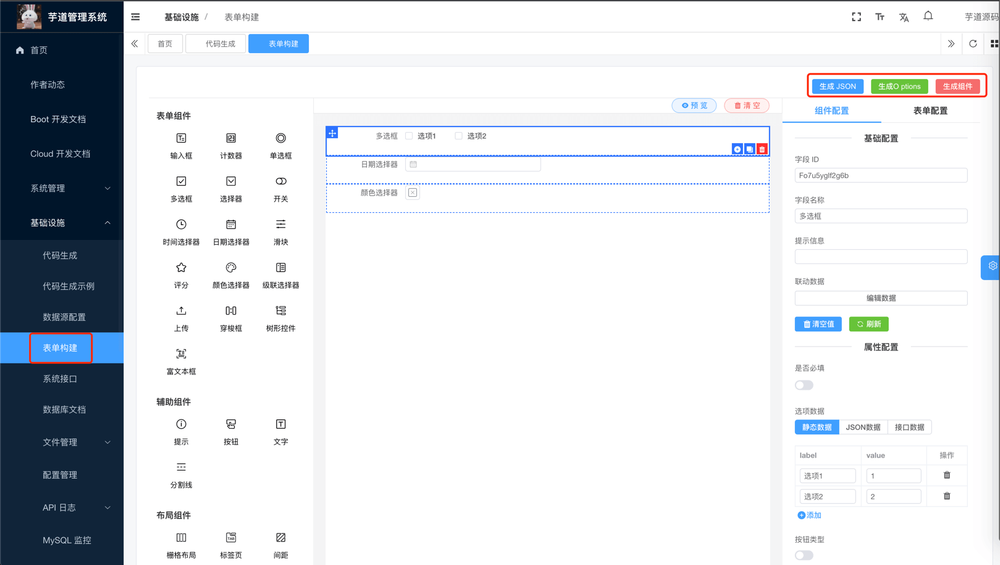

② 实战案例 - 表单展示：[src/views/bpm/processInstance/detail/index.vue (opens new window)](https://github.com/yudaocode/yudao-ui-admin-vue3/blob/master/src/views/bpm/processInstance/detail/index.vue#L62-L67)

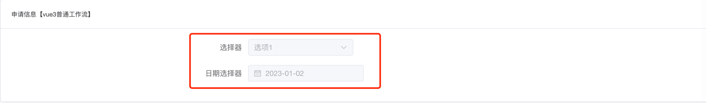

### [#](#_2-12-bpmn-js-工作流组件) 2.12 bpmn-js 工作流组件

核心是基于 [bpmn-js (opens new window)](https://bpmn.io/toolkit/bpmn-js/) 封装

#### [#](#_2-12-1-myprocessdesigner-流程设计组件) 2.12.1 MyProcessDesigner 流程设计组件

*   MyProcessDesigner 组件：位于 [src/components/bpmnProcessDesigner/package/designer/index.ts (opens new window)](https://github.com/yudaocode/yudao-ui-admin-vue3/blob/master/src/components/bpmnProcessDesigner/package/designer/index.ts) 内，基于 [https://gitee.com/MiyueSC/bpmn-process-designer (opens new window)](https://gitee.com/MiyueSC/bpmn-process-designer) 项目适配
*   实战案例：[src/views/bpm/model/editor/index.vue (opens new window)](https://github.com/yudaocode/yudao-ui-admin-vue3/blob/master/src/views/bpm/model/editor/index.vue#L3-L15)

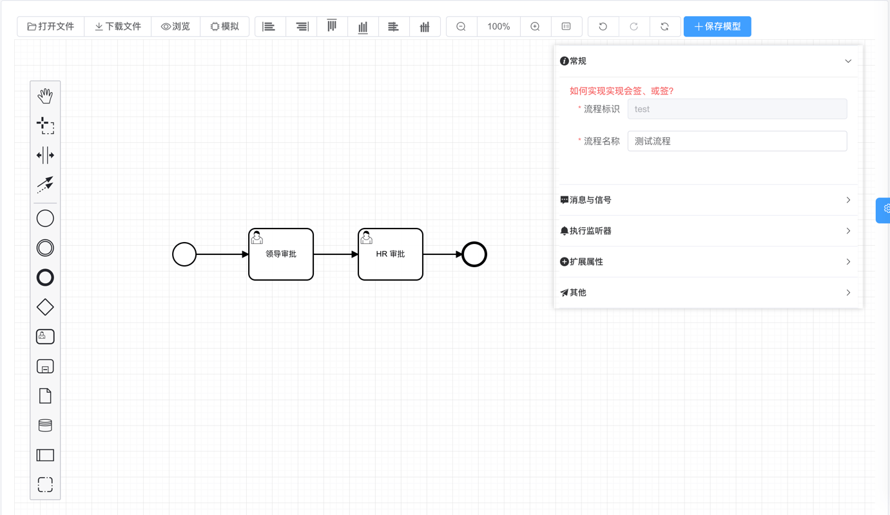

#### [#](#_2-12-2-myprocessviewer-流程展示组件) 2.12.2 MyProcessViewer 流程展示组件

*   MyProcessViewer 组件：位于 [src/components/bpmnProcessDesigner/package/designer/index2.ts (opens new window)](https://github.com/yudaocode/yudao-ui-admin-vue3/blob/master/src/components/bpmnProcessDesigner/package/designer/index2.ts) 内
*   实战案例：[src/views/bpm/processInstance/detail/ProcessInstanceBpmnViewer.vue (opens new window)](https://github.com/yudaocode/yudao-ui-admin-vue3/blob/master/src/views/bpm/processInstance/detail/ProcessInstanceBpmnViewer.vue#L6-L14)

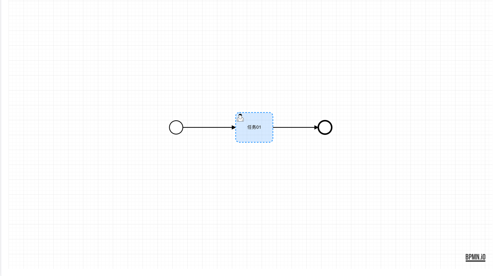

## [#](#_3-组件注册) 3. 组件注册

友情提示：

该小节，基于 [《vue element plus admin —— 组件注册 》 (opens new window)](https://element-plus-admin-doc.cn/guide/component.html) 的内容修改。

组件注册可以分成两种类型：按需引入、全局注册。

### [#](#_3-1-按需引入) 3.1 按需引入

项目目前的组件注册机制是按需注册，是在需要用到的页面才引入。

```vue
<script setup lang="ts">
import { ElBacktop } from 'element-plus'
import { useDesign } from '@/hooks/web/useDesign'

const { getPrefixCls, variables } = useDesign()

const prefixCls = getPrefixCls('backtop')
</script>

<template>
  <ElBacktop
    :class="`${prefixCls}-backtop`"
    :target="`.${variables.namespace}-layout-content-scrollbar .${variables.elNamespace}-scrollbar__wrap`"
  />
</template>

```

注意：**tsx 文件内不能使用全局注册组件**，需要手动引入组件使用。

### [#](#_3-2-全局注册) 3.2 全局注册

如果觉得按需引入太麻烦，可以进行全局注册，在 [src/components/index.ts (opens new window)](https://github.com/yudaocode/yudao-ui-admin-vue3/blob/master/src/components/index.ts)，添加需要注册的组件。

以 `Icon` 组件进行了全局注册，举个例子：

```typescript
import type { App } from 'vue'
import { Icon } from './Icon'

export const setupGlobCom = (app: App<Element>): void => {
  app.component('Icon', Icon)
}

```

如果 Element Plus 的组件需要全局注册，在 [src/plugins/elementPlus/index.ts (opens new window)](https://github.com/yudaocode/yudao-ui-admin-vue3/blob/master/src/plugins/elementPlus/index.ts) 添加需要注册的组件。

以 Element Plus 中只有 `ElLoading` 与 `ElScrollbar` 进行全局注册，举个例子：

```typescript
import type { App } from 'vue'

// 需要全局引入一些组件，如 ElScrollbar，不然一些下拉项样式有问题
import { ElLoading, ElScrollbar } from 'element-plus'

const plugins = [ElLoading]

const components = [ElScrollbar]

export const setupElementPlus = (app: App) => {
  plugins.forEach((plugin) => {
    app.use(plugin)
  })

  components.forEach((component) => {
    app.component(component.name, component)
  })
}

```