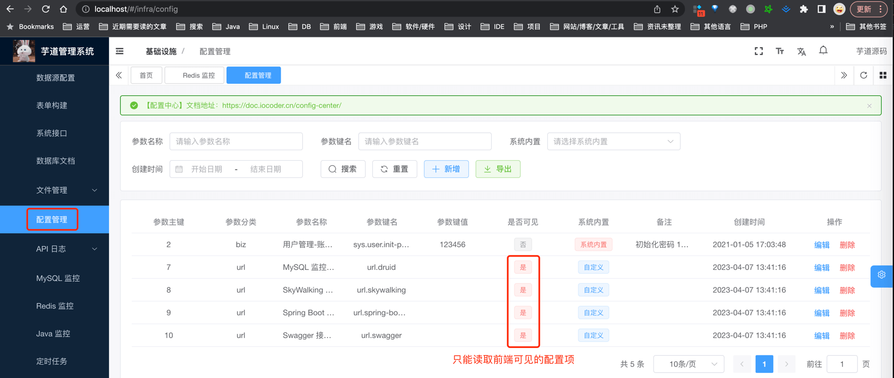
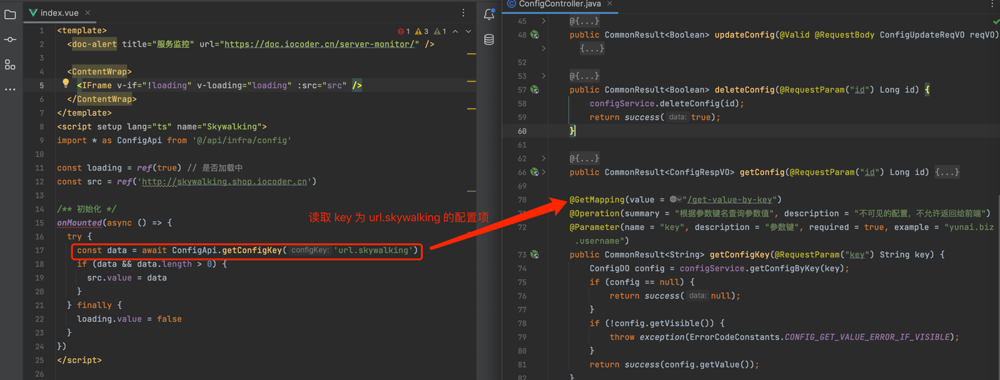

目录

# 配置读取

在 \[基础设施 -> 配置管理\] 菜单，可以动态修改配置，无需重启服务器即可生效。



提示

对应 [《后端手册 —— 配置中心》](/config-center/) 文档。

## [#](#_1-读取配置) 1. 读取配置

前端调用 [`/@api/infra/config/index.ts` (opens new window)](https://github.com/yudaocode/yudao-ui-admin-vue3/blob/master/src/api/infra/config/index.ts#L25-L28) 的 `#getConfigKey(configKey)` 方法，获取指定 key 对应的配置的值。代码如下：

```typescript
// 根据参数键名查询参数值
export const getConfigKey = (configKey: string) => {
    return request.get({ url: '/infra/config/get-value-by-key?key=' + configKey })
}

```

## [#](#_2-实战案例) 2. 实战案例

在 [`src/views/infra/server/index.vue` (opens new window)](https://github.com/yudaocode/yudao-ui-admin-vue3/blob/master/src/views/infra/server/index.vue) 页面中，获取 key 为 `"url.skywalking"` 的配置的值。代码如下：

