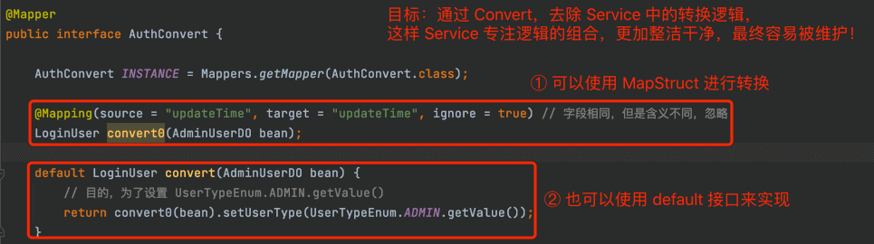
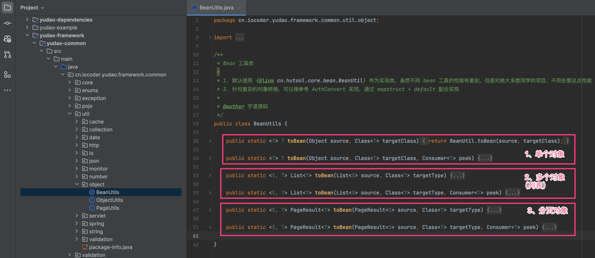
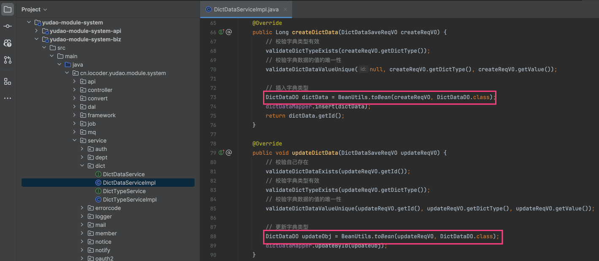
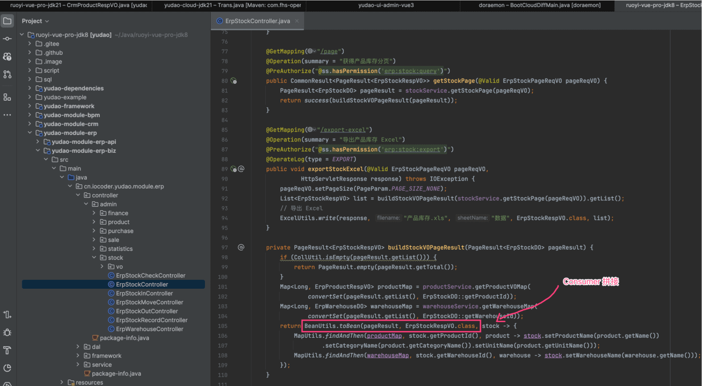
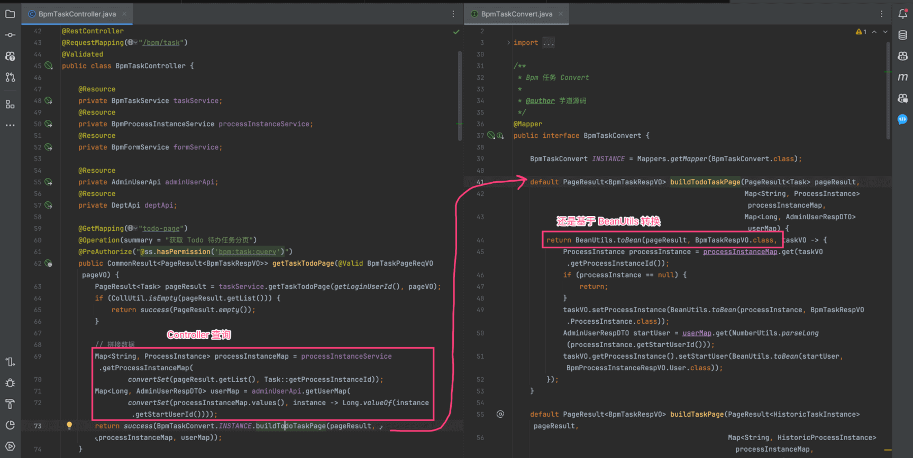
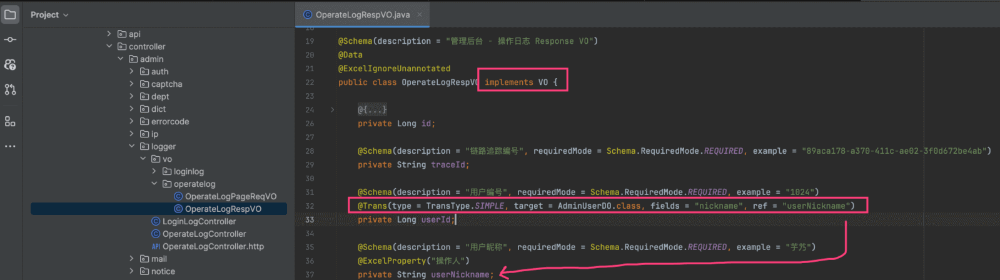
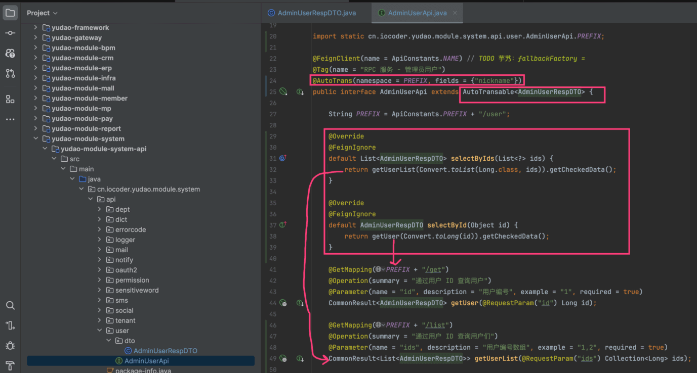
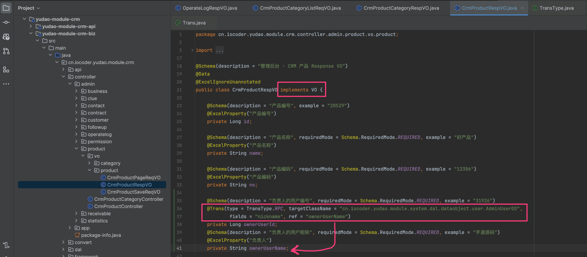
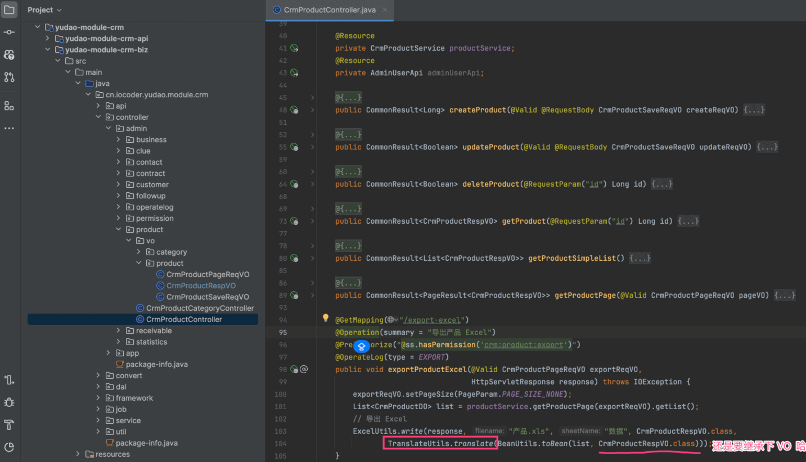
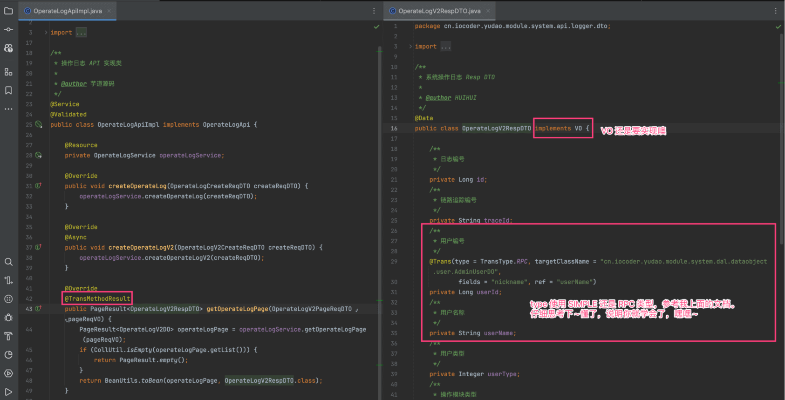

目录

# VO 对象转换、数据翻译

本小节，我们来讲解 VO 的对象转换、数据翻译的功能。注意，这里的 VO 是泛指 Java POJO 对象，也可以是 DTO、BO 等等。

## [#](#_1-对象转换) 1. 对象转换

对象转换，指的是 A 类型对象，转换成 B 类型对象。例如说，我们有一个 UserDO 类型对象，需要转换成 UserVO 或者 UserDTO 类型对象。

市面上有很多的对象转换工具，例如说 MapStruct、Dozer、各种 BeanUtils、BeanCopier 等等。目前我们提供了 MapStruct、BeanUtils 两种解决方案。

相比来说，MapStruct 性能会略好于 BeanUtils，但是相比数据库操作带来的耗时来说，基本可以忽略不计。因此，一般情况下，建议使用 BeanUtils 即可。

### [#](#_1-1-mapstruct) 1.1 MapStruct

项目使用 [MapStruct (opens new window)](https://www.iocoder.cn/Spring-Boot/MapStruct/?yudao) 实现 VO、DO、DTO 等对象之间的转换。

如果你没有学习过 MapStruct，需要阅读下 [《芋道 Spring Boot 对象转换 MapStruct 入门》 (opens new window)](https://www.iocoder.cn/Spring-Boot/MapStruct/?yudao) 文章。

在每个 `yudao-module-xxx-biz` 模块的 `convert` 包下，可以看到各个业务的 Convert 接口，如下图所示：

### [#](#_1-2-beanutils) 1.2 BeanUtils

项目提供了 [BeanUtils (opens new window)](https://github.com/YunaiV/yudao-cloud/blob/master/yudao-framework/yudao-common/src/main/java/cn/iocoder/yudao/framework/common/util/object/BeanUtils.java) 类，它是基于 Hutool 的 BeanUtil 封装一层。如下图所示：

疑问：为什么不直接使用 Hutool BeanUtil，而是额外封装一层呢？

① 方便替换实现。例如说，你想把 Hutool BeanUtil 换成 Spring BeanUtil、BeanCopier 等时，只需要修改它。

② 特性增强。额外支持 List、Page 对象的转换，也支持 Consumer 进一步转化。

1、在简单场景，直接使用 BeanUtils 的 `#toBean(...)` 方法，如下图所示：

2、在复杂场景，可以通过 Consumer 进一步拼接，如下图所示：

当然，如果 Consumer 的逻辑比较复杂，又希望 Controller 代码精简一点，可以放到对应的 Convert 类里，如下图所示：

## [#](#_2-数据翻译) 2. 数据翻译

数据翻译，指的是将 A 类型对象的某个字段，“翻译”成 B 类型对象的某个字段。例如说，我们有一个 UserVO 的 `deptId` 字段，读取对应 DeptDO 的 `name` 字段，最终设置到 UserVO 的 `deptName` 字段。

一般来说，目前有两种方案：

*   方案一：数据库 SQL 联表查询，可见 [《MyBatis 联表&分页查询》](/mybatis-pro/) 文档
*   方案二：数据库多次单表查询，然后在 Java 代码中进行数据拼接（翻译）。其实就是「1.2 BeanUtils」的“复杂场景”。如下图所示：

项目里，大多数采用“方案二”，因为这样可以减少数据库的压力，避免 SQL 过于复杂，也方便后续维护。

不过如果你觉得“方案二”比较麻烦，我们也集成了 [`easy-trans` (opens new window)](https://gitee.com/dromara/easy_trans) 框架，一个注解，搞定数据翻译。

下面，我们来分场景，看看具体如何使用！

### [#](#_2-1-场景一-模块内翻译) 2.1 场景一：模块内翻译

模块内翻译，指的是在同一个模块内，进行数据翻译。例如说，OperateLogRespVO 属于 `yudao-module-system` 模块，需要读取模块内的 AdminUserDO 数据。

① 第一步，给 OperateLogRespVO 实现 `com.fhs.core.trans.vo.VO` 接口。

② 第二步，给 OperateLogRespVO 的 `deptId` 字段，添加 `@Trans` 注解，如下图所示：

*   `type` 属性：使用 `TransType.SIMPLE` 简单翻译，使用 MyBatis Plus
*   `target` 属性：目标 DO 实体的类，例如说 `AdminUserDO.class`
*   `fields` 属性：读取 DO 实体的字段，例如说 `nickname`。如果是多个字段，它也是个数组
*   `ref` 属性：设置 VO 类的字段，例如说 `userNickname`。如果是多个字段，可以使用 `refs`

更多关于 `@Trans` 注解的讲解，可见 [《Trans 注解详解(必读)》 (opens new window)](http://easy-trans.fhs-opensource.top/components/trans.html) 文档。

### [#](#_2-2-场景二-跨服务翻译) 2.2 场景二：跨服务翻译

跨服务翻译，指的是在不同服务，通过 RPC 进行数据翻译。例如说，CrmProductRespVO 属于 `yudao-module-crm` 服务，需要读取 `yudao-module-system` 服务的 AdminUserRespDTO 数据。

使用上，会分成两块：

*   【自定义翻译器】在 `yudao-module-system` 服务中，自定义一个 AutoTransable 数据翻译器的实现，提供 AdminUserRespDTO 的查询方法
*   【使用翻译器】在 `yudao-module-crm` 服务中，使用刚定义的 AutoTransable 数据翻译器，实现数据翻译

#### [#](#_2-2-1-自定义翻译器) 2.2.1 自定义翻译器

整体参考 [《AUTO\_TRANS 使用》 (opens new window)](http://easy-trans.fhs-opensource.top/components/auto.html) 文档。

① 第一步，给 AdminUserRespDTO 实现 `com.fhs.core.trans.vo.VO` 接口。

② 第二步，给 AdminUserApi 实现 `com.fhs.trans.service.AutoTransable` 接口，并实现对应的 `#selectByIds(...)` 和 `#selectById(...)` 方法，还要添加 `@AutoTrans` 注解，如下图所示：

其中 `@AutoTrans` 注解，主要是两个属性：

*   `namespace` 属性：指定数据翻译器的命名空间，需要全局唯一，这里可以直接使用 AdminUserApi 的 `PREFIX`
*   `fields` 属性：哪些属性可以被翻译，例如说 `nickname` 昵称可以被翻译

友情提示：

如果你使用的是 jdk8 版本，没有 `@FeignIgnore` 注解，可以分别添加 `@GetMapping("select")` 和 `@GetMapping("select-list")` 注解，不然 Feign 会启动检测，导致项目启动失败。

#### [#](#_2-2-2-使用翻译器) 2.2.2 使用翻译器

① 第一步，给 CrmProductRespVO 实现 `com.fhs.core.trans.vo.VO` 接口。

② 第二步，给 CrmProductRespVO 的 `ownerUserId` 字段，添加 `@Trans` 注解，如下图所示：

*   `type` 属性：使用 `TransType.AUTO_TRANS` 自定义翻译器
*   `key` 属性：使用自定义翻译器的 `namespace` 属性，这里就是 AdminUserApi 的 `PREFIX`
*   `fields` 和 `ref` 属性：同上，不重复解释

### [#](#_2-3-场景三-excel-导出翻译) 2.3 场景三：Excel 导出翻译

在 Excel 导出时，如果也有数据翻译的需求，需要调用 [TranslateUtils (opens new window)](https://github.com/YunaiV/yudao-cloud/blob/master/yudao-framework/yudao-spring-boot-starter-mybatis/src/main/java/cn/iocoder/yudao/framework/translate/core/TranslateUtils.java) 的 `#translate(...)` 方法，如下图所示：

本质上，它就是 `easy-trans` 的手动翻译，可见 [《Trans 基础使用(必读)》的“3、自动翻译和手动翻译” (opens new window)](http://easy-trans.fhs-opensource.top/components/basic.html#_3%E3%80%81%E8%87%AA%E5%8A%A8%E7%BF%BB%E8%AF%91%E5%92%8C%E6%89%8B%E5%8A%A8%E7%BF%BB%E8%AF%91)

### [#](#_2-4-自动翻译的说明) 2.4 自动翻译的说明

① 默认情况下，所有 Spring MVC 接口的 RespVO 实现了 `com.fhs.core.trans.vo.VO` 接口，因为项目配置了 `easy-trans.is-enable-global` 为 `true` 启动全局翻译。

如果你希望某个接口不自动翻译，可以在方法上添加 `@IgnoreTrans` 注解。

友情提示：

如果一个 Spring MVC 接口的返回数据比较多，或者 RespVO 是个树形结构，建议添加 `@IgnoreTrans` 注解。 原因是，`easy-trans` 全局有递归推断，在数据规模较大的情况下，可能会导致性能问题。

② 如果希望一个普通方法，也自动翻译，可以在方法上添加 `@TransMethodResult` 注解，框架会自动翻译方法 `return` 的值基于 Spring AOP 实现。例如说：

友情提示：

对于 Spring Cloud 项目，因为 API 实现也是 Spring MVC 接口，所以上面这个示例，不添加 `@TransMethodResult` 注解，也会自动翻译。

如果你想尝试下，可以找个 Service 类，添加 `@TransMethodResult` 注解，看看效果。