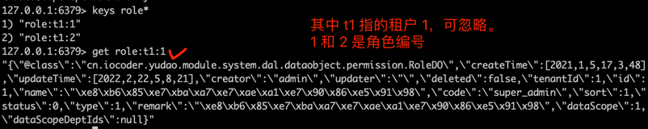
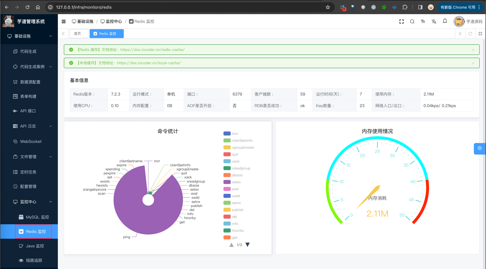
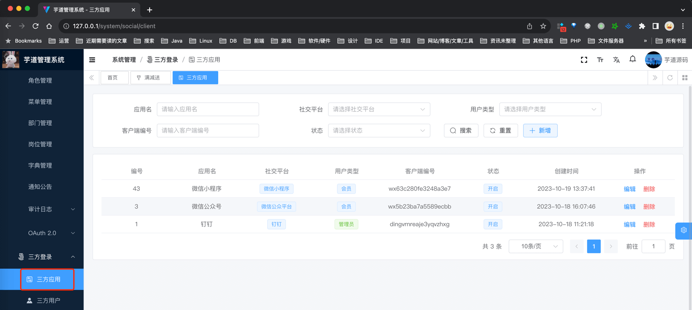
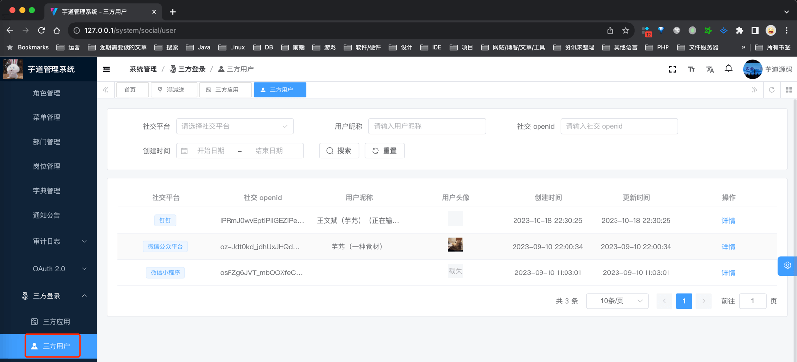

目录

# 三方登录

系统对接国内多个第三方平台，实现三方登录的功能。例如说：

*   管理后台：企业微信、阿里钉钉
*   用户 App：微信公众号、微信小程序


友情提示：为了表述方便，本文主要使用管理后台的三方登录作为示例。

用户 App 也是支持该功能，你可以自己去体验一下。

## [#](#_1-表结构) 1. 表结构


① 三方登录完成时，系统会将三方用户存储到 [`system_social_user` (opens new window)](https://github.com/YunaiV/yudao-cloud/blob/master/yudao-module-system/yudao-module-system-biz/src/main/java/cn/iocoder/yudao/module/system/dal/dataobject/social/SocialUserDO.java) 表中，通过 [`type` (opens new window)](https://github.com/YunaiV/yudao-cloud/blob/master/yudao-module-system/yudao-module-system-api/src/main/java/cn/iocoder/yudao/module/system/enums/social/SocialTypeEnum.java) 标记对应的第三方平台。

② 【未】关联本系统 User 的三方用户，需要在三方登录完成后，使用账号密码进行「**绑定登录**」，成功后记录到 [`system_social_user_bind` (opens new window)](https://github.com/YunaiV/yudao-cloud/blob/master/yudao-module-system/yudao-module-system-biz/src/main/java/cn/iocoder/yudao/module/system/dal/dataobject/social/SocialUserBindDO.java) 表中。

【已】关联本系统 User 的三方用户，在三方登录完成后，直接进入系统，即「**快捷登录**」。

## [#](#_2-绑定登录) 2. 绑定登录

① 使用浏览器访问 [http://127.0.0.1:1024/login (opens new window)](http://127.0.0.1:1024/login) 地址，点击 \[钉钉\] 或者 \[企业微信\] 进行三方登录。此时，会调用 [`/admin-api/system/auth/social-auth-redirect` (opens new window)](https://github.com/YunaiV/yudao-cloud/blob/master/yudao-module-system/yudao-module-system-biz/src/main/java/cn/iocoder/yudao/module/system/controller/admin/auth/AuthController.java#L97-L106) 接口，获得第三方平台的登录地址，并进行跳转。


然后，使用 \[钉钉\] 或者 \[企业微信\] 进行扫码，完成三方登录。

② 三方登录成功后，跳转回 [http://127.0.0.1:1024/social-login (opens new window)](http://127.0.0.1:1024/social-login) 地址。此时，会调用 [`/admin-api/system/auth/social-login` (opens new window)](https://github.com/YunaiV/yudao-cloud/blob/master/yudao-module-system/yudao-module-system-biz/src/main/java/cn/iocoder/yudao/module/system/controller/admin/auth/AuthController.java#L149-L154) 接口，尝试「快捷登录」。由于该三方用户【未】关联管理后台的 AdminUser 用户，所以会看到 “未绑定账号，需要进行绑定” 报错。


③ 输入账号密码，点击 \[提交\] 按钮，进行「绑定登录」。此时，会调用 [`/admin-api/system/auth/login` (opens new window)](https://github.com/YunaiV/yudao-cloud/blob/master/yudao-module-system/yudao-module-system-biz/src/main/java/cn/iocoder/yudao/module/system/controller/admin/auth/AuthController.java#L61-L66) 接口（在账号密码登录的基础上，额外带上 `socialType` + `socialCode` + `socialState` 参数）。成功后，即可进入系统的首页。



## [#](#_3-快捷登录) 3. 快捷登录

退出系统，再进行一次三方登录的流程。

【相同】① 使用浏览器访问 [http://127.0.0.1:1024/login (opens new window)](http://127.0.0.1:1024/login) 地址，点击 \[钉钉\] 或者 \[企业微信\] 进行三方登录。此时，会调用 [`/admin-api/system/auth/social-auth-redirect` (opens new window)](https://github.com/YunaiV/yudao-cloud/blob/master/yudao-module-system/yudao-module-system-biz/src/main/java/cn/iocoder/yudao/module/system/controller/admin/auth/AuthController.java#L97-L106) 接口，获得第三方平台的登录地址，并进行跳转。


【不同】② 三方登录成功后，跳转回 [http://127.0.0.1:1024/social-login (opens new window)](http://127.0.0.1:1024/social-login) 地址。此时，会调用 [`/admin-api/system/auth/social-login` (opens new window)](https://github.com/YunaiV/yudao-cloud/blob/master/yudao-module-system/yudao-module-system-biz/src/main/java/cn/iocoder/yudao/module/system/controller/admin/auth/AuthController.java#L149-L154) 接口，尝试「快捷登录」。由于该三方用户【已】关联管理后台的 AdminUser 用户，所以直接进入系统的首页。


## [#](#_4-绑定与解绑) 4. 绑定与解绑

访问 [http://127.0.0.1:1024/user/profile (opens new window)](http://127.0.0.1:1024/user/profile) 地址，选择 \[社交信息\] 选项，可以三方用户的绑定与解绑。



## [#](#_5-配置管理) 5. 配置管理
### [#](#_5-1-配置文件) 5.1 配置文件

在 [`application-{env}.yaml` (opens new window)](https://github.com/YunaiV/ruoyi-vue-pro/blob/master/yudao-server/src/main/resources/application-local.yaml#L196-L211) 配置文件中，对应 `justauth` 配置项，填写你的第三方平台的配置信息。


系统使用 [JustAuth (opens new window)](https://gitee.com/yudaocode/justauth) 组件，想要对接其它第三方平台，只需要新增对应的配置信息即可。

### [#](#_5-2-数据库配置) 5.2 数据库配置

① `system_social_client` 表，它本质上是 JustAuth 配置的 DB 存储。

主要实现两个目的：

```sql
CREATE TABLE `system_social_client` (
  `id` bigint NOT NULL AUTO_INCREMENT COMMENT '编号',
  `name` varchar(255) CHARACTER SET utf8mb4 COLLATE utf8mb4_unicode_ci NOT NULL COMMENT '应用名',
  `status` tinyint NOT NULL COMMENT '状态',
  // JustAuth 配置项
  `social_type` tinyint NOT NULL COMMENT '社交平台的类型',
  `client_id` varchar(255) CHARACTER SET utf8mb4 COLLATE utf8mb4_unicode_ci NOT NULL COMMENT '客户端编号',
  `client_secret` varchar(255) CHARACTER SET utf8mb4 COLLATE utf8mb4_unicode_ci NOT NULL COMMENT '客户端密钥',
  `agent_id` varchar(255) COLLATE utf8mb4_unicode_ci DEFAULT NULL COMMENT '代理编号',
  // 目的 1
  `tenant_id` bigint NOT NULL DEFAULT '0' COMMENT '租户编号',
  // 目的 2
  `user_type` tinyint NOT NULL COMMENT '用户类型',
  // ... 省略其它非关键字段
  PRIMARY KEY (`id`) USING BTREE
) ENGINE=InnoDB AUTO_INCREMENT=44 DEFAULT CHARSET=utf8mb4 COLLATE=utf8mb4_unicode_ci COMMENT='社交客户端表';

```

1.  在需要 SaaS 多租户的项目中，通过 `tenant_id` 字段隔离，实现不同租户对应不同第三方平台的配置
2.  在多用户类型的项目中，通过 `user_type` 字段区分，实现不同用户类型对应不同第三方平台的配置

注意，`system_social_client` 表的优先级，比 `application-{env}.yaml` 配置文件高！具体逻辑，可见 SocialClientServiceImpl 类的 `#buildAuthRequest(...)` 方法。

疑问：系统目前支持指定租户 + 用户类型 + 社交平台，对应多套配置吗？

不支持，需要自己改造。总体思路是：

1.  `system_social_client` 额外再增加一个 `application` 应用字段，存储应用名，进行一步隔离
2.  前端调用三方登录时，额外传递 `application` 应用字段，用于查询对应应用的配置

② 在 \[系统管理 -> 三方登录 -> 三方应用\] 菜单下，可以进行**当前租户**的 `system_social_client` 表的配置管理。如下图所示：



另外，在 \[系统管理 -> 三方登录 -> 三方用户\] 菜单下，可以进行**当前租户**的 `system_social_user` 三方用户表的查询。如下图所示：



## [#](#_6-第三方平台的申请) 6. 第三方平台的申请

*   [阿里钉钉 (opens new window)](https://justauth.cn/guide/oauth/dingtalk/)
*   [企业微信扫码登录 (opens new window)](https://justauth.cn/guide/oauth/wechat_enterprise_qrcode/)
*   [微信开放平台 (opens new window)](https://justauth.cn/guide/oauth/wechat_open/)

注意，如果第三方平台如果需要配置具体的授信地址，需要添加 `/social-login` 用于三方登录回调页、`/user/profile` 用于三方用户的绑定与解绑。