目录

# 代码生成【单表】（新增功能）

大部分项目里，其实有很多代码是重复的，几乎每个模块都有 CRUD 增删改查的功能，而这些功能的实现代码往往是大同小异的。如果这些功能都要自己去手写，非常无聊枯燥，浪费时间且效率很低，还可能会写错。

所以这种重复性的代码，项目提供了 [codegen (opens new window)](https://github.com/YunaiV/yudao-cloud/tree/master/yudao-module-infra/yudao-module-infra-biz/src/main/java/cn/iocoder/yudao/module/infra/service/codegen) 代码生成器，只需要在数据库中设计好表结构，就可以一键生成前后端代码 + 单元测试 + Swagger 接口文档 + Validator 参数校验。

针对不同的业务场景，项目提供了三种模式：单表、树表、主子表。

本文，我们将演示“单表”的使用，基于代码生成器，在 `yudao-module-system` 模块中，开发一个【**用户组**】的功能。

## [#](#👍-相关视频教程) 👍 相关视频教程

友情提示：虽然是基于 Boot 项目录制，但是 Cloud 一样可以学习。

*   [从零开始 05：如何 5 分钟，开发一个新功能？ (opens new window)](https://t.zsxq.com/07Jm2vrzJ)

## [#](#_1-数据库表结构设计) 1. 数据库表结构设计

设计用户组的数据库表名为 `system_group`，其建表语句如下：

```sql
CREATE TABLE `system_group` (
    `id` bigint NOT NULL AUTO_INCREMENT COMMENT '编号',
    `name` varchar(255) COLLATE utf8mb4_unicode_ci NOT NULL COMMENT '名字',
    `description` varchar(512) COLLATE utf8mb4_unicode_ci DEFAULT NULL COMMENT '描述',
    `status` tinyint NOT NULL COMMENT '状态',
    `creator` varchar(64) CHARACTER SET utf8mb4 COLLATE utf8mb4_unicode_ci DEFAULT '' COMMENT '创建者',
    `create_time` datetime NOT NULL DEFAULT CURRENT_TIMESTAMP COMMENT '创建时间',
    `updater` varchar(64) CHARACTER SET utf8mb4 COLLATE utf8mb4_unicode_ci DEFAULT '' COMMENT '更新者',
    `update_time` datetime NOT NULL DEFAULT CURRENT_TIMESTAMP ON UPDATE CURRENT_TIMESTAMP COMMENT '更新时间',
    `deleted` bit(1) NOT NULL DEFAULT b'0' COMMENT '是否删除',
    `tenant_id` bigint NOT NULL DEFAULT '0' COMMENT '租户编号',
    PRIMARY KEY (`id`) USING BTREE
) ENGINE=InnoDB DEFAULT CHARSET=utf8mb4 COLLATE=utf8mb4_unicode_ci COMMENT='用户组';

```

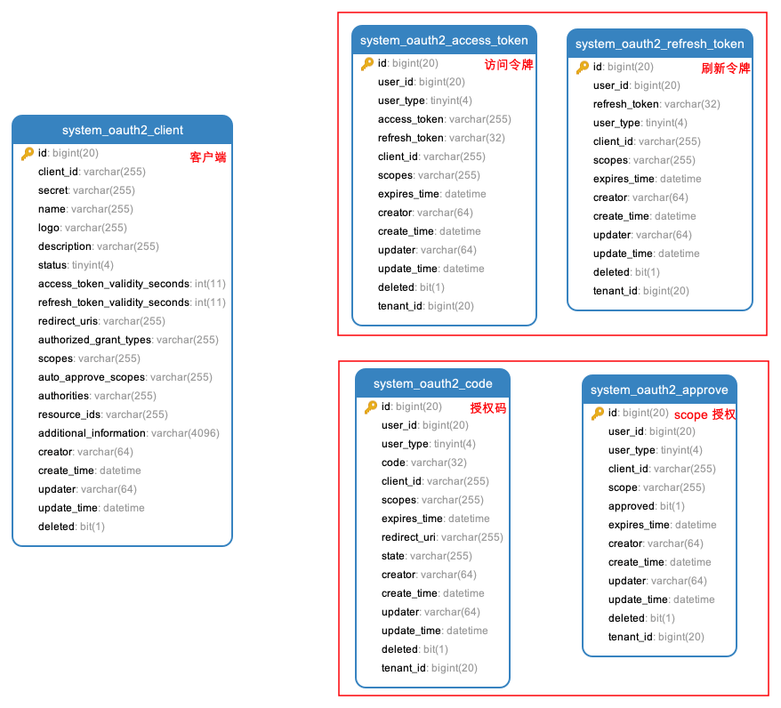

① 表名的前缀，要和 Maven Module 的模块名保持一致。例如说，用户组在 `yudao-module-system` 模块，所以表名的前缀是 `system_`。

疑问：为什么要保持一致？

代码生成器会自动解析表名的前缀，获得其所属的 Maven Module 模块，简化配置过程。

② 设置 ID 主键，一般推荐使用 `bigint` 长整形，并设置自增长。

③ 正确设置每个字段是否允许空，代码生成器会根据它生成参数是否允许空的校验规则。

④ 正确设置注释，代码生成器会根据它生成字段名与提示等信息。

⑤ 添加 `creator`、`create_time`、`updater`、`update_time`、`deleted` 是必须设置的系统字段；如果开启多租户的功能，并且该表需要多租户的隔离，则需要添加 `tenant_id` 字段。

## [#](#_2-代码生成) 2. 代码生成
### [#](#_2-1-导入表) 2.1 导入表

点击 \[基础设施 -> 代码生成\] 菜单，点击 \[基于 DB 导入\] 按钮，选择 `system_group` 表，后点击 \[确认\] 按钮。

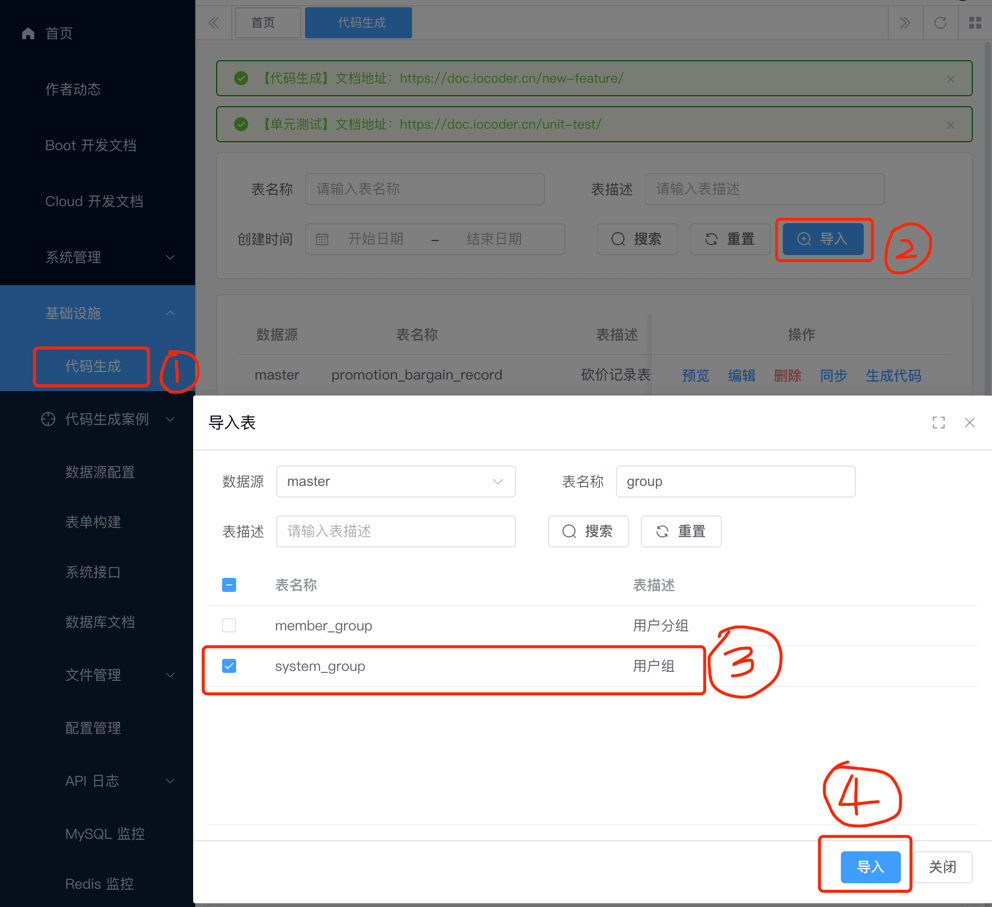

代码实现？

可见 [CodegenBuilder (opens new window)](https://github.com/YunaiV/yudao-cloud/blob/master/yudao-module-infra/yudao-module-infra-biz/src/main/java/cn/iocoder/yudao/module/infra/service/codegen/inner/CodegenBuilder.java) 类，自动解析数据库的表结构，生成默认的配置。

### [#](#_2-2-编辑配置) 2.2 编辑配置

点击 `system_group` 所在行的 \[编辑\] 按钮，修改生成配置。后操作如下：

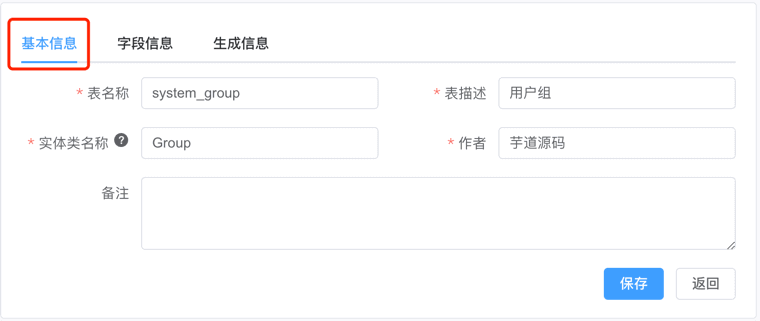

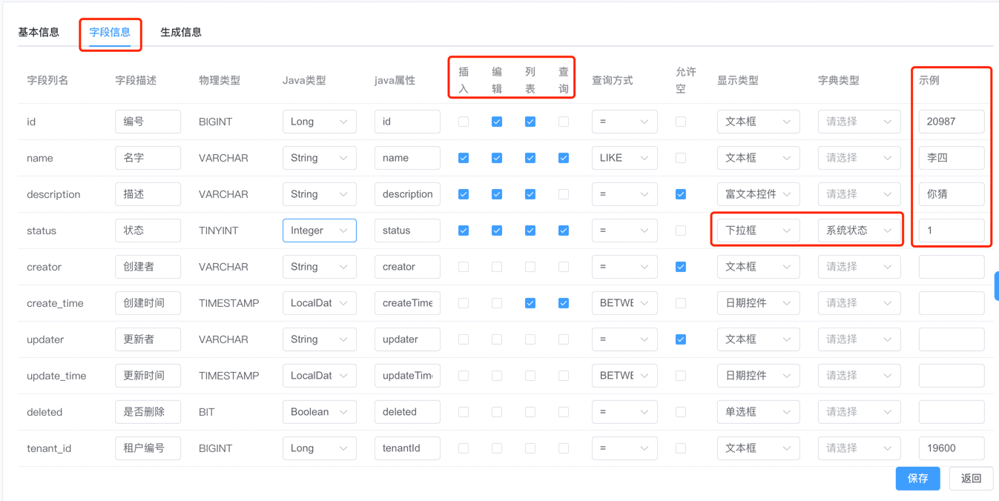

*   将 `status` 字段的显示类型为【下拉框】，字典类型为【系统状态】。
*   将 `description` 字段的【查询】取消。
*   将 `id`、`name`、`description`、`status` 字段的【示例】填写上。

字段信息

*   插入：新增时，是否传递该字段。
*   编辑：修改时，是否传递该字段。
*   列表：Table 表格，是否展示该字段。
*   查询：搜索框，是否支持该字段查询，查询的条件是什么。
*   允许空：新增或修改时，是否必须传递该字段，用于 Validator 参数校验。
*   字典类型：在显示类型是下拉框、单选框、复选框时，选择使用的字典。
*   示例：参数示例，用于 Swagger 接口文档的 `example` 示例。

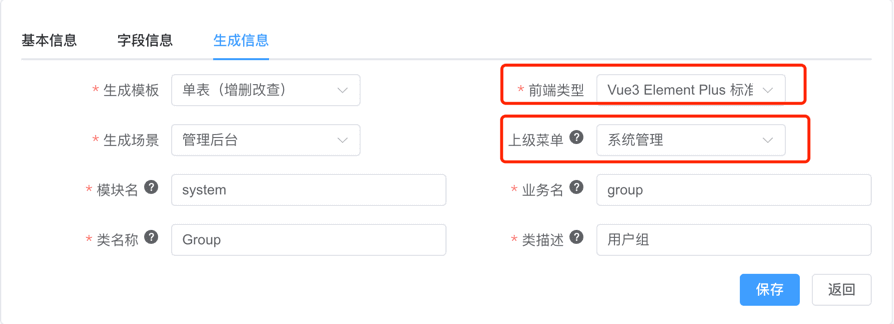

*   将【上级菜单】设置为【系统管理】。
*   将【前端类型】设置为“前端项目”对应的“前端类型”。例如说，我们这里演示的是 `yudao-ui-admin-vue3` 前端项目，则选择了【Vue3 Element Plus 标准模版】。

前端项目

前端类型

yudao-ui-admin-vue2

Vue2 Element UI 标准模版

yudao-ui-admin-vue3

Vue3 Element Plus 标准模版

yudao-ui-admin-vben

Vue3 Vben 模版

生成信息

*   生成场景：分成管理后台、用户 App 两种，用于生成 Controller 放在 `admin` 还是 `app` 包。
*   上级菜单：生成场景是管理后台时，需要设置其所属的上级菜单。
*   前端类型： 提供多种 UI 模版。后端的 `application.yaml` 配置文件中的 `yudao.codegen.front-type` 配置项，设置默认的 UI 模版，避免每次都需要设置。

完成后，点击 \[提交\] 按钮，保存生成配置。

### [#](#_2-3-预览代码) 2.3 预览代码

点击 `system_group` 所在行的 \[预览\] 按钮，在线预览生成的代码，检查是否符合预期。

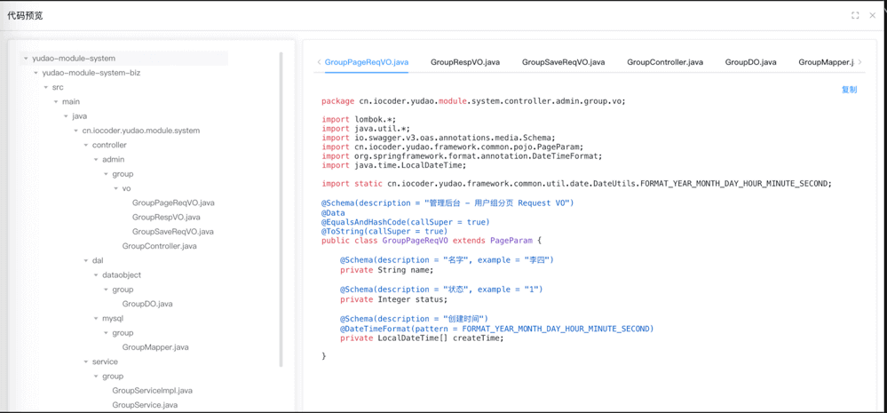

### [#](#_2-4-生成代码) 2.4 生成代码

点击 `system_group` 所在行的 \[生成代码\] 按钮，下载生成代码的压缩包，双击进行解压。

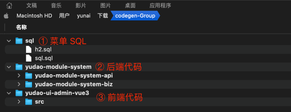

代码实现？

可见 [CodegenEngine (opens new window)](https://github.com/YunaiV/yudao-cloud/blob/master/yudao-module-infra/yudao-module-infra-biz/src/main/java/cn/iocoder/yudao/module/infra/service/codegen/inner/CodegenEngine.java) 类，基于 Velocity 模板引擎，生成具体代码。模板文件，可见 [`resources/codegen` (opens new window)](https://github.com/YunaiV/yudao-cloud/tree/master/yudao-module-infra/yudao-module-infra-biz/src/main/resources/codegen) 目录。

## [#](#_3-代码运行) 3. 代码运行

本小节，我们将生成的代码，复制到项目中，并进行运行。

### [#](#_3-1-后端运行) 3.1 后端运行

① 将生成的后端代码，复制到项目中。操作如下图所示：

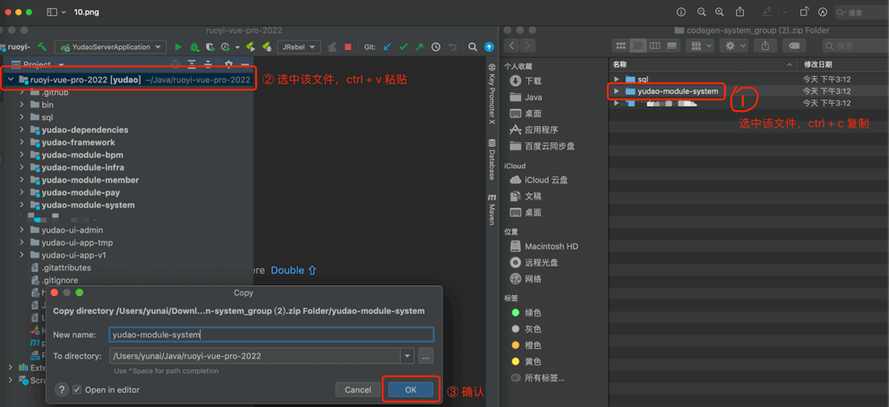

② 将 `ErrorCodeConstants.java_手动操作` 文件的错误码，复制到该模块 ErrorCodeConstants 类中，并设置对应的错误码编号，之后进行删除。操作如下图所示：

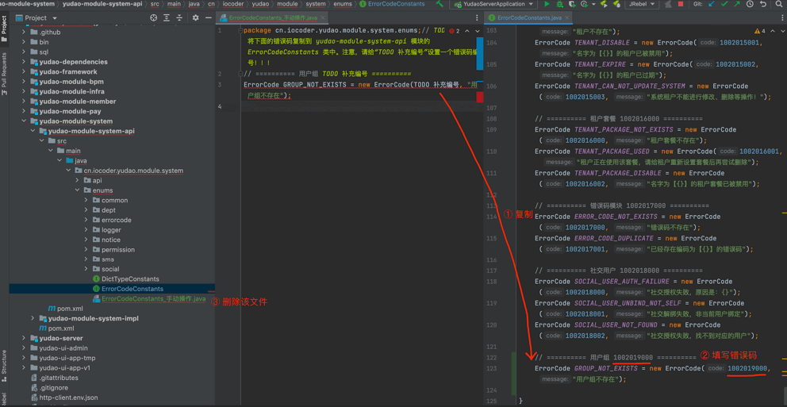

③ 将 `h2.sql` 的 CREATE 语句复制到该模块的 `create_tables.sql` 文件，DELETE 语句复制到该模块的 `clean.sql`。操作如下图：

友情提示：最新版本，第 ③ 部分的单元测试，默认已经不在生成。所以，不需要操作这一步。

原因是：大多数团队，没有编写单元测试的习惯，导致生成的单元测试代码，会被直接删除。所以，我们默认不生成单元测试代码，减少不必要的代码生成。

如果想要开启，可以把 `yudao.codegen.unit-test-enable` 配置项设置为 `true`，然后重新生成代码。

另外，如果你想要编写单元测试，可以考虑使用 [MarsCode (opens new window)](https://www.marscode.cn/home?utm_source=kol&utm_medium=yudao&utm_campaign=reception) 智能编码插件，可以免费生成不错的单元测试。

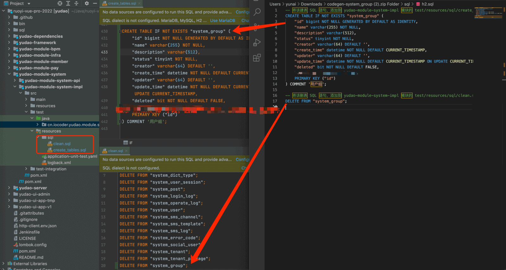

疑问：\`create\_tables.sql\` 和 \`clean.sql\` 文件的作用是什么？

项目的单元测试，需要使用到 H2 内存数据库，`create_tables.sql` 用于创建所有的表结构，`clean.sql` 用于每个单元测试的方法跑完后清理数据。

然后，运行 GroupServiceImplTest 单元测试，执行通过。

④ 打开数据库工具，运行代码生成的 `sql/sql.sql` 文件，用于菜单的初始化。

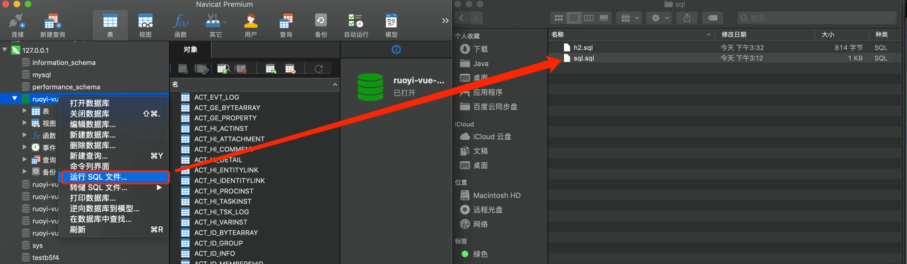

⑤ Debug 运行 YudaoServerApplication 类，启动后端项目。通过 IDEA 的 \[Actuator -> Mappings\] 菜单，可以看到代码生成的 GroupController 的 RESTful API 接口已经生效。

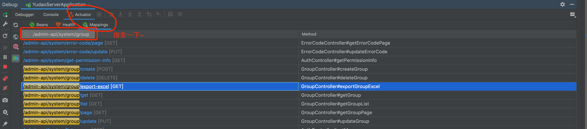

### [#](#_3-2-前端运行) 3.2 前端运行

① 将生成的前端代码，复制到项目中。操作如下图所示：

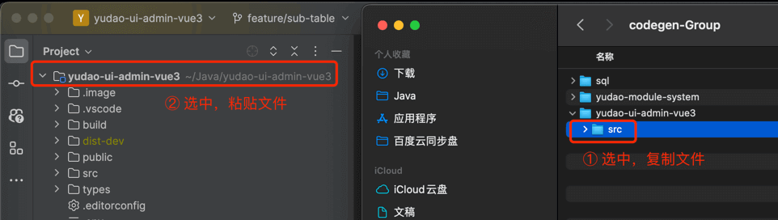

② **重新**执行 `npm run dev` 命令，启动前端项目。点击 \[系统管理 -> 菜单管理\] 菜单，点击【刷新菜单缓存】，因为前端项目会缓存菜单在内存中的，所以需要刷新一下。

③ 点击 \[系统管理 -> 用户组管理\] 菜单，就可以看到用户组的 UI 界面。

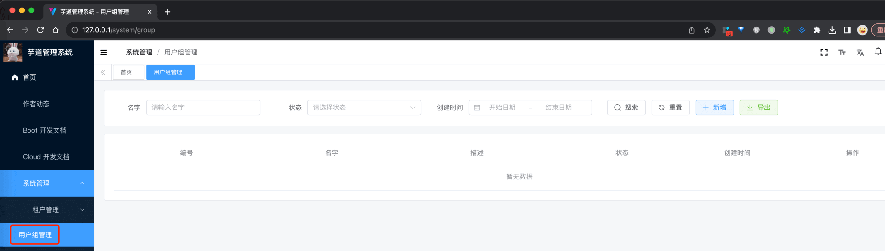

* * *

至此，我们已经完成了【**用户组**】功能的代码生成，基本节省了你 80% 左右的开发任务，后续可以根据自己的需求，进行剩余的 20% 的开发！

## [#](#_4-后续变更) 4. 后续变更

随着业务的发展，已经生成代码的功能需要变更。继续以【**用户组**】举例子，它的 `system_group` 表需要新增一个分类 `category` 字段，此时**不建议**使用代码生成器，而是直接修改已经生成的代码：

① 后端：修改 GroupDO 数据实体类、GroupSaveReqVO 保存 VO 类、GroupSaveRespVO 响应 VO 类，新增 `category` 字段。

② 前端：修改 Vue 的 `index.vue` 列表和 Form 表单组件，新增 `category` 字段。

③ 重新编译后后端，并进行启动。

over！非常简单方便，即保证了代码的整洁规范，又不增加过多的开发量。

## [#](#_5-常见问题) 5. 常见问题

① 生成的代码结构，有没具体说明？

答：参见 [《项目结构》](/project-intro) 文档的说明，最好把对应视频好好看下。

② 为什么要分 XXXSaveReqVO、XXXRespVO、XXXPageReqVO 三个 VO 类？

答：星球里 [https://t.zsxq.com/14Fc743WH (opens new window)](https://t.zsxq.com/14Fc743WH) 进行了 VO 拆分的讨论，总体大家倾向拆分成三个 VO 类，因为这样更加清晰，而且也不会增加太多的维护工作量。

可能你会想，能不能把 XXXSaveReqVO 和 XXXRespVO 合并成一个呢？有两方面的考虑：

1.  一般来说，新增/修改是不传递 `createTime`、`creator` 等字段，响应是需要返回 `createTime`、`creator` 等字段，两者的字段无法不一致。
2.  一旦 VO 和 DO 拆分开后，调整字段时，例如说新增一个 xxx 字段，两个 VO 的修改成本，和一个 VO 实际是差不多的。

③ 为什么 UI 界面的数据字典，下拉没有选项，或者列表没有展示它的文本？

类似 [https://t.zsxq.com/owJzU (opens new window)](https://t.zsxq.com/owJzU) 的问题。

原因是：需要在前端的代码里，枚举一下。例如说 Vue3 + Element-Plus 版本，需要在 `yudao-ui-admin-vue3/src/utils/dict.ts` 的 `DICT_TYPE` 添加字典的 `type` 枚举值。