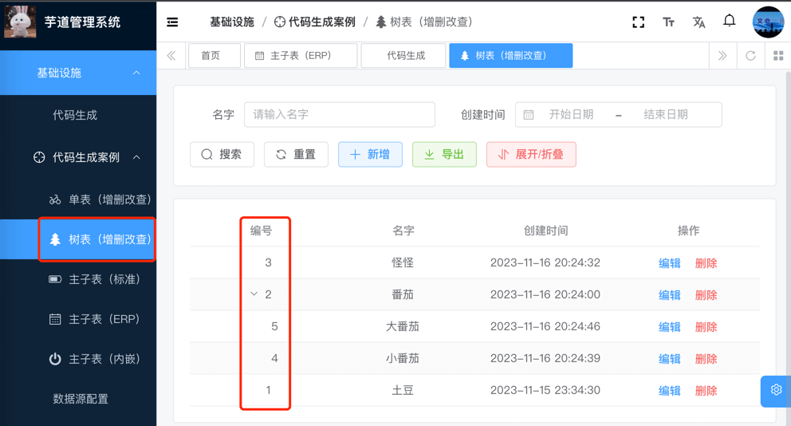
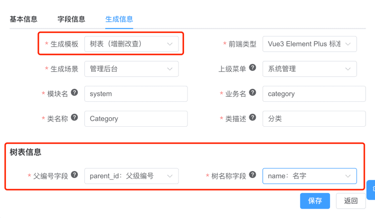

目录

# 代码生成（树表）

友情提示：

本文接 [《代码生成【单表】》](/new-feature/)，请务必先阅读。因为重复的内容，本文会不再赘述！

树表，是在“单表”的基础上，增加了「树形结构」的功能。



例如说：部门、分类等，是一个树形结构。我们可以通过树形结构，来展示部门、分类的层级关系。

下面，我们将演示“树表”的使用，基于代码生成器，在 `yudao-module-system` 模块中，开发一个【**分类**】的功能。

## [#](#_1-数据库表结构设计) 1. 数据库表结构设计

设计分类的数据库表名为 `system_category`，其建表语句如下：

```sql
CREATE TABLE `system_category` (
  `id` bigint NOT NULL AUTO_INCREMENT COMMENT '编号',
  `name` varchar(100) CHARACTER SET utf8mb4 COLLATE utf8mb4_unicode_ci NOT NULL DEFAULT '' COMMENT '名字',
  `parent_id` bigint NOT NULL COMMENT '父级编号',
  `creator` varchar(64) CHARACTER SET utf8mb4 COLLATE utf8mb4_unicode_ci DEFAULT '' COMMENT '创建者',
  `create_time` datetime NOT NULL DEFAULT CURRENT_TIMESTAMP COMMENT '创建时间',
  `updater` varchar(64) CHARACTER SET utf8mb4 COLLATE utf8mb4_unicode_ci DEFAULT '' COMMENT '更新者',
  `update_time` datetime NOT NULL DEFAULT CURRENT_TIMESTAMP ON UPDATE CURRENT_TIMESTAMP COMMENT '更新时间',
  `deleted` bit(1) NOT NULL DEFAULT b'0' COMMENT '是否删除',
  `tenant_id` bigint NOT NULL DEFAULT '0' COMMENT '租户编号',
  PRIMARY KEY (`id`) USING BTREE
) ENGINE=InnoDB AUTO_INCREMENT=6 DEFAULT CHARSET=utf8mb4 COLLATE=utf8mb4_unicode_ci COMMENT='分类表';

```

其中 `parent_id` 字段，用于标识父级分类的编号。如果是顶级分类，则 `parent_id` 为 `0`。

## [#](#_2-代码生成) 2. 代码生成
### [#](#_2-1-导入表) 2.1 导入表

点击 \[基础设施 -> 代码生成\] 菜单，点击 \[基于 DB 导入\] 按钮，选择 `system_category` 表，后点击 \[确认\] 按钮。

### [#](#_2-2-编辑配置) 2.2 编辑配置

点击 `system_category` 所在行的 \[编辑\] 按钮，修改生成配置。后操作如下：



*   将【生成模版】设置为【树表】。🔥最最关键的步骤！
*   树表信息：将【父编号字段】设置为 `parent_id` 字段，将【树名称字段】设置为 `name` 字段。
*   将【上级菜单】设置为【系统管理】。
*   将【前端类型】设置为“前端项目”对应的“前端类型”。例如说，我们这里演示的是 `yudao-ui-admin-vue3` 前端项目，则选择了【Vue3 Element Plus 标准模版】。

### [#](#_2-3-预览代码) 2.3 预览代码

点击 `system_category` 所在行的 \[预览\] 按钮，在线预览生成的代码，检查是否符合预期。

### [#](#_2-3-生成代码) 2.3 生成代码

点击 `system_category` 所在行的 \[生成\] 按钮，生成代码。

# [#](#_3-代码运行) 3. 代码运行

和 [《代码生成【单表】》](/new-feature/) 的「3. 代码运行」一致，就不重复赘述。