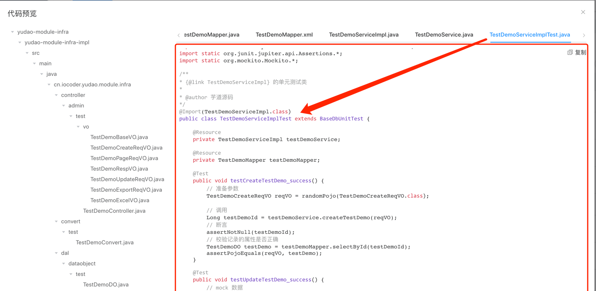
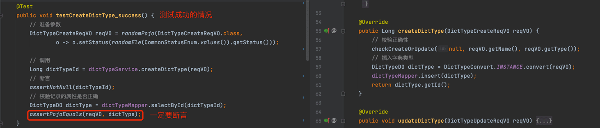
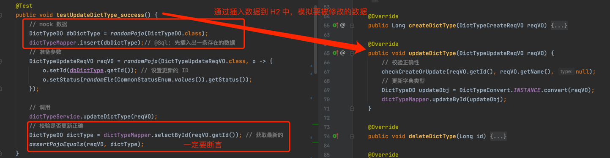
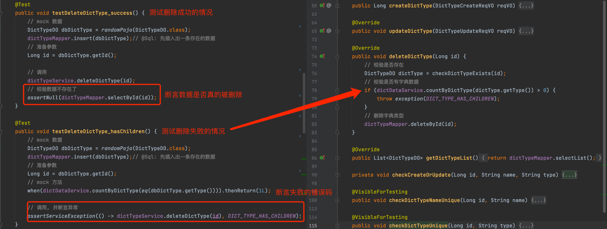
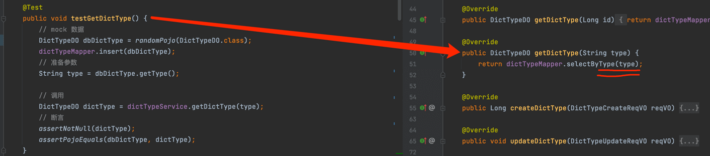
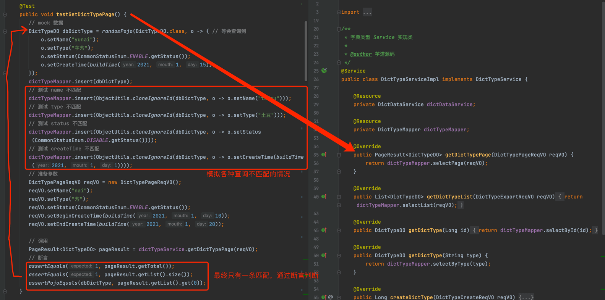
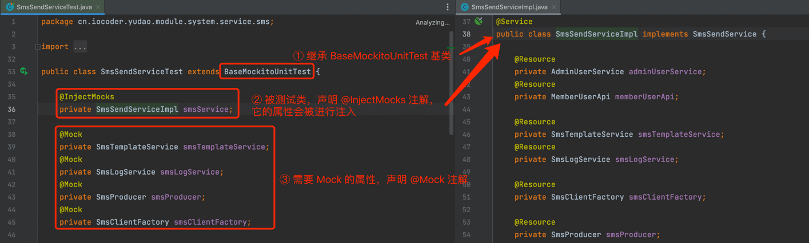

目录

# 单元测试

项目使用 Junit5 + Mockito 实现单元测试，提升代码质量、重复测试效率、部署可靠性等。

截止目前，项目已经有 500+ 测试用例。

内容推荐

如果你想系统学习单元测试，可以阅读[《有效的单元测试》 (opens new window)](https://www.iocoder.cn/Architecture/books-recommended/?yudao)这本书，非常适合 Java 工程师。

如果只是想学习 Spring Boot Test 的话，可以阅读 [《芋道 Spring Boot 单元测试 Test 入门 》 (opens new window)](https://www.iocoder.cn/Spring-Boot/Unit-Test/?yudao) 文章。

## [#](#_1-测试组件) 1.测试组件

[`yudao-spring-boot-starter-test` (opens new window)](https://github.com/YunaiV/yudao-cloud/blob/master/yudao-framework/yudao-spring-boot-starter-test/) 是项目提供的测试组件，用于单元测试、集成测试等等。

### [#](#_1-1-快速测试的基类) 1.1 快速测试的基类

测试组件提供了 4 种单元测试的基类，通过继承它们，可以快速的构建单元测试的环境。

基类

作用

[BaseMockitoUnitTest (opens new window)](https://github.com/YunaiV/yudao-cloud/blob/master/yudao-framework/yudao-spring-boot-starter-test/src/main/java/cn/iocoder/yudao/framework/test/core/ut/BaseMockitoUnitTest.java)

纯 Mockito 的单元测试

[BaseDbUnitTest (opens new window)](https://github.com/YunaiV/yudao-cloud/blob/master/yudao-framework/yudao-spring-boot-starter-test/src/main/java/cn/iocoder/yudao/framework/test/core/ut/BaseDbUnitTest.java)

使用内嵌的 H2 数据库的单元测试

[BaseRedisUnitTest (opens new window)](https://github.com/YunaiV/yudao-cloud/blob/master/yudao-framework/yudao-spring-boot-starter-test/src/main/java/cn/iocoder/yudao/framework/test/core/ut/BaseRedisUnitTest.java)

使用内嵌的 Redis 缓存的单元测试

[BaseDbAndRedisUnitTest (opens new window)](https://github.com/YunaiV/yudao-cloud/blob/master/yudao-framework/yudao-spring-boot-starter-test/src/main/java/cn/iocoder/yudao/framework/test/core/ut/BaseDbAndRedisUnitTest.java)

使用内嵌的 H2 数据库 + Redis 缓存的单元测试

疑问：什么是内嵌的 Redis 缓存？

基于 [jedis-mock (opens new window)](https://github.com/fppt/jedis-mock) 开源项目，通过 [RedisTestConfiguration (opens new window)](https://github.com/YunaiV/yudao-cloud/blob/master/yudao-framework/yudao-spring-boot-starter-test/src/main/java/cn/iocoder/yudao/framework/test/config/RedisTestConfiguration.java) 配置类，启动一个 Redis 进程。一般情况下，会使用 16379 端口。

### [#](#_1-2-测试工具类) 1.2 测试工具类

① [RandomUtils (opens new window)](https://github.com/YunaiV/yudao-cloud/blob/master/yudao-framework/yudao-spring-boot-starter-test/src/main/java/cn/iocoder/yudao/framework/test/core/util/RandomUtils.java) 基于 [podam (opens new window)](https://github.com/mtedone/podam) 开源项目，实现 Bean 对象的随机生成。

② [AssertUtils (opens new window)](https://github.com/YunaiV/yudao-cloud/blob/master/yudao-framework/yudao-spring-boot-starter-test/src/main/java/cn/iocoder/yudao/framework/test/core/util/AssertUtils) 封装 Junit 的 Assert 断言，实现 Bean 对象的断言，支持忽略部分属性。

## [#](#_2-basedbunittest-实战案例) 2. BaseDbUnitTest 实战案例

以字典类型模块的 [DictTypeServiceImpl (opens new window)](https://github.com/YunaiV/yudao-cloud/blob/master/yudao-module-system/yudao-module-system-biz/src/main/java/cn/iocoder/yudao/module/system/service/dict/DictDataServiceImpl.java) 为例子，讲解它的 [DictTypeServiceTest (opens new window)](https://github.com/YunaiV/yudao-cloud/blob/master/yudao-module-system/yudao-module-system-biz/src/test/java/cn/iocoder/yudao/module/system/service/dict/DictDataServiceTest.java) 单元测试的编写实现。

### [#](#_2-1-引入依赖) 2.1 引入依赖

在 `yudao-module-system-biz` 模块中，引入 `yudao-spring-boot-starter-test` 技术组件。如下所示：

```xml
<dependency>
    <groupId>cn.iocoder.cloud</groupId>
    <artifactId>yudao-spring-boot-starter-test</artifactId>
    <scope>test</scope>
</dependency>

```

### [#](#_2-2-新建-ut-配置文件) 2.2 新建 ut 配置文件

在 [`test/resources` (opens new window)](https://github.com/YunaiV/yudao-cloud/blob/master/yudao-module-system/yudao-module-system-biz/src/test/resources/) 目录，新建单元测试的 [`application-unit-test.yaml` (opens new window)](https://github.com/YunaiV/yudao-cloud/blob/master/yudao-module-system/yudao-module-system-biz/src/test/resources/application-unit-test.yaml) 配置文件，内容如下：


### [#](#_2-3-添加-h2-sql-脚本) 2.3 添加 H2 SQL 脚本

修改 [`test/resources/sql` (opens new window)](https://github.com/YunaiV/yudao-cloud/blob/master/yudao-module-system/yudao-module-system-biz/src/test/resources/sql/) 目录的两个 H2 SQL 脚本：

① 在 [`create_tables.sql` (opens new window)](https://github.com/YunaiV/yudao-cloud/blob/master/yudao-module-system/yudao-module-system-biz/src/test/resources/sql/create_tables.sql) 文件中，添加 `system_dict_type` 的 H2 建表语句。SQL 如下：

```sql
CREATE TABLE IF NOT EXISTS "system_dict_type" (
    "id" bigint NOT NULL GENERATED BY DEFAULT AS IDENTITY,
    "name" varchar(100) NOT NULL DEFAULT '',
    "type" varchar(100) NOT NULL DEFAULT '',
    "status" tinyint NOT NULL DEFAULT '0',
    "remark" varchar(500) DEFAULT NULL,
    "creator" varchar(64) DEFAULT '',
    "create_time" timestamp NOT NULL DEFAULT CURRENT_TIMESTAMP,
    "updater" varchar(64) DEFAULT '',
    "update_time" timestamp NOT NULL DEFAULT CURRENT_TIMESTAMP,
    "deleted" bit NOT NULL DEFAULT FALSE,
    PRIMARY KEY ("id")
) COMMENT '字典类型表';

```

注意，H2 和 MySQL 的建表语句有区别，需要手动进行转换。如果你不想进行转换，可以使用 \[基础设置 -> 代码生成\] 菜单的代码生成器功能，如下图所示：


② 在 [`clean.sql` (opens new window)](https://github.com/YunaiV/yudao-cloud/blob/master/yudao-module-system/yudao-module-system-biz/src/test/resources/sql/clean.sql) 文件中，添加 `system_dict_type` 的清空数据的语句。SQL 如下：

```sql
DELETE FROM "system_dict_type";

```

每次单元测试的方法执行完后，会执行 `clean.sql` 脚本，进行数据的清理，保证每个单元测试的方法的数据隔离性。

### [#](#_2-3-新建-dicttypeservicetest-类) 2.3 新建 DictTypeServiceTest 类

新建 DictTypeServiceTest 测试类，继承 BaseMockitoUnitTest 基类，并完成它的配置。代码如下图所示：


*   属于自己模块的，使用 Spring 初始化成真实的 Bean，然后通过 `@Resource` 注入。例如说：`dictTypeService`、`dictTypeMapper`
*   属于别人模块的，使用 Spring `@MockBean` 注解，模拟 Mock 成一个 Bean 后注入。例如说：`dictDataService`

疑问：为什么有的进行 Mock，有的不进行 Mock 呢？

*   单元测试需要避免对外部的依赖，而 `dictDataService` 是外部依赖，所以需要 Mock 掉。
*   `dictTypeMapper` 某种程度来说，也是一种外部依赖，但是通过内嵌的 H2 内存数据库，进行“真实”的数据库操作，反而单元测试的编写效率更高，效果更好，所以不需要 Mock 掉。

另外，\[基础设置 -> 代码生成\] 菜单的代码生成器功能，已经生成了绝大多数的单元测试的逻辑，这里主要是希望让你了解单元测试的具体使用，所以并没有使用它。如下图所示：



### [#](#_2-4-新增方法的单测) 2.4 新增方法的单测



### [#](#_2-5-修改方法的单测) 2.5 修改方法的单测



### [#](#_2-6-删除方法的单测) 2.6 删除方法的单测



### [#](#_2-7-单条查询方法的单测) 2.7 单条查询方法的单测



### [#](#_2-8-分页查询方法的单测) 2.8 分页查询方法的单测



## [#](#_3-basemockitounittest-实战案例) 3. BaseMockitoUnitTest 实战案例

一些类由于不依赖 MySQL 和 Redis，可以通过继承 BaseMockitoUnitTest 基类，实现纯 Mockito 的单元测试。例如说 [SmsSendServiceTest (opens new window)](https://github.com/YunaiV/yudao-cloud/blob/master/yudao-module-system/yudao-module-system-biz/src/test/java/cn/iocoder/yudao/module/system/service/sms/SmsSendServiceTest.java) 单元测试类，代码如下：



具体 SmsSendServiceTest 的每个测试方法，和 DictTypeServiceTest 并没有什么差别，还是 Mock 模拟 + Assert 断言 + Verify 调用，你可以自己花点时间瞅瞅。