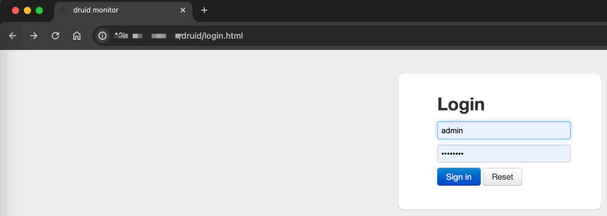

目录

# 多数据源（读写分离）

[`yudao-spring-boot-starter-mybatis` (opens new window)](https://github.com/YunaiV/yudao-cloud/blob/master/yudao-framework/yudao-spring-boot-starter-mybatis/) 技术组件，除了提供 MyBatis 数据库操作，还提供了如下 2 种功能：

*   数据连接池：基于 [Alibaba Druid (opens new window)](https://github.com/alibaba/druid) 实现，额外提供监控的能力。
*   多数据源（读写分离）：基于 [Dynamic Datasource (opens new window)](https://github.com/baomidou/dynamic-datasource-spring-boot-starter) 实现，支持 Druid 连接池，可集成 [Seata (opens new window)](https://www.iocoder.cn/Seata/install/?yudao) 实现分布式事务。

## [#](#_1-数据连接池) 1. 数据连接池

友情提示：

如果你未学习过 Druid 数据库连接池，可以后续阅读 [《芋道 Spring Boot 数据库连接池入门》 (opens new window)](http://www.iocoder.cn/Spring-Boot/datasource-pool/?yudao) 文章。

```xml
<dependency>
    <groupId>com.alibaba</groupId>
    <artifactId>druid-spring-boot-starter</artifactId>
</dependency>

```

### [#](#_1-1-druid-监控配置) 1.1 Druid 监控配置

友情提示：以 yudao-module-system 服务为例子。

在 [`application-local.yaml` (opens new window)](https://github.com/YunaiV/yudao-cloud/blob/master/yudao-module-system/yudao-module-system-biz/src/main/resources/application-local.yaml#L7-L25) 配置文件中，通过 `spring.datasource.druid` 配置项，仅仅设置了 Druid **监控**相关的配置项目，具体数据库的设置需要使用 Dynamic Datasource 的配置项。如下图所示：


### [#](#_1-2-druid-监控界面) 1.2 Druid 监控界面

① 访问后端的 `/druid/index.html` 路径，例如说本地的 `http://127.0.0.1:48080/druid/index.html` 地址，可以查看到 Druid 监控界面。如下图所示：

友情提示：48080 需要换成服务的端口！！！

例如说：`system-server` 是 48081 端口！！！


② 访问前端的 \[基础设施 -> 监控中心 -> MySQL 监控\] 菜单，也可以查看到 Druid 监控界面。如下图所示：


补充说明：

前端 \[基础设施 -> MySQL 监控\] 菜单，通过 iframe 内嵌后端的 `/druid/index.html` 路径。

如果你想自定义地址，可以前往 \[基础设置 -> 配置管理\] 菜单，设置 key 为 `url.druid` 配置项。

### [#](#_1-3-如何开启登录) 1.3 如何开启登录？

生产环境下，建议 Druid 监控界面开启“安全认证”的功能，避免出现安全事故。

只需要在 `spring.datasource.druid.stat-view-servlet` 配置项中，设置 `login-username` 和 `login-password` 即可。开启后，登录界面如下图所示：



## [#](#_2-多数据源) 2. 多数据源

友情提示：

如果你未学习过多数据源，可以后续阅读 [《芋道 Spring Boot 多数据源（读写分离）入门》 (opens new window)](http://www.iocoder.cn/Spring-Boot/dynamic-datasource/?yudao) 文章。

```xml
<dependency>
    <groupId>com.baomidou</groupId>
    <artifactId>dynamic-datasource-spring-boot-starter</artifactId>
</dependency>

```

### [#](#_2-1-多数据源配置) 2.1 多数据源配置

友情提示：以 yudao-module-system 服务为例子。

在 [`application-local.yaml` (opens new window)](https://github.com/YunaiV/yudao-cloud/blob/master/yudao-module-system/yudao-module-system-biz/src/main/resources/application-local.yaml#L40-L62) 配置文件中，通过 `spring.datasource.dynamic` 配置项，配置了 Master-Slave 主从两个数据源。如下图所示：


### [#](#_2-2-数据源切换) 2.2 数据源切换
#### [#](#_2-2-1-master-注解) 2.2.1 @Master 注解

在方法上添加 [`@Master` (opens new window)](https://github.com/baomidou/dynamic-datasource-spring-boot-starter/blob/master/src/main/java/com/baomidou/dynamic/datasource/annotation/Master.java) 注解，使用名字为 `master` 的数据源，即使用【主】库，一般适合【写】场景。示例如下图：


由于项目的 `spring.datasource.dynamic.primary` 为 `master`，默认使用【主】库，所以无需手动添加 `@Master` 注解。

#### [#](#_2-2-2-slave-注解) 2.2.2 @Slave 注解

在方法上添加 [`@Slave` (opens new window)](https://github.com/baomidou/dynamic-datasource-spring-boot-starter/blob/master/src/main/java/com/baomidou/dynamic/datasource/annotation/Slave.java) 注解，使用名字为 `slave` 的数据源，即使用【从】库，一般适合【读】场景。示例如下图：


#### [#](#_2-2-3-ds-注解) 2.2.3 @DS 注解

在方法上添加 [`@DS` (opens new window)](https://github.com/baomidou/dynamic-datasource-spring-boot-starter/blob/master/src/main/java/com/baomidou/dynamic/datasource/annotation/DS.java) 注解，使用指定名字的数据源，适合多数据源的情况。示例如下图：


### [#](#_2-3-分布式事务) 2.3 分布式事务

在使用 Spring `@Transactional` 声明的事务中，无法进行数据源的切换，此时有 3 种解决方案：

① 拆分成多个 Spring 事务，每个事务对应一个数据源。如果是【写】场景，可能会存在多数据源的事务不一致的问题。

② 引入 Seata 框架，提供完整的分布式事务的解决方案，可学习 [《芋道 Seata 极简入门 》 (opens new window)](https://www.iocoder.cn/Seata/install/?yudao) 文章。

③ 使用 Dynamic Datasource 提供的 [`@DSTransactional` (opens new window)](https://github.com/baomidou/dynamic-datasource-spring-boot-starter/blob/master/src/main/java/com/baomidou/dynamic/datasource/annotation/DSTransactional.java) 注解，支持多数据源的切换，不提供绝对可靠的多数据源的事务一致性（强于 ① 弱于 ②），可学习 [《DSTransactional 实现源码分析 》 (opens new window)](https://www.yinxiang.com/everhub/note/ac0175c8-35f5-4d66-8cd3-c662d7a16441) 文章。

## [#](#_3-事务相关) 3. 事务相关

事务一共有 3 种解决方案，分别是：

*   单机 + 单数据源：`@Transactional` 注解
*   单机 + 多数据源：`@DSTransactional` 注解
*   多机 + 单/多数据源：Seata 分布式事务

### [#](#_3-1-transactional-注解) 3.1 @Transactional 注解

大多数情况下，是单机 + 单个数据源的操作，只需要在方法上添加 Spring `@Transactional` 注解，声明事务即可。

具体的使用，可以项目里搜 `@Transactional` 关键字，就可以看到非常多的使用示例。

### [#](#_3-2-dstransactional-注解) 3.2 @DSTransactional 注解

如果单机 + 多个数据源的操作，使用 `@Transactional` 声明的事务中，无法进行数据源的切换。此时，可以使用 Dynamic Datasource 提供的 [`@DSTransactional` (opens new window)](https://github.com/baomidou/dynamic-datasource-spring-boot-starter/blob/master/src/main/java/com/baomidou/dynamic/datasource/annotation/DSTransactional.java) 注解，支持多数据源的切换。

友情提示：

`@DSTransactional` 注解，提供相对可靠的多数据源的事务一致性，但是不绝对，可学习 [《DSTransactional 实现源码分析 》 (opens new window)](https://www.yinxiang.com/everhub/note/ac0175c8-35f5-4d66-8cd3-c662d7a16441) 文章。

使用的示例，AService 调用 BService、CService，并且分别对应 a、b、c 各自的数据源，代码如下所示：

```java
public class AService {
    
    @Resource
    private BService bService;
    @Resource
    private CService cService;
    
    @DS("a") // 注意：如果 a 是默认数据源时，则不需要 @DS 注解
    @DSTransactional
    public void create() {
        bService.createB();
        CService.createC();
    }
    
}

    public class BService {
        
        @DS("b")
        public void createB() {
            // 调用 bMapper 逻辑
        }
        
    }
    
    public class CService {
        
        @DS("c")
        public void createC() {
            // 调用 cMapper 逻辑
        }
        
    }

```

场景问题：

问题 ①：c 数据源的操作发生异常，a、b 数据源会回滚么？

*   答案：会的，因为最终是最外层的 `@DSTransactional` 注解对应的方法结束后，才进行事务的提交，所以它实际不需要回滚。
*   注意：但是有一点要注意，如果提交时某个数据源的事务提交失败，则可能导致事务的不一致。

问题 ②：b、c 数据源的方法，也添加 `@DSTransactional` 注解，会不会影响事务？

*   答案：不会，可以放心大胆的加。

### [#](#_3-3-分布式事务) 3.3 分布式事务

在多机分布式场景下，无论是单数据源、多数据源，本质上都是分布式事务，建议引入 Seata 框架，提供完整的分布式事务的解决方案，可学习 [《芋道 Seata 极简入门 》 (opens new window)](https://www.iocoder.cn/Seata/install/?yudao) 文章。

不过如果你是单机项目，则可以不用关注着一点哈！

## [#](#_4-分库分表) 4. 分库分表

建议采用 ShardingSphere 的子项目 Sharding-JDBC 完成分库分表的功能，可阅读 [《芋道 Spring Boot 分库分表入门 》 (opens new window)](https://www.iocoder.cn/Spring-Boot/sharding-datasource/?yudao) 文章，学习如何整合进项目。