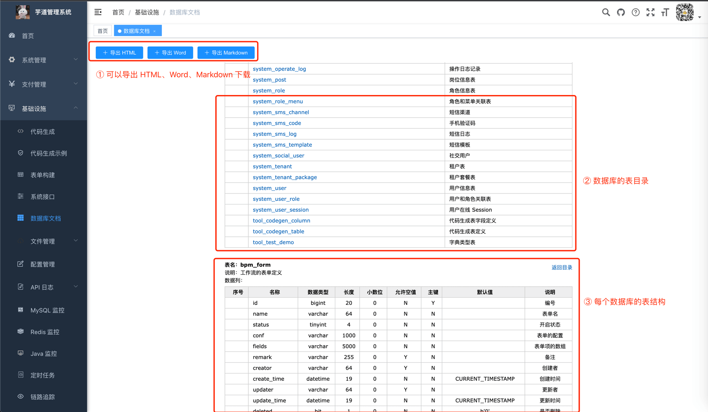
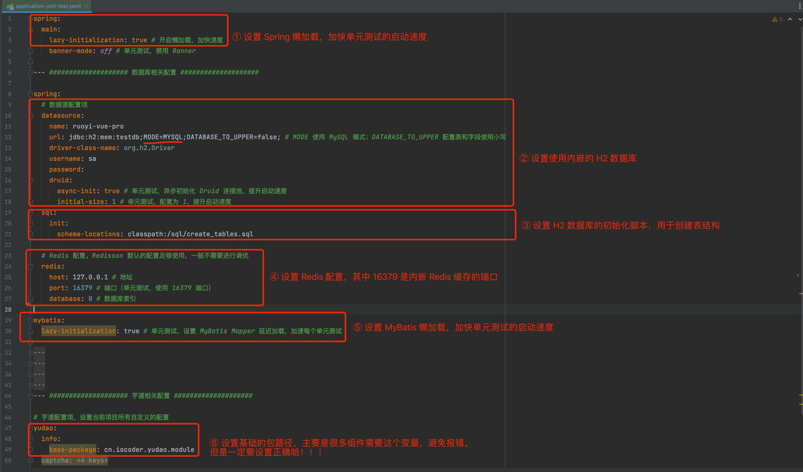
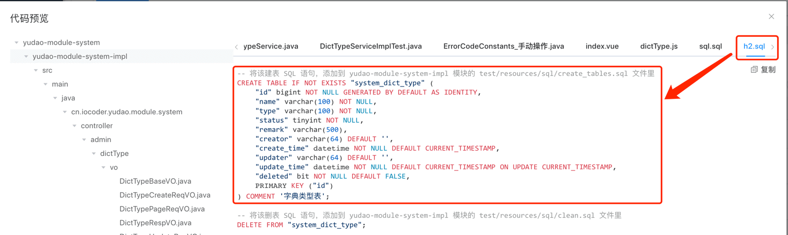

目录

# 异步任务

[`yudao-spring-boot-starter-job` (opens new window)](https://github.com/YunaiV/ruoyi-vue-pro/blob/master/yudao-framework/yudao-spring-boot-starter-job/) 技术组件，除了提供定时任务的功能，还提供了 Async 异步任务的能力。系统使用异步任务，提升执行效率。例如说：

*   [操作日志模块 (opens new window)](https://github.com/YunaiV/ruoyi-vue-pro/blob/master/yudao-module-system/yudao-module-system-biz/src/main/java/cn/iocoder/yudao/module/system/service/logger/OperateLogServiceImpl.java#L42-L56)，异步记录【操作日志】
*   [访问日志模块 (opens new window)](https://github.com/YunaiV/yudao-cloud/blob/master/yudao-module-infra/yudao-module-infra-biz/src/main/java/cn/iocoder/yudao/module/infra/service/logger/ApiAccessLogServiceImpl.java#L39-L44)，异步记录【访问日志】

友情提示：

如果你未学习过 Spring 异步任务，可以后续阅读 [《芋道 Spring Boot 异步任务入门 》 (opens new window)](https://www.iocoder.cn/Spring-Boot/Async-Job/?yudao) 文章。

## [#](#_1-async-配置) 1. Async 配置

在 [YudaoAsyncAutoConfiguration (opens new window)](https://github.com/YunaiV/yudao-cloud/blob/master/yudao-framework/yudao-spring-boot-starter-job/src/main/java/cn/iocoder/yudao/framework/quartz/config/YudaoAsyncAutoConfiguration.java) 配置类，设置使用 [TransmittableThreadLocal (opens new window)](https://github.com/alibaba/transmittable-thread-local)，解决异步执行时上下文传递的问题。如下图所示：



友情提示：

项目使用到 ThreadLocal 的地方，建议都使用 TransmittableThreadLocal 进行替换。

## [#](#_2-引入依赖) 2. 引入依赖

以访问日志模块为例，讲解它如何使用异步任务，实现异步记录【访问日志】的功能。

### [#](#_2-1-引入依赖) 2.1 引入依赖

在 `yudao-module-system-infra` 模块中，引入 `yudao-spring-boot-starter-job` 技术组件。如下所示：

```xml
<dependency>
    <groupId>cn.iocoder.cloud</groupId>
    <artifactId>yudao-spring-boot-starter-job</artifactId>
</dependency>

```

### [#](#_2-2-添加-async-注解) 2.2 添加 @Async 注解

在 [ApiAccessLogServiceImpl (opens new window)](https://github.com/YunaiV/yudao-cloud/blob/master/yudao-module-infra/yudao-module-infra-biz/src/main/java/cn/iocoder/yudao/module/infra/service/logger/ApiAccessLogServiceImpl.java#L39-L44) 的 `#createApiAccessLogAsync(...)` 方法上，添加 `@Async` 注解，声明它要异步执行。如下图所示：



### [#](#_2-3-测试调用) 2.3 测试调用

随便请求一个 RESTful API 接口，可以看到在异步任务的线程池中，进行了访问日志的记录。如下图所示：

