目录

# 操作日志、访问日志、异常日志

项目提供 2 类 4 种系统日志：

*   审计日志：用户的操作日志、登录日志
*   API 日志：RESTful API 的访问日志、错误日志

## [#](#_1-操作日志) 1. 操作日志

操作日志，记录「谁」在「什么时间」对「什么对象」做了「什么事情」。

打开 \[系统管理 -> 审计日志 -> 操作日志\] 菜单，可以看到对应的列表，如下图所示：

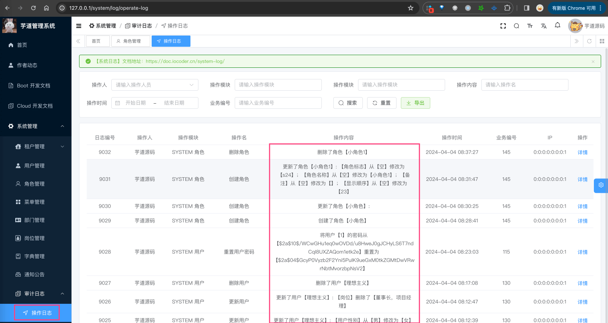

### [#](#_1-1-操作日志组件) 1.1 操作日志组件

① 操作日志的记录，由 [`yudao-spring-boot-starter-security` (opens new window)](https://github.com/YunaiV/yudao-cloud/blob/master/yudao-framework/yudao-spring-boot-starter-security/) 技术组件的 `operatelog` 包提供，基于我老友开源的 [https://github.com/mouzt/mzt-biz-log (opens new window)](https://github.com/mouzt/mzt-biz-log) 实现，只需要添加 `@LogRecord` 注解，即可实现操作日志的记录。

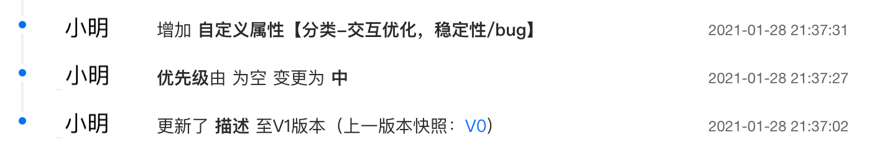

*   【新增】2021-09-16 10:00 订单创建，订单号：NO.11089999，其中涉及变量订单号 “NO.11089999”
*   【修改】2021-09-16 10:00 用户小明修改了订单的配送地址：从 “金灿灿小区” 修改到 “银盏盏小区”

疑问：为什么不独立一个 \`yudao-spring-boot-starter-operatelog\` 组件呢？

早期，项目确实有 `operatelog` 组件，和 `mzt-biz-log` 组件一样，也是基于 Spring AOP + 注解实现。

随着我老友开源了 `mzt-biz-log` 组件，再加上希望减少项目的 starter 数量，所以决定直接使用 `mzt-biz-log` 组件，放到 `security` 组件中，而不是自己再造一个轮子。

② 操作日志的存储，由 `yudao-module-system` 的 [OperateLog (opens new window)](https://github.com/YunaiV/yudao-cloud/blob/master/yudao-module-system/yudao-module-system-biz/src/main/java/cn/iocoder/yudao/module/system/service/logger/OperateLogServiceImpl.java) 模块实现，记录到数据库的 [`system_operate_log` (opens new window)](https://github.com/YunaiV/yudao-cloud/blob/master/yudao-module-system/yudao-module-system-biz/src/main/java/cn/iocoder/yudao/module/system/dal/dataobject/logger/OperateLogDO.java) 表。

* * *

下面，我们来看项目中的几个使用案例。在开始之前，希望你先简单通读下 [《mzt-biz-log 使用指南》 (opens new window)](https://github.com/mouzt/mzt-biz-log/blob/master/readme.md) 文档。

### [#](#_1-2-场景一-创建用户) 1.2 场景一：创建用户

① 在 [LogRecordConstants (opens new window)](https://github.com/YunaiV/yudao-cloud/blob/master/yudao-module-system/yudao-module-system-api/src/main/java/cn/iocoder/yudao/module/system/enums/LogRecordConstants.java) 类中，定义 `SYSTEM_USER_CREATE_SUB_TYPE`、`SYSTEM_USER_CREATE_SUCCESS` 变量。如下图所示：

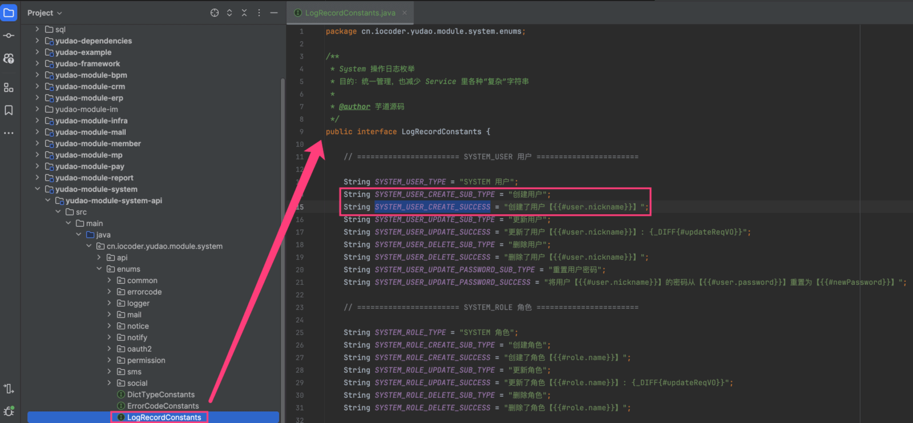

疑问：为什么要在 LogRecordConstants 定义？

这个并非强制，只是一个使用建议。每个 `yudao-module-xxx` 模块下，建议都搞一个 LogRecordConstants 类，方便大家统一管理操作日志的常量，这样方便大家查找。

② 在 Service 方法上，添加 `@LogRecord` 注解，如下图所示：

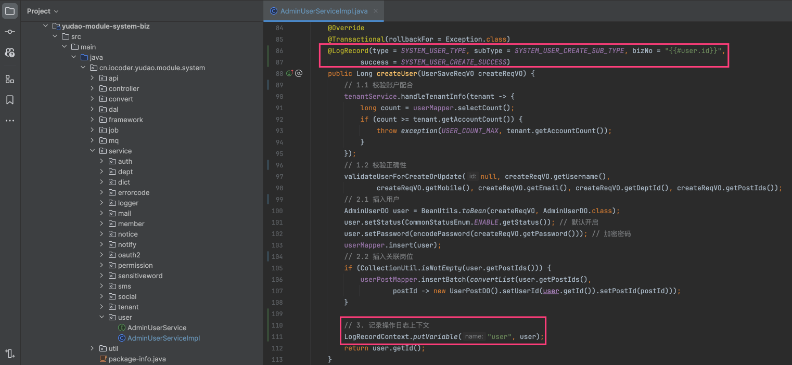

最终，我们记录操作日志的内容，如下图所示：

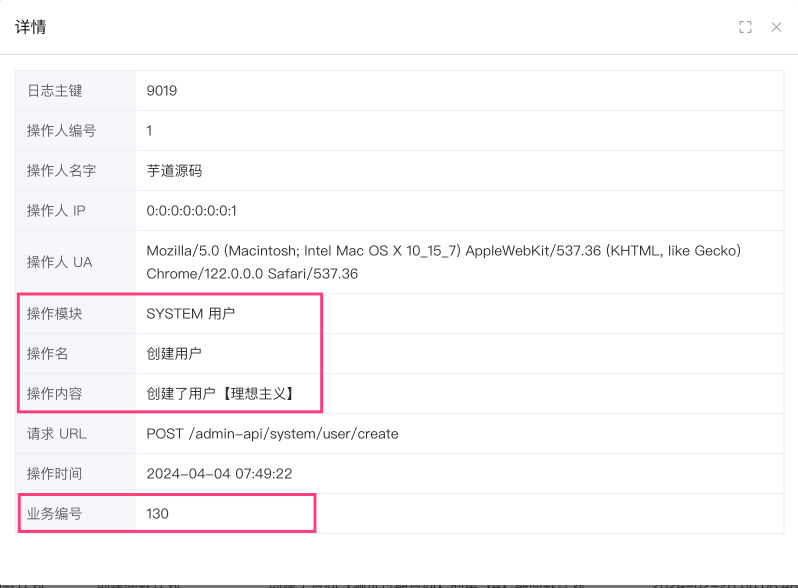

### [#](#_1-3-场景二-修改用户信息) 1.3 场景二：修改用户信息

① 在 [LogRecordConstants (opens new window)](https://github.com/YunaiV/yudao-cloud/blob/master/yudao-module-system/yudao-module-system-api/src/main/java/cn/iocoder/yudao/module/system/enums/LogRecordConstants.java) 类中，定义 `SYSTEM_USER_UPDATE_SUB_TYPE`、`SYSTEM_USER_UPDATE_SUCCESS` 变量。如下图所示：

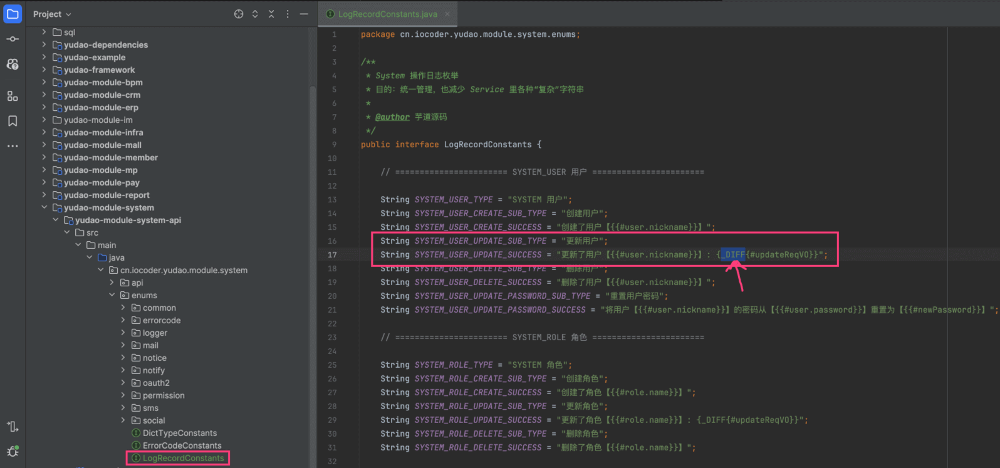

这里我们使用了 `_DIFF` 函数，实现对象 diff 功能，即“【备注】从【132】修改为【1324】”。因此，我们需要在 [UserSaveReqVO (opens new window)](https://github.com/YunaiV/yudao-cloud/blob/master/yudao-module-system/yudao-module-system-biz/src/main/java/cn/iocoder/yudao/module/system/controller/admin/user/vo/user/UserSaveReqVO.java) 类上添加 `@DiffLogField` 注解，如下图所示：

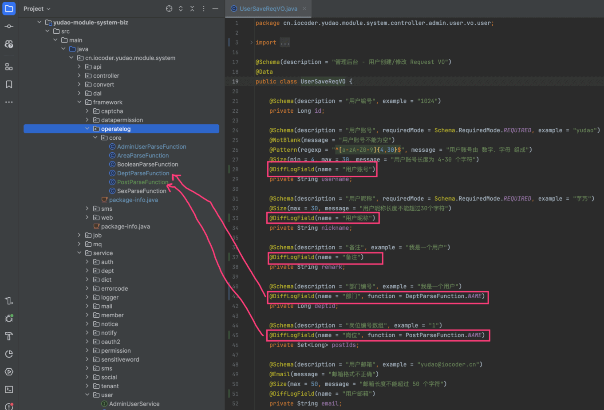

*   注解的 `name` 字段：字段的中文名，例如说：“【备注】”
*   注解的 `function` 字段：自定义函数，用于字段的值翻译，例如说：[PostParseFunction (opens new window)](https://github.com/YunaiV/yudao-cloud/blob/master/yudao-module-system/yudao-module-system-biz/src/main/java/cn/iocoder/yudao/module/system/framework/operatelog/core/PostParseFunction.java) 岗位名、[DeptParseFunction (opens new window)](https://github.com/YunaiV/yudao-cloud/blob/master/yudao-module-system/yudao-module-system-biz/src/main/java/cn/iocoder/yudao/module/system/framework/operatelog/core/DeptParseFunction.java) 部门名、[SexParseFunction (opens new window)](https://github.com/YunaiV/yudao-cloud/blob/master/yudao-module-system/yudao-module-system-biz/src/main/java/cn/iocoder/yudao/module/system/framework/operatelog/core/SexParseFunction.java) 性别等等

② 在 Service 方法上，添加 `@LogRecord` 注解，如下图所示：

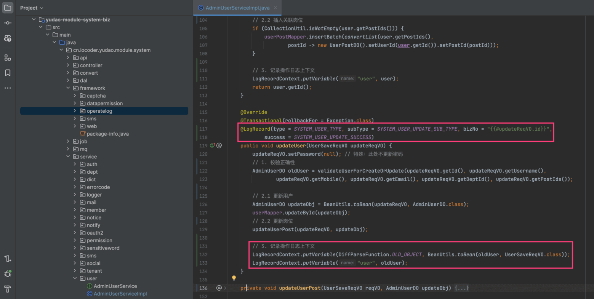

最终，我们记录操作日志的内容，如下图所示：

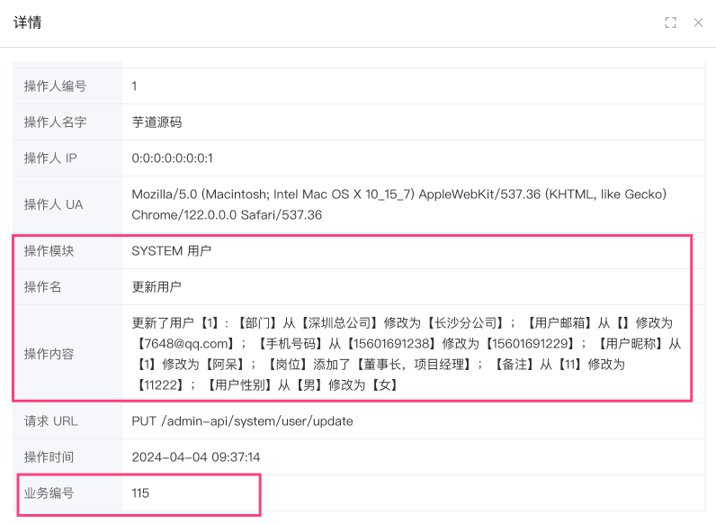

### [#](#_1-4-更多场景) 1.4 更多场景

由于操作日志需要手动记录，再加上是新改造的，所以目前只有少数几个地方使用了。后续，我们会逐步完善，让操作日志更加完善。

目前，[CRM 模块的操作日志 (opens new window)](https://github.com/YunaiV/yudao-cloud/blob/master/yudao-module-crm/yudao-module-crm-api/src/main/java/cn/iocoder/yudao/module/crm/enums/LogRecordConstants.java)是最全的，应该有大几十个使用案例，大家碰到不会使用的地方，可以参考下。

## [#](#_2-登录日志) 2. 登录日志

登录日志，记录用户的登录、登出行为，包括成功的、失败的。

打开 \[系统管理 -> 审计日志 -> 登录日志\] 菜单，可以看对应的列表，如下图所示：

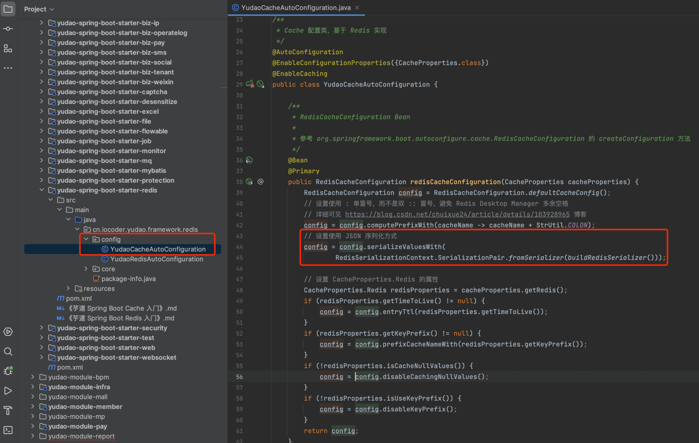

登录日志的存储，由 `yudao-module-system` 的 [LoginLog (opens new window)](https://github.com/YunaiV/yudao-cloud/blob/master/yudao-module-system/yudao-module-system-biz/src/main/java/cn/iocoder/yudao/module/system/service/logger/LoginLogServiceImpl.java) 模块实现，记录到数据库的 [`system_login_log` (opens new window)](https://github.com/YunaiV/yudao-cloud/blob/master/yudao-module-system/yudao-module-system-biz/src/main/java/cn/iocoder/yudao/module/system/dal/dataobject/logger/LoginLogDO.java) 表。

登录类型通过 [LoginLogTypeEnum (opens new window)](https://github.com/YunaiV/yudao-cloud/blob/master/yudao-module-system/yudao-module-system-api/src/main/java/cn/iocoder/yudao/module/system/enums/logger/LoginLogTypeEnum.java) 枚举，登录结果通过 [LoginResultEnum (opens new window)](https://github.com/YunaiV/yudao-cloud/blob/master/yudao-module-system/yudao-module-system-api/src/main/java/cn/iocoder/yudao/module/system/enums/logger/LoginResultEnum.java) 枚举，都可以自定义。代码如下：

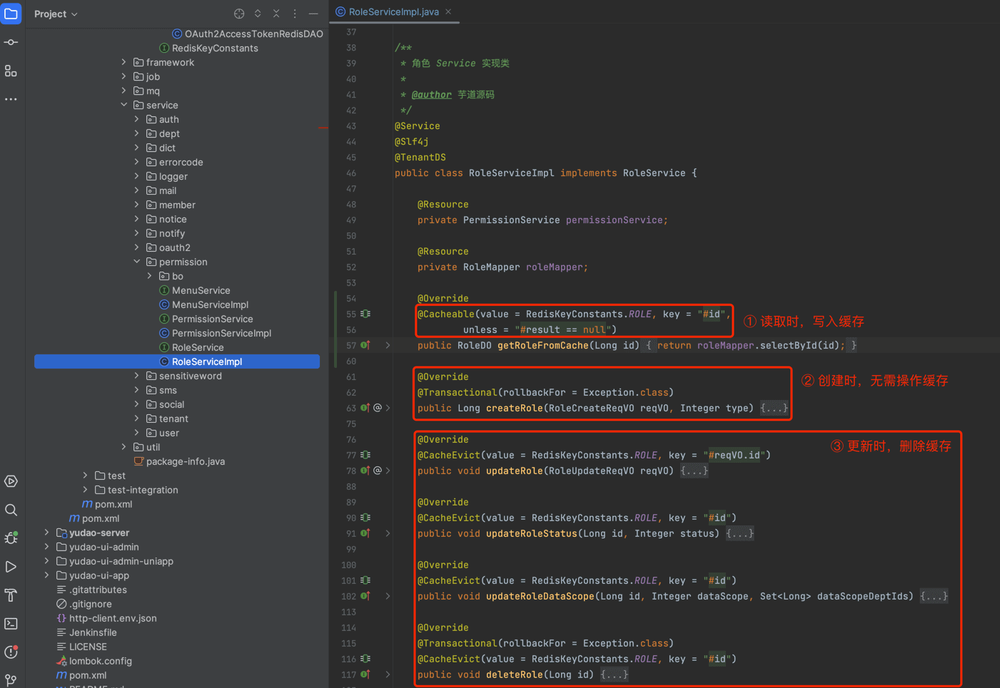

### [#](#_3-1-数据库记录) 3.1 数据库记录

API 访问日志，记录 API 的每次调用，包括 HTTP 请求、用户、开始时间、时长等等信息。

打开 \[基础设施 -> API 日志 -> 访问日志\] 菜单，可以看对应的列表，如下图所示：

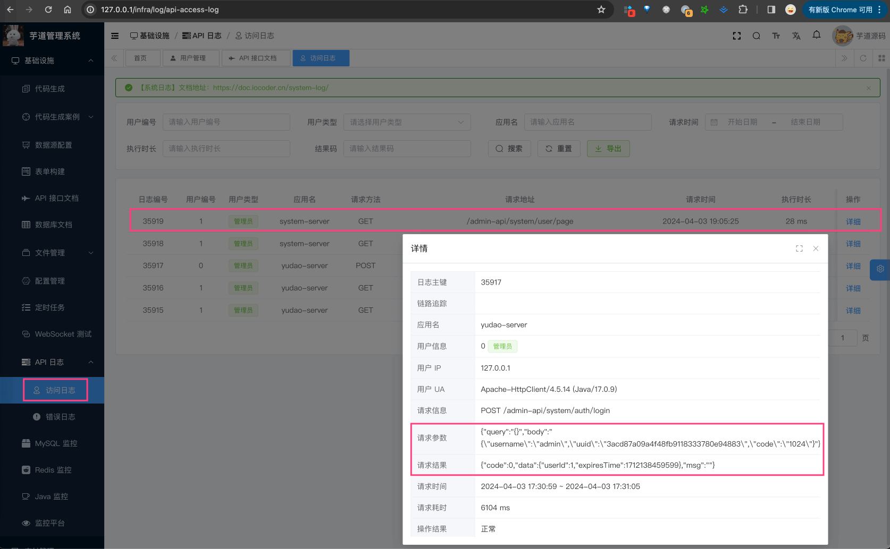

① 访问日志的记录，由 [`yudao-spring-boot-starter-web` (opens new window)](https://github.com/YunaiV/yudao-cloud/blob/master/yudao-framework/yudao-spring-boot-starter-web/) 技术组件实现，通过 [ApiAccessLogFilter (opens new window)](https://github.com/YunaiV/yudao-cloud/blob/master/yudao-framework/yudao-spring-boot-starter-web/src/main/java/cn/iocoder/yudao/framework/apilog/core/filter/ApiAccessLogFilter.java) 过滤 RESTful API 请求，**异步**记录日志。

② 访问日志的存储，由 `yudao-module-infra` 的 [AccessLog (opens new window)](https://github.com/YunaiV/yudao-cloud/blob/master/yudao-module-infra/yudao-module-infra-biz/src/main/java/cn/iocoder/yudao/module/infra/service/logger/ApiAccessLogServiceImpl.java) 模块实现，记录到数据库的 [`infra_api_access_log` (opens new window)](https://github.com/YunaiV/yudao-cloud/blob/master/yudao-module-infra/yudao-module-infra-biz/src/main/java/cn/iocoder/yudao/module/infra/dal/dataobject/logger/ApiAccessLogDO.java) 表。

③ 可以通过 [`@ApiAccessLog` (opens new window)](https://github.com/YunaiV/yudao-cloud/blob/master/yudao-framework/yudao-spring-boot-starter-web/src/main/java/cn/iocoder/yudao/framework/apilog/core/annotations/ApiAccessLog.java) 注解，自定义 API 访问日志的记录。如下图所示：

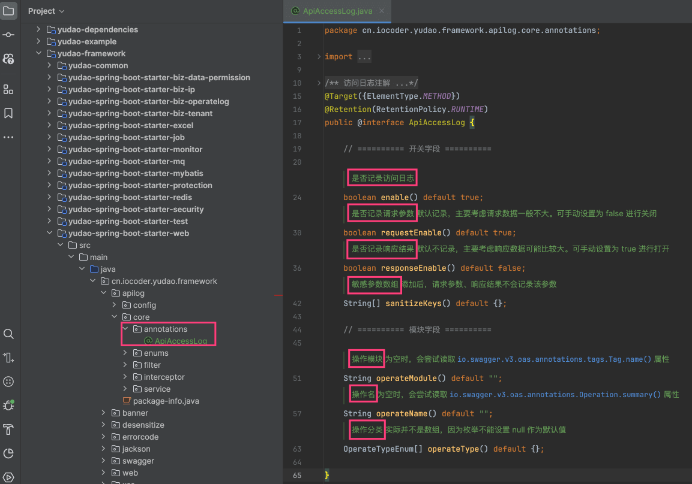

*   `enable` 字段：是否记录日志，默认为 `true` 记录日志。如果你想某个接口不记录日志，可以设置为 `false`，例如说 NotifyMessageController 的 `#getUnreadNotifyMessageCount()` 接口
*   `requestEnable` 字段：默认为 `true` 记录请求参数，主要考虑请求参数一般不大。如果你想某个接口不记录请求参数，可以设置为 `false`
*   `sanitizeKeys` 字段：脱敏字段，例如说：密码、访问令牌等等。如果你想某个接口脱敏某个字段，可以设置为 `password`、`mobile` 等等。另外，ApiAccessLogFilter 默认有 [`SANITIZE_KEYS` (opens new window)](https://github.com/YunaiV/yudao-cloud/blob/master/yudao-framework/yudao-spring-boot-starter-web/src/main/java/cn/iocoder/yudao/framework/apilog/core/filter/ApiAccessLogFilter.java#L52) 全局配置，包括 `password`、`accessToken`、`refreshToken` 等，避免大家忘记~
*   `responseEnable` 字段：默认为 `false` 不记录响应参数，主要考虑响应参数一般比较大，特别是 `GET` 列表请求。如果你想某个接口记录响应参数，可以设置为 `true`
*   `operateModule` 字段：操作模块，例如说：用户、岗位、部门等等。为空时，默认会读取类上的 Swagger `@Tag` 注解的 `name` 属性
*   `operateName` 字段：操作名，例如说：新增用户、修改用户等等。为空时，默认会读取方法的 Swagger `@Operation` 注解的 `summary` 属性
*   `operateType` 字段：操作类型，操作类型，在 [OperateTypeEnum (opens new window)](https://github.com/YunaiV/yudao-cloud/blob/master/yudao-framework/yudao-spring-boot-starter-web/src/main/java/cn/iocoder/yudao/framework/apilog/core/interceptor/ApiAccessLogInterceptor.java) 枚举。目前有 `GET` 查询、`CREATE` 新增、`UPDATE` 修改、`DELETE` 删除、`EXPORT` 导出、`IMPORT` 导入、`OTHER` 其它，可进行自定义

疑问：为什么要增加 \`operateModule\`、\`operateName\`、\`operateType\` 字段呢？

从感受上来说，它们应该属于“操作日志”，不应该记录到“访问日志”中。但是考虑到“操作日志”需要手动记录，可能大家会“偷懒”不想记录，但是业务人员（例如说：产品、运行）等看不懂“访问日志”，所以增加了这些字段，方便大家查看。

④ 我们在 `local` 本地环境下，一般做一些日常开发，使用不到“访问日志”，所以默认在 `application-local.yaml` 配置文件里，我们设置 `yudao.access-log.enable` 为 `false` 默认不记录，大家如果有需要，可以设置为 `true` 打开进行记录。

### [#](#_3-2-文件记录) 3.2 文件记录

项目还提供了 [ApiAccessLogInterceptor (opens new window)](https://github.com/YunaiV/yudao-cloud/blob/master/yudao-framework/yudao-spring-boot-starter-web/src/main/java/cn/iocoder/yudao/framework/apilog/core/interceptor/ApiAccessLogInterceptor.java) 拦截器，打印 HTTP 请求、参数、耗时到文件（IDEA 控制台）中，方便大家进行调试。如下图所示：

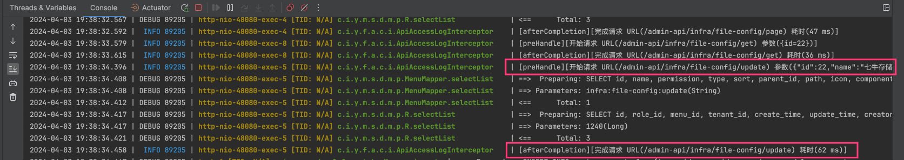

每次请求有两条：一条 `request` 【开始请求】包括请求 URL、请求参数；一条 `response` 【结束请求】只包括耗时。

另外，考虑到 ApiAccessLogInterceptor 的定位是开发调试，所以 `prod` 生产环境默认不开启噢，当然你也可以按照自己需要修改。

## [#](#_4-api-错误日志) 4. API 错误日志

API 错误日志，记录每次 API 的异常调用，包括 HTTP 请求、用户、异常的堆栈等等信息。

打开 \[基础设施 -> API 日志 -> 错误日志\] 菜单，可以看对应的列表，如下图所示：

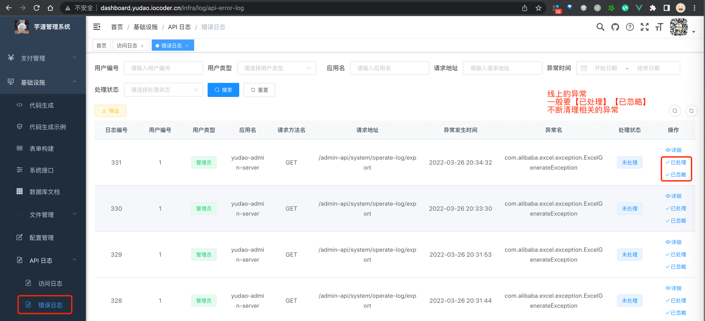

错误日志的记录，由 [`yudao-spring-boot-starter-web` (opens new window)](https://github.com/YunaiV/yudao-cloud/blob/master/yudao-framework/yudao-spring-boot-starter-web/) 技术组件实现，通过 [GlobalExceptionHandler (opens new window)](https://github.com/YunaiV/yudao-cloud/blob/master/yudao-framework/yudao-spring-boot-starter-web/src/main/java/cn/iocoder/yudao/framework/web/core/handler/GlobalExceptionHandler.java) 拦截每次 RESTful API 的系统异常，**异步**记录日志。

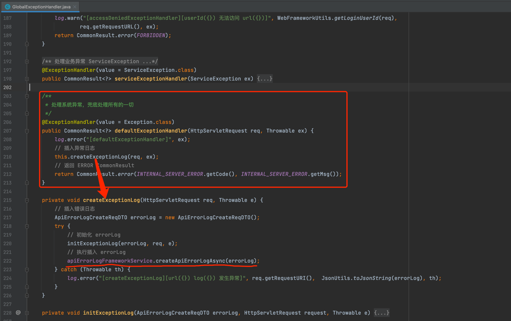

错误日志的存储，由 `yudao-module-infra` 的 [ErrorLog (opens new window)](https://github.com/YunaiV/yudao-cloud/blob/master/yudao-module-infra/yudao-module-infra-biz/src/main/java/cn/iocoder/yudao/module/infra/service/logger/ApiErrorLogServiceImpl.java) 模块实现，记录到数据库的 [`infra_api_error_log` (opens new window)](https://github.com/YunaiV/yudao-cloud/blob/master/yudao-module-infra/yudao-module-infra-biz/src/main/java/cn/iocoder/yudao/module/infra/dal/dataobject/logger/ApiErrorLogDO.java) 表。