目录

# 新建服务

本章节，将介绍如何新建名字为 `yudao-module-demo` 的示例服务，并添加 RESTful API 接口。

虽然内容看起来比较长，是因为艿艿写的比较详细，大量截图，保姆级教程！其实只有 6 个步骤，保持耐心，跟着艿艿一点点来。🙂 完成之后，你会对整个 [项目结构](/project-intro/) 有更充分的了解。

## [#](#👍-相关视频教程) 👍 相关视频教程

*   [从零开始 06：如何 5 分钟，创建一个新模块？ (opens new window)](https://t.zsxq.com/07EUrZrNV) 【该视频是 Boot 单体版，Cloud 待录制】

## [#](#_1-新建-demo-模块) 1. 新建 demo 模块

① 选择 File -> New -> Module 菜单，如下图所示：

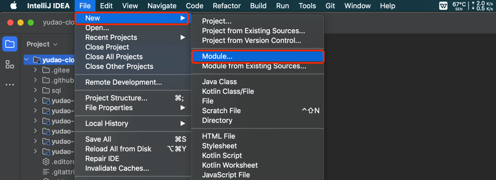

② 选择 Maven 类型，选择父模块为 `yudao`，输入名字为 `yudao-module-demo`，并点击 Create 按钮，如下图所示：

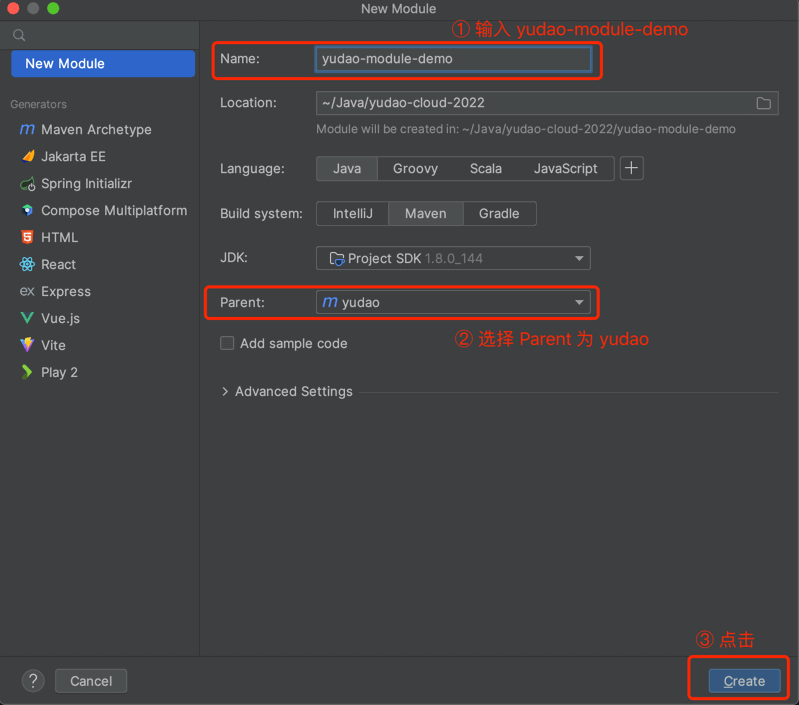

③ 打开 `yudao-module-demo` 模块，删除 src 文件，如下图所示：

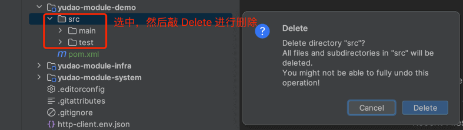

④ 打开 `yudao-module-demo` 模块的 `pom.xml` 文件，修改内容如下：

提示

`<!-- -->` 部分，只是注释，不需要写到 XML 中。

```xml
<?xml version="1.0" encoding="UTF-8"?>
<project xmlns="http://maven.apache.org/POM/4.0.0"
         xmlns:xsi="http://www.w3.org/2001/XMLSchema-instance"
         xsi:schemaLocation="http://maven.apache.org/POM/4.0.0 http://maven.apache.org/xsd/maven-4.0.0.xsd">
    <parent>
        <artifactId>yudao</artifactId>
        <groupId>cn.iocoder.cloud</groupId>
        <version>${revision}</version> <!-- 1. 修改 version 为 ${revision} -->
    </parent>
    <modelVersion>4.0.0</modelVersion>

    <artifactId>yudao-module-demo</artifactId>
    <packaging>pom</packaging> <!-- 2. 新增 packaging 为 pom -->

    <name>${project.artifactId}</name> <!-- 3. 新增 name 为 ${project.artifactId} -->
    <description> <!-- 4. 新增 description 为该模块的描述 -->
        demo 模块，主要实现 XXX、YYY、ZZZ 等功能。
    </description>

</project>

```

## [#](#_2-新建-demo-api-子模块) 2. 新建 demo-api 子模块

① 新建 `yudao-module-demo-api` 子模块，整个过程和“新建 demo 模块”是一致的，如下图所示：


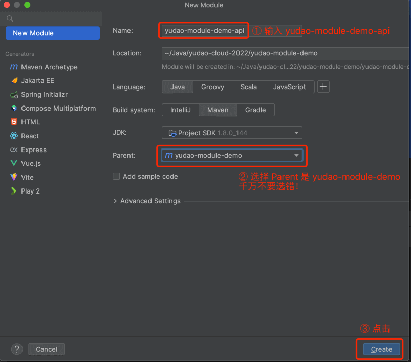

② 打开 `yudao-module-demo-api` 模块的 `pom.xml` 文件，修改内容如下：

```xml
<?xml version="1.0" encoding="UTF-8"?>
<project xmlns="http://maven.apache.org/POM/4.0.0"
         xmlns:xsi="http://www.w3.org/2001/XMLSchema-instance"
         xsi:schemaLocation="http://maven.apache.org/POM/4.0.0 http://maven.apache.org/xsd/maven-4.0.0.xsd">
    <parent>
        <artifactId>yudao-module-demo</artifactId>
        <groupId>cn.iocoder.cloud</groupId>
        <version>${revision}</version> <!-- 1. 修改 version 为 ${revision} -->
    </parent>
    <modelVersion>4.0.0</modelVersion>
    <artifactId>yudao-module-demo-api</artifactId>
    <packaging>jar</packaging> <!-- 2. 新增 packaging 为 jar -->

    <name>${project.artifactId}</name> <!-- 3. 新增 name 为 ${project.artifactId} -->
    <description> <!-- 4. 新增 description 为该模块的描述 -->
        demo 模块 API，暴露给其它模块调用
    </description>

    <dependencies>  <!-- 5. 新增 yudao-common 依赖 -->
        <dependency>
            <groupId>cn.iocoder.cloud</groupId>
            <artifactId>yudao-common</artifactId>
        </dependency>
    </dependencies>

</project>

```

③ 【可选】新建 `cn.iocoder.yudao.module.demo` **基础**包，其中 `demo` 为模块名。之后，新建 `api` 和 `enums` 包。如下图所示：

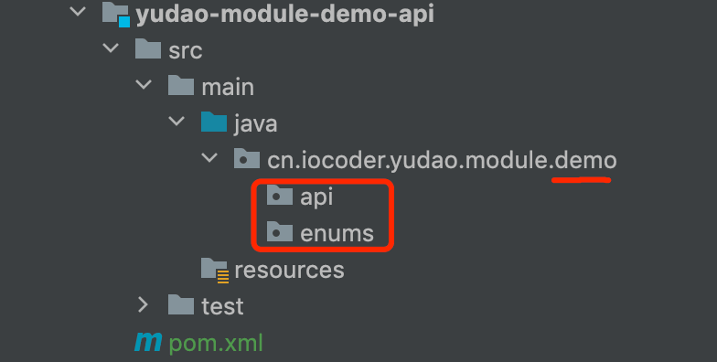

## [#](#_3-新建-demo-biz-子模块) 3. 新建 demo-biz 子模块

① 新建 `yudao-module-demo-biz` 子模块，整个过程和“新建 demo 模块”也是一致的，如下图所示：


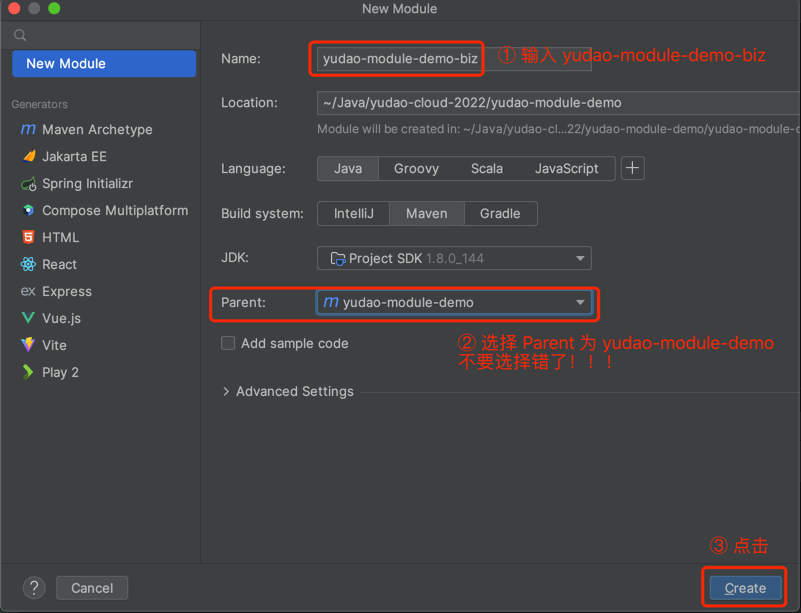

② 打开 `yudao-module-demo-biz` 模块的 `pom.xml` 文件，修改成内容如下：

```xml
<?xml version="1.0" encoding="UTF-8"?>
<project xmlns="http://maven.apache.org/POM/4.0.0"
         xmlns:xsi="http://www.w3.org/2001/XMLSchema-instance"
         xsi:schemaLocation="http://maven.apache.org/POM/4.0.0 http://maven.apache.org/xsd/maven-4.0.0.xsd">
    <parent>
        <artifactId>yudao-module-demo</artifactId>
        <groupId>cn.iocoder.cloud</groupId>
        <version>${revision}</version> <!-- 1. 修改 version 为 ${revision} -->
    </parent>
    <modelVersion>4.0.0</modelVersion>
    <packaging>jar</packaging> <!-- 2. 新增 packaging 为 jar -->

    <artifactId>yudao-module-demo-biz</artifactId>

    <name>${project.artifactId}</name> <!-- 3. 新增 name 为 ${project.artifactId} -->
    <description> <!-- 4. 新增 description 为该模块的描述 -->
        demo 模块，主要实现 XXX、YYY、ZZZ 等功能。
    </description>

    <dependencies>  <!-- 5. 新增依赖，这里引入的都是比较常用的业务组件、技术组件 -->
        <!-- Spring Cloud 基础 -->
        <dependency>
            <groupId>cn.iocoder.cloud</groupId>
            <artifactId>yudao-spring-boot-starter-env</artifactId>
        </dependency>

        <!-- 依赖服务 -->
        <dependency>
            <groupId>cn.iocoder.cloud</groupId>
            <artifactId>yudao-module-system-api</artifactId>
            <version>${revision}</version>
        </dependency>
        <dependency>
            <groupId>cn.iocoder.cloud</groupId>
            <artifactId>yudao-module-infra-api</artifactId>
            <version>${revision}</version>
        </dependency>

        <dependency>
            <groupId>cn.iocoder.cloud</groupId>
            <artifactId>yudao-module-demo-api</artifactId>
            <version>${revision}</version>
        </dependency>

        <!-- 业务组件 -->
        <dependency>
            <groupId>cn.iocoder.cloud</groupId>
            <artifactId>yudao-spring-boot-starter-biz-data-permission</artifactId>
        </dependency>
        <dependency>
            <groupId>cn.iocoder.cloud</groupId>
            <artifactId>yudao-spring-boot-starter-biz-tenant</artifactId>
        </dependency>

        <!-- Web 相关 -->
        <dependency>
            <groupId>cn.iocoder.cloud</groupId>
            <artifactId>yudao-spring-boot-starter-web</artifactId>
        </dependency>

        <dependency>
            <groupId>cn.iocoder.cloud</groupId>
            <artifactId>yudao-spring-boot-starter-security</artifactId>
        </dependency>

        <!-- DB 相关 -->
        <dependency>
            <groupId>cn.iocoder.cloud</groupId>
            <artifactId>yudao-spring-boot-starter-mybatis</artifactId>
        </dependency>

        <dependency>
            <groupId>cn.iocoder.cloud</groupId>
            <artifactId>yudao-spring-boot-starter-redis</artifactId>
        </dependency>

        <!-- RPC 远程调用相关 -->
        <dependency>
            <groupId>cn.iocoder.cloud</groupId>
            <artifactId>yudao-spring-boot-starter-rpc</artifactId>
        </dependency>

        <!-- Registry 注册中心相关 -->
        <dependency>
            <groupId>com.alibaba.cloud</groupId>
            <artifactId>spring-cloud-starter-alibaba-nacos-discovery</artifactId>
        </dependency>

        <!-- Config 配置中心相关 -->
        <dependency>
            <groupId>com.alibaba.cloud</groupId>
            <artifactId>spring-cloud-starter-alibaba-nacos-config</artifactId>
        </dependency>

        <!-- Job 定时任务相关 -->
        <dependency>
            <groupId>cn.iocoder.cloud</groupId>
            <artifactId>yudao-spring-boot-starter-job</artifactId>
        </dependency>

        <!-- 消息队列相关 -->
        <dependency>
            <groupId>cn.iocoder.cloud</groupId>
            <artifactId>yudao-spring-boot-starter-mq</artifactId>
        </dependency>

        <!-- Test 测试相关 -->
        <dependency>
            <groupId>cn.iocoder.cloud</groupId>
            <artifactId>yudao-spring-boot-starter-test</artifactId>
        </dependency>

        <!-- 工具类相关 -->
        <dependency>
            <groupId>cn.iocoder.cloud</groupId>
            <artifactId>yudao-spring-boot-starter-excel</artifactId>
        </dependency>

        <!-- 监控相关 -->
        <dependency>
            <groupId>cn.iocoder.cloud</groupId>
            <artifactId>yudao-spring-boot-starter-monitor</artifactId>
        </dependency>
    </dependencies>

    <build>
        <!-- 设置构建的 jar 包名 -->
        <finalName>${project.artifactId}</finalName>
        <plugins>
            <!-- 打包 -->
            <plugin>
                <groupId>org.springframework.boot</groupId>
                <artifactId>spring-boot-maven-plugin</artifactId>
                <version>${spring.boot.version}</version>
                <configuration>
                    <fork>true</fork>
                </configuration>
                <executions>
                    <execution>
                        <goals>
                            <goal>repackage</goal> <!-- 将引入的 jar 打入其中 -->
                        </goals>
                    </execution>
                </executions>
            </plugin>
        </plugins>
    </build>
</project>

```

③ 【必选】新建 `cn.iocoder.yudao.module.demo` **基础**包，其中 `demo` 为模块名。之后，新建 `controller.admin` 和 `controller.user` 等包。如下图所示：

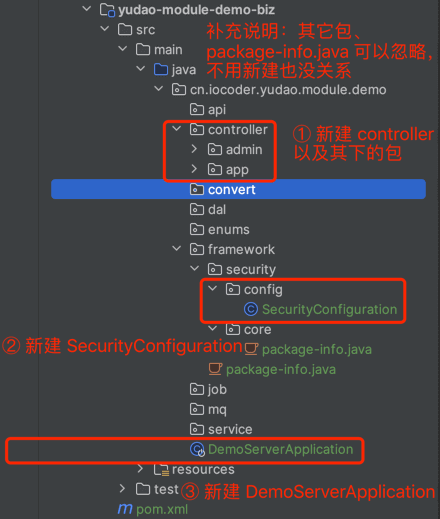

友情提示：

注意！【JDK 17 + Spring Boot 3.X 版本】和【JDK 8 + Spring Boot 2.X 版本】的代码略有不同，下面会分别展示。

【JDK 17 + Spring Boot 3.X 版本】其中 SecurityConfiguration 的 Java 代码如下：

```java
package cn.iocoder.yudao.module.demo.framework.security.config;

import cn.iocoder.yudao.framework.security.config.AuthorizeRequestsCustomizer;
import cn.iocoder.yudao.module.infra.enums.ApiConstants;
import org.springframework.beans.factory.annotation.Value;
import org.springframework.context.annotation.Bean;
import org.springframework.context.annotation.Configuration;
import org.springframework.security.config.annotation.web.builders.HttpSecurity;
import org.springframework.security.config.annotation.web.configurers.AuthorizeHttpRequestsConfigurer;

/**
 * Demo 模块的 Security 配置
 */
@Configuration(proxyBeanMethods = false)
public class SecurityConfiguration {

    @Bean
    public AuthorizeRequestsCustomizer authorizeRequestsCustomizer() {
        return new AuthorizeRequestsCustomizer() {

            @Override
            public void customize(ExpressionUrlAuthorizationConfigurer<HttpSecurity>.ExpressionInterceptUrlRegistry registry) {
                // Swagger 接口文档
                registry.requestMatchers("/v3/api-docs/**").permitAll()
                        .requestMatchers("/webjars/**").permitAll()
                        .requestMatchers("/swagger-ui").permitAll()
                        .requestMatchers("/swagger-ui/**").permitAll();
                // Druid 监控
                registry.requestMatchers("/druid/**").permitAll();
                // Spring Boot Actuator 的安全配置
                registry.requestMatchers("/actuator").permitAll()
                        .requestMatchers("/actuator/**").permitAll();
                // RPC 服务的安全配置
                registry.requestMatchers(ApiConstants.PREFIX + "/**").permitAll();
            }

        };
    }

}

```

【JDK 8 + Spring Boot 2.X 版本】其中 SecurityConfiguration 的 Java 代码如下：

```java
package cn.iocoder.yudao.module.demo.framework.security.config;

import cn.iocoder.yudao.framework.security.config.AuthorizeRequestsCustomizer;
import cn.iocoder.yudao.module.system.enums.ApiConstants;
import org.springframework.context.annotation.Bean;
import org.springframework.context.annotation.Configuration;
import org.springframework.security.config.annotation.web.builders.HttpSecurity;
import org.springframework.security.config.annotation.web.configurers.ExpressionUrlAuthorizationConfigurer;

/**
 * Demo 模块的 Security 配置
 */
@Configuration(proxyBeanMethods = false)
public class SecurityConfiguration {

    @Bean
    public AuthorizeRequestsCustomizer authorizeRequestsCustomizer() {
        return new AuthorizeRequestsCustomizer() {

            @Override
            public void customize(ExpressionUrlAuthorizationConfigurer<HttpSecurity>.ExpressionInterceptUrlRegistry registry) {
                // Swagger 接口文档
                registry.antMatchers("/v3/api-docs/**").permitAll()
                        .antMatchers("/webjars/**").permitAll()
                        .antMatchers("/swagger-ui").permitAll()
                        .antMatchers("/swagger-ui/**").permitAll();
                // Druid 监控
                registry.antMatchers("/druid/**").anonymous();
                // Spring Boot Actuator 的安全配置
                registry.antMatchers("/actuator").anonymous()
                        .antMatchers("/actuator/**").anonymous();
                // RPC 服务的安全配置
                registry.antMatchers(ApiConstants.PREFIX + "/**").permitAll();
            }

        };
    }

}

```

其中 DemoServerApplication 的 Java 代码如下：

```java
package cn.iocoder.yudao.module.demo;

import org.springframework.boot.SpringApplication;
import org.springframework.boot.autoconfigure.SpringBootApplication;

/**
 * 项目的启动类
 *
 * @author 芋道源码
 */
@SpringBootApplication
public class DemoServerApplication {

    public static void main(String[] args) {
        SpringApplication.run(DemoServerApplication.class, args);
    }

}

```

④ 打开 Maven 菜单，点击刷新按钮，让引入的 Maven 依赖生效。如下图所示：


⑤ 在 `resources` 目录下，新建配置文件。如下图所示：

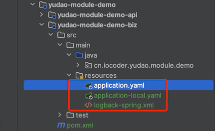

其中 `application.yml` 的配置如下：

```yaml
spring:
  application:
  name: demo-server

  profiles:
    active: local
  
  main:
    allow-circular-references: true # 允许循环依赖，因为项目是三层架构，无法避免这个情况。
    allow-bean-definition-overriding: true # 允许 Bean 覆盖，例如说 Feign 等会存在重复定义的服务

  config:
    import:
      - optional:classpath:application-${spring.profiles.active}.yaml # 加载【本地】配置
      - optional:nacos:${spring.application.name}-${spring.profiles.active}.yaml # 加载【Nacos】的配置

  # Servlet 配置
  servlet:
    # 文件上传相关配置项
    multipart:
      max-file-size: 16MB # 单个文件大小
      max-request-size: 32MB # 设置总上传的文件大小

  # Jackson 配置项
  jackson:
    serialization:
      write-dates-as-timestamps: true # 设置 LocalDateTime 的格式，使用时间戳
      write-date-timestamps-as-nanoseconds: false # 设置不使用 nanoseconds 的格式。例如说 1611460870.401，而是直接 1611460870401
      write-durations-as-timestamps: true # 设置 Duration 的格式，使用时间戳
      fail-on-empty-beans: false # 允许序列化无属性的 Bean

  # Cache 配置项
  cache:
    type: REDIS
    redis:
      time-to-live: 1h # 设置过期时间为 1 小时

server:
  port: 48099

logging:
  file:
    name: ${user.home}/logs/${spring.application.name}.log # 日志文件名，全路径

--- #################### 接口文档配置 ####################

springdoc:
  api-docs:
    enabled: true # 1. 是否开启 Swagger 接文档的元数据
    path: /v3/api-docs
  swagger-ui:
    enabled: true # 2.1 是否开启 Swagger 文档的官方 UI 界面
    path: /swagger-ui.html
  default-flat-param-object: true # 参见 https://doc.xiaominfo.com/docs/faq/v4/knife4j-parameterobject-flat-param 文档

knife4j:
  enable: true # 2.2 是否开启 Swagger 文档的 Knife4j UI 界面
  setting:
    language: zh_cn

# MyBatis Plus 的配置项
mybatis-plus:
  configuration:
    map-underscore-to-camel-case: true # 虽然默认为 true ，但是还是显示去指定下。
  global-config:
    db-config:
      id-type: NONE # “智能”模式，基于 IdTypeEnvironmentPostProcessor + 数据源的类型，自动适配成 AUTO、INPUT 模式。
      #      id-type: AUTO # 自增 ID，适合 MySQL 等直接自增的数据库
      #      id-type: INPUT # 用户输入 ID，适合 Oracle、PostgreSQL、Kingbase、DB2、H2 数据库
      #      id-type: ASSIGN_ID # 分配 ID，默认使用雪花算法。注意，Oracle、PostgreSQL、Kingbase、DB2、H2 数据库时，需要去除实体类上的 @KeySequence 注解
      logic-delete-value: 1 # 逻辑已删除值(默认为 1)
      logic-not-delete-value: 0 # 逻辑未删除值(默认为 0)
    banner: false # 关闭控制台的 Banner 打印
  type-aliases-package: ${yudao.info.base-package}.module.*.dal.dataobject
  encryptor:
    password: XDV71a+xqStEA3WH # 加解密的秘钥，可使用 https://www.imaegoo.com/2020/aes-key-generator/ 网站生成

mybatis-plus-join:
  banner: false # 关闭控制台的 Banner 打印

# VO 转换（数据翻译）相关
easy-trans:
  is-enable-global: true # 启用全局翻译（拦截所有 SpringMVC ResponseBody 进行自动翻译 )。如果对于性能要求很高可关闭此配置，或通过 @IgnoreTrans 忽略某个接口

--- #################### RPC 远程调用相关配置 ####################

--- #################### MQ 消息队列相关配置 ####################

--- #################### 定时任务相关配置 ####################

xxl:
  job:
    executor:
      appname: ${spring.application.name} # 执行器 AppName
      logpath: ${user.home}/logs/xxl-job/${spring.application.name} # 执行器运行日志文件存储磁盘路径
    accessToken: default_token # 执行器通讯TOKEN

--- #################### 芋道相关配置 ####################

yudao:
  info:
    version: 1.0.0
    base-package: cn.iocoder.yudao.module.demo
  web:
    admin-ui:
      url: http://dashboard.yudao.iocoder.cn # Admin 管理后台 UI 的地址
  xss:
    enable: false
    exclude-urls: # 如下两个 url，仅仅是为了演示，去掉配置也没关系
      - ${spring.boot.admin.context-path}/** # 不处理 Spring Boot Admin 的请求
      - ${management.endpoints.web.base-path}/** # 不处理 Actuator 的请求
  swagger:
    title: 管理后台
    description: 提供管理员管理的所有功能
    version: ${yudao.info.version}
  tenant: # 多租户相关配置项
    enable: true

debug: false

```

*   `spring.application.name` 配置项：可以改成你想要的服务名。
*   `server.port` 配置项：可以改成你想要的端口号。
*   `yudao.info.version.base-package` 配置项：可以改成你的项目的基准包名。

其中 `application-local.yml` 的配置如下：

```yaml
--- #################### 数据库相关配置 ####################
spring:
  # 数据源配置项
  autoconfigure:
    exclude:
      - com.alibaba.druid.spring.boot.autoconfigure.DruidDataSourceAutoConfigure # 排除 Druid 的自动配置，使用 dynamic-datasource-spring-boot-starter 配置多数据源
      - de.codecentric.boot.admin.client.config.SpringBootAdminClientAutoConfiguration # 禁用 Spring Boot Admin 的 Client 的自动配置
  datasource:
    druid: # Druid 【监控】相关的全局配置
      web-stat-filter:
        enabled: true
      stat-view-servlet:
        enabled: true
        allow: # 设置白名单，不填则允许所有访问
        url-pattern: /druid/*
        login-username: # 控制台管理用户名和密码
        login-password:
      filter:
        stat:
          enabled: true
          log-slow-sql: true # 慢 SQL 记录
          slow-sql-millis: 100
          merge-sql: true
        wall:
          config:
            multi-statement-allow: true
    dynamic: # 多数据源配置
      druid: # Druid 【连接池】相关的全局配置
        initial-size: 1 # 初始连接数
        min-idle: 1 # 最小连接池数量
        max-active: 20 # 最大连接池数量
        max-wait: 600000 # 配置获取连接等待超时的时间，单位：毫秒
        time-between-eviction-runs-millis: 60000 # 配置间隔多久才进行一次检测，检测需要关闭的空闲连接，单位：毫秒
        min-evictable-idle-time-millis: 300000 # 配置一个连接在池中最小生存的时间，单位：毫秒
        max-evictable-idle-time-millis: 900000 # 配置一个连接在池中最大生存的时间，单位：毫秒
        validation-query: SELECT 1 FROM DUAL # 配置检测连接是否有效
        test-while-idle: true
        test-on-borrow: false
        test-on-return: false
      primary: master
      datasource:
        master:
          url: jdbc:mysql://127.0.0.1:3306/ruoyi-vue-pro?useSSL=false&serverTimezone=Asia/Shanghai&allowPublicKeyRetrieval=true&nullCatalogMeansCurrent=true&rewriteBatchedStatements=true # MySQL Connector/J 8.X 连接的示例
          #          url: jdbc:mysql://127.0.0.1:3306/ruoyi-vue-pro?useSSL=true&allowPublicKeyRetrieval=true&useUnicode=true&characterEncoding=UTF-8&serverTimezone=Asia/Shanghai&rewriteBatchedStatements=true # MySQL Connector/J 5.X 连接的示例
          #          url: jdbc:postgresql://127.0.0.1:5432/ruoyi-vue-pro # PostgreSQL 连接的示例
          #          url: jdbc:oracle:thin:@127.0.0.1:1521:xe # Oracle 连接的示例
          #          url: jdbc:sqlserver://127.0.0.1:1433;DatabaseName=ruoyi-vue-pro # SQLServer 连接的示例
          #          url: jdbc:dm://10.211.55.4:5236?schema=RUOYI_VUE_PRO # DM 连接的示例
          username: root
          password: 123456
        #          username: sa # SQL Server 连接的示例
        #          password: JSm:g(*%lU4ZAkz06cd52KqT3)i1?H7W # SQL Server 连接的示例
        #          username: SYSDBA # DM 连接的示例
        #          password: SYSDBA # DM 连接的示例
        slave: # 模拟从库，可根据自己需要修改
          lazy: true # 开启懒加载，保证启动速度
          url: jdbc:mysql://127.0.0.1:3306/ruoyi-vue-pro?useSSL=false&serverTimezone=Asia/Shanghai&allowPublicKeyRetrieval=true&nullCatalogMeansCurrent=true&rewriteBatchedStatements=true
          username: root
          password: 123456

  # Redis 配置。Redisson 默认的配置足够使用，一般不需要进行调优
  redis:
    host: 127.0.0.1 # 地址
    port: 6379 # 端口
    database: 0 # 数据库索引
#    password: 123456 # 密码，建议生产环境开启

--- #################### MQ 消息队列相关配置 ####################

--- #################### 定时任务相关配置 ####################

xxl:
  job:
    admin:
      addresses: http://127.0.0.1:9090/xxl-job-admin # 调度中心部署跟地址

--- #################### 服务保障相关配置 ####################

# Lock4j 配置项
lock4j:
  acquire-timeout: 3000 # 获取分布式锁超时时间，默认为 3000 毫秒
  expire: 30000 # 分布式锁的超时时间，默认为 30 毫秒

--- #################### 监控相关配置 ####################

# Actuator 监控端点的配置项
management:
  endpoints:
    web:
      base-path: /actuator # Actuator 提供的 API 接口的根目录。默认为 /actuator
      exposure:
        include: '*' # 需要开放的端点。默认值只打开 health 和 info 两个端点。通过设置 * ，可以开放所有端点。

# Spring Boot Admin 配置项
spring:
  boot:
    admin:
      # Spring Boot Admin Client 客户端的相关配置
      client:
        instance:
          service-host-type: IP # 注册实例时，优先使用 IP [IP, HOST_NAME, CANONICAL_HOST_NAME]

# 日志文件配置
logging:
  level:
    # 配置自己写的 MyBatis Mapper 打印日志
    cn.iocoder.yudao.module.demo.dal.mysql: debug
    org.springframework.context.support.PostProcessorRegistrationDelegate: ERROR # TODO 芋艿：先禁用，Spring Boot 3.X 存在部分错误的 WARN 提示

--- #################### 芋道相关配置 ####################

# 芋道配置项，设置当前项目所有自定义的配置
yudao:
  env: # 多环境的配置项
    tag: ${HOSTNAME}
  security:
    mock-enable: true
  access-log: # 访问日志的配置项
    enable: false

```

*   `logging.level.cn.iocoder.yudao.module.demo.dal.mysql` 配置项：可以改成你的项目的基准包名。

其中 `logback-spring.xml` 的配置如下：

```xml
<configuration>
    <!-- 引用 Spring Boot 的 logback 基础配置 -->
    <include resource="org/springframework/boot/logging/logback/defaults.xml" />
    <!-- 变量 yudao.info.base-package，基础业务包 -->
    <springProperty scope="context" name="yudao.info.base-package" source="yudao.info.base-package"/>
    <!-- 格式化输出：%d 表示日期，%X{tid} SkWalking 链路追踪编号，%thread 表示线程名，%-5level：级别从左显示 5 个字符宽度，%msg：日志消息，%n是换行符 -->
    <property name="PATTERN_DEFAULT" value="%d{${LOG_DATEFORMAT_PATTERN:-yyyy-MM-dd HH:mm:ss.SSS}} | %highlight(${LOG_LEVEL_PATTERN:-%5p} ${PID:- }) | %boldYellow(%thread [%tid]) %boldGreen(%-40.40logger{39}) | %m%n${LOG_EXCEPTION_CONVERSION_WORD:-%wEx}"/>

    <!-- 控制台 Appender -->
    <appender name="STDOUT" class="ch.qos.logback.core.ConsoleAppender">　　　　　
        <encoder class="ch.qos.logback.core.encoder.LayoutWrappingEncoder">
            <layout class="org.apache.skywalking.apm.toolkit.log.logback.v1.x.TraceIdPatternLogbackLayout">
                <pattern>${PATTERN_DEFAULT}</pattern>
            </layout>
        </encoder>
    </appender>

    <!-- 文件 Appender -->
    <!-- 参考 Spring Boot 的 file-appender.xml 编写 -->
    <appender name="FILE"  class="ch.qos.logback.core.rolling.RollingFileAppender">
        <encoder class="ch.qos.logback.core.encoder.LayoutWrappingEncoder">
            <layout class="org.apache.skywalking.apm.toolkit.log.logback.v1.x.TraceIdPatternLogbackLayout">
                <pattern>${PATTERN_DEFAULT}</pattern>
            </layout>
        </encoder>
        <!-- 日志文件名 -->
        <file>${LOG_FILE}</file>
        <rollingPolicy class="ch.qos.logback.core.rolling.SizeAndTimeBasedRollingPolicy">
            <!-- 滚动后的日志文件名 -->
            <fileNamePattern>${LOGBACK_ROLLINGPOLICY_FILE_NAME_PATTERN:-${LOG_FILE}.%d{yyyy-MM-dd}.%i.gz}</fileNamePattern>
            <!-- 启动服务时，是否清理历史日志，一般不建议清理 -->
            <cleanHistoryOnStart>${LOGBACK_ROLLINGPOLICY_CLEAN_HISTORY_ON_START:-false}</cleanHistoryOnStart>
            <!-- 日志文件，到达多少容量，进行滚动 -->
            <maxFileSize>${LOGBACK_ROLLINGPOLICY_MAX_FILE_SIZE:-10MB}</maxFileSize>
            <!-- 日志文件的总大小，0 表示不限制 -->
            <totalSizeCap>${LOGBACK_ROLLINGPOLICY_TOTAL_SIZE_CAP:-0}</totalSizeCap>
            <!-- 日志文件的保留天数 -->
            <maxHistory>${LOGBACK_ROLLINGPOLICY_MAX_HISTORY:-30}</maxHistory>
        </rollingPolicy>
    </appender>
    <!-- 异步写入日志，提升性能 -->
    <appender name="ASYNC" class="ch.qos.logback.classic.AsyncAppender">
        <!-- 不丢失日志。默认的，如果队列的 80% 已满,则会丢弃 TRACT、DEBUG、INFO 级别的日志 -->
        <discardingThreshold>0</discardingThreshold>
        <!-- 更改默认的队列的深度，该值会影响性能。默认值为 256 -->
        <queueSize>256</queueSize>
        <appender-ref ref="FILE"/>
    </appender>

    <!-- SkyWalking GRPC 日志收集，实现日志中心。注意：SkyWalking 8.4.0 版本开始支持 -->
    <appender name="GRPC" class="org.apache.skywalking.apm.toolkit.log.logback.v1.x.log.GRPCLogClientAppender">
        <encoder class="ch.qos.logback.core.encoder.LayoutWrappingEncoder">
            <layout class="org.apache.skywalking.apm.toolkit.log.logback.v1.x.TraceIdPatternLogbackLayout">
                <pattern>${PATTERN_DEFAULT}</pattern>
            </layout>
        </encoder>
    </appender>

    <!-- 本地环境 -->
    <springProfile name="local">
        <root level="INFO">
            <appender-ref ref="STDOUT"/>
            <appender-ref ref="GRPC"/> <!-- 本地环境下，如果不想接入 SkyWalking 日志服务，可以注释掉本行 -->
            <appender-ref ref="ASYNC"/>  <!-- 本地环境下，如果不想打印日志，可以注释掉本行 -->
        </root>
    </springProfile>
    <!-- 其它环境 -->
    <springProfile name="dev,test,stage,prod,default">
        <root level="INFO">
            <appender-ref ref="STDOUT"/>
            <appender-ref ref="ASYNC"/>
            <appender-ref ref="GRPC"/>
        </root>
    </springProfile>

</configuration>

```

## [#](#_4-新建-restful-api-接口) 4. 新建 RESTful API 接口

① 在 `controller.admin` 包，新建一个 DemoTestController 类，并新建一个 `/demo/test/get` 接口。代码如下：

```java
package cn.iocoder.yudao.module.demo.controller.admin;

import cn.iocoder.yudao.framework.common.pojo.CommonResult;
import io.swagger.v3.oas.annotations.tags.Tag;
import io.swagger.v3.oas.annotations.Operation;
import org.springframework.validation.annotation.Validated;
import org.springframework.web.bind.annotation.GetMapping;
import org.springframework.web.bind.annotation.RequestMapping;
import org.springframework.web.bind.annotation.RestController;

import static cn.iocoder.yudao.framework.common.pojo.CommonResult.success;

@Tag(name = "管理后台 - Test")
@RestController
@RequestMapping("/demo/test")
@Validated
public class DemoTestController {

    @GetMapping("/get")
    @Operation(summary = "获取 test 信息")
    public CommonResult<String> get() {
        return success("true");
    }

}

```

**注意**，`/demo` 是该模块所有 RESTful API 的基础路径，`/test` 是 Test 功能的基础路径。

① 在 `controller.app` 包，新建一个 AppDemoTestController 类，并新建一个 `/demo/test/get` 接口。代码如下：

```java
package cn.iocoder.yudao.module.demo.controller.app;

import cn.iocoder.yudao.framework.common.pojo.CommonResult;
import io.swagger.v3.oas.annotations.tags.Tag;
import io.swagger.v3.oas.annotations.Operation;
import org.springframework.validation.annotation.Validated;
import org.springframework.web.bind.annotation.GetMapping;
import org.springframework.web.bind.annotation.RequestMapping;
import org.springframework.web.bind.annotation.RestController;

import static cn.iocoder.yudao.framework.common.pojo.CommonResult.success;

@Tag(name = "用户 App - Test")
@RestController
@RequestMapping("/demo/test")
@Validated
public class AppDemoTestController {

    @GetMapping("/get")
    @Operation(summary = "获取 test 信息")
    public CommonResult<String> get() {
        return success("true");
    }

}

```

在 Controller 的命名上，额外增加 **App** 作为前缀，一方面区分是管理后台还是用户 App 的 Controller，另一方面避免 Spring Bean 的名字冲突。

可能你会奇怪，这里我们定义了两个 `/demo/test/get` 接口，会不会存在重复导致冲突呢？答案，当然是并不会。原因是：

*   `controller.admin` 包下的接口，默认会增加 `/admin-api`，即最终的访问地址是 `/admin-api/demo/test/get`
*   `controller.app` 包下的接口，默认会增加 `/app-api`，即最终的访问地址是 `/app-api/demo/test/get`

## [#](#_5-启动-demo-服务) 5. 启动 demo 服务

① 运行 SystemServerApplication 类，将 `system` 服务启动。运行 InfraServerApplication 类，将 `infra` 服务启动。

② 运行 DemoServerApplication 类，将新建的 `demo` 服务进行启动。启动完成后，使用浏览器打开 [http://127.0.0.1:48099/doc.html (opens new window)](http://127.0.0.1:48099/doc.html) 地址，进入该服务的 Swagger 接口文档。

③ 打开“管理后台 - Test”接口，进行 `/admin-api/demo/test/get` 接口的调试，如下图所示：

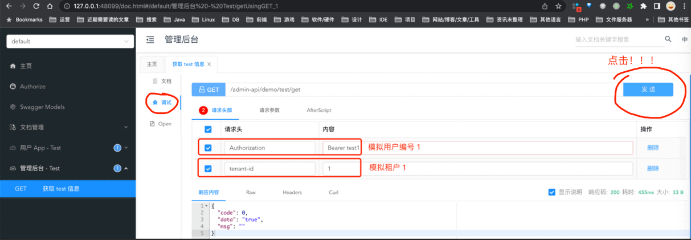

④ 打开“用户 App - Test”接口，进行 `/app-api/demo/test/get` 接口的调试，如下图所示：

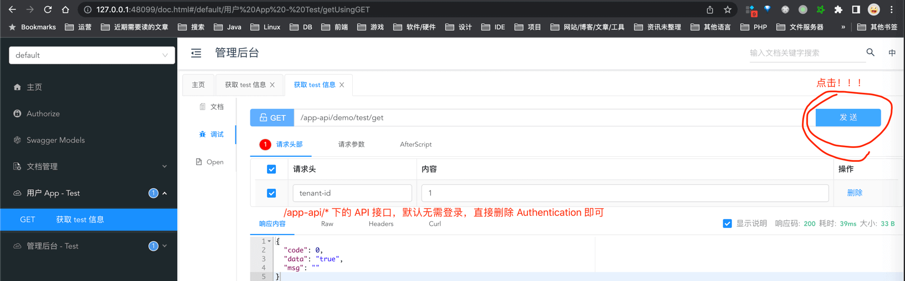

## [#](#_6-网关配置) 6. 网关配置

① 打开 `yudao-gateway` 网关项目的 `application.yml` 配置文件，增加 `demo` 服务的路由配置。代码如下：

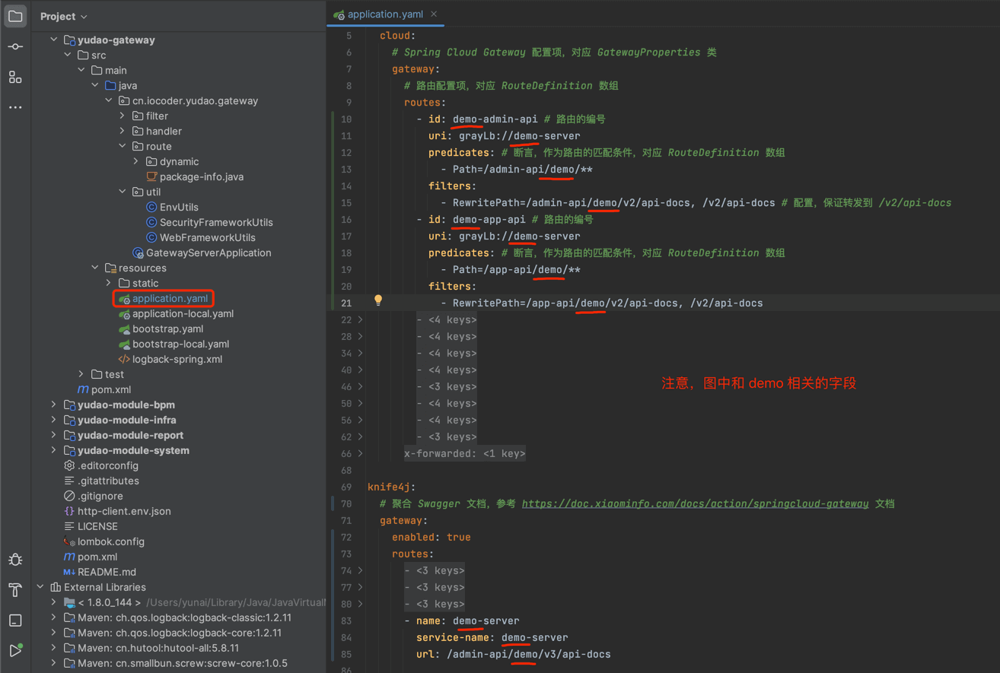

友情提示：图中的 /v2/ 都改成 /v3/，或者以下面的文字为准！！！

```yaml
        - id: demo-admin-api # 路由的编号
          uri: grayLb://demo-server
          predicates: # 断言，作为路由的匹配条件，对应 RouteDefinition 数组
            - Path=/admin-api/demo/**
          filters:
            - RewritePath=/admin-api/demo/v3/api-docs, /v3/api-docs # 配置，保证转发到 /v2/api-docs
        - id: demo-app-api # 路由的编号
          uri: grayLb://demo-server
          predicates: # 断言，作为路由的匹配条件，对应 RouteDefinition 数组
            - Path=/app-api/demo/**
          filters:
            - RewritePath=/app-api/demo/v3/api-docs, /v3/api-docs

```

```yaml
      - name: demo-server
        service-name: demo-server
        url: /admin-api/demo/v3/api-docs

```

② 运行 GatewayServerApplication 类，将 `gateway` 网关服务启动。

③ 使用浏览器打开 [http://127.0.0.1:48080/doc.html (opens new window)](http://127.0.0.1:48080/doc.html) 地址，进入网关的 Swagger 接口文档。然后，选择 `demo-server` 服务，即可进行 `/admin-api/demo/test/get` 和 `/app-api/demo/test/get` 接口的调试，如下图所示：

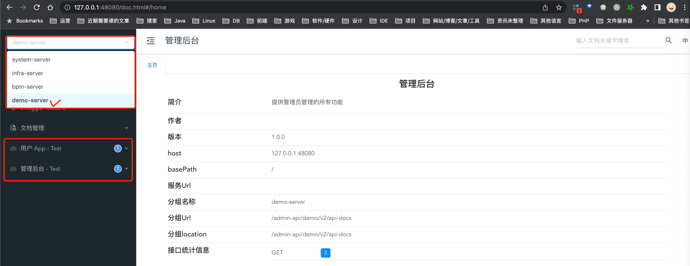