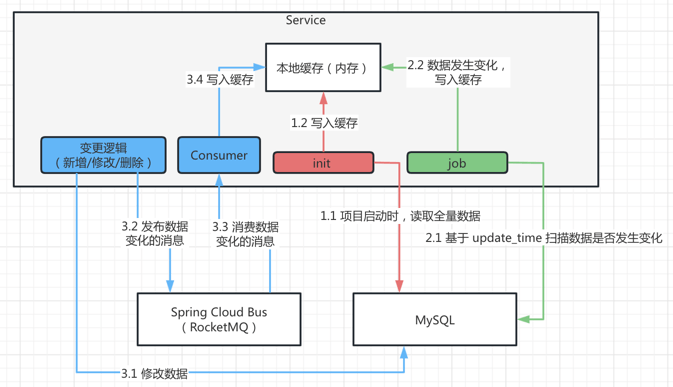
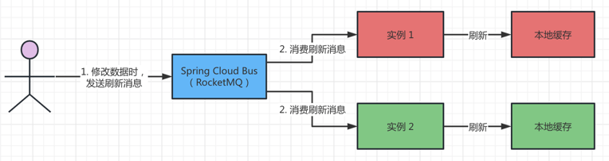

目录

# 本地缓存

重要说明：

① 由于大家普遍反馈，“本地缓存”学习成本太高，一般 Redis 缓存足够满足大多数场景的性能要求，所以基本使用 [Spring Cache](/redis-cache) + Redis 所替代。

也因此，本章节更多的，是讲解如何在项目中使用本地缓存。如果你不需要本地缓存，可以忽略本章节。

② 项目中还保留了部分地方使用本地缓存，例如说：短信客户端、文件客户端、敏感词等。主要原因是，它们是“有状态”的 Java 对象，无法缓存到 Redis 中。

系统使用本地缓存，提升公用逻辑的执行性能。 例如说： \*

*   [租户模块 (opens new window)](https://github.com/YunaiV/yudao-cloud/blob/master/yudao-module-system/yudao-module-system-biz/src/main/java/cn/iocoder/yudao/module/system/service/tenant/TenantServiceImpl.java) 缓存租户信息，每次 RESTful API 校验租户是否禁用、过期时，无需读库。
*   [部门模块 (opens new window)](https://github.com/YunaiV/yudao-cloud/blob/master/yudao-module-system/yudao-module-system-biz/src/main/java/cn/iocoder/yudao/module/system/service/dept/DeptServiceImpl.java) 缓存部门信息，每次数据权限校验时，无需读库。
*   [权限模块 (opens new window)](https://github.com/YunaiV/yudao-cloud/blob/master/yudao-module-system/yudao-module-system-biz/src/main/java/cn/iocoder/yudao/module/system/service/permission/PermissionServiceImpl.java) 缓存权限信息，每次功能权限校验时，无需读库。

## [#](#_1-实现原理) 1. 实现原理

本地缓存的实现，一共有两步，如下图所示：



*   项目启动时，初始化缓存：从数据库中读取数据，写入到本地缓存（例如说一个 Map 对象）
*   数据变化时，实时刷新缓存：（例如说通过管理后台修改数据）重新从数据库中读取数据，重新写入到本地缓存

## [#](#_2-实战案例) 2. 实战案例

以 [角色模块 (opens new window)](https://github.com/YunaiV/yudao-cloud/blob/master/yudao-module-system/yudao-module-system-biz/src/main/java/cn/iocoder/yudao/module/system/service/permission/RoleServiceImpl.java) 为例，讲解如何实现角色信息的本地缓存。

### [#](#_2-1-初始化缓存) 2.1 初始化缓存

① 在 [RoleService (opens new window)](https://github.com/YunaiV/yudao-cloud/blob/master/yudao-module-system/yudao-module-system-biz/src/main/java/cn/iocoder/yudao/module/system/service/permission/RoleService.java) 接口中，定义 `#initLocalCache()` 方法。代码如下：

```java
// RoleService.java

/**
 * 初始化角色的本地缓存
 */
void initLocalCache();

```

为什么要定义接口方法？

稍后实时刷新缓存时，会调用 RoleService 接口的该方法。

② 在 [RoleServiceImpl (opens new window)](https://github.com/YunaiV/yudao-cloud/blob/master/yudao-module-system/yudao-module-system-biz/src/main/java/cn/iocoder/yudao/module/system/service/permission/RoleServiceImpl.java) 类中，实现 `#initLocalCache()` 方法，通过 `@PostConstruct` 注解，在项目启动时进行本地缓存的初始化。代码如下：

```java
// RoleServiceImpl.java

/**
 * 角色缓存
 * key：角色编号 {@link RoleDO#getId()}
 *
 * 这里声明 volatile 修饰的原因是，每次刷新时，直接修改指向
 */
@Getter
private volatile Map<Long, RoleDO> roleCache;

/**
 * 初始化 {@link #roleCache} 缓存
 */
@Override
@PostConstruct
public void initLocalCache() {
    // 注意：忽略自动多租户，因为要全局初始化缓存
    TenantUtils.executeIgnore(() -> {
        // 第一步：查询数据
        List<RoleDO> roleList = roleMapper.selectList();
        log.info("[initLocalCache][缓存角色，数量为:{}]", roleList.size());
    
        // 第二步：构建缓存
        roleCache = CollectionUtils.convertMap(roleList, RoleDO::getId);
    });
}

```

疑问：为什么使用 TenantUtils 的 executeIgnore 方法来执行逻辑？

由于 RoleDO 是多租户隔离，如果使用 TenantUtils 方法，会导致缓存刷新时，只加载某个租户的角色数据，导致本地缓存的错误。

所以，如果缓存的数据不存在多租户隔离的情况，可以不使用 TenantUtils 方法！！！！

### [#](#_2-2-实时刷新缓存) 2.2 实时刷新缓存

为什么需要使用 [Spring Cloud Bus (opens new window)](https://spring.io/projects/spring-cloud-bus) 来实时刷新缓存？考虑到高可用，线上会部署多个 JVM 实例，需要通过 RocketMQ 广播到所有实例，实现本地缓存的刷新。



友情提示：

对 Spring Cloud Bus 不熟悉的同学，可以后续阅读 [《芋道 Spring Cloud Alibaba 事件总线 Bus RocketMQ 入门 》 (opens new window)](https://www.iocoder.cn/Spring-Cloud-Alibaba/Bus-RocketMQ/?yudao) 文档。

#### [#](#_2-2-1-rolerefreshmessage) 2.2.1 RoleRefreshMessage

新建 [RoleRefreshMessage (opens new window)](https://github.com/YunaiV/yudao-cloud/blob/master/yudao-module-system/yudao-module-system-biz/src/main/java/cn/iocoder/yudao/module/system/mq/message/permission/RoleRefreshMessage.java) 类，角色数据刷新 Message。代码如下：

```java
@Data
public class RoleRefreshMessage extends RemoteApplicationEvent {

    public RoleRefreshMessage() {
    }

    public RoleRefreshMessage(Object source, String originService, String destinationService) {
        super(source, originService, DEFAULT_DESTINATION_FACTORY.getDestination(destinationService));
    }

}

```

#### [#](#_2-2-2-roleproducer) 2.2.2 RoleProducer

① 新建 [RoleProducer (opens new window)](https://github.com/YunaiV/yudao-cloud/blob/master/yudao-module-system/yudao-module-system-biz/src/main/java/cn/iocoder/yudao/module/system/mq/producer/permission/RoleProducer.java) 类，RoleRefreshMessage 的 Producer 生产者。代码如下：

```java
@Component
public class RoleProducer extends AbstractBusProducer {

    /**
     * 发送 {@link RoleRefreshMessage} 消息
     */
    public void sendRoleRefreshMessage() {
        publishEvent(new RoleRefreshMessage(this, getBusId(), selfDestinationService()));
    }

}

```

② 在数据的新增 / 修改 / 删除等写入操作时，需要使用 RoleProducer 发送消息。如下图所示：


#### [#](#_2-2-3-rolerefreshconsumer) 2.2.3 RoleRefreshConsumer

新建 [RoleRefreshConsumer (opens new window)](https://github.com/YunaiV/yudao-cloud/blob/master/yudao-module-system/yudao-module-system-biz/src/main/java/cn/iocoder/yudao/module/system/mq/consumer/permission/RoleRefreshConsumer.java) 类，RoleRefreshMessage 的 Consumer 消费者，刷新本地缓存。代码如下：

```java
@Component
@Slf4j
public class RoleRefreshConsumer {

    @Resource
    private RoleService roleService;

    @EventListener
    public void execute(RoleRefreshMessage message) {
        log.info("[execute][收到 Role 刷新消息]");
        roleService.initLocalCache();
    }

}

```