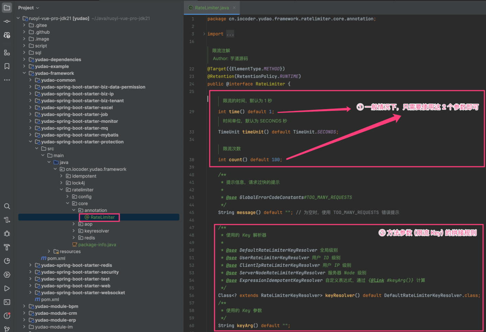
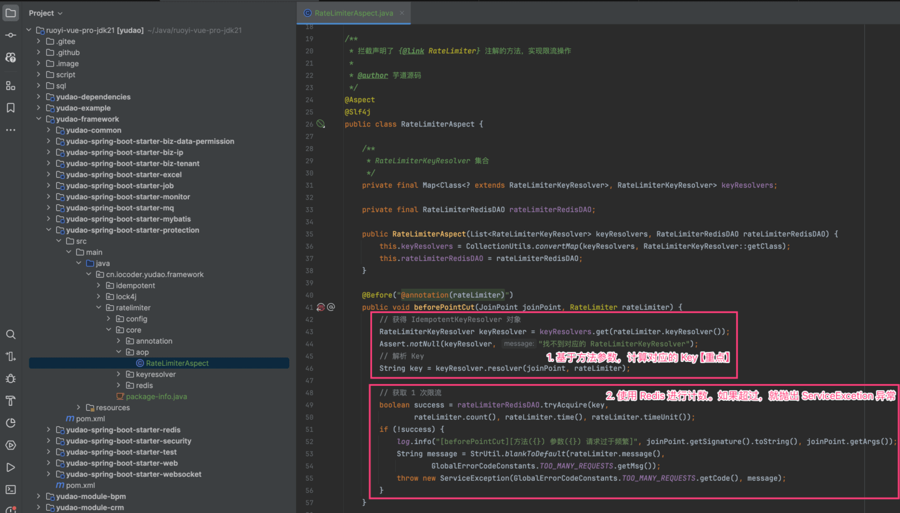
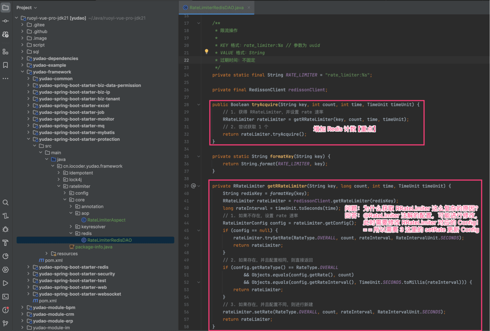
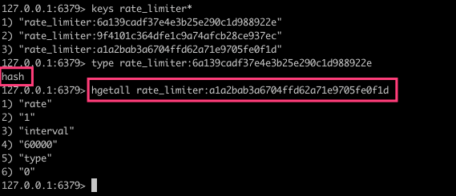

目录

# 请求限流（RateLimiter）

[`yudao-spring-boot-starter-protection` (opens new window)](https://github.com/YunaiV/yudao-cloud/blob/master/yudao-framework/yudao-spring-boot-starter-protection/) 技术组件，由它的 [`ratelimiter` (opens new window)](https://github.com/YunaiV/yudao-cloud/blob/master/yudao-framework/yudao-spring-boot-starter-protection/src/main/java/cn/iocoder/yudao/framework/ratelimiter/) 包，提供声明式的限流特性，可防止请求过多。例如说，用户疯狂的点击了某个按钮，导致发送了大量的请求。

```java

@RateLimiter(count = 10, timeUnit = TimeUnit.MINUTES)
@PostMapping("/user/create")
public String createUser(User user){
    userService.createUser(user);
    return "添加成功";
}

```

*   每分钟，所有用户，只能操作 10 次

疑问：如果想按照每个用户，或者每个 IP，限制请求呢？

可设置该注解的 `keyResolver` 属性，可选择的有：

*   DefaultRateLimiterKeyResolver：全局级别
*   UserRateLimiterKeyResolver：用户 ID 级别
*   ClientIpRateLimiterKeyResolver：用户 IP 级别
*   ServerNodeRateLimiterKeyResolver：服务器 Node 级别
*   ExpressionIdempotentKeyResolver：自定义级别，通过 `keyArg` 属性指定 Spring EL 表达式

## [#](#_1-实现原理) 1. 实现原理

友情提示：

它的实现原理，和 [《幂等性（防重复提交）》](/idempotent/) 比较接近哈。

它的实现原理非常简单，针对相同参数的方法，一段时间内，只能执行一定次数。执行流程如下：

在方法执行前，判断参数对应的 Key 是否超过限制：

*   如果**超过**，则进行报错。
*   如果**未超过**，则使用 Redis 计数 +1

默认参数的 Redis Key 的计算规则由 [DefaultRateLimiterKeyResolver (opens new window)](https://github.com/YunaiV/yudao-cloud/blob/master/yudao-framework/yudao-spring-boot-starter-protection/src/main/java/cn/iocoder/yudao/framework/ratelimiter/core/keyresolver/impl/DefaultRateLimiterKeyResolver.java) 实现，使用 MD5(方法名 + 方法参数)，避免 Redis Key 过长。

## [#](#_2-ratelimiter-注解) 2. `@RateLimiter` 注解

[`@RateLimiter` (opens new window)](https://github.com/YunaiV/yudao-cloud/blob/master/yudao-framework/yudao-spring-boot-starter-protection/src/main/java/cn/iocoder/yudao/framework/ratelimiter/core/annotation/RateLimiter.java) 注解，声明在方法上，表示该方法需要开启限流。代码如下：



① 对应的 AOP 切面是 [RateLimiterAspect (opens new window)](https://github.com/YunaiV/yudao-cloud/blob/master/yudao-framework/yudao-spring-boot-starter-protection/src/main/java/cn/iocoder/yudao/framework/ratelimiter/core/aop/RateLimiterAspect.java) 类，核心就 10 行左右的代码，如下图所示：



② 对应的 Redis Key 的前缀是 `rate_limiter:%` ，可见 [IdempotentRedisDAO (opens new window)](https://github.com/YunaiV/yudao-cloud/blob/master/yudao-framework/yudao-spring-boot-starter-protection/src/main/java/cn/iocoder/yudao/framework/ratelimiter/core/redis/RateLimiterRedisDAO.java) 类，如下图所示：



## [#](#_3-使用示例) 3. 使用示例

本小节，我们实现 `/admin-api/system/user/page` RESTful API 接口的限流。

① 在 `pom.xml` 文件中，引入 `yudao-spring-boot-starter-protection` 依赖。

```xml
<dependency>
    <groupId>cn.iocoder.boot</groupId>
    <artifactId>yudao-spring-boot-starter-protection</artifactId>
</dependency>

```

② 在 `/admin-api/system/user/page` RESTful API 接口的对应方法上，添加 `@RateLimiter` 注解。代码如下：

```java
// UserController.java

@GetMapping("/page")
@RateLimiter(count = 1, time = 60)
public CommonResult<PageResult<UserRespVO>> getUserPage(@Valid UserPageReqVO pageReqVO) {
    // ... 省略代码
}

```

③ 调用该 API 接口，执行成功。



④ 再次调用该 API 接口，被限流拦截，执行失败。

```json
{
  "code": 429,
  "data": null,
  "msg": "请求过于频繁，请稍后重试"
}

```