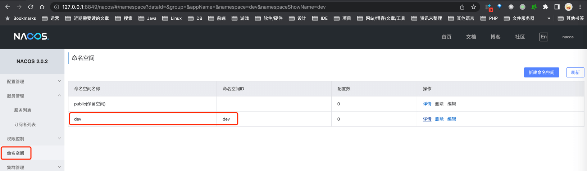
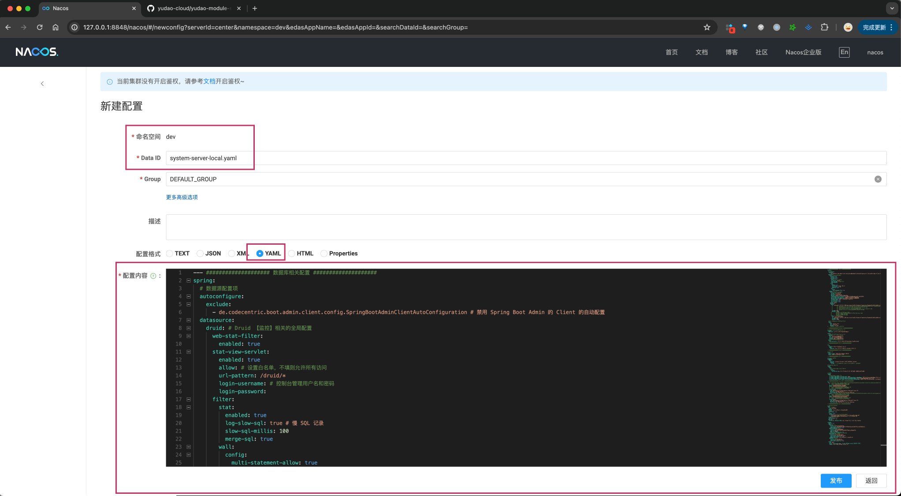
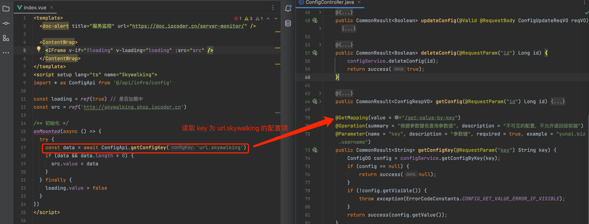

目录

# 配置中心 Nacos

## [#](#_1-配置中心-nacos) 1. 配置中心 Nacos

项目使用 Nacos 作为配置中心，实现配置的动态管理。

### [#](#_1-1-搭建-nacos-server) 1.1 搭建 Nacos Server

① 参考[《芋道 Nacos 极简入门》 (opens new window)](https://www.iocoder.cn/Nacos/install/?qun)文章的「2. 单机部署（最简模式）」或「3. 单机部署（基于 MySQL 数据库）」小节。

② 点击 Nacos 控制台的 \[命名空间\] 菜单，创建一个 ID 和名字都为 `dev` 的命名空间，稍后会使用到。如下图所示：



注意！新建命名空间时，它的“命名空间ID”、“命名空间名”都要是 `dev` 噢！！！

### [#](#_1-2-项目接入-nacos) 1.2 项目接入 Nacos

友情提示：以 yudao-module-system 服务为例子。

#### [#](#_1-2-1-引入依赖) 1.2.1 引入依赖

在 `yudao-module-system-biz` 模块的 [`pom.xml` (opens new window)](https://github.com/YunaiV/yudao-cloud/blob/master/yudao-module-system/yudao-module-system-biz/pom.xml) 中，引入 Nacos 对应的依赖。如下所示：

```xml
<!-- Config 配置中心相关 -->
<dependency>
    <groupId>com.alibaba.cloud</groupId>
    <artifactId>spring-cloud-starter-alibaba-nacos-config</artifactId>
</dependency>

```

#### [#](#_1-2-2-添加配置) 1.2.2 添加配置

① 在 [`application-local.yaml` (opens new window)](https://github.com/YunaiV/yudao-cloud/blob/master/yudao-module-system/yudao-module-system-biz/src/main/resources/application-local.yaml#L14-L16) 中，添加 `nacos.config` 配置。如下所示：

```yaml
--- #################### 配置中心相关配置 ####################

spring:
  cloud:
    nacos:
      server-addr: 127.0.0.1:8848 # Nacos 服务器地址
      username: # Nacos 账号
      password: # Nacos 密码
      config: # 【注册中心】配置项
        namespace: dev # 命名空间。这里使用 dev 开发环境
        group: DEFAULT_GROUP # 使用的 Nacos 配置分组，默认为 DEFAULT_GROUP

```

*   `spring.cloud.nacos.config.namespace` 配置项：设置为 `dev`，就是刚创建的命名空间

② 在 [`application.yaml` (opens new window)](https://github.com/YunaiV/yudao-cloud/blob/master/yudao-module-system/yudao-module-system-biz/src/main/resources/application.yaml) 中，添加 `spring.cloud.config.import` 配置项。

```yaml
spring:
  cloud:
    config:
      - optional:classpath:application-${spring.profiles.active}.yaml # 加载【本地】配置
      - optional:nacos:${spring.application.name}-${spring.profiles.active}.yaml # 加载【Nacos】的配置

```

*   其中 `optional:nacos:${spring.application.name}-${spring.profiles.active}.yaml` 表示，从 Nacos 加载 `dataId` 为 `system-server-local.yaml` 的配置项。

#### [#](#_1-2-3-配置管理) 1.2.3 配置管理

友情提示：

如果你不会使用 Nacos 配置中心，可以参考[《芋道 Spring Cloud Alibaba 配置中心 Nacos 入门 》 (opens new window)](https://www.iocoder.cn/Spring-Cloud-Alibaba/Nacos-Config/?qun)文档，学习 Nacos 配置中心的使用。

按照需要，将不同环境存在差异的 [`application-local.yaml` (opens new window)](https://github.com/YunaiV/yudao-cloud/blob/master/yudao-module-system/yudao-module-system-biz/src/main/resources/application-local.yaml) 和 [`application-dev.yaml` (opens new window)](https://github.com/YunaiV/yudao-cloud/blob/master/yudao-module-system/yudao-module-system-biz/src/main/resources/application-dev.yaml) 中的配置，迁移到 Nacos 配置中心。以 `application-local.yaml` 为例子。

① 将 `application-local.yaml` 中，**除了如下** Nacos 配置外的配置，迁移到 Nacos 配置中心中。如下图所示：

```yaml
--- #################### 注册中心 + 配置中心相关配置 ####################

spring:
  cloud:
    nacos:
      server-addr: 127.0.0.1:8848 # Nacos 服务器地址
      username: # Nacos 账号
      password: # Nacos 密码
      discovery: # 【配置中心】配置项
        namespace: dev # 命名空间。这里使用 dev 开发环境
        group: DEFAULT_GROUP # 使用的 Nacos 配置分组，默认为 DEFAULT_GROUP
        metadata:
          version: 1.0.0 # 服务实例的版本号，可用于灰度发布
      config: # 【注册中心】配置项
        namespace: dev # 命名空间。这里使用 dev 开发环境
        group: DEFAULT_GROUP # 使用的 Nacos 配置分组，默认为 DEFAULT_GROUP

```

*   \= = 如果把这部分 Nacos 配置也放进去，都不知道 Nacos 地址信息了！！！



*   `Data ID` 为 `${spring.application.name}-${spring.profiles.active}.yaml`，例如说 `system-server-local.yaml`。
*   配置格式：`YAML` 格式
*   配置内容：将 `application-local.yaml` 中的配置，迁移到 Nacos 配置中心中。

提示

① 疑问：为什么项目中的 `application-{env}.yaml` 中的配置，没有放到 Nacos 配置中心中？

回答：主要考虑大家 [《快速启动》](/quick-start) 可以更简单。

实际项目中，是建议放到 Nacos 配置中心，进行配置的动态管理的。

* * *

② 疑问：是否建议将 `application.yaml` 中的配置，迁移到 Nacos 配置中心中？

回答：一般情况下，不建议将 `application.yaml` 中的配置，迁移到 Nacos 配置中心。因为 `application.yaml` 中的配置，是通用的配置，无需动态管理。

所以目前在大厂里的最佳实践：

*   固定配置，放在 `application.yaml` 配置文件
*   动态配置，按需放在 Nacos 等配置中心
*   敏感配置，放在 KMS 密钥服务，类似阿里云的 [密钥管理服务 (opens new window)](https://www.aliyun.com/product/kms)

## [#](#_2-配置管理) 2. 配置管理

友情提示：该功能是从 Boot 项目延用到 Cloud 项目，一般情况下不会使用到，使用 Nacos 管理配置即可。

在 \[基础设施 -> 配置管理\] 菜单，可以查看和管理配置，适合业务上需要动态的管理某个配置。

例如说：创建用户时，需要配置用户的默认密码，这个密码是不会变的，但是有时候需要修改这个默认密码，这个时候就可以通过配置管理来修改。


对应的后端代码是 `yudao-module-infra` 的 [`config` (opens new window)](https://github.com/YunaiV/yudao-cloud/blob/master/yudao-module-infra/yudao-module-infra-biz/src/main/java/cn/iocoder/yudao/module/infra/service/config/) 业务模块。

### [#](#_2-1-配置的表结构) 2.1 配置的表结构

`infra_config` 的表结构如下：

```sql
CREATE TABLE `infra_config` (
    `id` int NOT NULL AUTO_INCREMENT COMMENT '参数主键',
    `group` varchar(50) CHARACTER SET utf8mb4 COLLATE utf8mb4_unicode_ci NOT NULL COMMENT '参数分组',
    `type` tinyint NOT NULL COMMENT '参数类型',
    `name` varchar(100) CHARACTER SET utf8mb4 COLLATE utf8mb4_unicode_ci NOT NULL DEFAULT '' COMMENT '参数名称',
    `key` varchar(100) CHARACTER SET utf8mb4 COLLATE utf8mb4_unicode_ci NOT NULL DEFAULT '' COMMENT '参数键名',
    `value` varchar(500) CHARACTER SET utf8mb4 COLLATE utf8mb4_unicode_ci NOT NULL DEFAULT '' COMMENT '参数键值',
    `sensitive` bit(1) NOT NULL COMMENT '是否敏感',
    `remark` varchar(500) CHARACTER SET utf8mb4 COLLATE utf8mb4_unicode_ci DEFAULT NULL COMMENT '备注',
    `creator` varchar(64) CHARACTER SET utf8mb4 COLLATE utf8mb4_unicode_ci DEFAULT '' COMMENT '创建者',
    `create_time` datetime NOT NULL DEFAULT CURRENT_TIMESTAMP COMMENT '创建时间',
    `updater` varchar(64) CHARACTER SET utf8mb4 COLLATE utf8mb4_unicode_ci DEFAULT '' COMMENT '更新者',
    `update_time` datetime NOT NULL DEFAULT CURRENT_TIMESTAMP ON UPDATE CURRENT_TIMESTAMP COMMENT '更新时间',
    `deleted` bit(1) NOT NULL DEFAULT b'0' COMMENT '是否删除',
    PRIMARY KEY (`id`) USING BTREE
) ENGINE=InnoDB AUTO_INCREMENT=8 DEFAULT CHARSET=utf8mb4 COLLATE=utf8mb4_unicode_ci COMMENT='参数配置表';

```

*   `key` 字段，对应到 Spring Boot 配置文件的配置项，例如说 `yudao.captcha.enable`、`sys.user.init-password` 等等。

### [#](#_2-2-后端案例) 2.2 后端案例

调用 ConfigApi 的 `#getConfigValueByKey(String key)` 方法，可以读取指定 `key` 的参数值。

具体案例，可见 AdminUserServiceImpl 的 `#importUserList(...)` 方法，在导入 Excel 用户时，它会读取 `system.user.init-password` 作为用户初始化密码。

### [#](#_2-3-前端案例) 2.3 前端案例

后端提供了 [`/admin-api/infra/config/get-value-by-key` (opens new window)](https://github.com/YunaiV/yudao-cloud/blob/master/yudao-module-infra/yudao-module-infra-biz/src/main/java/cn/iocoder/yudao/module/infra/controller/admin/config/ConfigController.java#L70-L82) RESTful API 接口，返回指定配置项的值。前端的使用示例如下图：

