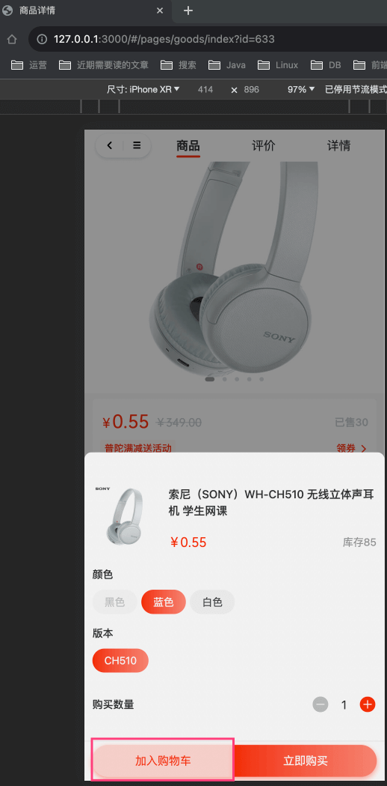
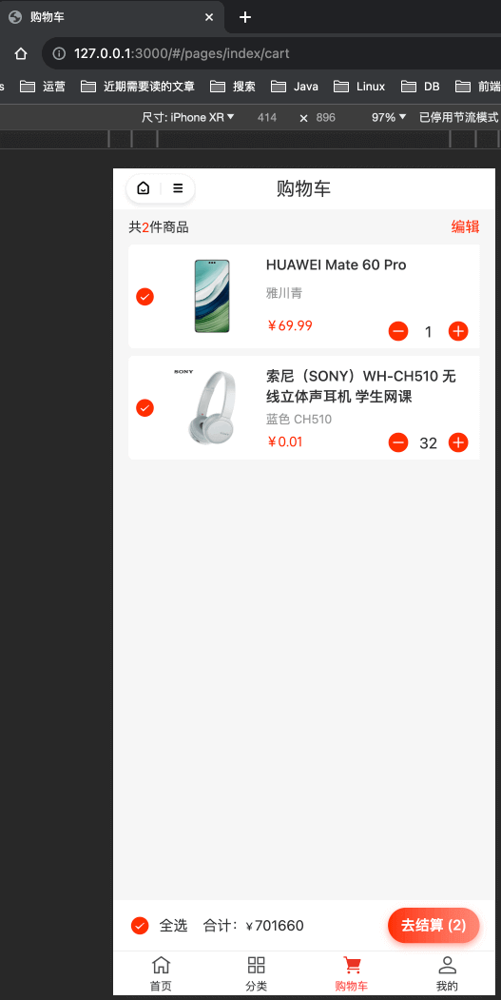

目录

# 【交易】购物车

## [#](#_1-表结构) 1. 表结构

购物车表，由 `yudao-module-trade-biz` 后端模块的 `cart` 包实现。表结构如下：

> 省略 creator/create\_time/updater/update\_time/deleted/tenant\_id 等通用字段

```sql
CREATE TABLE `trade_cart`  (
  `id` bigint NOT NULL AUTO_INCREMENT COMMENT '编号，唯一自增。',
    
  `user_id` bigint NOT NULL COMMENT '用户编号',
    
  `spu_id` bigint NOT NULL COMMENT '商品 SPU 编号',
  `sku_id` bigint NOT NULL COMMENT '商品 SKU 编号',
  
  `count` int NOT NULL COMMENT '商品购买数量',
  `selected` bit(1) NOT NULL DEFAULT b'1' COMMENT '是否选中',
  PRIMARY KEY (`id`) USING BTREE
) ENGINE = InnoDB AUTO_INCREMENT = 70 CHARACTER SET = utf8mb4 COLLATE = utf8mb4_general_ci COMMENT = '购物车的商品信息';

```

注意，它存储的是购物项，用户添加了多个商品 SKU 则会有多条记录。字段可以分成三类：

*   ① `user_id` 字段：对应的用户编号。
*   ② `spu_id`、`sku_id` 字段：商品 SPU、SKU 相关信息。
*   ③ `count`、`selected` 字段：购买数量和选中状态。相同商品 SKU 被多次添加到购物车时，只会记录一条，`count` 数量进行累加，直到被下单。

疑问：为什么不使用 Redis 存储购物车？

MySQL 实现简单易懂，性能足够满足绝大多数公司。目前，市面上主流的电商开源项目都使用 MySQL 存储购物车信息。它有如下三点好处：

*   数据分析。例如，哪些商品被添加到购物车很多，但是很少被下单，实现转换率漏斗
*   业务拓展。例如，卖家基于买家购物车的商品信息，进行回访，促发购买
*   用户体验。缓存总会过期，可能买家目前仅仅是添加到购物车，N 天后会进行购买

当然，如果你真的希望使用 Redis 实现购物车，推荐阅读 [《购物车服务》 (opens new window)](http://skrshop.tech/#/src/shopping/cart?id=%e8%b4%ad%e7%89%a9%e8%bd%a6%e6%9c%8d%e5%8a%a1) 文档。

## [#](#_2-管理后台) 2. 管理后台

暂时没有对应菜单，可以查询 `trade_cart` 表实现。

因为它采用 MySQL 实现存储，所以实现还是比较简单的。如果是 Redis 的话，可能条件 + 分页查询就比较复杂了。

## [#](#_3-移动端) 3. 移动端
### [#](#_3-1-添加购物车) 3.1 添加购物车

在商品详情页，选择完商品 SKU 后，可点击「加入购物车」按钮，实现添加购物车功能。如下图所示：



### [#](#_3-2-购物车列表) 3.2 购物车列表

对应 uni-app 底部的 \[购物车\] 导航，对应 `yudao-mall-uniapp` 项目的 `pages/index/cart.vue` 页面。如下图所示：



后续，点击「去结算」按钮，即可进入下单流程。