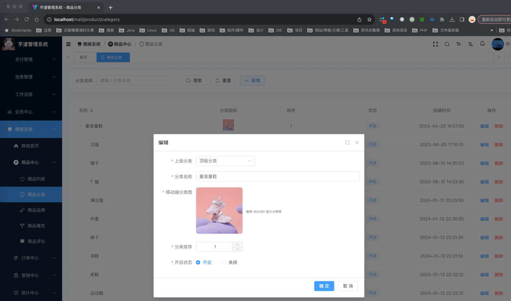
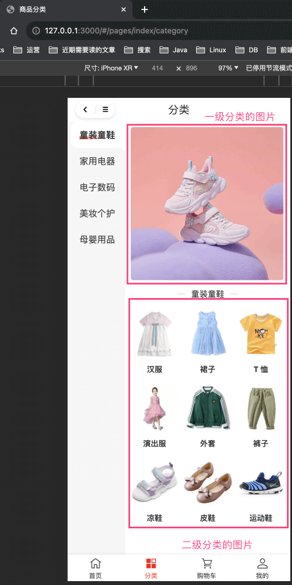
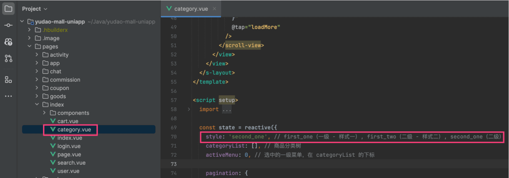

目录

# 【商品】商品分类

## [#](#_1-表结构) 1. 表结构

商品分类，由 `yudao-module-product-biz` 后端模块的 `category` 包实现。表结构如下：

> 省略 creator/create\_time/updater/update\_time/deleted/tenant\_id 等通用字段

```sql
CREATE TABLE `product_category` (
  `id` bigint NOT NULL AUTO_INCREMENT COMMENT '分类编号',
  `parent_id` bigint NOT NULL COMMENT '父分类编号',
  `name` varchar(255) CHARACTER SET utf8mb4 COLLATE utf8mb4_unicode_ci NOT NULL COMMENT '分类名称',
  `pic_url` varchar(255) CHARACTER SET utf8mb4 COLLATE utf8mb4_unicode_ci NOT NULL COMMENT '移动端分类图',
  `sort` int DEFAULT '0' COMMENT '分类排序',
  `status` tinyint NOT NULL COMMENT '开启状态',
  PRIMARY KEY (`id`) USING BTREE
) ENGINE=InnoDB AUTO_INCREMENT=60 DEFAULT CHARSET=utf8mb4 COLLATE=utf8mb4_unicode_ci COMMENT='商品分类';

```

① 分类目前支持 2 级分类，即 `parent_id` 为 0 的是一级分类，否则是二级分类。

② `pic_url` 分类图片，一级、二级分类都需要设置。

## [#](#_2-管理后台) 2. 管理后台

对应 \[商城系统 -> 商品中心 -> 商品分类\] 菜单，对应 `yudao-ui-admin-vue3` 项目的 `@/views/mall/product/category` 目录。



## [#](#_3-移动端) 3. 移动端

对应 uni-app 底部的 \[分类\] 导航，对应 `yudao-mall-uniapp` 项目的 `pages/index/category.vue` 页面。



分类目前有 `first_one`、`first_two`、`second_one` 三种展示风格，可以手动进行修改。如下图所示：

