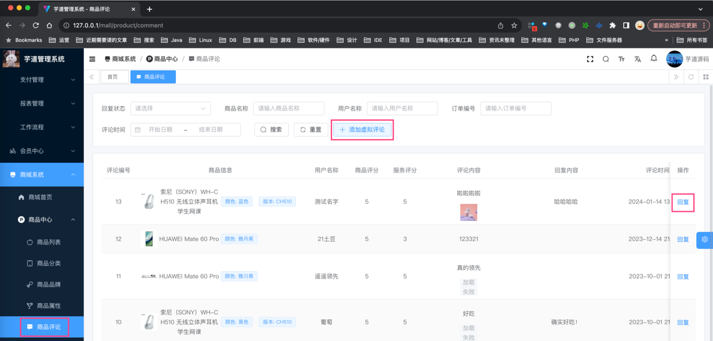
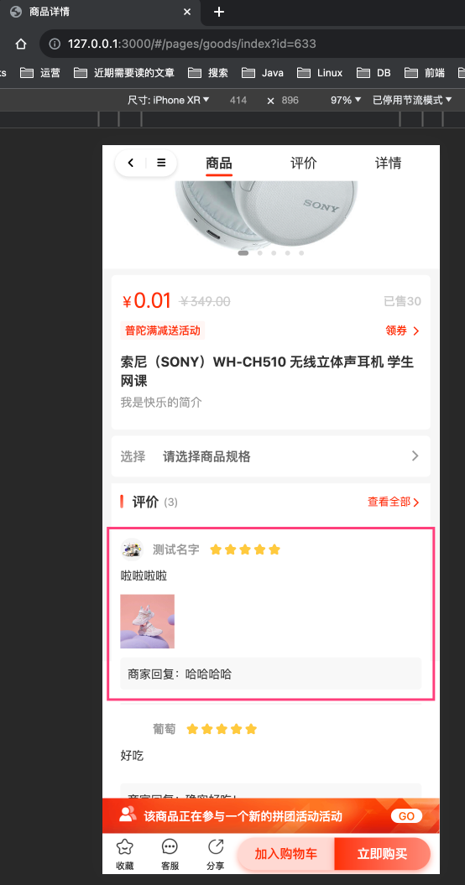
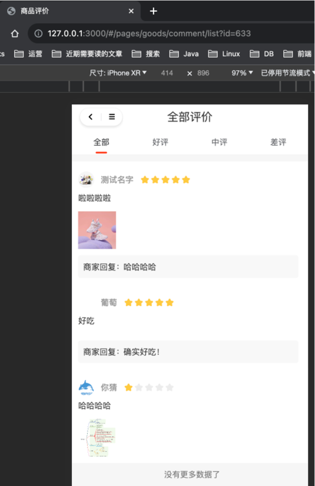
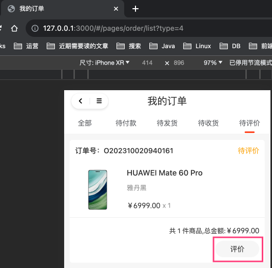
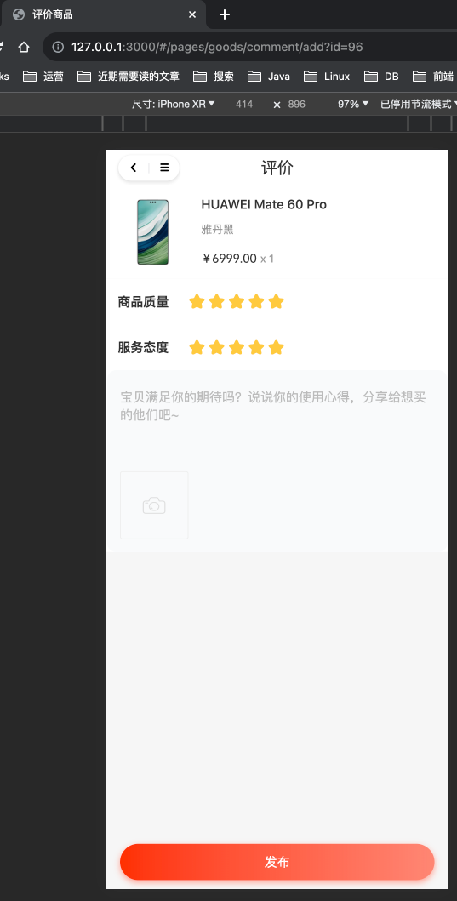

目录

# 【商品】商品评价

## [#](#_1-表结构) 1. 表结构

商品评价由 `yudao-module-product-biz` 后端模块的 `comment` 包实现，表结构如下：

> 省略 creator/create\_time/updater/update\_time/deleted/tenant\_id 等通用字段

```sql
CREATE TABLE `product_comment` (
  `id` bigint NOT NULL AUTO_INCREMENT COMMENT '评价编号，主键自增',
  
  `user_id` bigint NOT NULL COMMENT '评价人的用户编号，关联 MemberUserDO 的 id 编号',
  `user_nickname` varchar(255) CHARACTER SET utf8mb4 COLLATE utf8mb4_general_ci DEFAULT NULL COMMENT '评价人名称',
  `user_avatar` varchar(1024) CHARACTER SET utf8mb4 COLLATE utf8mb4_general_ci DEFAULT NULL COMMENT '评价人头像',
  `anonymous` bit(1) NOT NULL COMMENT '是否匿名',
  
  `order_id` bigint DEFAULT '0' COMMENT '交易订单编号，关联 TradeOrderDO 的 id 编号',
  `order_item_id` bigint DEFAULT '0' COMMENT '交易订单项编号，关联 TradeOrderItemDO 的 id 编号',
  
  `spu_id` bigint NOT NULL COMMENT '商品 SPU 编号，关联 ProductSpuDO 的 id',
  `spu_name` varchar(255) CHARACTER SET utf8mb4 COLLATE utf8mb4_general_ci DEFAULT NULL COMMENT '商品 SPU 名称',
  `sku_id` bigint NOT NULL COMMENT '商品 SKU 编号，关联 ProductSkuDO 的 id 编号',
  `sku_pic_url` varchar(256) CHARACTER SET utf8mb4 COLLATE utf8mb4_general_ci NOT NULL COMMENT '图片地址',
  `sku_properties` varchar(512) CHARACTER SET utf8mb4 COLLATE utf8mb4_general_ci DEFAULT NULL COMMENT '属性数组，JSON 格式 [{propertId: , valueId: }, {propertId: , valueId: }]',
  
  `scores` tinyint NOT NULL COMMENT '评分星级1-5分',
  `description_scores` tinyint NOT NULL COMMENT '描述星级 1-5 星',
  `benefit_scores` tinyint NOT NULL COMMENT '服务星级 1-5 星',
  `content` varchar(1024) CHARACTER SET utf8mb4 COLLATE utf8mb4_general_ci NOT NULL COMMENT '评价内容',
  `pic_urls` varchar(4096) CHARACTER SET utf8mb4 COLLATE utf8mb4_general_ci DEFAULT NULL COMMENT '评价图片地址数组',
  
  `visible` bit(1) DEFAULT NULL COMMENT '是否可见，true:显示false:隐藏',
  `reply_status` bit(1) DEFAULT b'0' COMMENT '商家是否回复',
  `reply_user_id` bigint DEFAULT NULL COMMENT '回复管理员编号，关联 AdminUserDO 的 id 编号',
  `reply_content` varchar(1024) CHARACTER SET utf8mb4 COLLATE utf8mb4_general_ci DEFAULT NULL COMMENT '商家回复内容',
  `reply_time` datetime DEFAULT NULL COMMENT '商家回复时间',
  PRIMARY KEY (`id`) USING BTREE
) ENGINE=InnoDB AUTO_INCREMENT=14 DEFAULT CHARSET=utf8mb4 COLLATE=utf8mb4_general_ci COMMENT='商品评价';

```

① `user_id`、`user_nickname`、`user_avatar`、`anonymous` 字段，会员用户相关信息。

② `order_id`、`order_item_id` 字段，交易订单相关信息。下单的每个订单项（商品），都可以评价一次，所以这里可以看到 `order_item_id` 字段。

③ `spu_id`、`spu_name`、`sku_id`、`sku_pic_url`、`sku_properties` 字段，商品 SPU、SKU 相关信息。通过冗余这些商品字段，可以减少关联查询，提高查询效率。

④ `description_scores`、`benefit_scores`、`content`、`pic_urls` 字段，会员用户的评价信息。而 `score` 字段是 `description_scores`、`benefit_scores` 两个字段的平均值。

⑤ `reply_status`、`reply_user_id`、`reply_content`、`reply_time` 字段，商家回复相关信息。

`visible` 字段，控制评价在 uni-app 是否可见，默认为 `true`，可以通过管理后台修改。

## [#](#_2-管理后台) 2. 管理后台

对应 \[商城系统 -> 商品中心 -> 商品评价\] 菜单，对应 `yudao-ui-admin-vue3` 项目的 `@/views/mall/product/comment` 目录。



① 点击「添加虚拟评价」按钮，可以给某个商品添加虚拟评价，用于商品详情页的评价展示。

② 点击「回复」按钮，可以回复某个评价。

③ 点击「是否展示」按钮，可以控制评价在 uni-app 是否可见。

## [#](#_3-移动端) 3. 移动端
### [#](#_3-1-评价列表) 3.1 评价列表

① 商品详情页，展示近 3 条评价，由 `yudao-ui-uniapp` 项目的 `pages/goods/components/detail/detail-comment-card.vue` 实现。如下图所示：



② 点击「查看全部」按钮，进入商品评价列表页，由 `yudao-ui-uniapp` 项目的 `pages/goods/comment/list.vue` 实现。如下图所示：



### [#](#_3-2-添加评价) 3.2 添加评价

在订单确认售后后，可以对商品进行评价，由 `yudao-ui-uniapp` 项目的 `pages/goods/comment/add.vue` 实现。如下图所示：



