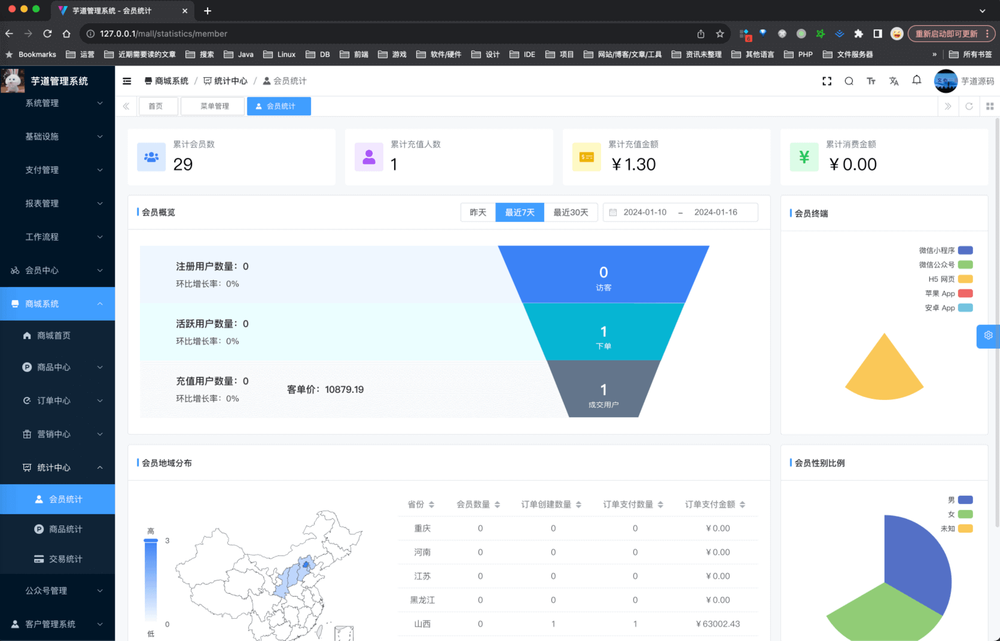
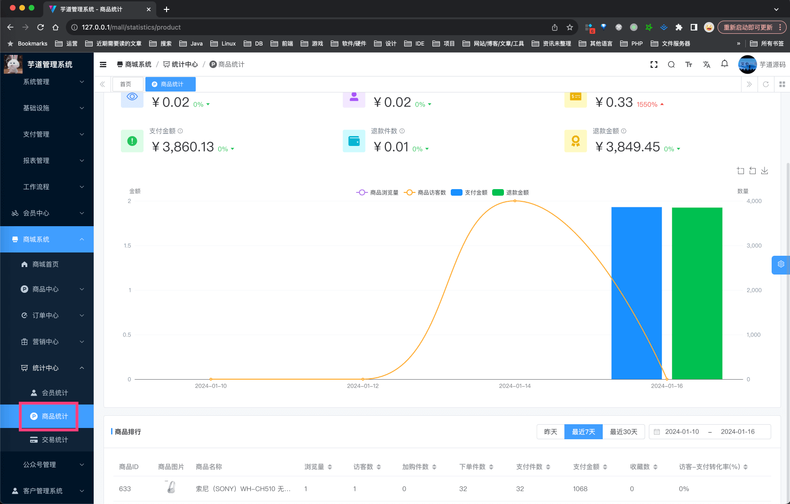
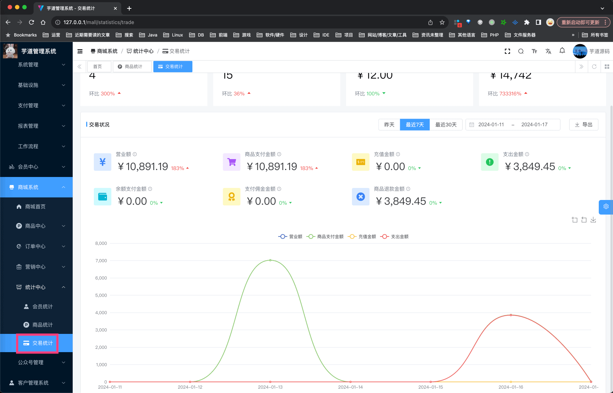

目录

# 【统计】会员、商品、交易统计

本小节，我们来讲 \[商城系统 -> 统计中心\] 菜单下的会员、商品、交易统计相关内容，它们是由 `yudao-module-statistics-biz` 后端模块实现。

友情提示：为什么所有数据库操作都使用 StatisticsMapper 结尾呢？

一方面，和现有业务使用的 Mapper 独立开，避免业务 Mapper 混乱，统计 SQL 往往较为复杂（个性化）。

另一方面，随着数据规模的增大，统计 SQL 不适合放在 MySQL 关系数据库中执行，往往会引入 ClickHouse、Doris 作为数据仓库，这个时候只要把 StatisticsMapper 改造下即可。

另外，考虑统计 SQL 往往非常消耗 MySQL 资源，可以把 StatisticsMapper 切到单独的 MySQL 读库上，避免影响线上业务。

## [#](#_1-会员统计) 1. 会员统计

由 MemberStatisticsController 提供统计接口。

### [#](#_1-1-表结构) 1.1 表结构

暂时没有统计表，都是通过 SQL 查询实现。

### [#](#_1-2-管理后台) 1.2 管理后台

对应 \[商城系统 -> 统计中心 -> 会员统计\] 菜单，对应 `yudao-ui-admin-vue3` 项目的 `src/views/mall/statistics/member` 目录。如下图所示：



## [#](#_2-商品统计) 2. 商品统计

由 ProductStatisticsController 提供统计接口。

### [#](#_2-1-表结构) 2.1 表结构

统计每个商品 SPU 的浏览量、访客量、收藏数量、加购数量、下单件数、支付件数、支付金额、退款件数、退款金额、访客支付转化率等，通过 ProductStatisticsJob 每天定时统计。

```sql
CREATE TABLE `product_statistics` (
  `id` bigint NOT NULL AUTO_INCREMENT COMMENT '编号，主键自增',
  `time` date NOT NULL COMMENT '统计日期',
  `spu_id` bigint NOT NULL COMMENT '商品 SPU 编号',
  
  `browse_count` int NOT NULL DEFAULT '0' COMMENT '浏览量',
  `browse_user_count` int NOT NULL DEFAULT '0' COMMENT '访客量',
  `favorite_count` int NOT NULL DEFAULT '0' COMMENT '收藏数量',
  `cart_count` int NOT NULL DEFAULT '0' COMMENT '加购数量',
  
  `order_count` int NOT NULL DEFAULT '0' COMMENT '下单件数',
  `order_pay_count` int NOT NULL DEFAULT '0' COMMENT '支付件数',
  `order_pay_price` int NOT NULL DEFAULT '0' COMMENT '支付金额，单位：分',
  
  `after_sale_count` int NOT NULL DEFAULT '0' COMMENT '退款件数',
  `after_sale_refund_price` int NOT NULL DEFAULT '0' COMMENT '退款金额，单位：分',
  
  `browse_convert_percent` int NOT NULL DEFAULT '0' COMMENT '访客支付转化率（百分比）',
  
  `creator` varchar(64) COLLATE utf8mb4_unicode_ci DEFAULT '' COMMENT '创建者',
  `create_time` datetime NOT NULL DEFAULT CURRENT_TIMESTAMP COMMENT '创建时间',
  `updater` varchar(64) COLLATE utf8mb4_unicode_ci DEFAULT '' COMMENT '更新者',
  `update_time` datetime NOT NULL DEFAULT CURRENT_TIMESTAMP ON UPDATE CURRENT_TIMESTAMP COMMENT '更新时间',
  `deleted` bit(1) NOT NULL DEFAULT b'0' COMMENT '是否删除',
  `tenant_id` bigint NOT NULL DEFAULT '0' COMMENT '租户编号',
  PRIMARY KEY (`id`),
  KEY `idx_time` (`time`),
  KEY `idx_spu_id` (`spu_id`)
) ENGINE=InnoDB DEFAULT CHARSET=utf8mb4 COLLATE=utf8mb4_unicode_ci COMMENT='商品统计表';

```

### [#](#_2-2-管理后台) 2.2 管理后台

对应 \[商城系统 -> 统计中心 -> 商品统计\] 菜单，对应 `yudao-ui-admin-vue3` 项目的 `src/views/mall/statistics/product` 目录。如下图所示：



友情提示：

ProductStatisticsJob 需要参考 [《定时任务》](/job) 文档，配置每天 00:00:00 执行。否则上面的界面上，可能没有统计的数据。

## [#](#_3-交易统计) 3. 交易统计

由 TradeStatisticsController 提供统计接口。

### [#](#_3-1-表结构) 3.1 表结构

统计每天的订单创建数、支付数、支付金额、退款数、退款金额、佣金金额、余额支付金额、充值数、充值金额、充值退款数、充值退款金额等，通过 TradeStatisticsJob 每天定时统计。

```sql
CREATE TABLE `trade_statistics` (
  `id` bigint NOT NULL AUTO_INCREMENT COMMENT '编号，主键自增',
  `time` datetime NOT NULL COMMENT '统计日期',
  
  `order_create_count` int NOT NULL DEFAULT '0' COMMENT '创建订单数',
  `order_pay_count` int NOT NULL DEFAULT '0' COMMENT '支付订单商品数',
  `order_pay_price` int NOT NULL DEFAULT '0' COMMENT '总支付金额，单位：分',
  
  `after_sale_count` int NOT NULL DEFAULT '0' COMMENT '退款订单数',
  `after_sale_refund_price` int NOT NULL DEFAULT '0' COMMENT '总退款金额，单位：分',
  
  `brokerage_settlement_price` int NOT NULL DEFAULT '0' COMMENT '佣金金额（已结算），单位：分',
  
  `wallet_pay_price` int NOT NULL DEFAULT '0' COMMENT '总支付金额（余额），单位：分',
  `recharge_pay_count` int NOT NULL DEFAULT '0' COMMENT '充值订单数',
  `recharge_pay_price` int NOT NULL DEFAULT '0' COMMENT '充值金额，单位：分',
  `recharge_refund_count` int NOT NULL DEFAULT '0' COMMENT '充值退款订单数',
  `recharge_refund_price` int NOT NULL DEFAULT '0' COMMENT '充值退款金额，单位：分',

  `creator` varchar(64) CHARACTER SET utf8mb4 COLLATE utf8mb4_unicode_ci DEFAULT '' COMMENT '创建者',
  `create_time` datetime NOT NULL DEFAULT CURRENT_TIMESTAMP COMMENT '创建时间',
  `updater` varchar(64) CHARACTER SET utf8mb4 COLLATE utf8mb4_unicode_ci DEFAULT '' COMMENT '更新者',
  `update_time` datetime NOT NULL DEFAULT CURRENT_TIMESTAMP ON UPDATE CURRENT_TIMESTAMP COMMENT '更新时间',
  `deleted` bit(1) NOT NULL DEFAULT b'0' COMMENT '是否删除',
  `tenant_id` bigint NOT NULL DEFAULT '0' COMMENT '租户编号',
  PRIMARY KEY (`id`) USING BTREE,
  KEY `trade_statistics_time_index` (`time`) USING BTREE
) ENGINE=InnoDB AUTO_INCREMENT=153 DEFAULT CHARSET=utf8mb4 COLLATE=utf8mb4_unicode_ci COMMENT='交易统计表';

```

### [#](#_3-2-管理后台) 3.2 管理后台

对应 \[商城系统 -> 统计中心 -> 交易统计\] 菜单，对应 `yudao-ui-admin-vue3` 项目的 `src/views/mall/statistics/trade` 目录。如下图所示：



友情提示：

TradeStatisticsJob 需要参考 [《定时任务》](/job) 文档，配置每天 00:00:00 执行。否则上面的界面上，可能没有统计的数据。