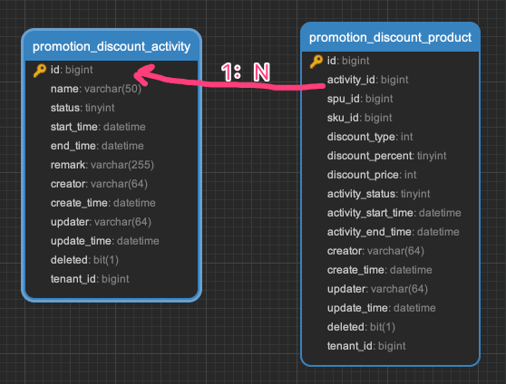
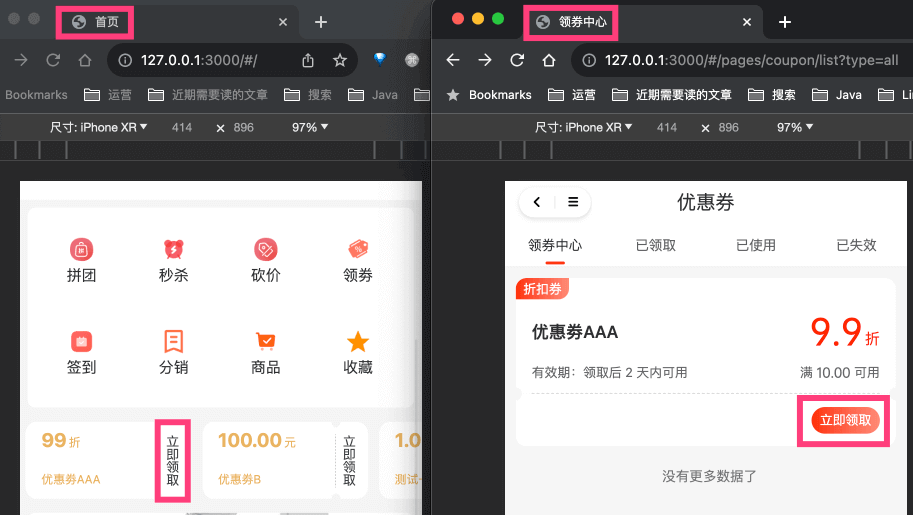
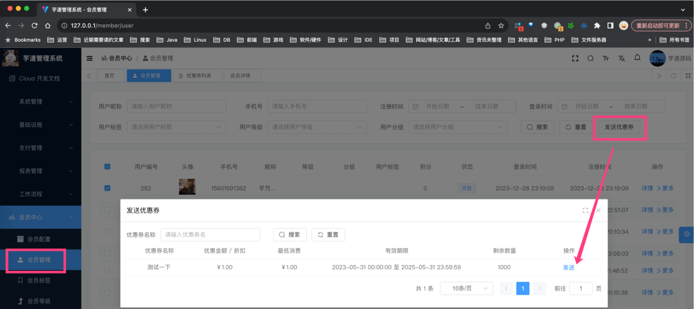
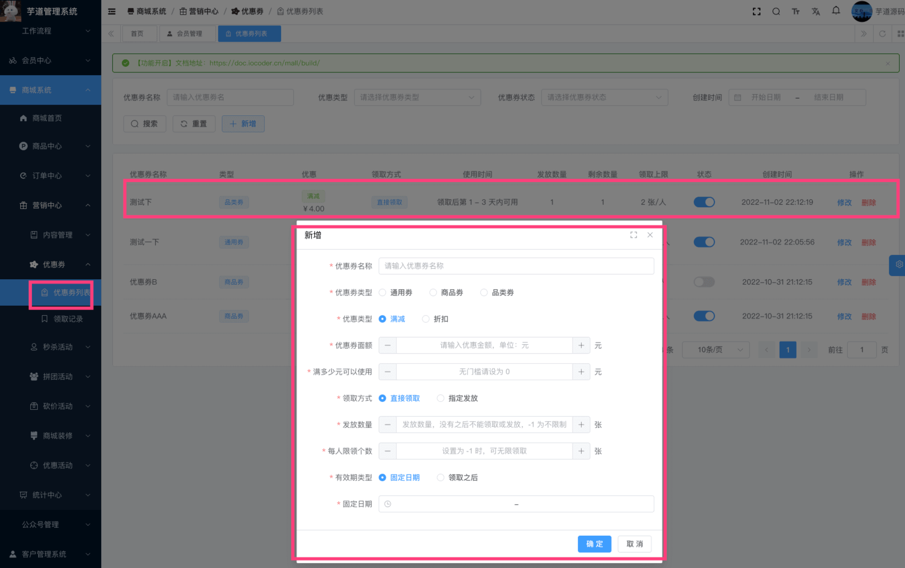
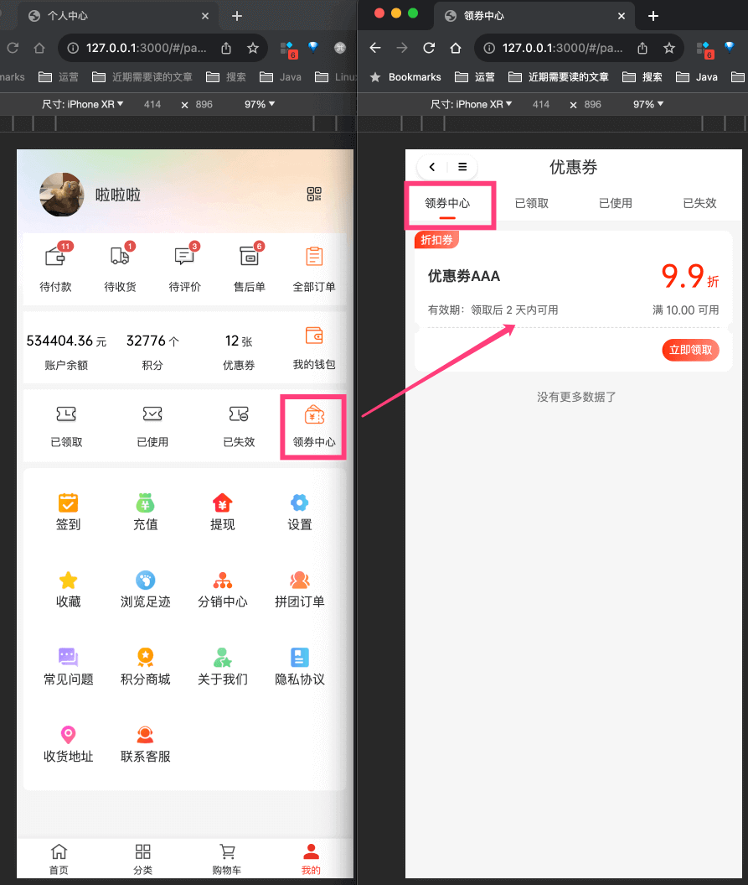
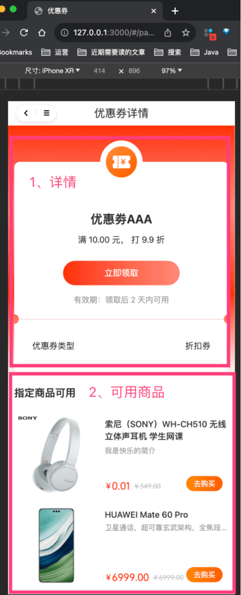
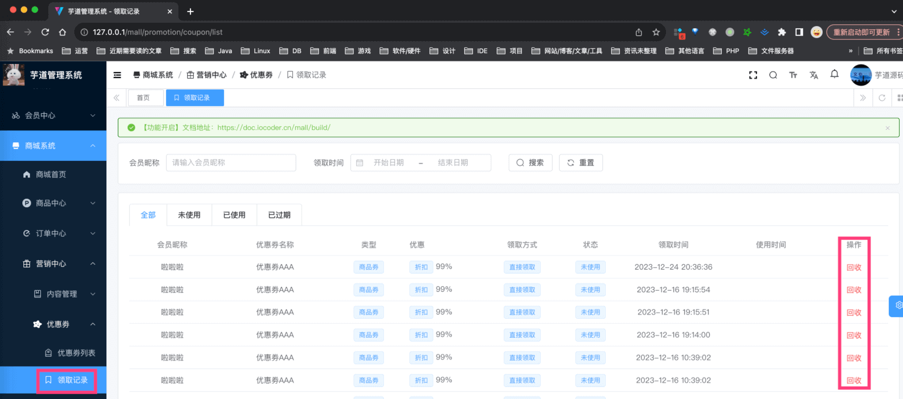
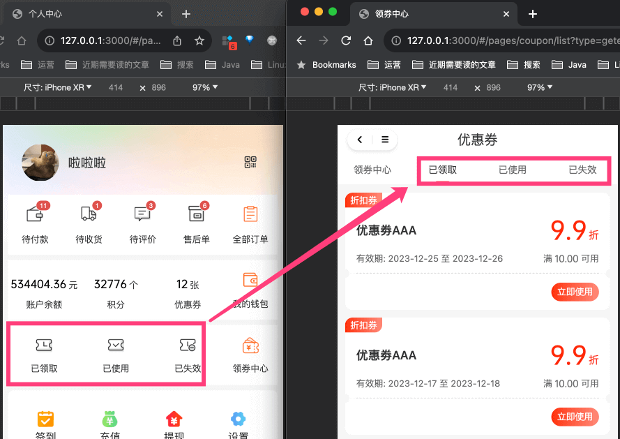
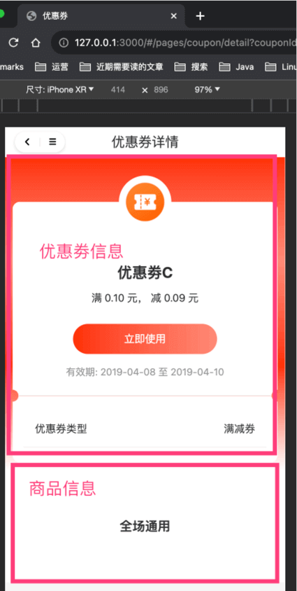
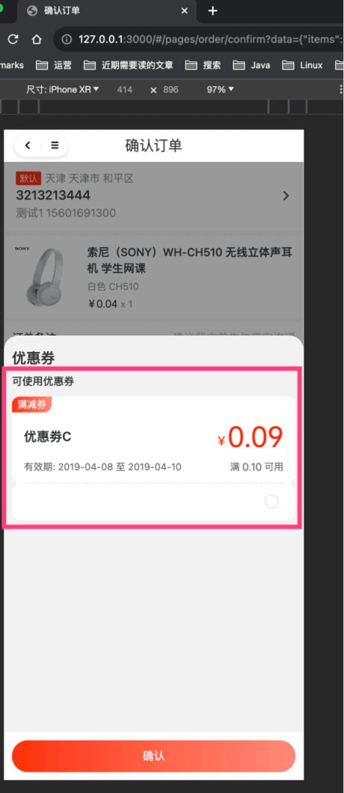

目录

# 【营销】优惠劵

优惠劵功能，主要由 `yudao-module-promotion-biz` 后端模块的 `coupon` 实现，包括两部分：优惠劵模版、优惠劵。如下图所示：



## [#](#_1-优惠劵模版) 1. 优惠劵模版

优惠劵模版，由卖家在管理后台配置，提供给买家领取成优惠劵，由 CouponTemplateService 类实现。

### [#](#_1-1-表结构) 1.1 表结构

> 省略 creator/create\_time/updater/update\_time/deleted/tenant\_id 等通用字段

```sql
CREATE TABLE `promotion_coupon_template` (
  `id` bigint NOT NULL AUTO_INCREMENT COMMENT '模板编号，自增唯一。',
  `name` varchar(50) CHARACTER SET utf8mb4 COLLATE utf8mb4_general_ci NOT NULL COMMENT '优惠劵名',
  
  `status` tinyint NOT NULL COMMENT '状态',

  `take_type` tinyint NOT NULL COMMENT '领取方式',  
  `total_count` int NOT NULL COMMENT '发放数量, -1 - 则表示不限制',
  `take_limit_count` tinyint NOT NULL COMMENT '每人限领个数, -1 - 则表示不限制',
  `take_count` int NOT NULL DEFAULT '0' COMMENT '领取优惠券的数量',
  `use_count` int NOT NULL DEFAULT '0' COMMENT '使用优惠券的次数',
  
  `use_price` int NOT NULL COMMENT '是否设置满多少金额可用，单位：分',
  `product_scope` tinyint NOT NULL COMMENT '商品范围',
  `product_scope_values` varchar(500) CHARACTER SET utf8mb4 COLLATE utf8mb4_general_ci DEFAULT NULL COMMENT '商品范围编号的数组',
  
  `validity_type` tinyint NOT NULL COMMENT '生效日期类型',
  `valid_start_time` datetime DEFAULT NULL COMMENT '固定日期-生效开始时间',
  `valid_end_time` datetime DEFAULT NULL COMMENT '固定日期-生效结束时间',
  `fixed_start_term` int DEFAULT NULL COMMENT '领取日期-开始天数',
  `fixed_end_term` int DEFAULT NULL COMMENT '领取日期-结束天数',
  
  `discount_type` int NOT NULL COMMENT '优惠类型：1-代金卷；2-折扣卷\n',
  `discount_percent` tinyint DEFAULT NULL COMMENT '折扣百分比',
  `discount_price` int DEFAULT NULL COMMENT '优惠金额，单位：分',
  `discount_limit_price` int DEFAULT NULL COMMENT '折扣上限，仅在 discount_type 等于 2 时生效',
  PRIMARY KEY (`id`) USING BTREE
) ENGINE=InnoDB AUTO_INCREMENT=17 DEFAULT CHARSET=utf8mb4 COLLATE=utf8mb4_general_ci COMMENT='优惠劵模板';

```

① `status` 字段：优惠劵模版状态，由 CommonStatusEnum 枚举，只有开启、禁用两个状态。禁用时，无法领取。

② 【领取限制】`take_type` 字段：领取方式，由 CouponTemplateTakeTypeEnum 枚举，分成 3 种情况：

*   1、直接领取：展示在 uni-app 的 \[首页\]、\[领劵中心\]、\[商品详情\]，由用户主动领取。如下图所示： 
    
*   2、指定发放：管理员在管理后台，指定用户发放。如下图所示： 
    
*   3、新人券：买家在注册时，自动发放，由 CouponTakeByRegisterConsumer 消息消费者实现
    

③ 【使用条件】`product_scope` 字段：商品范围，由 PromotionProductScopeEnum 枚举，分成 3 种情况：

*   1、通用券：全部商品
*   2、商品券：指定商品，由 `product_scope_values` 字段指定商品编号的数组
*   3、品类券：指定品类，由 `product_scope_values` 字段指定品类编号的数组

④ 【有效期】`validity_type` 字段：生效日期类型，由 CouponTemplateValidityTypeEnum 枚举，分成 2 种情况：

*   1、固定日期：由 `valid_start_time`、`valid_end_time` 字段指定生效时间范围
*   2、领取日期：由 `fixed_start_term`、`fixed_end_term` 字段指定领取后多少天生效

⑤ 【优惠金额】`discount_type` 字段：优惠类型，由 PromotionDiscountTypeEnum 枚举，分成 2 种情况：

*   1、代金卷：由 `discount_price` 字段指定优惠金额
*   2、折扣卷：由 `discount_percent` 字段指定折扣百分比，由 `discount_limit_price` 字段指定折扣上限

### [#](#_1-2-管理后台) 1.2 管理后台

对应 \[商城系统 -> 营销中心 -> 优惠劵 -> 优惠劵\] 菜单，对应 `yudao-ui-admin-vue3` 项目的 `src/views/mall/promotion/coupon/template` 目录。如下图所示：



### [#](#_1-3-移动端) 1.3 移动端

① 在 uni-app 的 \[我的\] 有 \[领劵中心\]，可以领取优惠劵，对应 `yudao-ui-uniapp` 项目的 `pages/coupon/list.vue` 文件。如下图所示：



② 点击 \[领劵中心\] 的优惠劵，可以查看该优惠劵的详情，对应 `yudao-ui-uniapp` 项目的 `pages/coupon/detail.vue` 文件。如下图所示：



## [#](#_2-优惠劵) 2. 优惠劵

优惠劵，会员领取优惠劵模版来“生成”，由 CouponService 类实现。

### [#](#_2-1-表结构) 2.1 表结构

> 省略 creator/create\_time/updater/update\_time/deleted/tenant\_id 等通用字段

```sql
CREATE TABLE `promotion_coupon` (
  `id` bigint NOT NULL AUTO_INCREMENT COMMENT '优惠劵编号',
  
  `template_id` bigint NOT NULL COMMENT '优惠劵模板编号',
  `name` varchar(50) CHARACTER SET utf8mb4 COLLATE utf8mb4_general_ci NOT NULL COMMENT '优惠劵名',
  `use_price` int NOT NULL COMMENT '是否设置满多少金额可用，单位：分',
  `take_type` tinyint NOT NULL COMMENT '领取方式',
  `valid_start_time` datetime NOT NULL COMMENT '生效开始时间',
  `valid_end_time` datetime NOT NULL COMMENT '生效结束时间',
  `product_scope` tinyint NOT NULL COMMENT '商品范围',
  `product_scope_values` varchar(500) CHARACTER SET utf8mb4 COLLATE utf8mb4_general_ci DEFAULT NULL COMMENT '商品范围编号的数组',
  `discount_type` tinyint NOT NULL COMMENT '折扣类型',
  `discount_percent` tinyint DEFAULT NULL COMMENT '折扣百分比',
  `discount_price` int DEFAULT NULL COMMENT '优惠金额，单位：分',
  `discount_limit_price` int DEFAULT NULL COMMENT '折扣上限',
  
  `user_id` bigint NOT NULL COMMENT '用户编号',

  `status` tinyint NOT NULL COMMENT '优惠码状态；1-未使用；2-已使用；3-已失效',
  `use_order_id` bigint DEFAULT NULL COMMENT '使用订单号',
  `use_time` datetime DEFAULT NULL COMMENT '使用时间',
  PRIMARY KEY (`id`) USING BTREE
) ENGINE=InnoDB AUTO_INCREMENT=18 DEFAULT CHARSET=utf8mb4 COLLATE=utf8mb4_general_ci COMMENT='优惠劵';

```

字段虽然也蛮多，但是都是从 `promotion_coupon_template` 中复制过来的，所以更多讲讲差异的地方。

① 【优惠劵模版】从 `template_id` 开始到 `discount_limit_price` 结束，都是从 `promotion_coupon_template` 中复制过来的，用于记录优惠劵模版的信息。

要注意，如果 `promotion_coupon_template` 中的信息发生变化，`promotion_coupon` 中的信息不会变化，因为买家已经领取了，不能随意变更。

② 【用户】`user_id` 字段：用户编号，就是领取的买家。

③ 【状态】`status` 字段：优惠码状态，由 CouponStatusEnum 枚举，分成 3 种情况：未使用、已使用、已失效。

如果已使用，会记录 `use_order_id`、`use_time` 字段，表示使用的订单编号、使用时间。

优惠劵的过期，由 CouponExpireJob 定时任务实现。

### [#](#_2-2-管理后台) 2.2 管理后台

对应 \[商城系统 -> 营销中心 -> 优惠劵 -> 领取记录\] 菜单，对应 `yudao-ui-admin-vue3` 项目的 `src/views/mall/promotion/coupon` 目录。如下图所示：



### [#](#_2-3-移动端) 2.3 移动端

① 在 uni-app 的 \[我的\] 有 \[已领取\]、\[已使用\]、\[已失效\]，可以查看优惠劵，对应 `yudao-ui-uniapp` 项目的 `pages/coupon/list.vue` 文件。如下图所示：



② 点击某个优惠劵，可以查看该优惠劵的详情，对应 `yudao-ui-uniapp` 项目的 `pages/coupon/detail.vue` 文件。如下图所示：



③ 在 uni-app 下单时，可以选择优惠劵，对应 `yudao-ui-uniapp` 项目的 `sheep/components/s-coupon-select/s-coupon-select.vue` 文件。如下图所示：

