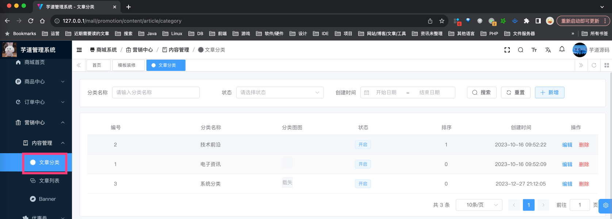
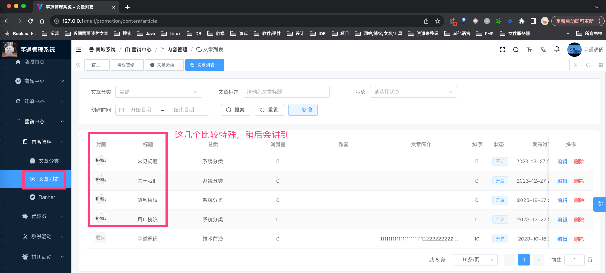
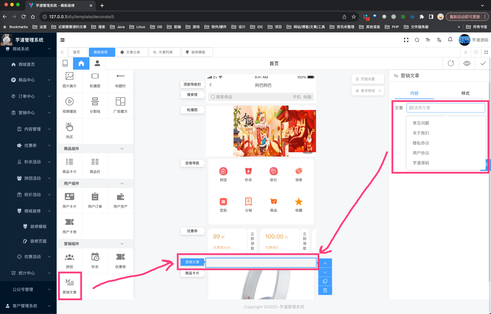
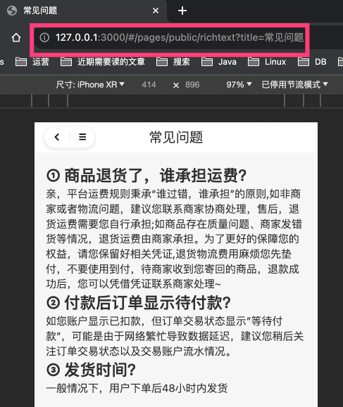
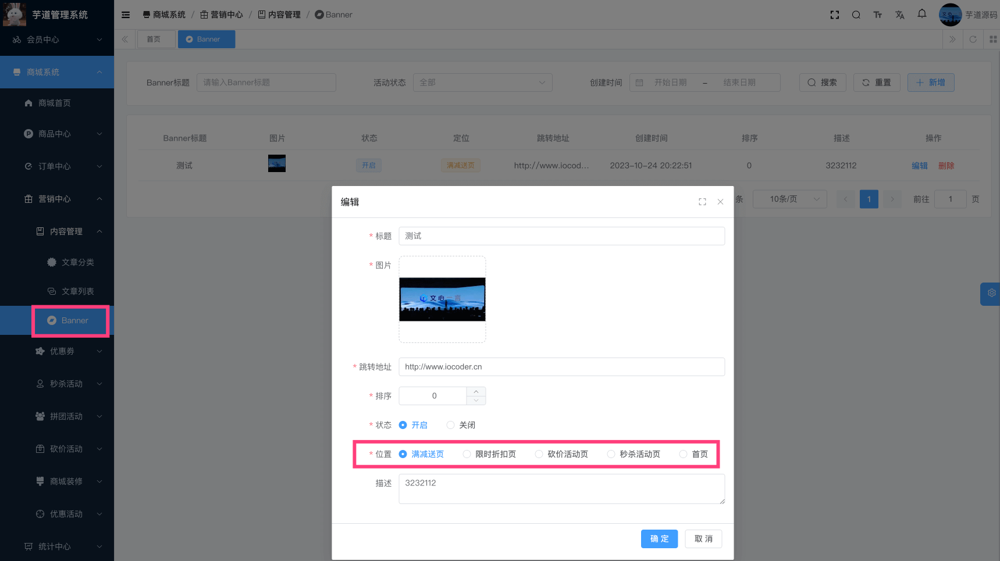

目录

# 【营销】内容管理

本小节，我们来讲 \[商城系统 -> 营销中心 -> 内容管理\] 菜单下的相关内容。

## [#](#_1-文章管理) 1. 文章管理

文章管理，主要由 `yudao-module-promotion-biz` 后端模块的 `article` 实现，包括文章分类、文章内容。

### [#](#_1-1-表结构) 1.1 表结构
#### [#](#_1-1-1-文章分类) 1.1.1 文章分类

> 省略 creator/create\_time/updater/update\_time/deleted/tenant\_id 等通用字段

```sql
CREATE TABLE `promotion_article_category` (
  `id` bigint NOT NULL AUTO_INCREMENT COMMENT '文章分类编号',
  `name` varchar(255) CHARACTER SET utf8mb4 COLLATE utf8mb4_unicode_ci NOT NULL COMMENT '分类名称',
  `pic_url` varchar(255) CHARACTER SET utf8mb4 COLLATE utf8mb4_unicode_ci DEFAULT '' COMMENT '图标地址',
  `status` tinyint NOT NULL DEFAULT '1' COMMENT '状态',
  `sort` int NOT NULL DEFAULT '99999' COMMENT '排序',
  PRIMARY KEY (`id`) USING BTREE
) ENGINE=InnoDB AUTO_INCREMENT=4 DEFAULT CHARSET=utf8mb4 COLLATE=utf8mb4_unicode_ci COMMENT='文章分类表';

```

#### [#](#_1-1-2-文章内容) 1.1.2 文章内容

> 省略 creator/create\_time/updater/update\_time/deleted/tenant\_id 等通用字段

```sql
CREATE TABLE `promotion_article` (
  `id` bigint unsigned NOT NULL AUTO_INCREMENT COMMENT '文章管理编号',
  `category_id` bigint NOT NULL COMMENT '分类编号',
  `title` varchar(255) CHARACTER SET utf8mb4 COLLATE utf8mb4_unicode_ci NOT NULL COMMENT '文章标题',
  `author` varchar(255) CHARACTER SET utf8mb4 COLLATE utf8mb4_unicode_ci DEFAULT '' COMMENT '文章作者',
  `content` text CHARACTER SET utf8mb4 COLLATE utf8mb4_unicode_ci NOT NULL COMMENT '文章内容',
  `pic_url` varchar(255) CHARACTER SET utf8mb4 COLLATE utf8mb4_unicode_ci NOT NULL COMMENT '文章封面图片地址',
  `introduction` varchar(255) CHARACTER SET utf8mb4 COLLATE utf8mb4_unicode_ci DEFAULT '' COMMENT '文章简介',
  `sort` int unsigned NOT NULL DEFAULT '0' COMMENT '排序',
  `status` tinyint unsigned NOT NULL DEFAULT '0' COMMENT '状态',
  `recommend_hot` bit(1) NOT NULL DEFAULT b'0' COMMENT '是否热门(小程序)',
  `recommend_banner` bit(1) NOT NULL DEFAULT b'0' COMMENT '是否轮播图(小程序)',
  `browse_count` varchar(255) CHARACTER SET utf8mb4 COLLATE utf8mb4_unicode_ci DEFAULT '' COMMENT '浏览次数',
  
  `spu_id` bigint NOT NULL DEFAULT '0' COMMENT '关联商品编号',

  PRIMARY KEY (`id`) USING BTREE
) ENGINE=InnoDB AUTO_INCREMENT=6 DEFAULT CHARSET=utf8mb4 COLLATE=utf8mb4_unicode_ci COMMENT='文章管理表';

```

### [#](#_1-2-管理后台) 1.2 管理后台
#### [#](#_1-2-1-文章分类) 1.2.1 文章分类

对应 \[商城系统 -> 营销中心 -> 内容管理 -> 文章分类\] 菜单，对应 `yudao-ui-admin-vue3` 项目的 `src/views/mall/promotion/article/category` 目录。如下图所示：



#### [#](#_1-2-2-文章内容) 1.2.2 文章内容

① 对应 \[商城系统 -> 营销中心 -> 内容管理 -> 文章列表\] 菜单，对应 `yudao-ui-admin-vue3` 项目的 `src/views/mall/promotion/article` 目录。如下图所示：



② 在 \[店铺装修\] 里，有“营销文章”组件，可以关联一个文章内容，展示在首页上。如下图所示：



### [#](#_1-3-移动端) 1.3 移动端
#### [#](#_1-3-1-文章分类) 1.3.1 文章分类

暂未使用到，可以忽略

#### [#](#_1-3-2-文章内容) 1.3.2 文章内容

① 文章内容，使用 `yudao-mall-uniapp` 项目的 `pages/public/richtext.vue` 页面。如下图所示：



② 目前 \[常见问题\]、\[关于我们\]、\[隐私协议\]、\[用户协议\] 等，直接使用的文章内容。

考虑到暂时不想做的太复杂，直接用 `title` 字段来区分！！！如上图 URL 中的 `title=常见问题`。

## [#](#_2-轮播位) 2. 轮播位

轮播位，主要由 `yudao-module-promotion-biz` 后端模块的 `banner` 实现，包括轮播位。

### [#](#_2-1-表结构) 2.1 表结构

> 省略 creator/create\_time/updater/update\_time/deleted/tenant\_id 等通用字段

```sql
CREATE TABLE `promotion_banner` (
  `id` bigint NOT NULL AUTO_INCREMENT COMMENT 'Banner 编号',
  `title` varchar(64) CHARACTER SET utf8mb4 COLLATE utf8mb4_unicode_ci NOT NULL DEFAULT '' COMMENT 'Banner 标题',
  `pic_url` varchar(255) CHARACTER SET utf8mb4 COLLATE utf8mb4_unicode_ci NOT NULL COMMENT '图片 URL',
  `url` varchar(255) CHARACTER SET utf8mb4 COLLATE utf8mb4_unicode_ci NOT NULL COMMENT '跳转地址',
  `status` tinyint NOT NULL DEFAULT '-1' COMMENT '活动状态',
  `sort` int DEFAULT NULL COMMENT '排序',
  `position` tinyint NOT NULL COMMENT '位置',
  `memo` varchar(255) CHARACTER SET utf8mb4 COLLATE utf8mb4_unicode_ci DEFAULT NULL COMMENT '描述',
  `browse_count` int DEFAULT NULL COMMENT 'Banner 点击次数',
  PRIMARY KEY (`id`) USING BTREE
) ENGINE=InnoDB AUTO_INCREMENT=5 DEFAULT CHARSET=utf8mb4 COLLATE=utf8mb4_unicode_ci COMMENT='Banner 广告位';

```

### [#](#_2-2-管理后台) 2.2 管理后台

对应 \[商城系统 -> 营销中心 -> 内容管理 -> Banner\] 菜单，对应 `yudao-ui-admin-vue3` 项目的 `src/views/mall/promotion/banner` 目录。如下图所示：



### [#](#_2-3-移动端) 2.3 移动端

目前 uni-app 暂时未使用到，可以忽略。。。