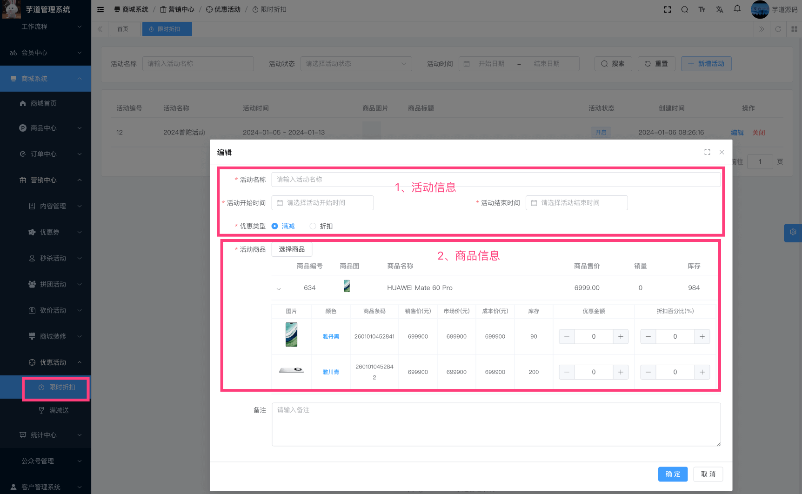
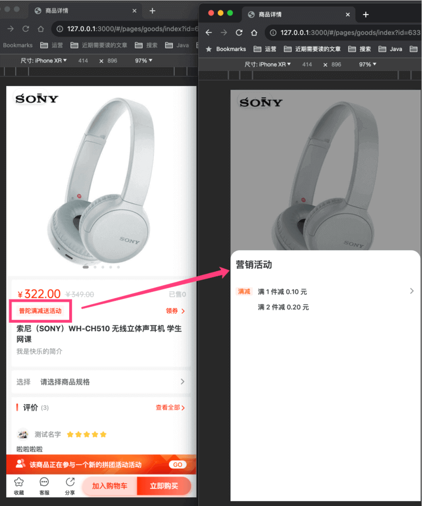

目录

# 【营销】满减送

友情提示：满减送的“减”已经实现，“送”暂未实现，预计 2024 年 Q1 完成。

满减送活动，主要由 `yudao-module-promotion-biz` 后端模块的 `reward` 实现，支持减金额、减运费、送积分、送优惠券等等。

## [#](#_1-表结构) 1. 表结构

> 省略 creator/create\_time/updater/update\_time/deleted/tenant\_id 等通用字段

```sql
CREATE TABLE `promotion_reward_activity` (
  `id` bigint NOT NULL AUTO_INCREMENT COMMENT '活动编号',
  `name` varchar(50) CHARACTER SET utf8mb4 COLLATE utf8mb4_general_ci NOT NULL DEFAULT '' COMMENT '活动标题',
  `start_time` datetime NOT NULL COMMENT '开始时间',
  `end_time` datetime NOT NULL COMMENT '结束时间',
  `remark` varchar(255) CHARACTER SET utf8mb4 COLLATE utf8mb4_general_ci DEFAULT '' COMMENT '备注',
  
  `status` tinyint NOT NULL DEFAULT '-1' COMMENT '活动状态',
  
  `product_scope` tinyint NOT NULL COMMENT '商品范围',
  `product_spu_ids` varchar(50) CHARACTER SET utf8mb4 COLLATE utf8mb4_general_ci DEFAULT NULL COMMENT '商品 SPU 编号的数组',
  
  `condition_type` tinyint NOT NULL DEFAULT '-1' COMMENT '条件类型',
  `rules` varchar(2000) CHARACTER SET utf8mb4 COLLATE utf8mb4_general_ci DEFAULT NULL COMMENT '优惠规则的数组',
  PRIMARY KEY (`id`) USING BTREE
) ENGINE=InnoDB AUTO_INCREMENT=5 DEFAULT CHARSET=utf8mb4 COLLATE=utf8mb4_general_ci COMMENT='满减送活动';

```

① `status` 字段：活动状态，由 CommonStatusEnum 枚举，只有开启、禁用两个状态。禁用时，无法参与满减送活动。

② `product_scope` 字段：商品范围，商品范围，由 PromotionProductScopeEnum 枚举，分成 3 种情况：

*   1、通用券：全部商品
*   2、商品券：指定商品，由 `product_spu_ids` 字段指定商品编号的数组
*   3、品类券：指定品类，由 `product_spu_ids` 字段指定品类编号的数组

③ `condition_type` 字段：条件类型，由 PromotionConditionTypeEnum 枚举，分成 2 种情况：满 N 元、满 N 件。

`rules` 字段：优惠规则的数组，支持多层级，可配置优惠金额、包邮、赠送积分、优惠劵。

## [#](#_2-管理后台) 2. 管理后台

对应 \[商城系统 -> 营销中心 -> 优惠活动 -> 满减送\] 菜单，对应 `yudao-ui-admin-vue3` 项目的 `src/views/mall/promotion/rewardActivity` 目录。如下图所示：



## [#](#_3-移动端) 3. 移动端
### [#](#_3-1-商品详情) 3.1 商品详情

在 uni-app 商品详情页，会展示该商品参与的满减送活动。点击后，会弹出满减送的优惠明细，如下图所示：



弹窗由 `yudao-mall-uniapp` 的 `sheep/components/s-activity-pop/s-activity-pop.vue` 组件实现。

### [#](#_3-2-活动详情) 3.2 活动详情

继续点击上图的满减送活动，会进入活动详情页，并展示参与该活动的商品列表，对应 `yudao-mall-uniapp` 的 `yudao-mall-uniapp/pages/activity/index.vue` 文件。如下图所示：


### [#](#_3-3-价格计算) 3.3 价格计算

TODO TradeRewardActivityPriceCalculator 类实现

TODO 前端的专属展示 /sheep/components/s-discount-list/s-discount-list.vue