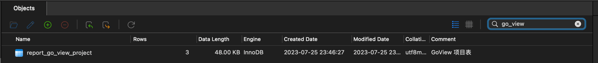
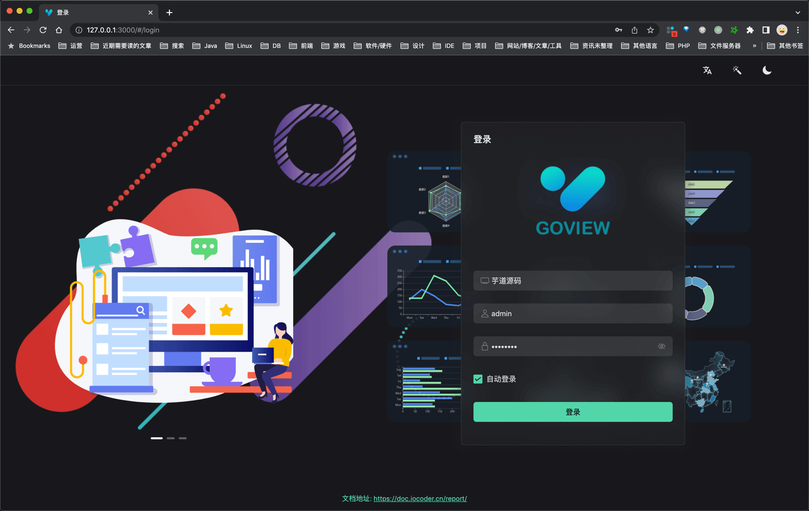
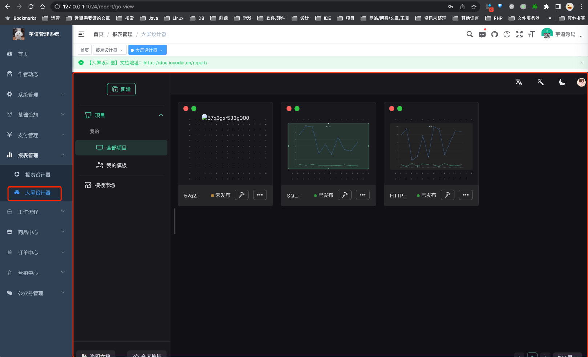
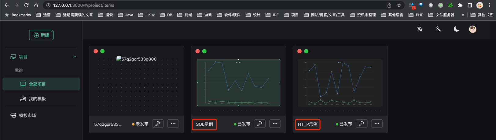

目录

# 大屏设计器

数据可视化，一般可以通过报表设计器、或者大屏设计器来实现。本小节，我们来讲解大屏设计器的功能开启。

大屏设计器，指的是通过拖拽图表或页面元素，无需编写代码即可制作数据大屏。如下图所示：


在项目中，通过集成市面上的报表引擎，实现了大屏设计器的能力。目前使用如下：

是否集成

是否开源

[AJ-Report (opens new window)](https://gitee.com/anji-plus/report)

集成中

开源

[Go-View (opens new window)](https://gitee.com/dromara/go-view)

集成中

开源

[JimuReport (opens new window)](https://github.com/jeecgboot/JimuReport)

不集成

不开源

为什么不使用 JimuReport 报表引擎呢？

因为 JimuReport 的大屏设计器是商业化的，需要购买授权。我手头暂时没有授权，所以没办法集成~

## [#](#_1-功能开启) 1. 功能开启

`yudao-module-report` 实现了报表设计器的能力，开启步骤如下：

*   第一步，导入报表的 SQL 数据库脚本
*   第二步，启动 `yudao-report-report` 服务
*   第三步，启动大屏设计器的前端项目

### [#](#_1-1-第一步-导入-sql) 1.1 第一步，导入 SQL

下载 [`go-view.sql`](/file/go-view.sql) 脚本，并导入数据库，初始化 Go-View 相关的表结构和数据。

友情提示：↑↑↑ go-view.sql 是可以点击下载的！ ↑↑↑



### [#](#_1-2-第二步-启动-report-服务) 1.2 第二步，启动 report 服务

运行该服务的 [ReportServerApplication (opens new window)](https://github.com/YunaiV/yudao-cloud/blob/master/yudao-module-report/yudao-module-report-biz/src/main/java/cn/iocoder/yudao/module/report/ReportServerApplication.java) 启动类，看到 `"Init JimuReport Config [ 线程池 ] "` 说明开启成功。

### [#](#_1-3-第三步-启动前端项目-aj-report) 1.3 第三步，启动前端项目（AJ-Report）

TODO 开发中，预计 4 月份左右。

### [#](#_1-3-第三步-启动前端项目-go-view) 1.3 第三步，启动前端项目（Go-View）

① 克隆 [yudao-ui-go-view (opens new window)](https://gitee.com/yudaocode/yudao-ui-go-view) 项目，执行如下命令进行启动：

```bash
# 安装 pnpm，提升依赖的安装速度
npm config set registry https://registry.npmmirror.com
npm install -g pnpm
# 安装依赖
pnpm install

# 启动服务
npm run dev

```

② 启动完成后，浏览器会自动打开 [http://127.0.0.1:3000 (opens new window)](http://127.0.0.1:3000) 地址，可以看到前端界面。



③ 访问 \[报表管理 -> 大屏设计器\] 菜单，可以查看对应的功能。如下图所示：



## [#](#_2-如何使用) 2. 如何使用？
### [#](#_2-1-aj-report-大屏设计器) 2.1 AJ-Report 大屏设计器

TODO 开发中，预计 4 月份左右。

### [#](#_2-2-go-view-大屏设计器) 2.2 Go-View 大屏设计器

可以查看 Go-View 的官方文档，主要是：

*   [GoView 说明文档 —— 页面引导 (opens new window)](https://www.mtruning.club/guide/start/pageGuide.html)
*   [GoView 说明文档 —— 常见问题 (opens new window)](https://www.mtruning.club/guide/start/more.html)

如果你想了解在 Go-View 中，如何使用 SQL 或 HTTP 查询数据，可以查看内置的两个示例：



集成 Go-View 的代码实现？

① 后端：Go-View 的后端代码，主要在 [`go-view` (opens new window)](https://github.com/YunaiV/yudao-cloud/blob/master/yudao-module-report/yudao-module-report-biz/src/main/java/cn/iocoder/yudao/module/report/controller/admin/goview/) 包下实现。

② 前端：在 [`@/views/report/go-view` (opens new window)](https://github.com/yudaocode/yudao-ui-admin-vue2/blob/master/src/views/report/goview/index.vue) 文件，通过 IFrame 嵌入 Go-View 界面。