目录

# 审批接入（业务表单）

相关视频：

*   [23、如何实现 OA 请假的发起？ (opens new window)](https://t.zsxq.com/04rFUjIei)
*   [24、如何实现 OA 请假的审批？ (opens new window)](https://t.zsxq.com/04fMJiufQ)

本文接 [《审批接入（流程表单）》](/bpm/use-bpm-form/)，讲解的是「业务接入（业务表单）」的流程：业务需建立独立的数据库表，并开发对应的表单、详情界面。

整个过程，还是：

1.  定义流程：【管理员】新建流程、设计流程模型、并设置用户任务的审批人，最终发布流程
2.  发起流程：【员工】选择流程，并发起流程实例
3.  审批流程：【审批人】接收到流程任务，审批结果为通过或不通过

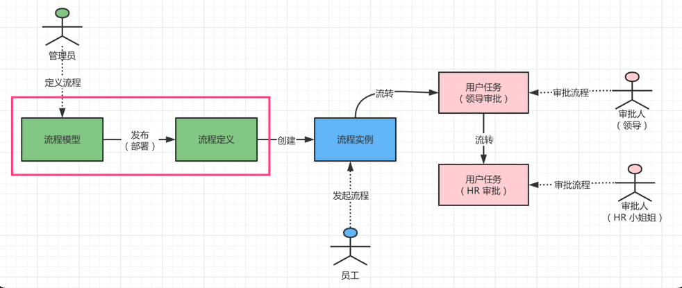

## [#](#_1-业务接入-业务表单) 1. 业务接入（业务表单）

根据业务需要，业务通过建立独立的数据库表（业务表）记录申请信息，而流程引擎只负责推动流程的前进或者结束。两者需要进行**双向**的关联：

*   每一条业务表记录，通过它的流程实例的编号( `process_instance_id` )指向对应的流程实例
*   每一个流程实例，通过它的业务键( `BUSINESS_KEY_` ) 指向对应的业务表记录

以项目中提供的 [OALeave (opens new window)](https://github.com/YunaiV/yudao-cloud/blob/master/yudao-module-bpm/yudao-module-bpm-biz/src/main/java/cn/iocoder/yudao/module/bpm/service/oa/BpmOALeaveServiceImpl.java) 请假举例子，它的业务表 `bpm_oa_leave` 和流程引擎的流程实例的关系如下图：

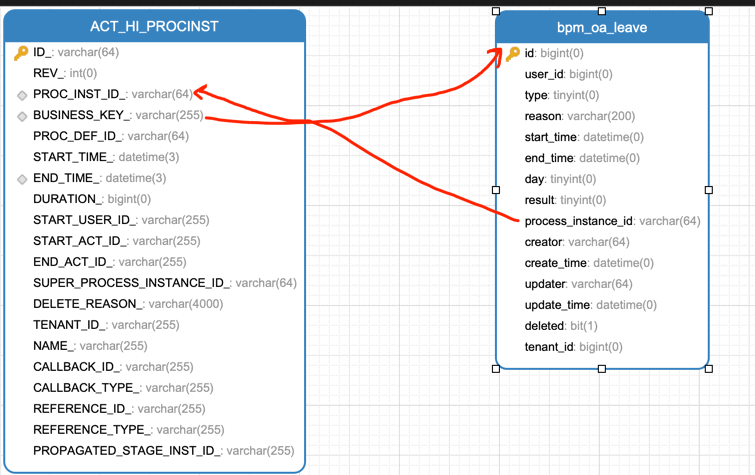

也因为业务建立了独立的业务表，所以必须开发业务表对应的列表、表单、详情页面。不过，审核相关的功能是无需重新开发的，原因是业务表已经关联对应的流程实例，流程引擎审批流程实例即可。

下面，我们以项目中的 [OALeave (opens new window)](https://github.com/YunaiV/yudao-cloud/blob/master/yudao-module-bpm/yudao-module-bpm-biz/src/main/java/cn/iocoder/yudao/module/bpm/service/oa/BpmOALeaveServiceImpl.java) 为例子，详细讲解下业务表单的开发与使用的过程。

### [#](#_1-0-第零步-业务开发) 1.0 第零步：业务开发
#### [#](#_1-0-1-新建业务表) 1.0.1 新建业务表

新建业务表 `bpm_oa_leave`，建表语句如下：

```sql
CREATE TABLE `bpm_oa_leave` (
  `id` bigint NOT NULL AUTO_INCREMENT COMMENT '请假表单主键',
  `user_id` bigint NOT NULL COMMENT '申请人的用户编号',
  `type` tinyint NOT NULL COMMENT '请假类型',
  `reason` varchar(200) CHARACTER SET utf8mb4 COLLATE utf8mb4_unicode_ci NOT NULL COMMENT '请假原因',
  `start_time` datetime NOT NULL COMMENT '开始时间',
  `end_time` datetime NOT NULL COMMENT '结束时间',
  `day` tinyint NOT NULL COMMENT '请假天数',
  `status` tinyint NOT NULL COMMENT '请假结果',
  `process_instance_id` varchar(64) CHARACTER SET utf8mb4 COLLATE utf8mb4_unicode_ci DEFAULT NULL COMMENT '流程实例的编号',
  `creator` varchar(64) CHARACTER SET utf8mb4 COLLATE utf8mb4_unicode_ci DEFAULT '' COMMENT '创建者',
  `create_time` datetime NOT NULL DEFAULT CURRENT_TIMESTAMP COMMENT '创建时间',
  `updater` varchar(64) CHARACTER SET utf8mb4 COLLATE utf8mb4_unicode_ci DEFAULT '' COMMENT '更新者',
  `update_time` datetime NOT NULL DEFAULT CURRENT_TIMESTAMP ON UPDATE CURRENT_TIMESTAMP COMMENT '更新时间',
  `deleted` bit(1) NOT NULL DEFAULT b'0' COMMENT '是否删除',
  `tenant_id` bigint NOT NULL DEFAULT '0' COMMENT '租户编号',
  PRIMARY KEY (`id`) USING BTREE
) ENGINE=InnoDB AUTO_INCREMENT=26 DEFAULT CHARSET=utf8mb4 COLLATE=utf8mb4_unicode_ci COMMENT='OA 请假申请表';

```

重点是两个字段：

*   `process_instance_id` 字段，关联流程引擎的流程实例对应的 `ACT_HI_PROCINST` 表的 `PROC_INST_ID_` 字段
*   `status` 字段，请假结果，需要通过 Listener 监听回调结果，稍后来看看

#### [#](#_1-0-2-【后端】实现业务逻辑) 1.0.2 【后端】实现业务逻辑

实现业务表的【后端】业务逻辑，具体代码可以看看如下两个类：

*   [BpmOALeaveController (opens new window)](https://github.com/YunaiV/yudao-cloud/blob/master/yudao-module-bpm/yudao-module-bpm-biz/src/main/java/cn/iocoder/yudao/module/bpm/controller/admin/oa/BpmOALeaveController.java)
*   [BpmOALeaveServiceImpl (opens new window)](https://github.com/YunaiV/yudao-cloud/blob/master/yudao-module-bpm/yudao-module-bpm-biz/src/main/java/cn/iocoder/yudao/module/bpm/service/oa/BpmOALeaveServiceImpl.java)

重点是看流程发起的逻辑，它定义了 `/bpm/oa/leave/create` 给业务的表单界面调用，UML 时序图如下：

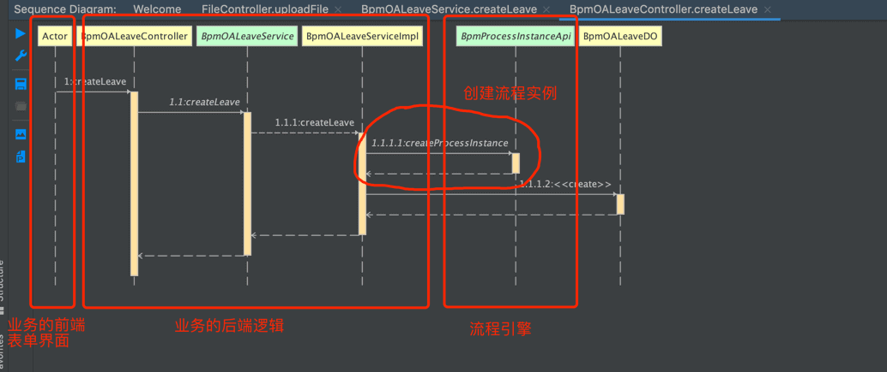

具体的实现代码比较简单，如下图所示：

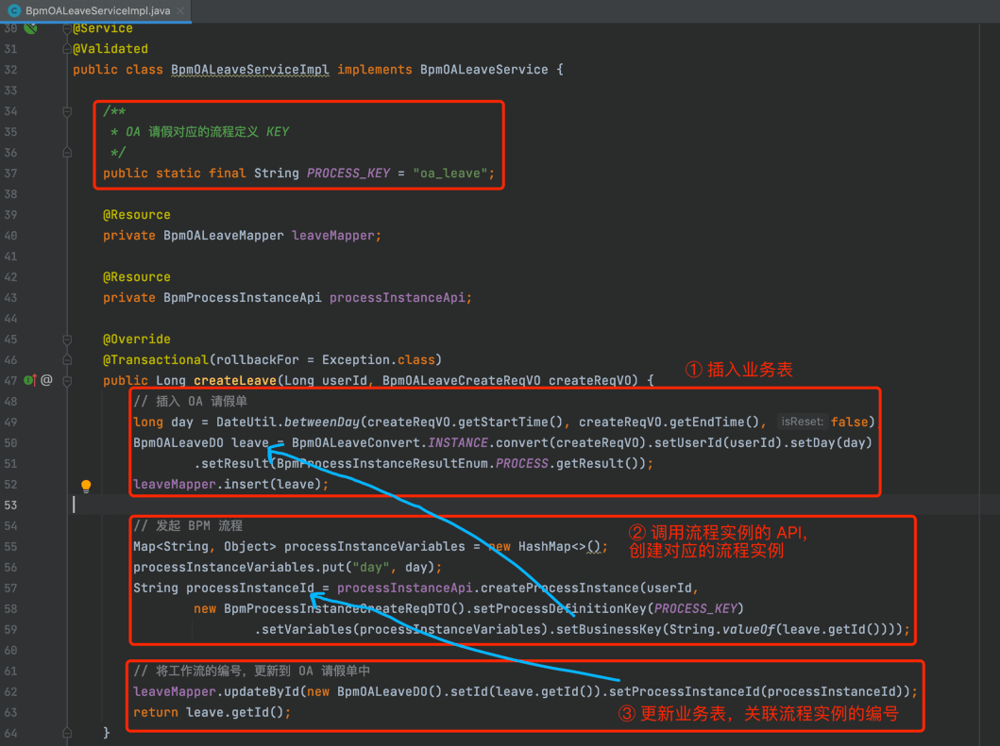

*   `PROCESS_KEY` 静态变量：是业务对应的流程模型的编号，稍后会进行创建编号为 oa\_leave 的流程模型。
*   [BpmProcessInstanceApi (opens new window)](https://github.com/YunaiV/yudao-cloud/blob/master/yudao-module-bpm/yudao-module-bpm-api/src/main/java/cn/iocoder/yudao/module/bpm/api/task/BpmProcessInstanceApi.java) 定义了 `#createProcessInstance(...)` 方法，用于创建流程实例，业务无需关心底层是 Flowable 引擎，还是 Activiti、Camunda 引擎。

#### [#](#_1-0-3-【前端】实现业务逻辑) 1.0.3 【前端】实现业务逻辑

实现业务表的【前端】业务逻辑，具体代码可以看看如下三个页面：

*   请假发起界面：[`leave/create.vue` (opens new window)](https://github.com/yudaocode/yudao-ui-admin-vue3/blob/master/src/views/bpm/oa/leave/create.vue)
*   请假详情界面：[`leave/detail.vue` (opens new window)](https://github.com/yudaocode/yudao-ui-admin-vue3/blob/master/src/views/bpm/oa/leave/detail.vue)
*   请假列表界面：[`leave/index.vue` (opens new window)](https://github.com/yudaocode/yudao-ui-admin-vue3/blob/master/src/views/bpm/oa/leave/index.vue)

另外，在 [`router/modules/remaining.ts` (opens new window)](https://github.com/yudaocode/yudao-ui-admin-vue3/blob/master/src/router/modules/remaining.ts#L305-L328) 中定义 `create.vue` 和 `detail.vue` 的路由，配置如下：

```javascript
{
    path: '/bpm',
    component: Layout,
    name: 'bpm',
    meta: {
      hidden: true
    },
    children: [
      {
        path: 'oa/leave/create',
        component: () => import('@/views/bpm/oa/leave/create.vue'),
        name: 'OALeaveCreate',
        meta: {
          noCache: true,
          hidden: true,
          canTo: true,
          title: '发起 OA 请假',
          activeMenu: '/bpm/oa/leave'
        }
      },
      {
        path: 'oa/leave/detail',
        component: () => import('@/views/bpm/oa/leave/detail.vue'),
        name: 'OALeaveDetail',
        meta: {
          noCache: true,
          hidden: true,
          canTo: true,
          title: '查看 OA 请假',
          activeMenu: '/bpm/oa/leave'
        }
      }
    ]
}

```

为什么要做独立的 \`create.vue\` 和 \`index.vue\` 页面？

*   创建流程时，需要跳转到 `create.vue` 页面，填写业务表的信息，才能提交流程。
*   审批流程时，需要跳转到 `detail.vue` 页面，查看业务表的信息。

#### [#](#_1-0-4-【实现】实现审批结果的监听) 1.0.4 【实现】实现审批结果的监听

审批结束时（例如说流程实例最终被审批通过、不通过、取消），后端需要监听审批结果，然后更新业务表的状态。

具体可见 [BpmOALeaveStatusListener (opens new window)](https://github.com/YunaiV/yudao-cloud/blob/master/yudao-module-bpm/yudao-module-bpm-biz/src/main/java/cn/iocoder/yudao/module/bpm/service/oa/listener/BpmOALeaveStatusListener.java) 监听器，它实现流程引擎定义的 [BpmProcessInstanceStatusEventListener (opens new window)](https://github.com/YunaiV/yudao-cloud/blob/master/yudao-module-bpm/yudao-module-bpm-api/src/main/java/cn/iocoder/yudao/module/bpm/event/BpmProcessInstanceStatusEventListener.java) 抽象类，在流程实例结束时，回调通知它**最终的**结果是通过还是不通过。代码如下图：

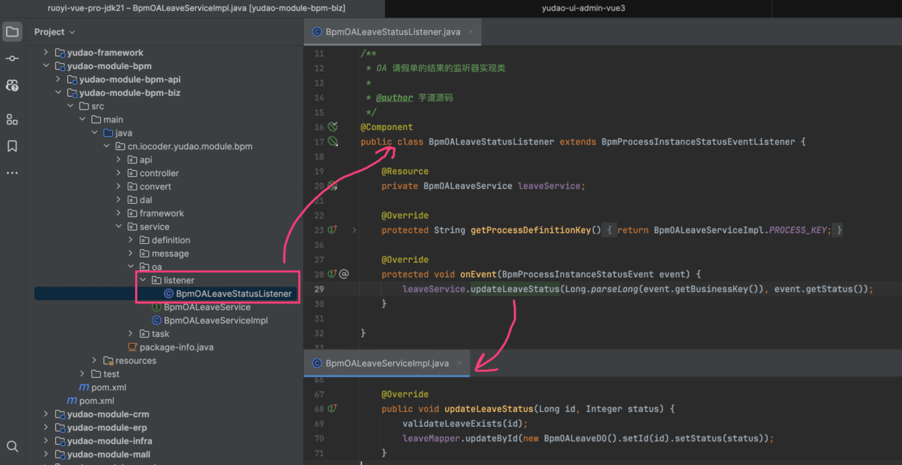

友情提示：BpmProcessInstanceStatusEventListener 是什么呢？

BpmProcessInstanceStatusEventListener 是我们框架自己封装的一个监听器，用于监听流程实例的最终结果。在流程实例结束时，会回调通知它。

如果你自己的业务接入工作流，并且需要监听审批结果，必须继承它，实现自己的监听器！！！

* * *

至此，我们了解了 OALeave 使用业务表单所涉及到的开发，下面我们来定义对应的流程、发起该流程、并审批该流程。

友情提示：从这一步开始，和「1. 请假流程【流程表单】」的流程基本是一致的，所以重点还是上面。

### [#](#_2-1-第一步-定义流程) 2.1 第一步：定义流程

登录账号 admin、密码 admin123 的用户，扮演【管理员】的角色，进行流程的定义。

#### [#](#_1-1-1-新建流程) 1.1.1 新建流程

访问 \[工作流程 -> 流程管理 -> 流程模型\] 菜单，点击「新建流程」按钮，填写流程标识、流程名称。如下图所示：

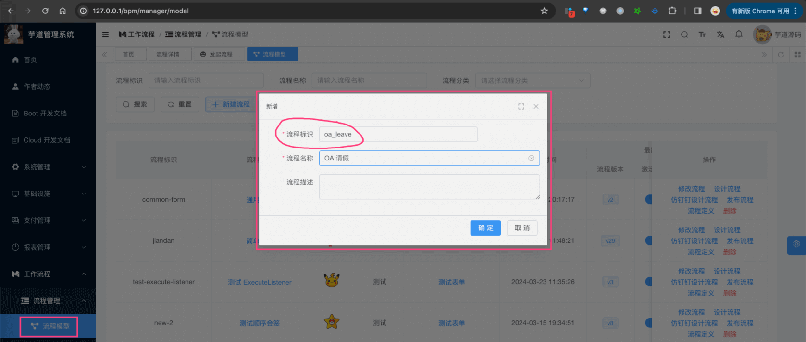

注意，流程标识需要填 `oa_leave`。因为在 BpmOALeaveServiceImpl 类中，发起流程的标识是 `oa_leave`。

#### [#](#_1-1-2-修改流程) 1.1.2 修改流程

点击「修改流程」按钮，配置表单类型为业务表单，填写表单提交路由为 `/bpm/oa/leave/create`（用于发起流程时，跳转的业务表单的路由）、表单查看路由为 `/bpm/oa/leave/detail`（用于在流程详情中，点击查看表单的路由）。如下图所示：

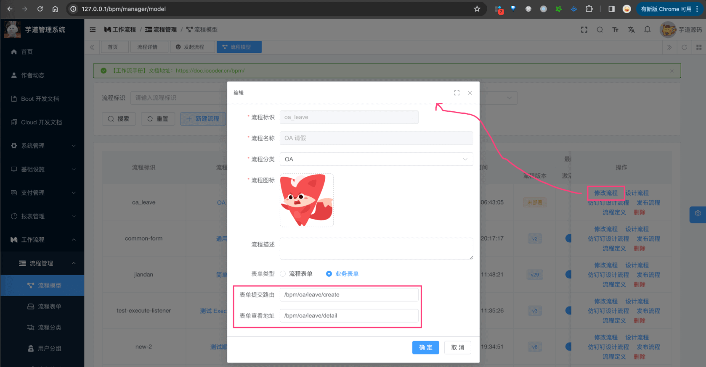

友情提示：注意！！！\`/bpm/oa/leave/create\` 和 \`/bpm/oa/leave/detail\`，都是相对 \`/views\` 开始的 Vue 文件的路径！！！

#### [#](#_1-1-3-设计流程) 1.1.3 设计流程

① 点击「设计流程」按钮，在线设计请假流程模型，包含两个用户任务：领导审批、HR 审批。如下图所示：

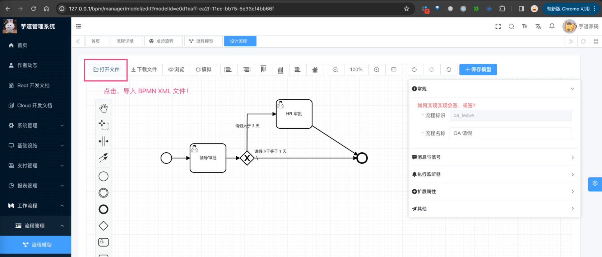

可以点击 [`oa_leave_bpmn.XML`](/img/%E5%B7%A5%E4%BD%9C%E6%B5%81/oa_leave_bpmn.XML) 进行下载，然后点击「打开文件」按钮，进行导入。

② 点击图中的“领导审批”，规则类型为“流程表达式”，流程表达式为 `${bpmTaskAssignLeaderExpression.calculateUsers(execution, 1)}`。如下图所示：

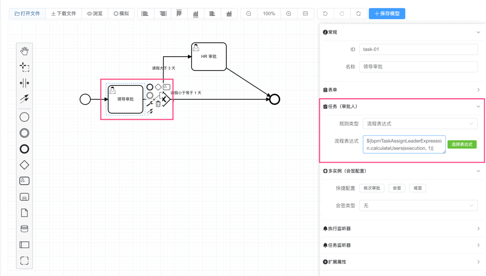

友情提示：该流程表达式的作用是，流程发起人的一级领导。

为什么呢？这块我们在 [《流程表达式》](/bpm/expression/) 详细讲解。

点击图中的“HR 审批”，规则类型为“岗位”，指定岗位为“人力资源”。如下图所示：

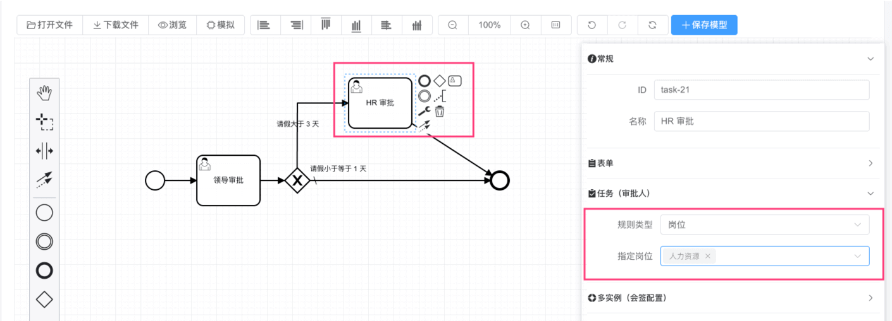

之后，点击右上角的「保存模型」按钮，完成流程模型的设计。

③ 点击「发布流程」按钮，把定义的流程模型部署出去。部署成功后，就可以发起该流程了。

### [#](#_2-2-第二步-发起流程) 2.2 第二步：发起流程

登录账号 admin、密码 admin123 的用户，扮演【员工】的角色，进行流程的发起。

① 发起业务表单请假流程，两种路径：

1.  访问 \[工作流程 -> 审批中心 -> 发起流程\] 菜单，选择“OA 请求”流程，会跳转到流程模型 `oa_leave` 配置的表单提交路由。 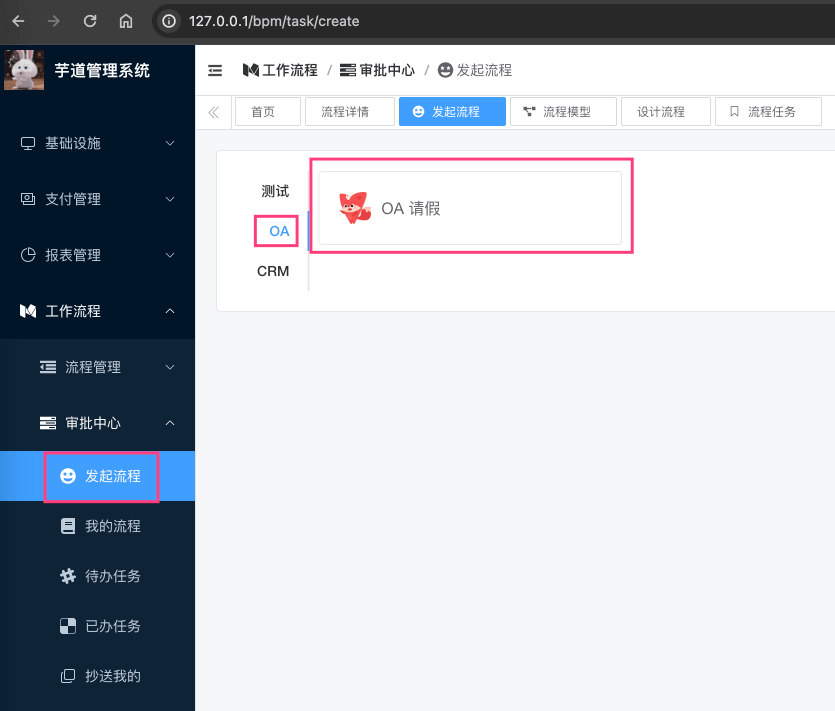
    
2.  访问 \[工作流程 -> OA 示例 -> 请假查询\] 菜单，点击「发起请假」按钮。 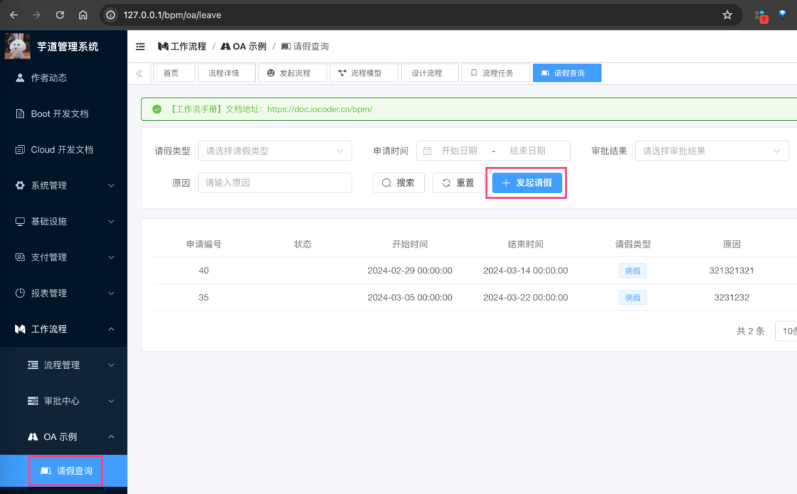
    

② 填写一个小于等于 3 天的请假，只会走【领导审批】任务；填写一个大于 3 天的请假，在走完【领导审批】任务后，会额外走【HR 审批】任务。

后续的流程，和 [审批接入（流程表单）](/bpm/use-bpm-form/) 是基本一致的，这里就不重复赘述，当然你还是要试着跑一跑，了解整个的过程。

### [#](#_2-3-第三步-审批流程) 2.3 第三步：审批流程

略~自己跑

*   登录账号 test、密码 test123 的用户，扮演【审批人】的角色，进行请假流程的【领导审批】任务
*   登录账号 hrmgr、密码 hr123 的用户，扮演【审批人】的角色，进行请假流程的【HR 审批】任务

## [#](#_2-选择业务表单、流程表单) 2. 选择业务表单、流程表单？

流程表单，适合简单业务，无需开发的那种。大多数场景下，我们还是选择业务表单，例如说：

*   [《CRM 手册 —— 【合同】合同管理、合同提醒》](/crm/contract) 的合同审批
*   [《CRM 手册 —— 【回款】回款管理、回款计划》](/crm/receivable) 的回款审批

也就是说，审批只是业务的一个环节，而不是整个业务的所有。所以，我们选择业务表单，是为了更好的支持业务的复杂度。

## [#](#_3-业务表单是如何集成的) 3. 业务表单是如何集成的？

① 流程发起时，会跳转流程模型配置的“表单提交路由”，代码如下图所示：

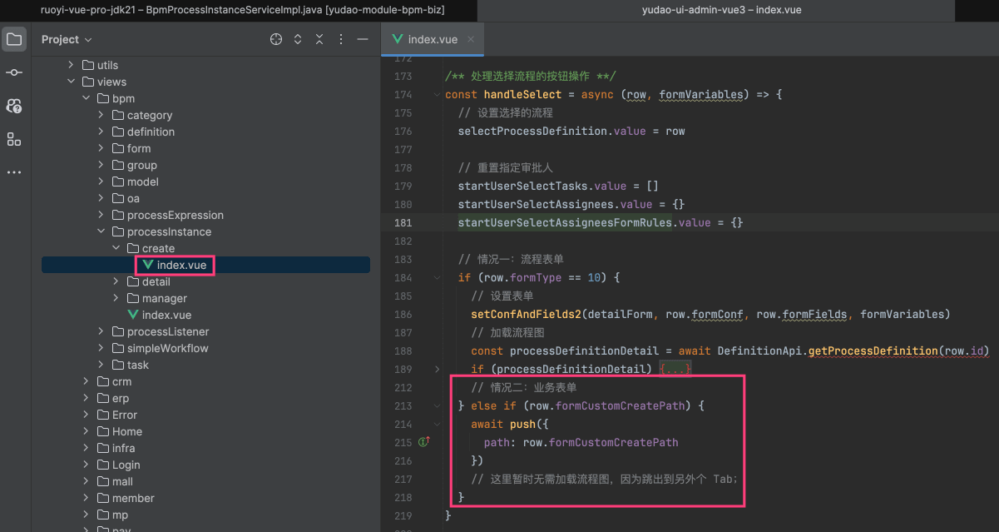

② 流程详情时，需要展示业务表单详情时，通过 [Vue3 异步组件 (opens new window)](https://cn.vuejs.org/guide/components/async) 特性，将展示流程模型配置的“表单查看路由”，代码如下图所示：

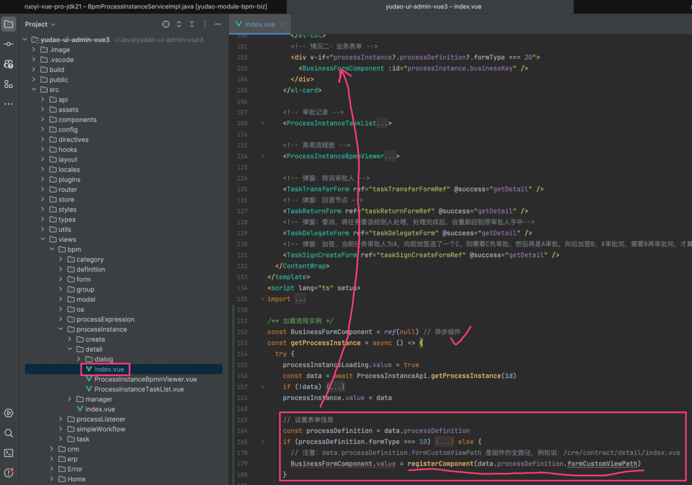