目录

# 审批接入（流程表单）

相关视频：

*   [02、如何实现动态的流程表单？ (opens new window)](https://t.zsxq.com/04nun2RRz)
*   [03、如何实现流程表单的保存？ (opens new window)](https://t.zsxq.com/04uneeaUb)
*   [04、如何实现流程表单的展示？ (opens new window)](https://t.zsxq.com/04jiMrjAm)

项目基于 Flowable 实现了工作流的功能，提供两种方式接入：

*   ① 【流程表单】：在线配置动态表单，无需建表与开发
*   ② 【业务表单】：业务需建立独立的数据库表，并开发对应的表单、详情界面

我们以“请假流程”为例子，讲解两种接入方式的差异，整个过程包括：

1.  定义流程：【管理员】新建流程、设计流程模型、并设置用户任务的审批人，最终发布流程
2.  发起流程：【员工】选择流程，并发起流程实例
3.  审批流程：【审批人】接收到流程任务，审批结果为通过或不通过


本文，我们讲解的是「业务接入（流程表单）」的流程，复杂业务接入的流程请查看[业务接入（业务表单）](/bpm/use-business-form)。

## [#](#_1-业务接入-流程表单) 1. 业务接入（流程表单）
### [#](#_1-1-第一步-定义流程) 1.1 第一步：定义流程

登录账号 admin、密码 admin123 的用户，扮演【管理员】的角色，进行流程的定义。

#### [#](#_1-1-1-新建流程) 1.1.1 新建流程

访问 \[工作流程 -> 流程管理 -> 流程模型\] 菜单，点击「新建流程」按钮，填写流程标识、流程名称。如下图所示：


*   流程标识：对应 BPMN 流程文件 XML 的 `id` 属性，不能重复，新建后不可修改。
*   流程名称：对应 BPMN 流程文件 XML 的 `name` 属性。

```xml
<!-- 这是一个 BPMN XML 的示例，主要看 id 和 name 属性 -->
<?xml version="1.0" encoding="UTF-8"?>
<bpmn2:definitions xmlns:xsi="http://www.w3.org/2001/XMLSchema-instance" xmlns:bpmn2="http://www.omg.org/spec/BPMN/20100524/MODEL" xmlns:bpmndi="http://www.omg.org/spec/BPMN/20100524/DI" id="diagram_Process_1647305370393" targetNamespace="http://activiti.org/bpmn">
  <bpmn2:process id="common-form" name="通用表单流程" isExecutable="true" />
  <bpmndi:BPMNDiagram id="BPMNDiagram_1">
    <bpmndi:BPMNPlane id="common-form_di" bpmnElement="common-form" />
  </bpmndi:BPMNDiagram>
</bpmn2:definitions>

```

#### [#](#_1-1-2-新建表单) 1.1.2 新建表单

① 访问 \[工作流程 -> 流程管理 -> 流程表单\] 菜单，点击「新增」按钮，新增一个名字为 `leave-form` 的表单。如下图所示：

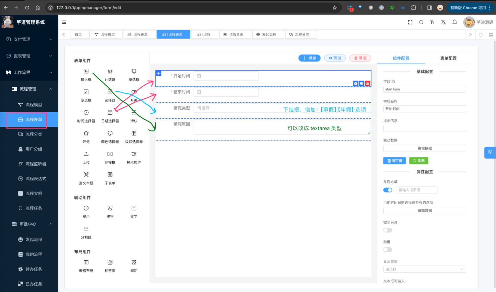

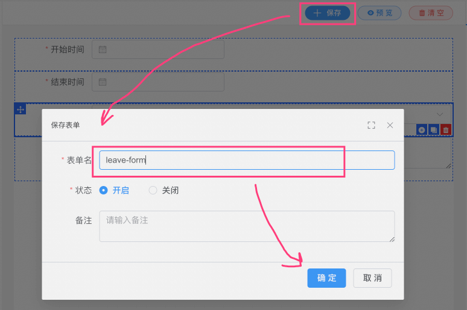

友情提示：如果感觉有点麻烦，随便设计下，保存就 OK 了。

② 回到 \[工作流程 -> 流程管理 -> 流程模型\] 菜单，点击「修改流程」按钮，配置表单类型为流程表单，选择名字为 `leave-form` 的流程表单。如下图所示：

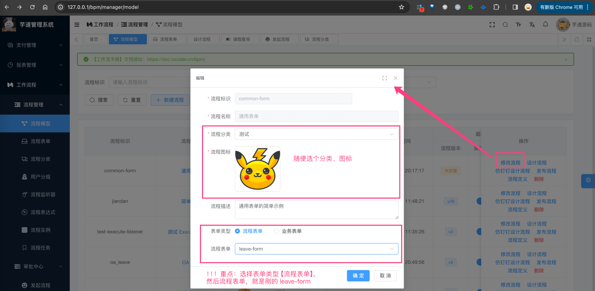

#### [#](#_1-1-3-设计流程) 1.1.3 设计流程

① 点击「设计流程」按钮，在线设计请假流程模型，包含两个用户任务：领导审批、HR 审批。如下图所示：

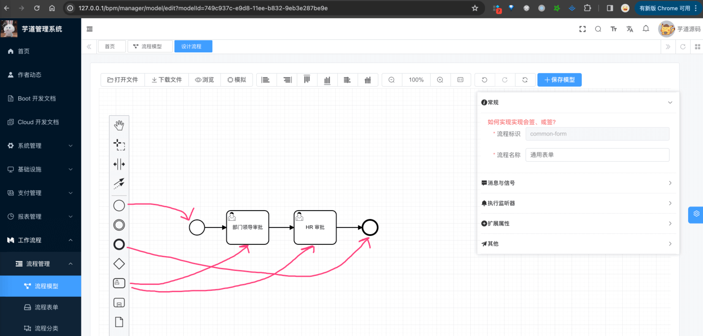

② 点击图中的“部门领导审批”，规则类型为“流程表达式”，流程表达式为 `${bpmTaskAssignLeaderExpression.calculateUsers(execution, 1)}`。如下图所示：

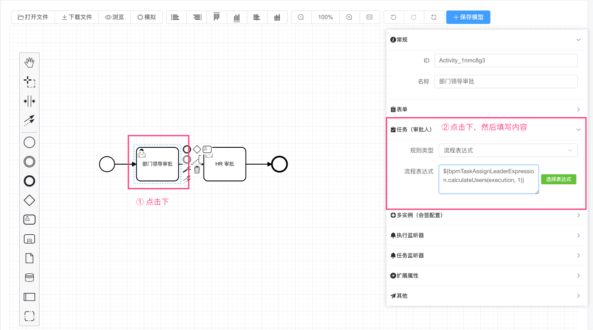

友情提示：该流程表达式的作用是，流程发起人的一级领导。

为什么呢？这块我们在 [《流程表达式》](/bpm/expression/) 详细讲解。

点击图中的“HR 审批”，规则类型为“岗位”，指定岗位为“人力资源”。如下图所示：


之后，点击右上角的「保存模型」按钮，完成流程模型的设计。

③ 点击「发布流程」按钮，把定义的流程模型部署出去。部署成功后，就可以发起该流程了。如下图所示：

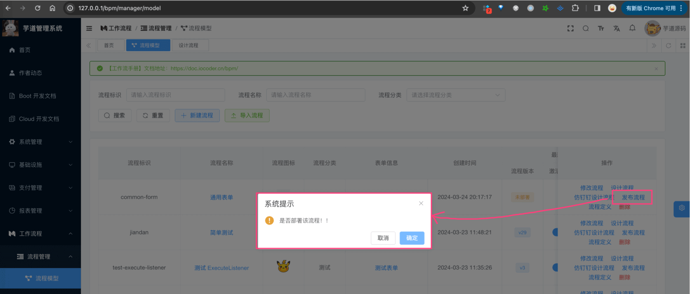

修改流程后，需要重新发布流程吗？

需要，**必须重新发布**才能生效。每次流程发布后，会生成一个新的流程定义，版本号从 v1 开始递增。

发布成功后，会部署新版本的流程定义，旧版本的流程定义将被挂起。当然，已经发起的流程不会受到影响，还是走老的流程定义。

### [#](#_2-第二步-发起流程) 2. 第二步：发起流程

登录账号 admin、密码 admin123 的用户，扮演【员工】的角色，进行流程的发起。

#### [#](#_2-1-发起流程) 2.1 发起流程

① 访问 \[工作流程 -> 审批中心 -> 发起流程\] 菜单，可以看到可以选择的流程定义的列表。


② 选择名字为“通用表单”的流程定义，发起请假流程。填写请假表单信息如下：

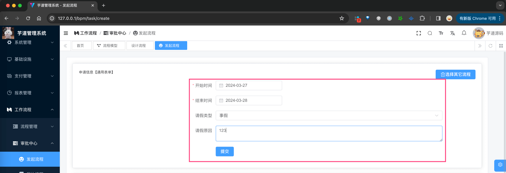

③ 点击提交成功后，可在 \[工作流程 -> 审批中心 -> 我的流程\]中，可看到该流程的状态、结果。


#### [#](#_2-2-查看流程) 2.2 查看流程

点击「详情」按钮，可以查看申请的表单信息、审批记录、流程跟踪图。

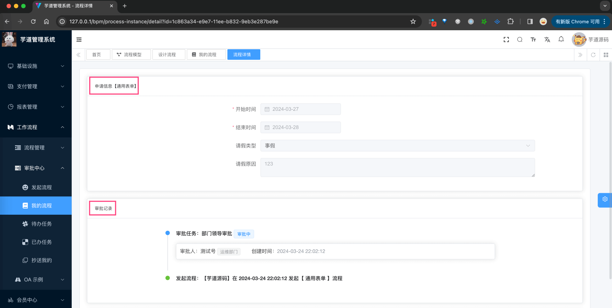

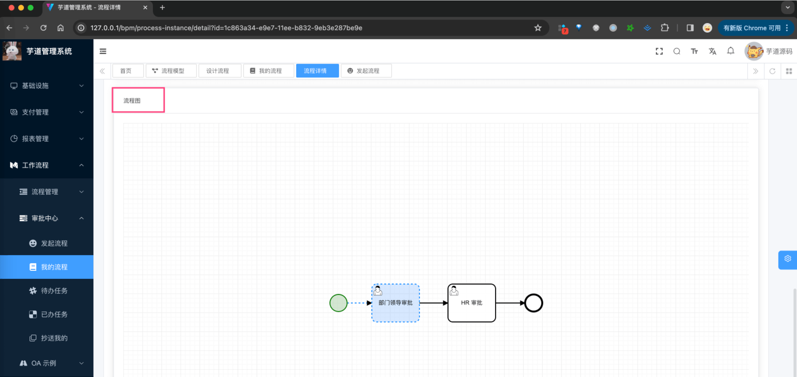

### [#](#_3-第三步-审批流程) 3. 第三步：审批流程
#### [#](#_3-1-部门领导审批) 3.1 部门领导审批

登录账号 test、密码 test123 的用户，扮演【审批人】的角色，进行请假流程的【领导审批】任务。

① 访问 \[工作流程 -> 审批中心 -> 待办任务\] 菜单，可以查询到需要审批的任务。

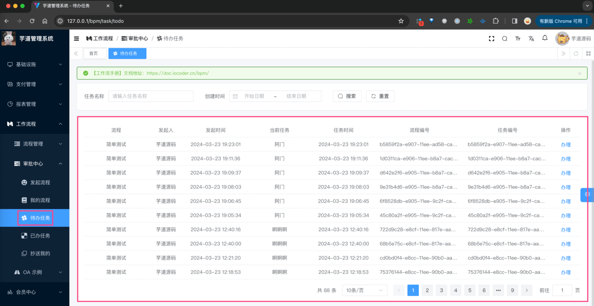

② 点击「办理」按钮，填写审批建议，并点击「通过」按钮，这样任务的审批就完成了。

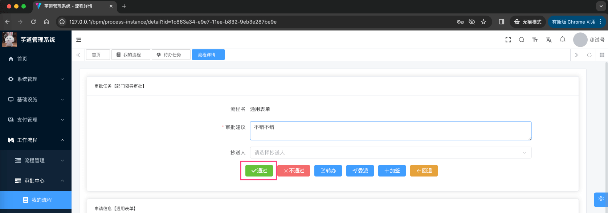

③ 访问 \[工作流程 -> 审批中心 -> 已办任务\] 菜单，可以查询到已经审批的任务。

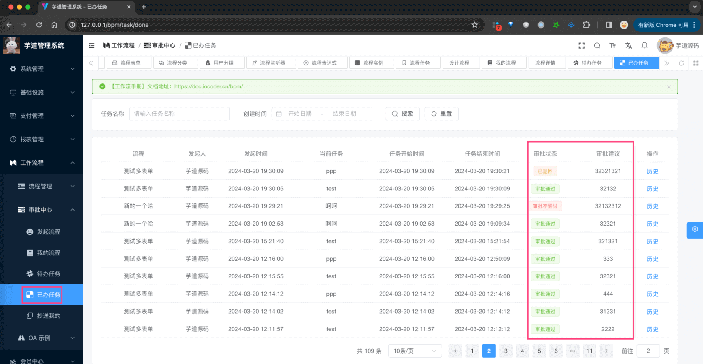

* * *

此时，使用【员工】的角色，访问 \[工作流程 -> 审批中心 -> 我的流程\] 菜单，可以看到流程流转到了【HR 审批】任务。

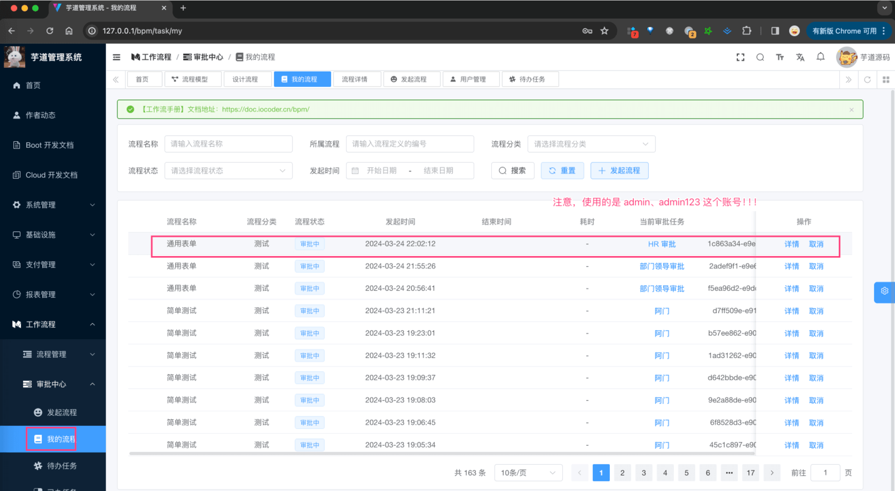

#### [#](#_3-2-hr-审批) 3.2 HR 审批

登录账号 hrmgr、密码 hr123 的用户，扮演【审批人】的角色，进行请假流程的【HR 审批】任务。

① 访问 \[工作流程 -> 审批中心 -> 待办任务\] 菜单，点击「审批」按钮，填写审批建议，并点击「通过」按钮。

* * *

此时，使用【员工】的角色，访问 \[工作流程 -> 审批中心 -> 我的流程\] 菜单，可以看到流程处理结束，最终审批通过。

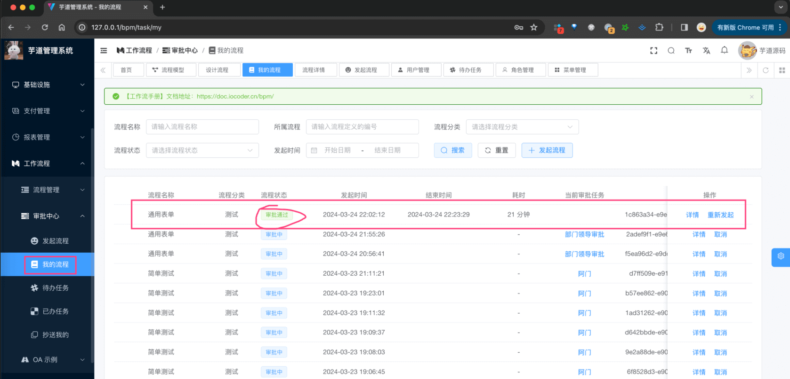

## [#](#_2-菜单【流程表单】) 2. 菜单【流程表单】

本小节，我们单独讲解的是菜单 \[工作流程 -> 流程管理 -> 流程表单\] 的功能。

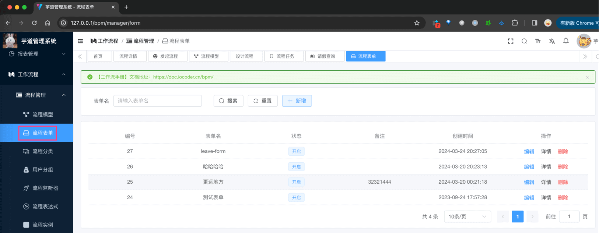

该菜单主要用于流程表单的配置，不包括最终表单填写后的存储，由 BpmFormController 提供接口。

### [#](#_2-1-表结构) 2.1 表结构

> 省略 creator/create\_time/updater/update\_time/deleted/tenant\_id 等通用字段

```sql
CREATE TABLE `bpm_form` (
  `id` bigint NOT NULL AUTO_INCREMENT COMMENT '编号',
  `name` varchar(64) CHARACTER SET utf8mb4 COLLATE utf8mb4_unicode_ci NOT NULL COMMENT '表单名',
  `status` tinyint NOT NULL COMMENT '开启状态',
  `conf` varchar(1000) CHARACTER SET utf8mb4 COLLATE utf8mb4_unicode_ci NOT NULL COMMENT '表单的配置',
  `fields` varchar(5000) CHARACTER SET utf8mb4 COLLATE utf8mb4_unicode_ci NOT NULL COMMENT '表单项的数组',
  `remark` varchar(255) CHARACTER SET utf8mb4 COLLATE utf8mb4_unicode_ci DEFAULT NULL COMMENT '备注',
  PRIMARY KEY (`id`) USING BTREE
) ENGINE=InnoDB AUTO_INCREMENT=28 DEFAULT CHARSET=utf8mb4 COLLATE=utf8mb4_unicode_ci COMMENT='BPM 表单定义表';

```

关键就 2 个字段：

① `conf`：表单的配置，是一个 JSON 字符串，包含表单的基本配置、按钮等。

```json
{
    "form": {
        "labelPosition": "right",
        "size": "default",
        "labelWidth": "125px",
        "hideRequiredAsterisk": false,
        "showMessage": true,
        "inlineMessage": false
    },
    "submitBtn": {
        "show": true,
        "innerText": "提交"
    },
    "resetBtn": {
        "show": false,
        "innerText": "重置"
    }
}

```

对应表单设计器的【表单配置】部分。如下图所示：

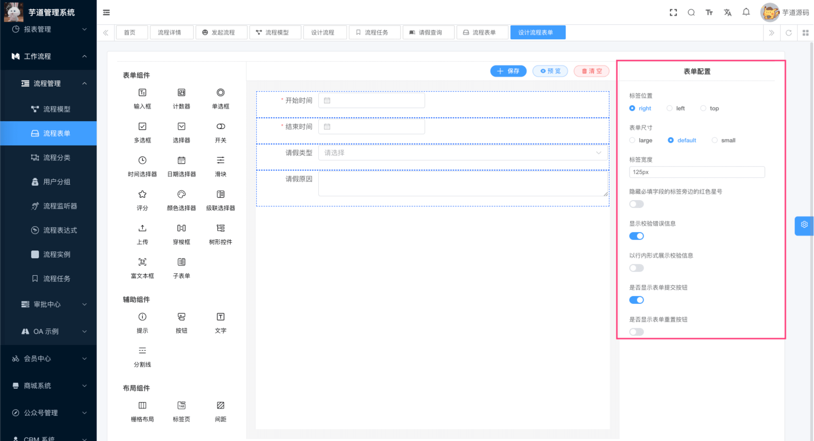

② `fields`：表单项的数组，是一个 JSON 字符串，包含表单的所有字段。

```json
["{\"type\":\"datePicker\",\"field\":\"startTime\",\"title\":\"开始时间\",\"info\":\"\",\"$required\":true,\"_fc_drag_tag\":\"datePicker\",\"hidden\":false,\"display\":true}","{\"type\":\"datePicker\",\"field\":\"Fm9i1onr8v6n68\",\"title\":\"结束时间\",\"info\":\"\",\"$required\":true,\"_fc_drag_tag\":\"datePicker\",\"hidden\":false,\"display\":true}","{\"type\":\"select\",\"field\":\"type\",\"title\":\"请假类型\",\"info\":\"\",\"effect\":{\"fetch\":\"\"},\"$required\":false,\"options\":[{\"label\":\"事假\",\"value\":1},{\"label\":\"年假\",\"value\":2}],\"_fc_drag_tag\":\"select\",\"hidden\":false,\"display\":true}","{\"type\":\"input\",\"field\":\"reason\",\"title\":\"请假原因\",\"info\":\"\",\"$required\":false,\"props\":{\"rows\":0,\"type\":\"textarea\"},\"_fc_drag_tag\":\"input\",\"hidden\":false,\"display\":true}"]

```

对应表单设计器的【组件配置】部分。如下图所示：

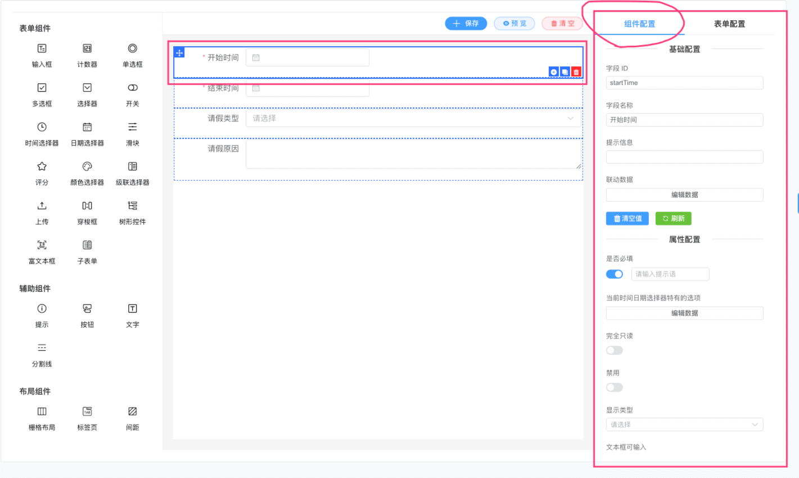

### [#](#_2-2-前端组件) 2.2 前端组件

基于 [https://github.com/xaboy/form-create (opens new window)](https://github.com/xaboy/form-create) 实现，支持 element-plus、ant-design-vue、naive-ui、arco-design、tdesign 等前端组件，还是非常不错的！

中文文档：[https://www.form-create.com/v3/guide/ (opens new window)](https://www.form-create.com/v3/guide/)

#### [#](#_2-2-1-表单设计器) 2.2.1 表单设计器

上文看到的“表单设计器”，在 [`bpm/form/editor/index.vue` (opens new window)](https://github.com/yudaocode/yudao-ui-admin-vue3/blob/master/src/views/bpm/form/editor/index.vue) 实现，使用 [form-create-designer (opens new window)](https://github.com/xaboy/form-create-designer) 实现。

#### [#](#_2-2-2-表单预览) 2.2.2 表单预览

点击「详情」按钮，可进行表单的预览，如下图所示：

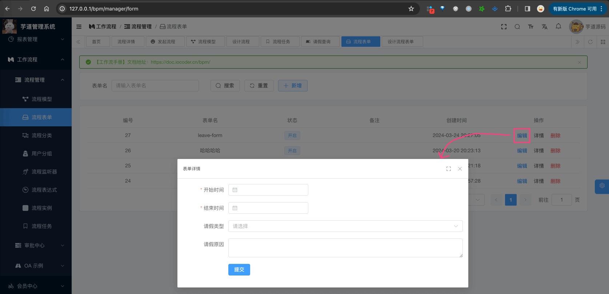

实现的逻辑，就是读取后端 `bpm_form` 表的 `conf` 和 `fields` 字段，然后使用 `form-create` 渲染。如下图所示：

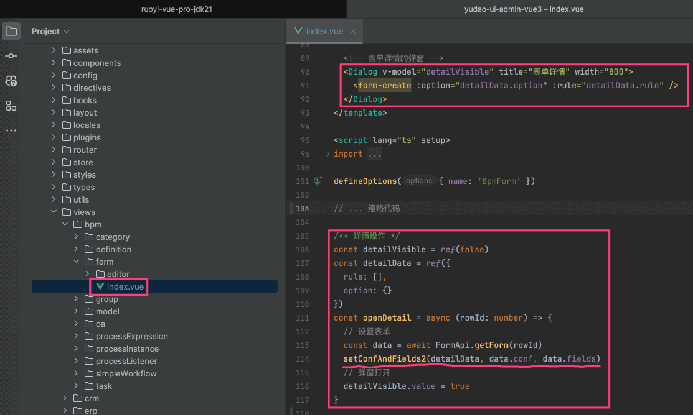

#### [#](#_2-2-3-表单填写) 2.2.3 表单填写

在 \[工作流程 -> 审批中心 -> 发起流程\] 菜单，点击「填写表单」按钮，可以填写表单。它也是基于 `form-create` 实现的，只是额外实现了 `@submit` 事件，用于提交表单。如下图所示：

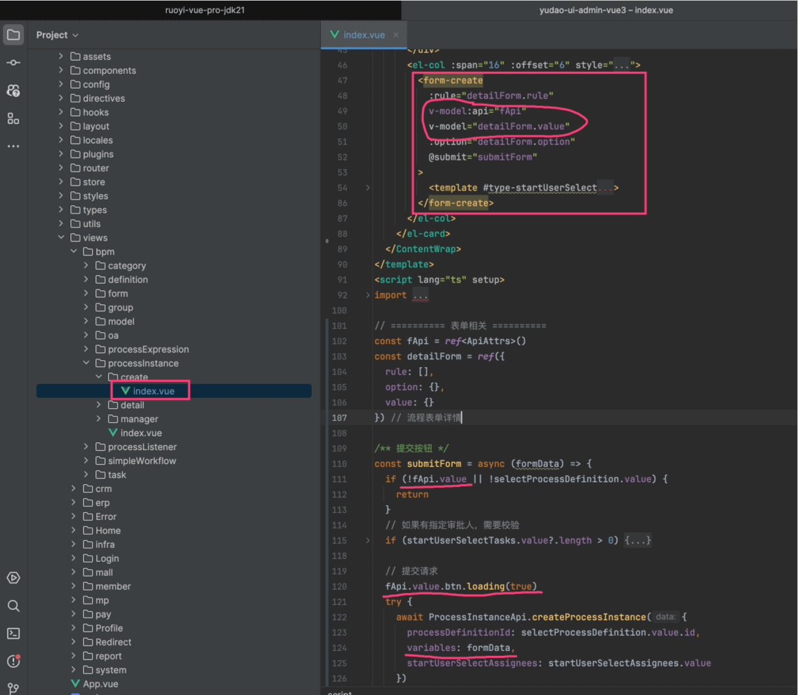

相比表单预览，它通过 `v-model` 获取表单的值，可通过 `v-model:api` 对应的 `fApi` 对象，进行表单的校验、重置等操作。

友情提问：使用流程表单时，提交的表单数据是怎么存储的？

存储到 Flowable 的 ProcessInstance 的 `variables` 中。如下图所示：

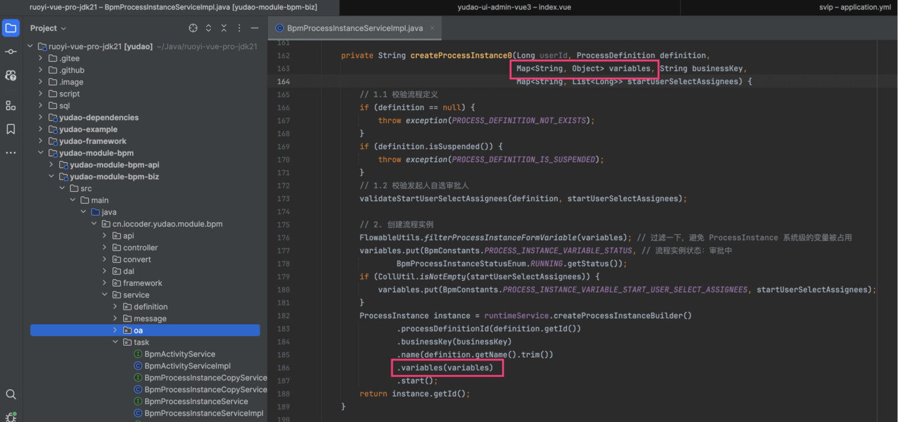

## [#](#_666-常见问题) 666. 常见问题？

① 流程中表单里面的附件上传，除了 pdf 这几种格式，可以支持别的格式的附件吗？

回答：[https://t.zsxq.com/bKzyd (opens new window)](https://t.zsxq.com/bKzyd)