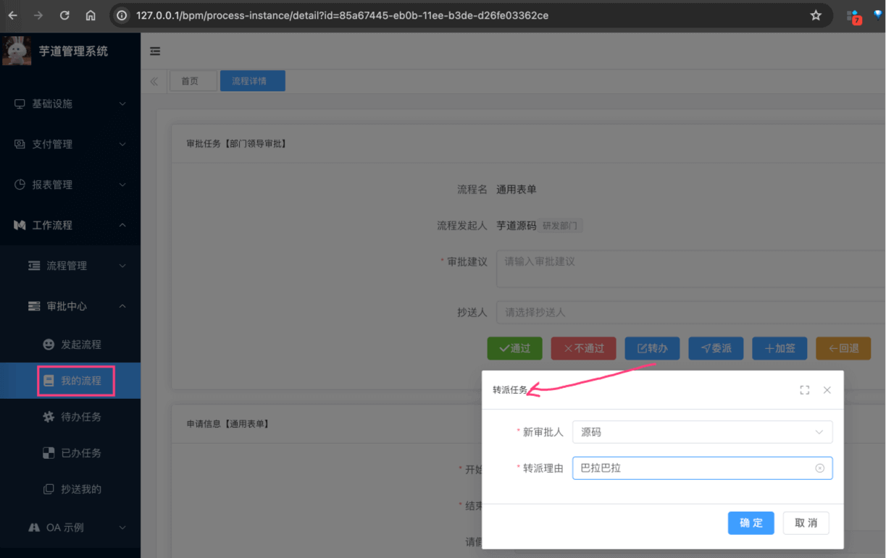
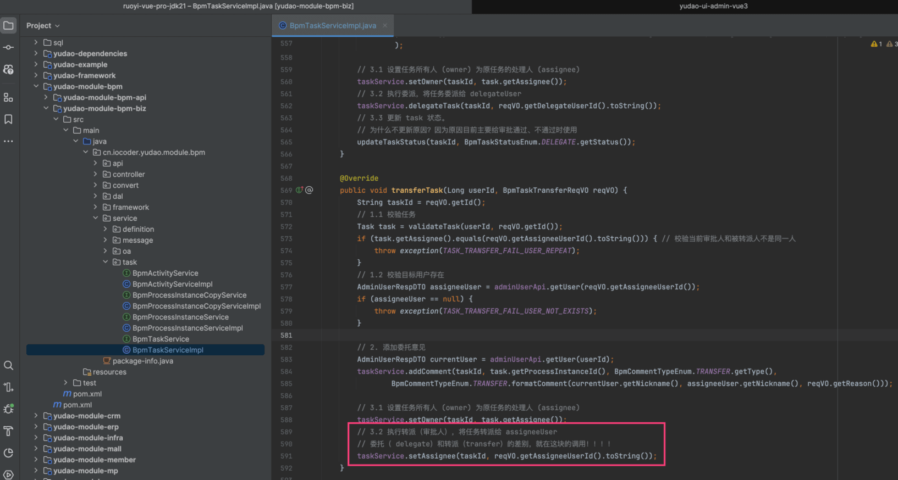
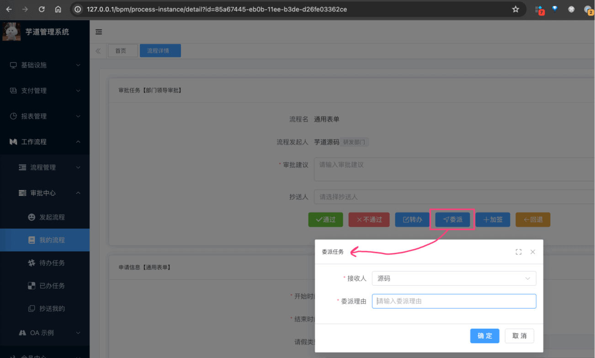
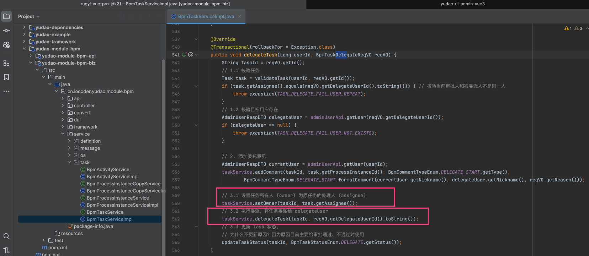
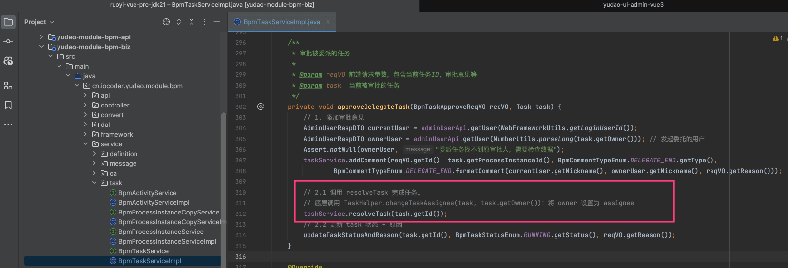
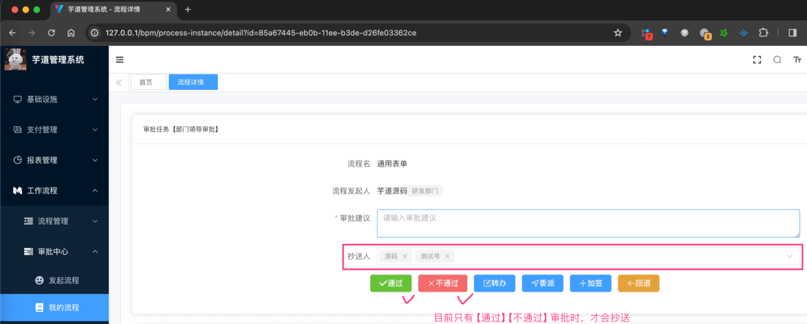
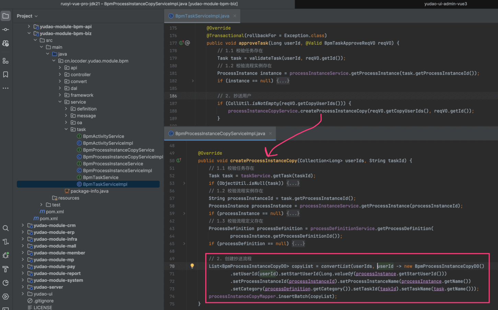
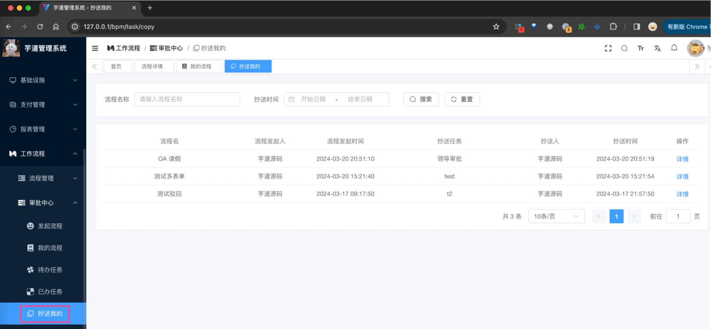

目录

# 审批转办、委派、抄送

## [#](#_1-转办、委派) 1. 转办、委派

转办和委托，两者的区别在于是不是真的转给对方，对比如下：

*   转办：A 转给其 B 审批，B 审批后，进入下一节点
*   委派：A 转给其 B 审批，B 审批后，转给 A，A 继续审批后进入下一节点

### [#](#_1-1-转办) 1.1 转办

转办，简单来说，就是 **真的** 换一个 `assignee` 审批人，对应界面如下：



对应后端的 BpmTaskController 提供的 `#transferTask(...)` 接口。如下图所示：



*   关键是红圈的 `3.2` 部分：通过调用 `TaskService#setAssignee(...)` 方法，修改审批人
*   至于 `3.1` 部分：将原审批人设置为 `owner`，这其实是可选的

### [#](#_1-2-委派) 1.2 委派

委派，简单来说，只是 **临时** 换一个 `assignee` 审批人，干完活还要交回来，对应界面如下：



它对应两个流程：

*   A 转给其 B 审批
*   B 审批后，转给 A

① A 转给其 B 审批，对应后端的 BpmTaskController 提供的 `#delegateTask(...)` 接口。如下图所示：



*   红圈的 `3.1` 部分：将原审批人设置为 `owner`，这个是必须的，因为委派是临时的，干完活还要交回来
*   红圈的 `3.2` 部分：通过调用 `TaskService#delegateTask(...)` 方法，委派给新审批人

② B 审批后，转给 A，对应后端的 BpmTaskController 提供的 `#approveTask(...)` 接口。如下图所示：



*   红圈的 `2.1` 部分：通过调用 `TaskService#resolveTask(...)` 方法，将委派的任务交回给原审批人，表示任务已审批（已完成）。这样，后续原审批人就可以继续审批了

## [#](#_2-抄送) 2. 抄送

抄送，将审批结果，通知给抄送列表对应的人。

### [#](#_2-1-表结构) 2.1 表结构

抄送表，是我们自己定义的 `bpm_process_instance_copy` 表，结构如下：

> 省略 creator/create\_time/updater/update\_time/deleted/tenant\_id 等通用字段

```sql
CREATE TABLE `bpm_process_instance_copy` (
  `id` bigint NOT NULL AUTO_INCREMENT COMMENT '编号',
  `user_id` bigint NOT NULL DEFAULT '0' COMMENT '用户编号，被抄送人',
  
  `start_user_id` bigint NOT NULL DEFAULT '0' COMMENT '发起流程的用户编号',
  `process_instance_id` varchar(64) COLLATE utf8mb4_unicode_ci NOT NULL DEFAULT '' COMMENT '流程实例的id',
  `process_instance_name` varchar(64) COLLATE utf8mb4_unicode_ci NOT NULL DEFAULT '' COMMENT '流程实例的名字',
  
  `category` varchar(64) CHARACTER SET utf8mb4 COLLATE utf8mb4_unicode_ci NOT NULL COMMENT '流程定义的分类',
  
  `task_id` varchar(64) COLLATE utf8mb4_unicode_ci NOT NULL DEFAULT '' COMMENT '发起抄送的任务编号',
  `task_name` varchar(64) COLLATE utf8mb4_unicode_ci DEFAULT NULL COMMENT '任务的名字',
  PRIMARY KEY (`id`) USING BTREE
) ENGINE=InnoDB AUTO_INCREMENT=12 DEFAULT CHARSET=utf8mb4 COLLATE=utf8mb4_unicode_ci COMMENT='BPM 流程实例抄送表';

```

比较简单，就是存储下关联的 `user_id`、`process_instance_id`、`task_id` 等信息。

### [#](#_2-2-发起抄送) 2.2 发起抄送

审批通过、不通过时，可以选择抄送的人，对应界面如下：



对应的后端代码，如下图所示：



### [#](#_2-3-查看抄送) 2.3 查看抄送

被抄送人，可以在 \[工作流程 -> 审批中心 -> 抄送我的\] 菜单，查看到抄送列表，对应界面如下：

