目录

# 流程发起、取消、重新发起

相关视频：

*   [11、如何实现流程的发起？ (opens new window)](https://t.zsxq.com/04jyvNfqj)
*   [12、如何实现我的流程列表？ (opens new window)](https://t.zsxq.com/046UFqRzz)
*   [13、如何实现流程的取消？ (opens new window)](https://t.zsxq.com/04aM72rzv)

本文的内容比较简单，主要围绕 \[审批中心\] 菜单下的 \[我的流程\]、\[发起流程\] 子菜单，讲解流程的发起、取消、重新发起的操作流程。

## [#](#_1-发起流程) 1. 发起流程

发起流程，对应 \[审批中心 -> 发起流程\] 菜单，如下图所示：

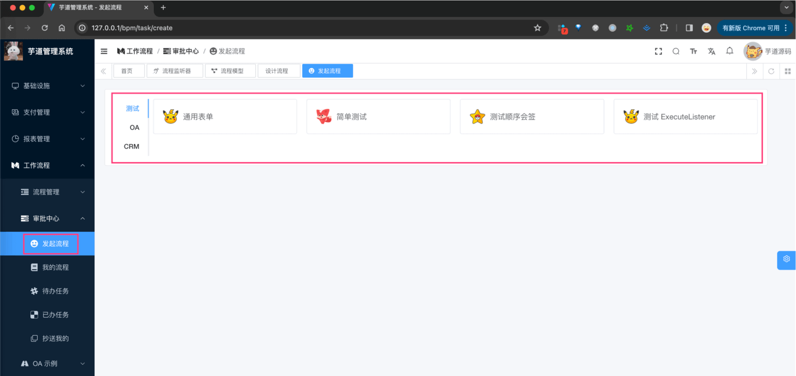

### [#](#_1-1-表结构) 1.1 表结构

① 流程实例表，由 Flowable 提供的 `ACT_RU_EXECUTION` 表实现，如下所示：

字段

类型

主键

说明

备注

ID\_

NVARCHAR2(64)

Y

主键

REV\_

INTEGER

N

数据版本

PROC\_INST\_ID\_

NVARCHAR2(64)

N

流程实例 ID

BUSINESS\_KEY\_

NVARCHAR2(255)

N

业务主键 ID

PARENT\_ID\_

NVARCHAR2(64)

N

父执行流的 ID

PROC\_DEF\_ID\_

NVARCHAR2(64)

N

流程定义的数据 ID

SUPER\_EXEC\_

NVARCHAR2(64)

N

ROOT\_PROC\_INST\_ID\_

NVARCHAR2(64)

N

ACT\_ID\_

NVARCHAR2(255)

N

节点实例 ID

IS\_ACTIVE\_

NUMBER(1)

N

是否存活

IS\_CONCURRENT\_

NUMBER(1)

N

执行流是否正在并行

IS\_SCOPE\_

NUMBER(1)

N

IS\_EVENT\_SCOPE\_

NUMBER(1)

N

IS\_MI\_ROOT\_

NUMBER(1)

N

SUSPENSION\_STATE\_

INTEGER

N

流程终端状态

CACHED\_ENT\_STATE\_

INTEGER

N

TENANT\_ID\_

NVARCHAR2(255)

N

NAME\_

NVARCHAR2(255)

N

START\_TIME\_

TIMESTAMP(6)

N

开始时间

START\_USER\_ID\_

NVARCHAR2(255)

N

LOCK\_TIME\_

TIMESTAMP(6)

N

IS\_COUNT\_ENABLED\_

NUMBER(1)

N

EVT\_SUBSCR\_COUNT\_

INTEGER

N

TASK\_COUNT\_

INTEGER

N

JOB\_COUNT\_

INTEGER

N

TIMER\_JOB\_COUNT\_

INTEGER

N

SUSP\_JOB\_COUNT\_

INTEGER

N

DEADLETTER\_JOB\_COUNT\_

INTEGER

N

VAR\_COUNT\_

INTEGER

N

ID\_LINK\_COUNT\_

INTEGER

N

② 流程参数表，由 Flowable 提供的 `ACT_RU_VARIABLE` 表实现，如下所示：

字段

类型

主键

说明

备注

ID\_

NVARCHAR2(64)

Y

主键

REV\_

INTEGER

N

数据版本

TYPE\_

NVARCHAR2(255)

N

参数类型

可以是基本的类型，也可以用户自行扩展

NAME\_

NVARCHAR2(255)

N

参数名称

EXECUTION\_ID\_

NVARCHAR2(64)

N

参数执行 ID

PROC\_INST\_ID\_

NVARCHAR2(64)

N

流程实例 ID

TASK\_ID\_

NVARCHAR2(64)

N

任务 ID

BYTEARRAY\_ID\_

NVARCHAR2(64)

N

资源 ID

DOUBLE\_

NUMBER(\*,10)

N

参数为 double，则保存在该字段中

LONG\_

NUMBER(19)

N

参数为 long，则保存在该字段中

TEXT\_

NVARCHAR2(2000)

N

用户保存文本类型的参数值

TEXT2\_

NVARCHAR2(2000)

N

用户保存文本类型的参数值

在 Flowable 中，如果想给 Task 增加拓展字段，无法通过 `ACT_RU_EXECUTION` 实现，而是通过 `ACT_RU_VARIABLE` 表实现。

该表是一种 Key-Value 的形式，可以存储任意类型的数据。例如说，项目中给 ProcessInstance 增加了一个 `PROCESS_STATUS` 字段，表示流程状态，如下图所示：

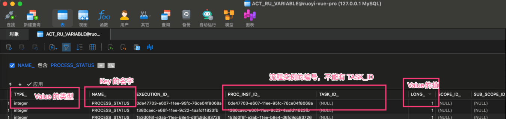

### [#](#_1-2-流程状态) 1.2 流程状态

流程状态，由 [BpmProcessInstanceStatusEnum (opens new window)](https://github.com/YunaiV/yudao-cloud/blob/master/yudao-module-bpm/yudao-module-bpm-api/src/main/java/cn/iocoder/yudao/module/bpm/enums/task/BpmProcessInstanceStatusEnum.java) 目前有 4 种，如下图所示：

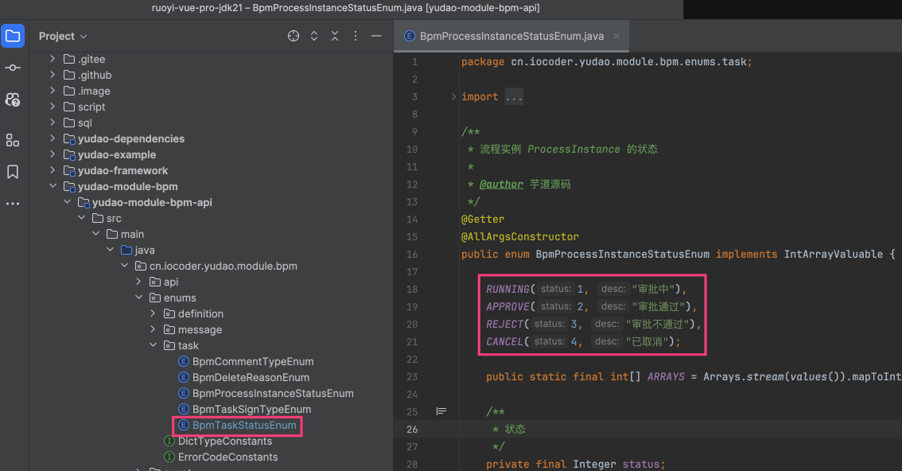

### [#](#_1-3-具体实现) 1.3 具体实现

*   前端，对应 `/views/bpm/processInstance/create/index.vue` 实现界面
*   后端，对应 BpmProcessInstanceController 的 `#createProcessInstance(...)` 提供接口

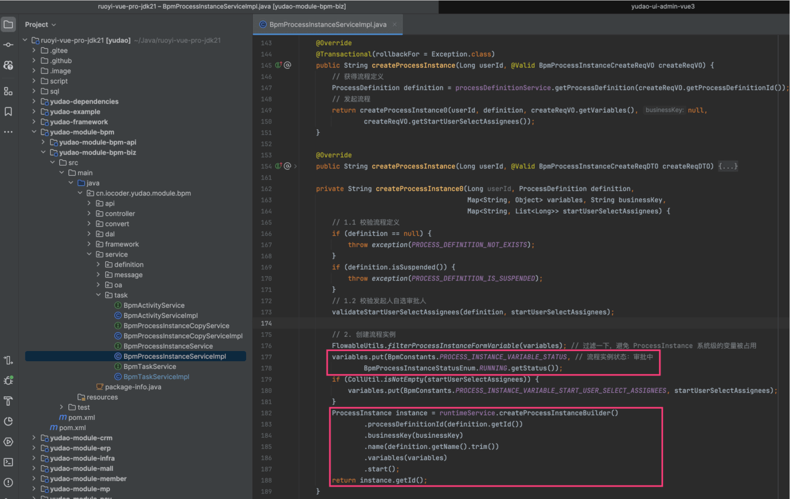

最核心的，就是调用 Flowable 的 `RuntimeService#createProcessInstanceBuilder().start()` 方法，创建流程实例。同时因为 Flowable 自身没有流程状态，所以需要我们自己维护任务状态。

## [#](#_2-我的流程) 2. 我的流程

我的流程，对应 \[审批中心 -> 我的流程\] 菜单，如下图所示：

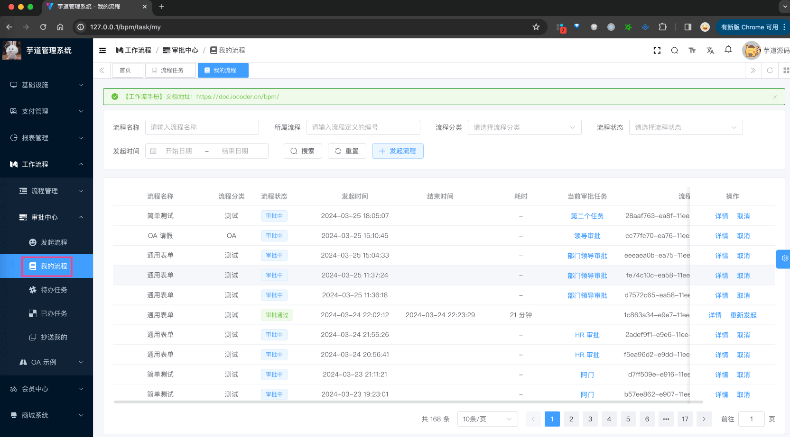

### [#](#_2-1-表结构) 2.1 表结构

① 历史流程实例表，由 Flowable 提供的 `ACT_HI_PROCINST` 表实现，如下所示：

字段

类型

主键

说明

备注

ID\_

NVARCHAR2(64)

Y

主键

PROC\_INST\_ID\_

NVARCHAR2(64)

N

流程实例 ID

BUSINESS\_KEY\_

NVARCHAR2(255)

N

业务主键

PROC\_DEF\_ID\_

NVARCHAR2(64)

N

属性 ID

START\_TIME\_

TIMESTAMP(6)

N

开始时间

END\_TIME\_

TIMESTAMP(6)

N

结束时间

DURATION\_

NUMBER(19)

N

耗时

START\_USER\_ID\_

NVARCHAR2(255)

N

起始人

START\_ACT\_ID\_

NVARCHAR2(255)

N

起始节点

END\_ACT\_ID\_

NVARCHAR2(255)

N

结束节点

SUPER\_PROCESS\_INSTANCE\_ID\_

NVARCHAR2(64)

N

父流程实例 ID

DELETE\_REASON\_

NVARCHAR2(2000)

N

删除原因

TENANT\_ID\_

NVARCHAR2(255)

N

NAME\_

NVARCHAR2(255)

N

名称

在 Flowable 中，如果 ProcessInstance 被完成（全部审批通过、不通过、取消等）时候，会从 `ACT_RU_EXECUTION` 表中删除，只能在 `ACT_HI_PROCINST` 表查询到。这是一种“冷热分离”的设计思想，因为进行的任务访问比较频繁，数据量越小，性能会越好。

而 \[我的流程\] 需要查询进行中、已完成的流程，所以需要查询 `ACT_HI_PROCINST` 表，而不能使用 `ACT_RU_EXECUTION` 表。

② 流程历史参数表，由 Flowable 提供的 `ACT_HI_VARINST` 表实现，如下所示：

字段

类型

主键

说明

备注

ID\_

NVARCHAR2(64)

Y

主键

PROC\_INST\_ID\_

NVARCHAR2(64)

N

流程实例 ID

EXECUTION\_ID\_

NVARCHAR2(64)

N

指定 ID

TASK\_ID\_

NVARCHAR2(64)

N

任务 ID

NAME\_

NVARCHAR2(255)

N

名称

VAR\_TYPE\_

NVARCHAR2(100)

N

参数类型

REV\_

INTEGER

N

数据版本

BYTEARRAY\_ID\_

NVARCHAR2(64)

N

字节表 ID

DOUBLE\_

NUMBER(\*,10)

N

存储 double 类型数据

LONG\_

NUMBER(\*,10)

N

存储 long 类型数据

TEXT\_

NVARCHAR2(2000)

N

TEXT2\_

NVARCHAR2(2000)

N

CREATE\_TIME\_

TIMESTAMP(6)(2000)

N

LAST\_UPDATED\_TIME\_

TIMESTAMP(6)(2000)

N

在 Flowable 中，如果 ProcessInstance 被完成（全部审批通过、不通过、取消等）时候，会从 `ACT_RU_VARIABLE` 表中删除，只能在 `ACT_HI_VARINST` 表查询到。这当然也是是一种“冷热分离”的设计思想~

### [#](#_2-2-具体实现) 2.2 具体实现

*   前端，对应 `/views/bpm/processInstance/index.vue` 实现界面
*   后端，对应 BpmProcessInstanceController 的 `#getProcessInstanceMyPage(...)` 提供接口

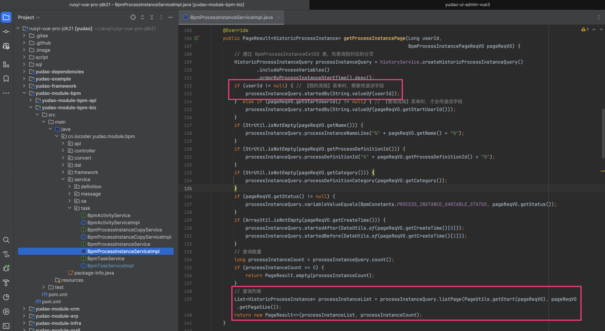

### [#](#_2-1-取消流程) 2.1 取消流程

可点击某个流程的「取消」按钮，进行流程的取消，如下图所示：

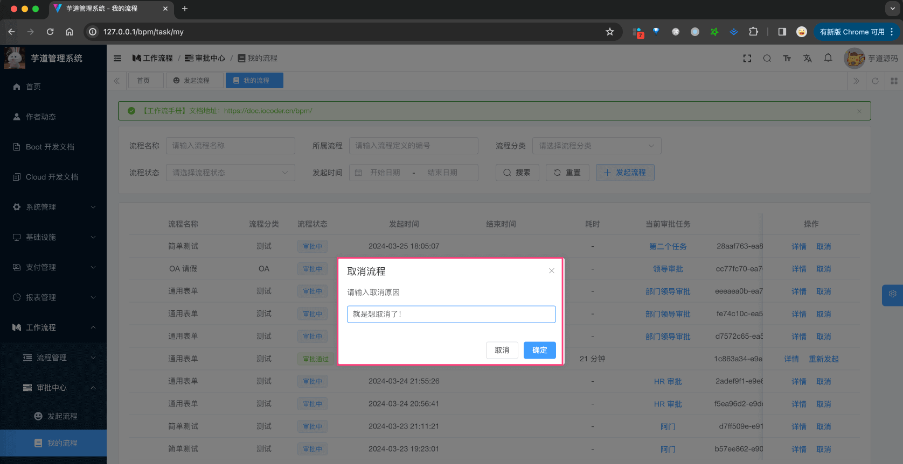

后端由 BpmProcessInstanceController 的 `#cancelProcessInstance(...)` 提供接口，如下图所示：

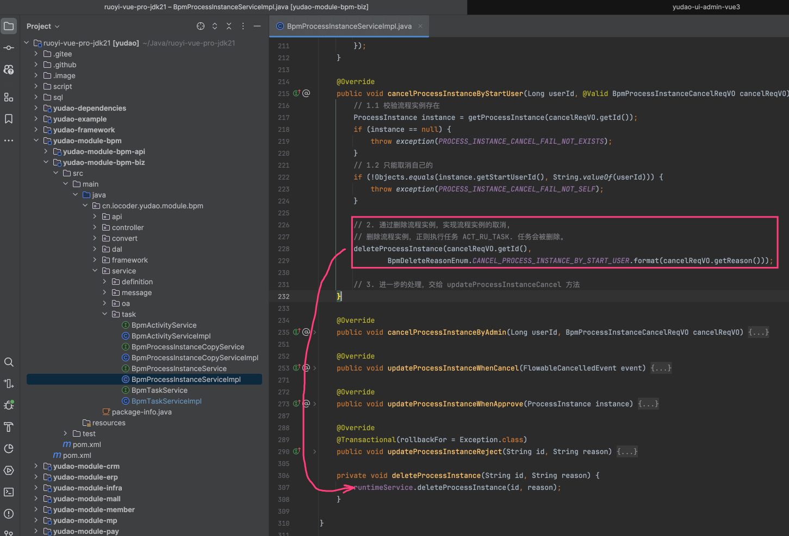

*   最核心的，就是调用 Flowable 的 `RuntimeService#deleteProcessInstance(...)` 方法，取消流程实例。

可能你会有疑问，哪里将流程状态更新为 `CANCEL` 已取消呢？答案在 [BpmProcessInstanceEventListener (opens new window)](https://github.com/YunaiV/yudao-cloud/blob/master/yudao-module-bpm/yudao-module-bpm-biz/src/main/java/cn/iocoder/yudao/module/bpm/framework/flowable/core/listener/BpmProcessInstanceEventListener.java) 监听器，它会监听到流程实例变更为取消，然后调用 BpmProcessInstanceController 的 `#updateProcessInstanceWhenCancel(...)` 方法，进行更新。如下图所示：

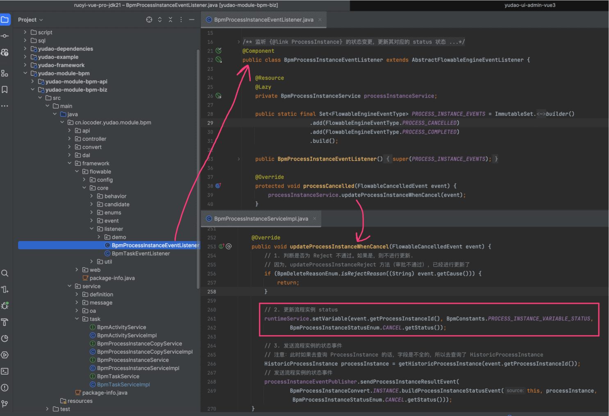

### [#](#_2-2-重新发起流程) 2.2 重新发起流程

流程结束后，可点击它的「重新发起」按钮，进行流程的重新发起，如下图所示：

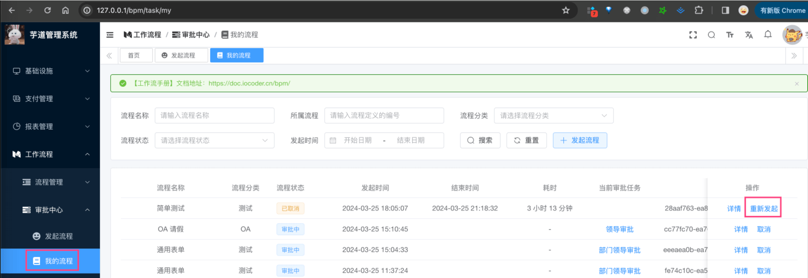

它的效果是，跳转到 \[发起流程\] 页面，然后将之前的流程参数，填充到表单中，如下图所示：

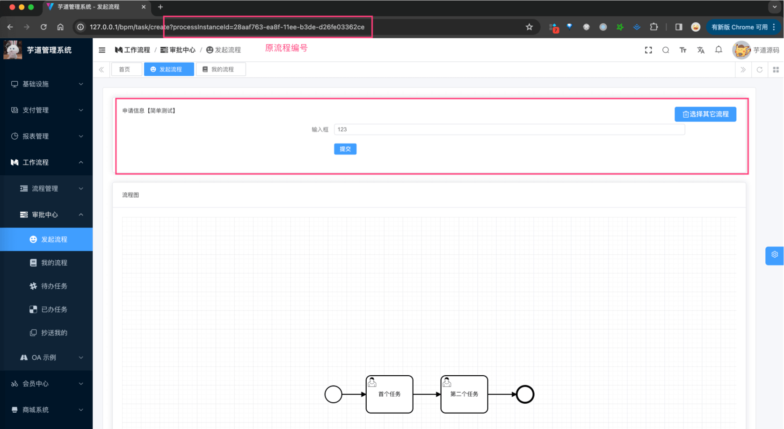

因此，它最终调用的还是「1. 发起流程」小节的发起流程接口，再次（重新）发起一个流程。

## [#](#_3-流程实例) 3. 流程实例

流程实例，展示系统中所有的流程，一般用于管理员查询，对应 \[流程管理 -> 流程实例\] 菜单，如下图所示：

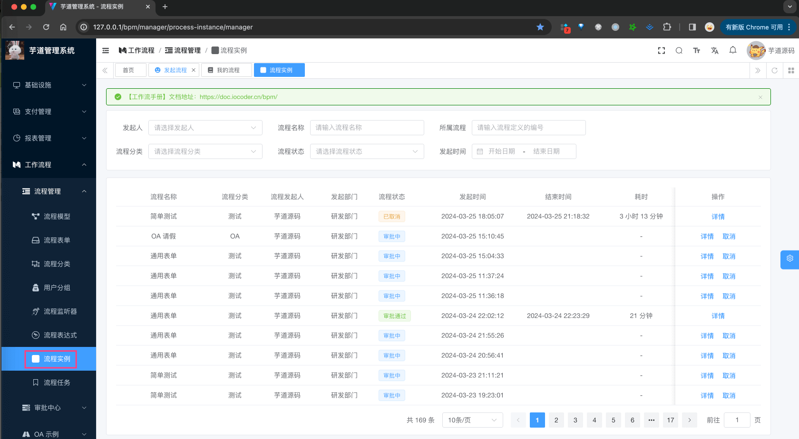

*   后端，对应 BpmProcessInstanceController 的 `#getProcessInstanceManagerPage(...)` 提供接口
*   前端，对应 `/views/bpm/processInstance/manager/index.vue` 实现界面

由于它查询的是所有流程，所以读取的是 `ACT_HI_PROCINST` 表，而不是 `ACT_RU_EXECUTION` 表。