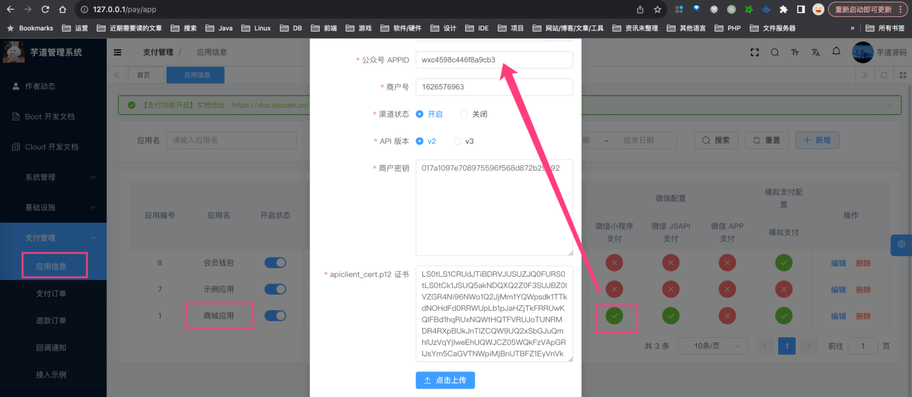
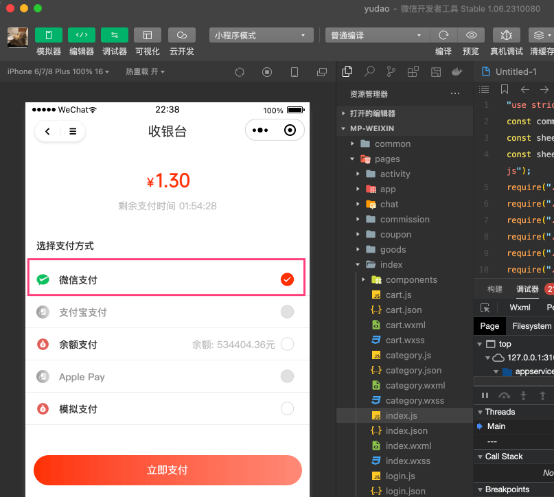
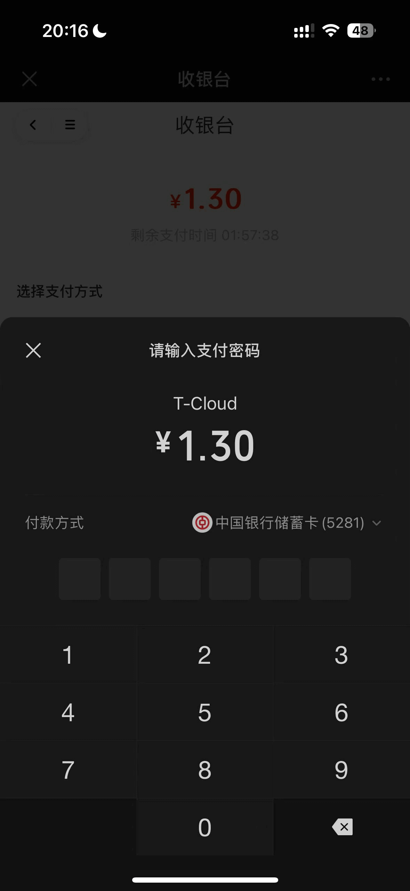

目录

# 微信小程序支付接入

前置阅读：

① 阅读 [《支付功能开启》](/pay/build/) 和 [《支付宝支付接入》](/pay/alipay-pay-demo/) 文档，一定要先跑通支付宝支付流程！！！不跑通支付宝，微信小程序支付更跑不通。

② 阅读 [《微信小程序登录》](/member/weixin-lite-login/) 文档，因为微信小程序支付需要先微信小程序登录，超级麻烦的说！

注意，微信小程序支付不能使用“测试小程序”，必须使用认证过的小程序。

微信小程序支付，使用 WxLitePayClient 客户端进行对接。

下面，我们以 `yudao-mall-uniapp` 商城项目，演示微信小程序支付的接入流程。

友情提示：

*   [http://yunai.natapp1.cc (opens new window)](http://yunai.natapp1.cc) 域名，是我后端项目的访问域名

所以，你的后端项目要使用 [《内网穿透》](/natapp/) 实现独立域名！！！

## [#](#_1-第一步-配置支付渠道) 1. 第一步，配置支付渠道

访问 \[支付管理 -> 应用信息\] 菜单，点击“商城应用”对应的【微信 JSAPI 支付】，进入支付渠道的配置。如下图所示：

*   在 [https://pay.weixin.qq.com/index.php/core/account/info (opens new window)](https://pay.weixin.qq.com/index.php/core/account/info) 地址，可获取微信支付商户号
*   在 [https://pay.weixin.qq.com/index.php/core/cert/api\_cert#/ (opens new window)](https://pay.weixin.qq.com/index.php/core/cert/api_cert#/) 地址，可获取 API 证书、密钥
*   注意！上图的“公众号 APPID”，实际指的是 [“小程序 APPID” (opens new window)](https://zhuanlan.zhihu.com/p/61511399) 哈，不要弄错了！

友情提示：

可以简单阅读下 [《微信官方文档 —— JSAPI 支付的接入前准备》 (opens new window)](https://pay.weixin.qq.com/wiki/doc/apiv3_partner/open/pay/chapter2_1.shtml) 文章。

## [#](#_2-支付功能测试) 2. 支付功能测试

① 使用微信开发者工具，访问小程序。随便找个商品下单，一路往下走，可以进入“收银台”界面（对应前端项目的 `pages/pay/index.vue` 文件）。如下图所示：

② 选择“微信支付”，点击“立即支付”按钮，即可进行微信支付。如下图所示：

*   前端代码的实现，可见 `sheep/platform/pay.js` 文件的 `#wechatMiniProgramPay(...)` 方法
*   后端代码的实现，可见 AppPayOrderController 提供的 `#submitPayOrder(...)` 接口

④ 支付成功后，跳转到“支付结果”界面（对应前端项目的 `pages/pay/result.vue` 文件）。

友情提示：

如果这个过程中碰到问题，可以先使用「微信开发者工具」，看看这个过程中有没什么报错。

自查 30-60 分钟，如果还是无法解决，可以在星球发帖求助！但是注意，一定要先自查，因为这玩意没环境现场，很难搞啊！！！