目录

# 支付宝支付接入

## [#](#_0-概述) 0. 概述

在 `yudao-module-pay-biz` 模块的 [`demo` (opens new window)](https://github.com/YunaiV/yudao-cloud/tree/master/yudao-module-pay/yudao-module-pay-biz/src/main/java/cn/iocoder/yudao/module/pay/controller/admin/demo) 模块，我们提供了一个 **支付** 接入的示例。

它支持如下支付渠道：

*   支付宝 [电脑网站 (opens new window)](https://opendocs.alipay.com/open/270/105898)支付
*   支付宝 [手机网站 (opens new window)](https://opendocs.alipay.com/open/203/105288)支付
*   支付宝 [当面付 (opens new window)](https://opendocs.alipay.com/open/194/105072)（条码支付）
*   支付宝 [扫码 (opens new window)](https://opendocs.alipay.com/apis/02890k)支付
*   微信 [付款码 (opens new window)](https://pay.weixin.qq.com/static/product/product_intro.shtml?name=qrcode)支付
*   微信 [Native (opens new window)](https://pay.weixin.qq.com/static/product/product_intro.shtml?name=qrcode)支付

疑问：为什么不支持微信小程序、公众号支付？

因为这 2 种微信支付方式，只能在微信环境中进行，而我们的接入示例使用 PC 浏览器，所以无法进行。

你可以阅读 [微信小程序支付接入](/pay/wx-lite-pay-demo/) 和 [微信公众号支付接入](/pay/wx-pub-pay-demo/) 文档，进行相关的支付接入。

下面，我们以 `demo` 模块为例子，讲解如何接入支付宝的 [电脑网站 (opens new window)](https://opendocs.alipay.com/open/270/105898) 支付。

## [#](#_1-第一步-配置支付渠道) 1. 第一步，配置支付渠道

① 在 \[支付管理 -> 应用信息\] 菜单，新建 `demo` 模块使用的支付应用。如下图所示：

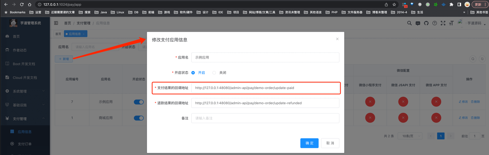

*   支付结果的回调地址：对应「2.4 第四步，实现回调接口」实现的接口。这里因为我们在本地演示，所以使用了 `127.0.0.1` IP 地址，如果你部署到服务器上，要设置服务器可调用到的 IP 地址。

因为 `demo` 模块的支付应用默认已经创建，所以你可以直接使用。注意，这里的应用编号 **“7”** 稍后会使用到。

疑问：为什么应用上有回调地址，然后 \`application.yaml\` 配置文件中也有 \`yudao.pay.order-notify-url\` 回调地址呢？

请详细阅读 [《支付手册 —— 功能开启》](/pay/build) 的「3.5 支付回调【重要】」小节。

简单来说：

*   配置文件的回调地址，是外部的支付渠道（支付宝、微信）回调 `pay` 支付模块（支付中心）的地址。
*   应用的回调地址，是 `pay` 回调内部的各个 `biz` 模块（支付应用）的地址。例如收：`trade` 商城的订单、`wallet` 钱包的充值。

因为内部会有多个业务模块，所以它们每个都有自己的回调地址，就是配置到对应的支付应用上！

② 点击“示例用户”对应的【支付宝 PC 网站支付】，进入支付渠道的配置。如下图所示：

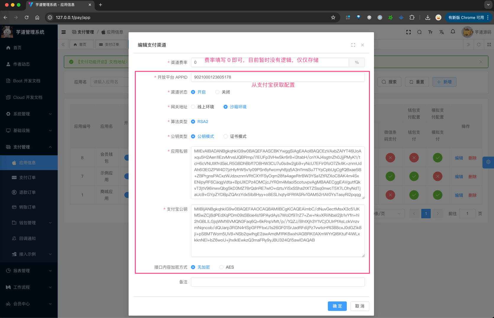

如果你还没有支付宝开放平台的账号，可以先参考 [《沙箱环境》 (opens new window)](https://opendocs.alipay.com/common/02kkv7) 文档，申请一个测试账号，我目前就是这么测试的。只需要阅读该文档的如下小节即可：


友情提示：

如果你还没有支付宝开放平台的账号，可以先参考 [《沙箱环境》 (opens new window)](https://opendocs.alipay.com/common/02kkv7) 文档，申请一个测试账号，我目前就是这么测试的。只需要阅读该文档的如下小节即可：

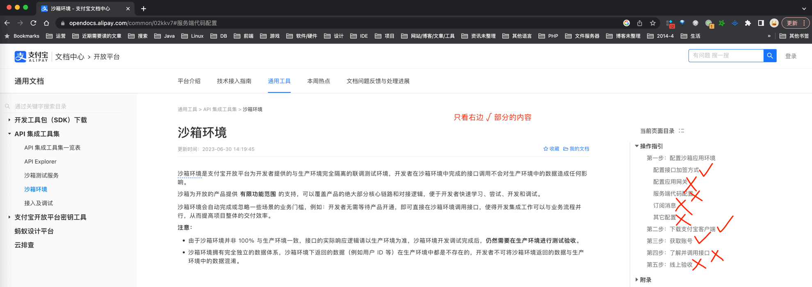

最终在 [沙箱应用 (opens new window)](https://open.alipay.com/develop/sandbox/app) 可以看到支付渠道的配置。

## [#](#_2-第二步-实现支付调用【重要】) 2. 第二步，实现支付调用【重要】

友情提示：由于 demo 模块的支付接入已经实现，这里你只要看懂什么意思即可，不用操作。

① 【后端】在 `demo` 模块所在的 `yudao-module-xx-biz` 模块的 `pom.xml` 文件，引入 `yudao-module-pay-api` 依赖，这样才可以调用到 PayOrderApi 接口。代码如下：

```xml
    <dependency>
        <groupId>cn.iocoder.cloud</groupId>
        <artifactId>yudao-module-pay-api</artifactId>
        <version>${revision}</version>
    </dependency>

```

② 【后端】在 `demo` 模块的下单逻辑中，需要调用 PayOrderApi 的 [`#createOrder(...)` (opens new window)](https://github.com/YunaiV/yudao-cloud/blob/master/yudao-module-pay/yudao-module-pay-biz/src/main/java/cn/iocoder/yudao/module/pay/service/demo/PayDemoOrderServiceImpl.java#L91-L96) 方法，创建支付单。如下图所示：

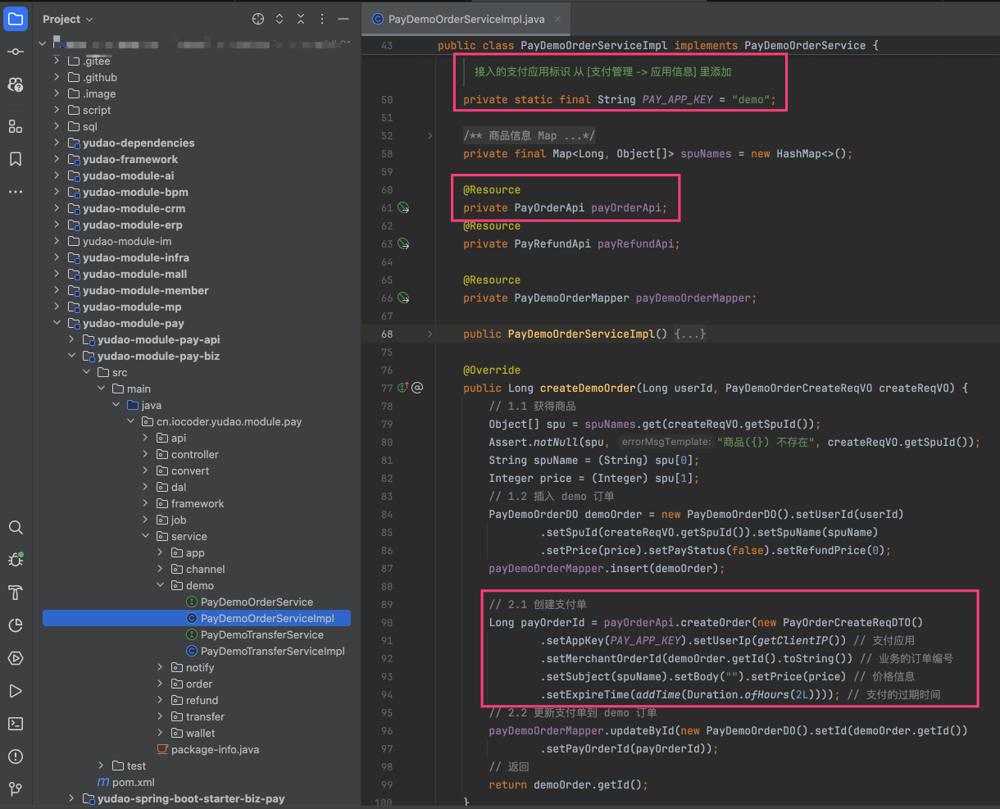

疑问：为什么 demo 模块在下单逻辑中，需要调用 PayOrderApi 接口来创建支付单？

因为跳转**公用的**【收银台】，需要通过读取支付订单，展示支付信息。这样，才能和 demo 模块进行解耦。收银台如下图所示：

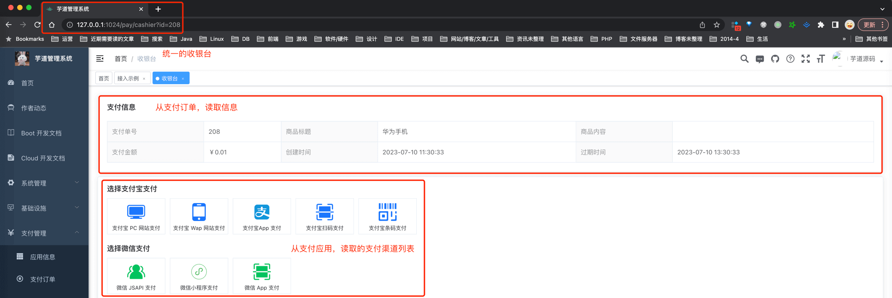

③ 【前端】在 `demo` 模块下完单之后，前端需要跳转到【收银台】。前端接入代码在 [`/views/pay/demo/index.vue` (opens new window)](https://github.com/yudaocode/yudao-ui-admin-vue2/blob/master/src/views/pay/demo/index.vue#L193-L201)，如下图所示：

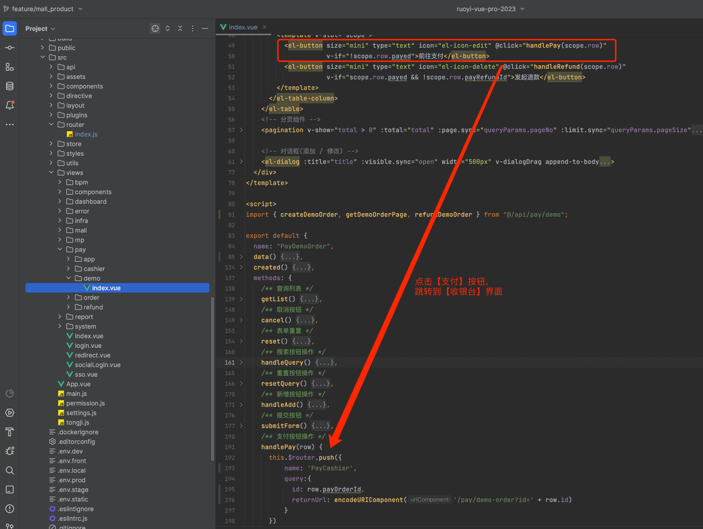

```js
this.$router.push({
  name: 'PayCashier',
  query:{
    id: row.payOrderId, // 支付单号
    returnUrl: encodeURIComponent('/pay/demo-order?id=' + row.id) // 支付成功后，跳转的 URL
  }
})

```

另外，收银台的前端代码，在 [`/views/pay/cashier/index.vue` (opens new window)](https://github.com/yudaocode/yudao-ui-admin-vue2/blob/master/src/views/pay/cashier/index.vue) 里，已经实现，感兴趣可以看看。

## [#](#_3-第三步-实现回调接口【重要】) 3. 第三步，实现回调接口【重要】

友情提示：由于 demo 模块的支付接入已经实现，这里你只要看懂什么意思即可，不用操作。

在 `demo` 模块所在的 `yudao-module-xx-biz` 模块，实现一个支付回调的接口，提供给支付【中心】回调。对应的代码在 PayDemoOrderController 的 [`#updateDemoOrderPaid(...)` (opens new window)](https://github.com/YunaiV/yudao-cloud/blob/master/yudao-module-pay/yudao-module-pay-biz/src/main/java/cn/iocoder/yudao/module/pay/controller/admin/demo/PayDemoOrderController.java#L50-L58) 方法中，如下图所示：

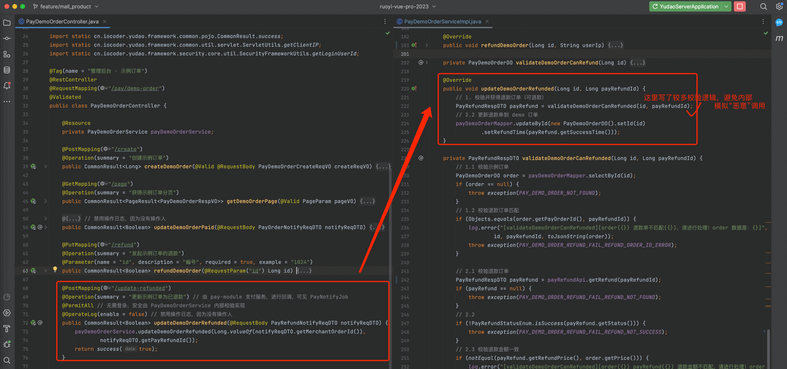

## [#](#_4-第四步-支付功能测试) 4. 第四步，支付功能测试

至此，我们已经完成了支付接入的所有步骤，接下来，我们来测试一下支付功能。

① 打开 \[支付管理 -> 接入示例 -> 支付&退款案例\] 菜单，进入示例订单列表。点击【发起订单】按钮，选择一个商品，进行下单。如下图所示：

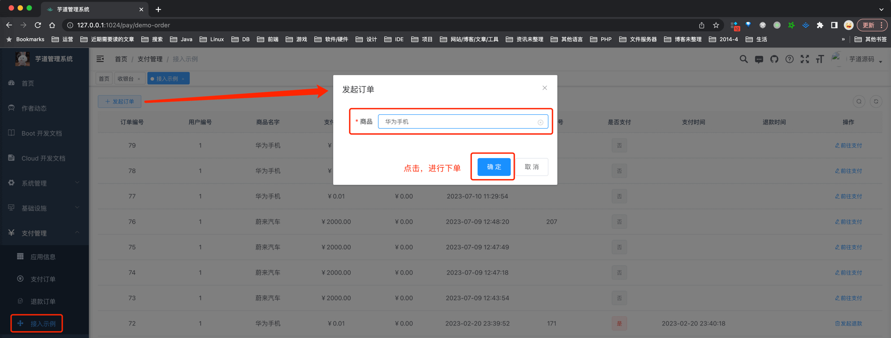

此时，在 `pay_order` 表中，会新增一条支付订单记录。

② 下单完成后，点击该订单对应的【支付】按钮，跳转到【收银台】。如下图所示：

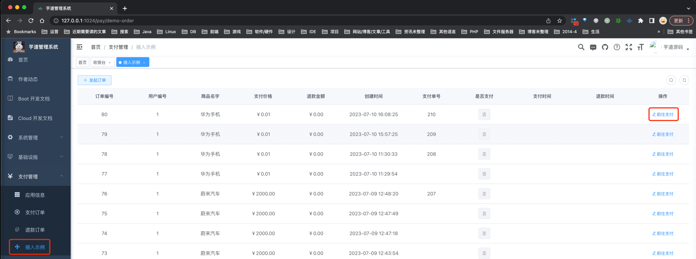

③ 选择【支付宝 PC 网站支付】支付渠道，跳转支付宝支付。如下图所示：

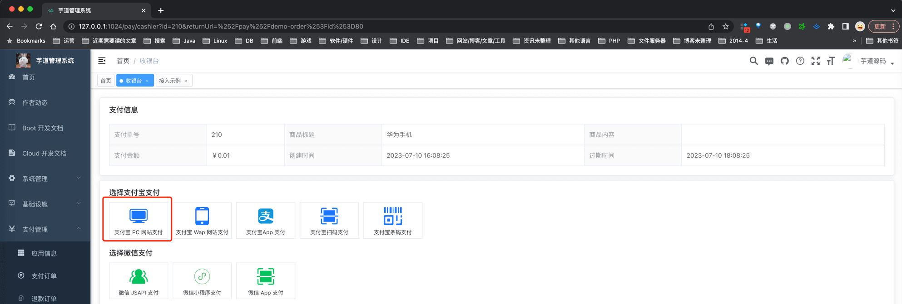

友情提示：

选择完支付【渠道】，会调用后端 PayOrderController 的 [`#submit(...)` (opens new window)](https://github.com/YunaiV/yudao-cloud/blob/master/yudao-module-pay/yudao-module-pay-biz/src/main/java/cn/iocoder/yudao/module/pay/controller/admin/order/PayOrderController.java#L70-L75) 方法，内部调用对应支付【渠道】的 PayClient 实现类，发起支付。

④ 此时，我们会看到一个支付宝的二维码，使用 [**“沙箱环境”** 的支付宝客户端 (opens new window)](https://opendocs.alipay.com/common/02kkv7#%E7%AC%AC%E4%BA%8C%E6%AD%A5%EF%BC%9A%E4%B8%8B%E8%BD%BD%E6%94%AF%E4%BB%98%E5%AE%9D%E5%AE%A2%E6%88%B7%E7%AB%AF)，扫码完成支付。如下图所示：

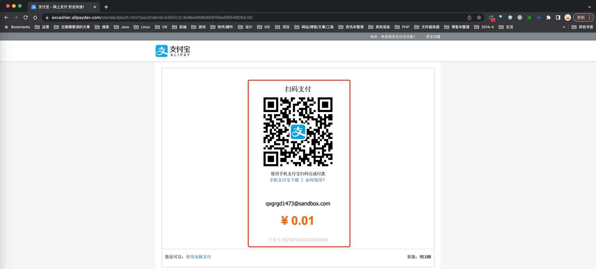

⑤ 支付完成后，先是支付【中心】的回调接口被回调，然后是 `demo` 模块的回调接口被回调。如下图所示：

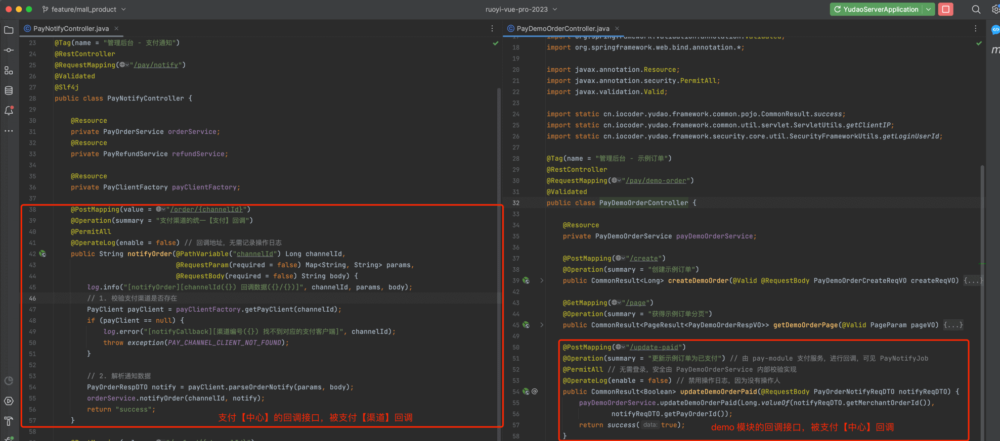

至此，我们已经完成支付接入的测试流程，可以试着多多 debug 调试整个流程，并不复杂噢。