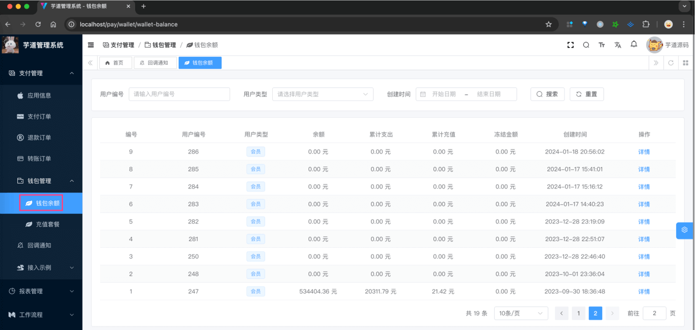
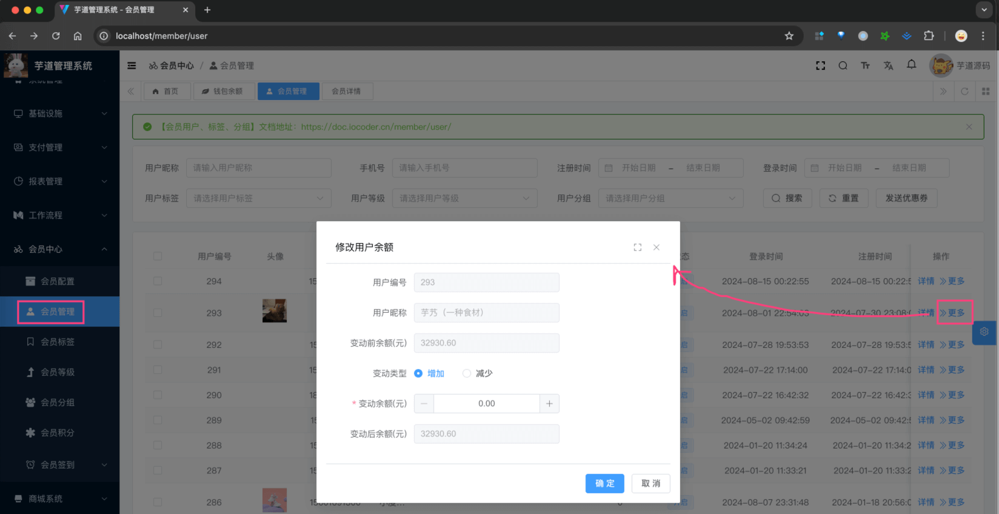
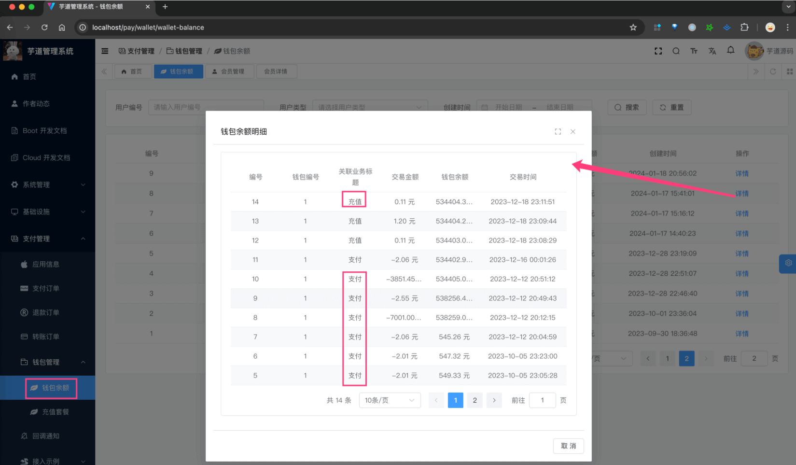
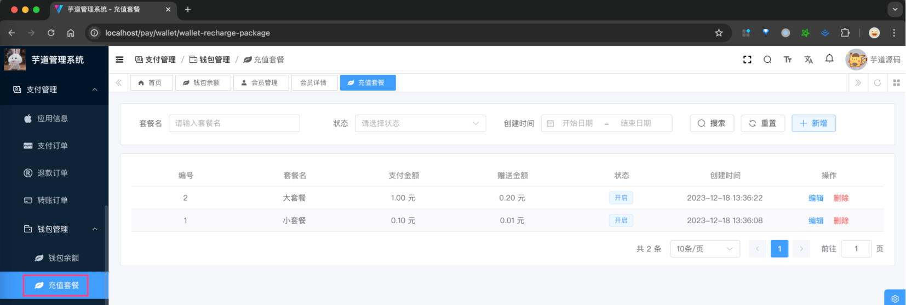
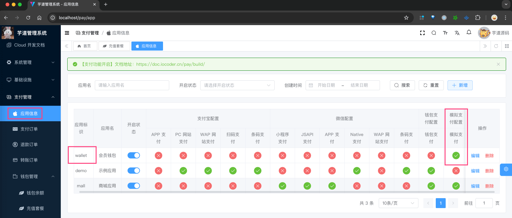
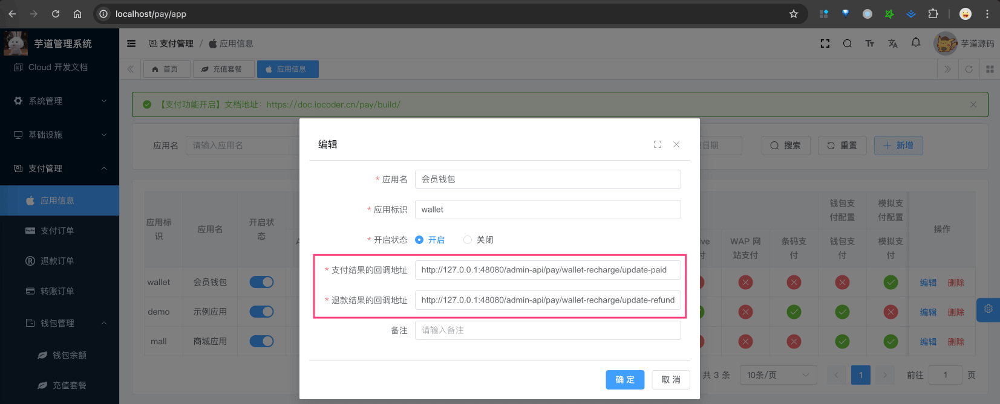
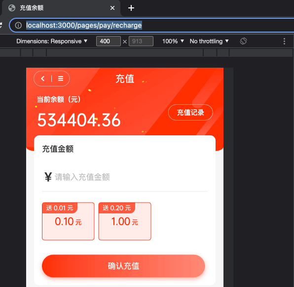
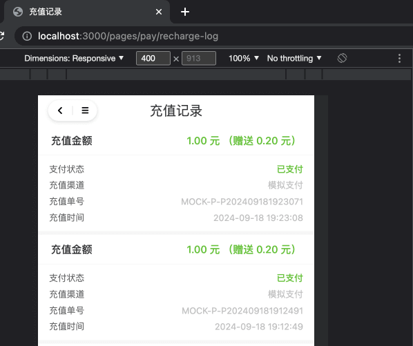
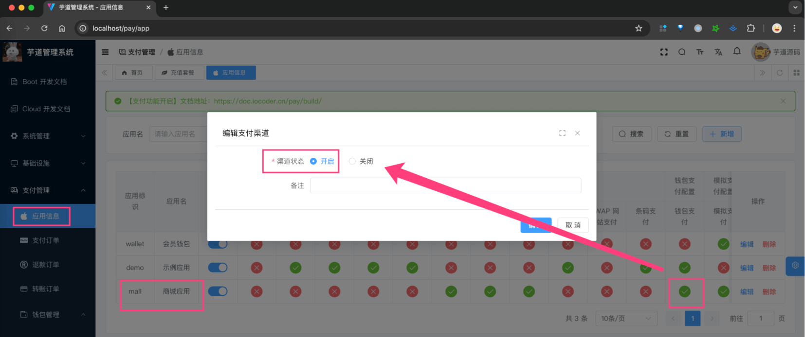
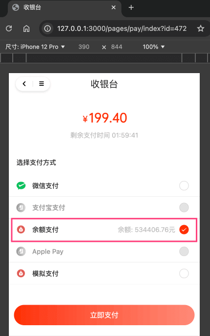

目录

# 钱包充值、支付、退款

前置阅读：

需要先阅读如下文档，对支付、退款功能有一定了解：

*   [《支付功能开启》](/pay/build/)
*   [《支付宝支付接入》](/pay/alipay-pay-demo/)
*   [《支付宝、微信退款接入》](/pay/refund-demo)

在 `yudao-module-pay-biz` 模块的 [`wallet` (opens new window)](https://github.com/YunaiV/yudao-cloud/tree/master/yudao-module-pay/yudao-module-pay-biz/src/main/java/cn/iocoder/yudao/module/pay/service/wallet) 模块，实现了钱包，包括了如下功能：

*   充值：可见 PayWalletRechargeService 类
*   支付：可见 WalletPayClient 类的 `#doUnifiedOrder(...)` 方法
*   退款：可见 WalletRefundClient 类的 `#doUnifiedRefund(...)` 方法
*   流水：可见 PayWalletTransactionService 类

疑问：为什么没有钱包的提现功能呢？

功能正在建设中，未来会支持提现到支付宝、微信、银行卡等渠道。

下面，我们逐个功能进行介绍。

## [#](#_1-钱包信息) 1. 钱包信息

本小节，我们先来看看钱包的信息部分，包括钱包表、钱包流水表。

### [#](#_1-1-钱包表) 1.1 钱包表

`pay_wallet` 表，会员钱包表，由 PayWalletService 实现。表结构如下：

```sql
CREATE TABLE `pay_wallet` (
  `id` bigint NOT NULL AUTO_INCREMENT COMMENT '编号',
  
  `user_id` bigint NOT NULL COMMENT '用户编号',
  `user_type` tinyint NOT NULL DEFAULT '0' COMMENT '用户类型',
  
  `balance` int NOT NULL DEFAULT '0' COMMENT '余额，单位分',
  
  `total_expense` int NOT NULL DEFAULT '0' COMMENT '累计支出，单位分',
  `total_recharge` int NOT NULL DEFAULT '0' COMMENT '累计充值，单位分',
  `freeze_price` int NOT NULL DEFAULT '0' COMMENT '冻结金额，单位分',
  
) ENGINE=InnoDB AUTO_INCREMENT=20 DEFAULT CHARSET=utf8mb4 COLLATE=utf8mb4_unicode_ci COMMENT='会员钱包表';

```

> 省略 creator/create\_time/updater/update\_time/deleted/tenant\_id 等通用字段

① `user_id`、`user_type` 字段：关联的用户编号、用户类型，例如说“商城”的会员用户。

② `balance` 字段：余额，单位分。支付时，会从这里扣除。

*   `total_expense` 字段，累计支出，单位分。每次支付时，会增加该字段。
*   `total_recharge` 字段：累计充值，单位分。每次充值时，会增加该字段。

③ `freeze_price` 字段：冻结金额，单位分。目前用于钱包充值时的退款，可暂时不用了解。

#### [#](#_1-1-1-钱包创建) 1.1.1 钱包创建

一般情况下，用户创建后，自动进行关联的钱包创建。但是考虑到 `pay` 模块是可选模块，需要进行结构。

所以，目前是通过 PayWalletService 的 `#getOrCreateWallet(userId, userType)` 方法来进行“创建”：不存在则进行创建，存在则直接查询返回。

#### [#](#_1-1-2-管理后台) 1.1.2 管理后台

在 \[支付管理 -> 钱包管理 -> 钱包余额\] 菜单，对应 `yudao-ui-admin-vue3/src/views/pay/wallet/balance/index.vue` 界面，可以查看钱包列表。如下图所示：



#### [#](#_1-1-3-修改余额) 1.1.3 修改余额

在 \[会员中心 -> 会员管理\] 菜单，点击 \[>> 更多 -> 修改余额\]，对应 `yudao-ui-admin-vue3/src/views/member/user/components/UserBalanceUpdateForm.vue` 界面，可以修改钱包余额。如下图所示：



### [#](#_1-2-钱包流水表) 1.2 钱包流水表

`pay_wallet` 表，会员钱包表，由 PayWalletService 实现。表结构如下：

```sql
CREATE TABLE `pay_wallet_transaction` (
  `id` bigint NOT NULL AUTO_INCREMENT COMMENT '编号',

  `wallet_id` bigint NOT NULL COMMENT '会员钱包 id',
  
  `biz_type` tinyint NOT NULL COMMENT '关联类型',
  `biz_id` varchar(64) CHARACTER SET utf8mb4 COLLATE utf8mb4_unicode_ci NOT NULL COMMENT '关联业务编号',
  `title` varchar(128) CHARACTER SET utf8mb4 COLLATE utf8mb4_unicode_ci NOT NULL COMMENT '流水标题',
  
  `no` varchar(64) CHARACTER SET utf8mb4 COLLATE utf8mb4_unicode_ci NOT NULL COMMENT '流水号',
    
  `price` int NOT NULL COMMENT '交易金额, 单位分',
  `balance` int NOT NULL COMMENT '余额, 单位分',

) ENGINE=InnoDB AUTO_INCREMENT=29 DEFAULT CHARSET=utf8mb4 COLLATE=utf8mb4_unicode_ci COMMENT='会员钱包流水表';

```

> 省略 creator/create\_time/updater/update\_time/deleted/tenant\_id 等通用字段

① `wallet_id` 字段：关联的钱包编号，即 `pay_wallet` 表的 `id` 字段。

② `biz_type`、`biz_id` 字段：关联的业务类型、业务编号。目前 `biz_type` 由 PayWalletBizTypeEnum 枚举，目前有充值、充值退款、支付、支付退款、更新余额等。

`title` 字段：流水标题，例如说：充值、支付、退款等。主要用于展示，没有什么特殊逻辑。

③ `no` 字段：流水号，全局唯一，例如说：W202408011306351。它通过 PayNoRedisDAO 生成，前缀是 `W`。

④ `price` 字段：本次交易的金额，单位分：

*   正数表示收入：例如说充值、支付退款
*   负数表示支出：例如说支付、充值退款

`balance` 字段：交易后的钱包余额，单位分。

#### [#](#_1-2-1-管理后台) 1.2.1 管理后台

在 \[支付管理 -> 钱包管理 -> 钱包余额\] 菜单，点击钱包后的 \[详情\] 按钮，对应 `yudao-ui-admin-vue3/src/views/pay/wallet/transaction/WalletTransactionList.vue` 界面，可以查看钱包流水。如下图所示：



## [#](#_2-钱包充值) 2. 钱包充值

本小节，我们先来看看钱包的充值部分，包括钱包充值表、钱包充值套餐表。

一般情况下，钱包的余额是通过充值来进行的，稍后会进行演示。

### [#](#_2-1-钱包套餐表) 2.1 钱包套餐表

`pay_wallet_recharge_package` 表，充值套餐表，由 PayWalletRechargePackageService 实现。表结构如下：

```sql
CREATE TABLE `pay_wallet_recharge_package` (
  `id` bigint NOT NULL AUTO_INCREMENT COMMENT '编号',
  `name` varchar(64) COLLATE utf8mb4_unicode_ci NOT NULL COMMENT '套餐名',
  `status` tinyint NOT NULL COMMENT '状态',

  `pay_price` int NOT NULL COMMENT '支付金额',
  `bonus_price` int NOT NULL COMMENT '赠送金额',
  
) ENGINE=InnoDB AUTO_INCREMENT=3 DEFAULT CHARSET=utf8mb4 COLLATE=utf8mb4_unicode_ci COMMENT='充值套餐表';

```

> 省略 creator/create\_time/updater/update\_time/deleted/tenant\_id 等通用字段

比较关键的就 `pay_price`、`bonus_price` 字段：

① `pay_price` 字段：支付金额，单位分。购买该套餐需要支付的金额。

② `bonus_price` 字段：赠送金额，单位分。购买该套餐，额外赠送的金额。

最终充值到钱包的余额，是 `pay_price` + `bonus_price`。

#### [#](#_2-1-1-管理后台) 2.1.1 管理后台

在 \[支付管理 -> 钱包管理 -> 充值套餐\] 菜单，对应 `yudao-ui-admin-vue3/src/views/pay/wallet/rechargePackage/index.vue` 界面，可以查看钱包充值套餐。如下图所示：



### [#](#_2-2-钱包充值表) 2.2 钱包充值表

`pay_wallet_recharge` 表，会员钱包充值表，由 PayWalletRechargeService 实现。表结构如下：

```sql
CREATE TABLE `pay_wallet_recharge` (
  `id` bigint NOT NULL AUTO_INCREMENT COMMENT '编号',

  `wallet_id` bigint NOT NULL COMMENT '会员钱包 id',
  
  `total_price` int NOT NULL COMMENT '用户实际到账余额，例如充 100 送 20，则该值是 120',
  `pay_price` int NOT NULL COMMENT '实际支付金额',
  `bonus_price` int NOT NULL COMMENT '钱包赠送金额',
  
  `package_id` bigint DEFAULT NULL COMMENT '充值套餐编号',
  
  `pay_status` bit(1) NOT NULL DEFAULT b'0' COMMENT '是否已支付：[0:未支付 1:已经支付过]',
  `pay_order_id` bigint DEFAULT NULL COMMENT '支付订单编号',
  `pay_channel_code` varchar(16) CHARACTER SET utf8mb4 COLLATE utf8mb4_unicode_ci DEFAULT NULL COMMENT '支付成功的支付渠道',
  `pay_time` datetime DEFAULT NULL COMMENT '订单支付时间',
  
  `pay_refund_id` bigint DEFAULT NULL COMMENT '支付退款单编号',
  `refund_total_price` int NOT NULL DEFAULT '0' COMMENT '退款金额，包含赠送金额',
  `refund_pay_price` int NOT NULL DEFAULT '0' COMMENT '退款支付金额',
  `refund_bonus_price` int NOT NULL DEFAULT '0' COMMENT '退款钱包赠送金额',
  `refund_time` datetime DEFAULT NULL COMMENT '退款时间',
  `refund_status` int NOT NULL DEFAULT '0' COMMENT '退款状态',

  PRIMARY KEY (`id`) USING BTREE
) ENGINE=InnoDB AUTO_INCREMENT=31 DEFAULT CHARSET=utf8mb4 COLLATE=utf8mb4_unicode_ci ROW_FORMAT=DYNAMIC COMMENT='会员钱包充值';

```

> 省略 creator/create\_time/updater/update\_time/deleted/tenant\_id 等通用字段

本质上，钱包的充值，和商城的订单是类似的，只是没有商品信息而已。因此它也有 `pay_` 开头的支付相关的字段，和 `refund_` 开头的退款相关的字段。

① `wallet_id` 字段：关联的钱包编号，即 `pay_wallet` 表的 `id` 字段。

② `total_price` 字段：用户实际到账余额，例如充 100 送 20，则该值是 120。

*   `pay_price` 字段：实际支付金额。
*   `bonus_price` 字段：钱包赠送金额。一般情况下，只有选择了 `package_id` 的套餐，才会有赠送金额。当然，也可以不选择套餐，直接充值。

③ `pay_` 开头的支付相关字段：钱包充值，可选择支付宝、微信等支付渠道，进行支付。

*   `pay_status` 字段：是否已支付。
*   `pay_order_id` 字段：支付订单编号，关联 `pay_order` 表的 `id` 字段。
*   `pay_channel_code` 字段：支付成功的支付渠道，例如说支付宝、微信。
*   `pay_time` 字段：订单支付时间。

④ `refund_` 开头的退款相关字段：钱包充值，可选择退款。

*   `refund_status` 字段：退款状态，通过 PayRefundStatusEnum 枚举，目前有未退款、退款成功、退款失败。
*   `pay_refund_id` 字段：支付退款单编号，关联 `pay_refund` 表的 `id` 字段。
*   `refund_total_price`、`refund_pay_price`、`refund_bonus_price` 字段：退款金额，包含赠送金额、退款支付金额、退款钱包赠送金额。
*   `refund_time` 字段：退款时间。

### [#](#_2-3-充值流程) 2.3 充值流程

下面，我们来演示下钱包的充值流程。目前，只有 [商城](/mall/build) 的 uni-app 端，可以进行充值。步骤如下：

① 在管理后台的 \[支付管理 -> 应用信息\] 菜单，将钱包对应的支付应用 `wallet` 进行开启（开启状态为打开）。如下图所示：



一般情况下，需要将钱包的支付宝、微信等支付渠道也进行配置。这里，我们为了演示方便，直接使用上图的“模拟支付”。

另外，钱包也有对应的的支付、退款回调地址，如下图所示：



*   支付回调地址：由 PayWalletRechargeController 的 [`#updateWalletRechargerPaid(...)` (opens new window)](https://github.com/YunaiV/yudao-cloud/blob/master/yudao-module-pay/yudao-module-pay-biz/src/main/java/cn/iocoder/yudao/module/pay/controller/admin/wallet/PayWalletRechargeController.java#L31-L38) 方法实现
*   退款回调地址：由 PayWalletRefundController 的 [`#updateWalletRechargeRefunded(...)` (opens new window)](https://github.com/YunaiV/yudao-cloud/blob/master/yudao-module-pay/yudao-module-pay-biz/src/main/java/cn/iocoder/yudao/module/pay/controller/admin/wallet/PayWalletRechargeController.java#L49-L56) 方法实现

友情提示：上述两个回调地址的逻辑，可以等后续再看，不影响充值流程的理解。

② 在商城 uni-app 端，访问 [http://127.0.0.1:3000/pages/pay/recharge (opens new window)](http://127.0.0.1:3000/pages/pay/recharge) 地址，进入 \[充值\] 界面，对应 <yudao-mall-uniapp/pages/pay/recharge.vue> 界面。如下图所示：



随便选择一个充值套餐，或者你想充值的金额，然后点击 \[确认充值\] 按钮，进入支付界面。

选择“模拟支付”，完成支付后，可点击“查看订单”按钮，跳转到 \[充值记录\] 界面，对应 <yudao-mall-uniapp/pages/pay/recharge-log.vue> 界面。如下图所示：



## [#](#_3-钱包支付与退款) 3. 钱包支付与退款

从本质上来说，钱包支付和支付宝、微信支付一样，可以认为是一个支付渠道。因此，我们定义了 [WalletPayClient (opens new window)](https://github.com/YunaiV/yudao-cloud/blob/master/yudao-module-pay/yudao-module-pay-biz/src/main/java/cn/iocoder/yudao/module/pay/framework/pay/core/WalletPayClient.java) 客户端，实现了钱包的支付与退款。

这样，在每个业务想要使用钱包支付时，就可以在它的支付应用上，开启钱包支付即可。例如说，我们只需要把“商城”的支付应用开启，就可以使用钱包支付了。如下图所示：



### [#](#_3-1-钱包支付) 3.1 钱包支付

在商城 uni-app 收银台，选择“余额支付”时，内部会调用 WalletPayClient 的 `#doUnifiedOrder(...)` 方法，发起支付。



它的整体流程和 [《支付宝支付接入》](/pay/alipay-pay-demo) 是一致的。

### [#](#_3-2-钱包退款) 3.2 钱包退款

钱包支付后，如果发起退款，则会退回到钱包中，内部会调用 WalletRefundClient 的 `#doUnifiedRefund(...)` 方法，发起退款。

它的整体流程和 [《支付宝、微信退款接入》](/pay/refund-demo) 是一致的。