目录

# 短信配置

本章节，介绍项目的短信功能。该功能提供统一的短信 API 给其它模块，使它们可以快速接入短信功能，无需关心不同短信平台的具体对接。

短信采用异步发送，基于 [消息队列](/message-queue/event)，如下图所示：

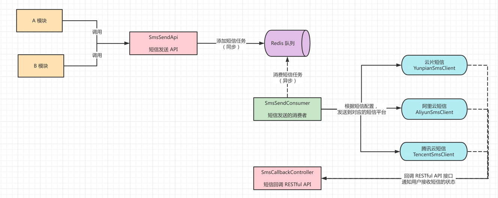

友情提示：图中的【Redis 消息队列】，应该是【RocketMQ 消息队列】哈~

该功能由 `yudao-module-system` 模块实现，其中：

*   [`service/sms` (opens new window)](https://github.com/YunaiV/yudao-cloud/blob/master/yudao-module-system/yudao-module-system-biz/src/main/java/cn/iocoder/yudao/module/system/service/sms/) 短信【业务】，提供短信渠道、模板的配置，短信日志的查看，短信的发送等功能
*   [`frameowrk/sms` (opens new window)](https://github.com/YunaiV/yudao-cloud/tree/master/yudao-module-system/yudao-module-system-biz/src/main/java/cn/iocoder/yudao/module/system/framework/sms)：短信【组件】，封装阿里云、腾讯云、华为云、七牛云等短信平台的客户端。

## [#](#_1-表结构) 1. 表结构

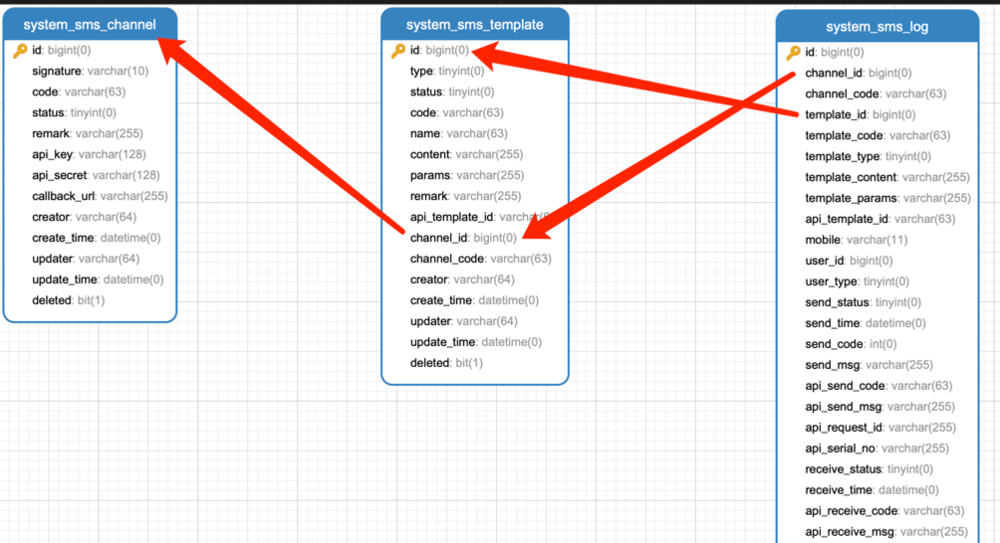

## [#](#_2-短信配置) 2. 短信配置

本小节，讲解如何配置短信功能，整个过程如下：

*   新建一个短信【渠道】，配置对应短信平台的账号
*   新建一个短信【模版】，配置对应短信平台的模板
*   测试该短信模板，查看对应的短信【日志】，确认是否发送成功

### [#](#_2-1-新建短信渠道) 2.1 新建短信渠道

① 点击 \[系统管理 -> 消息中心 -> 短信管理 -> 短信渠道\] 菜单，查看短信渠道的列表。如下图所示：

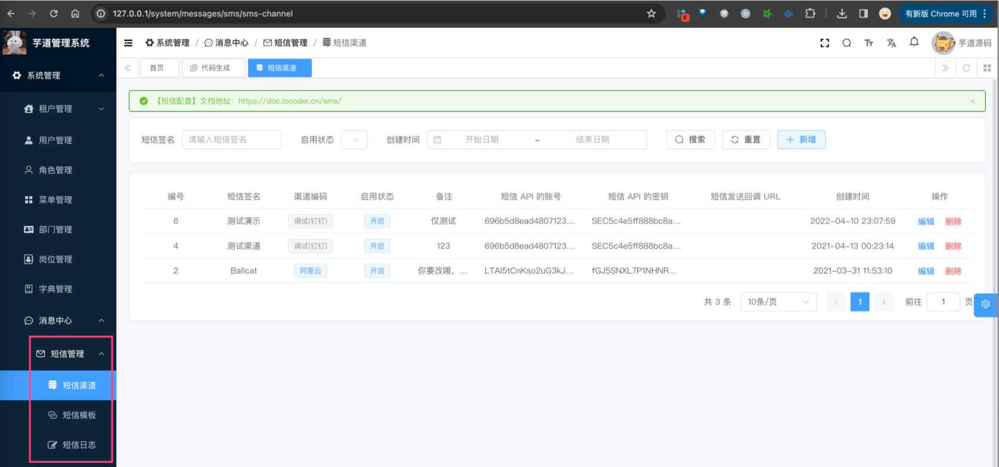

② 点击 \[新增\] 按钮，选择渠道编码为【调试（钉钉）】，并填写信息如下图：

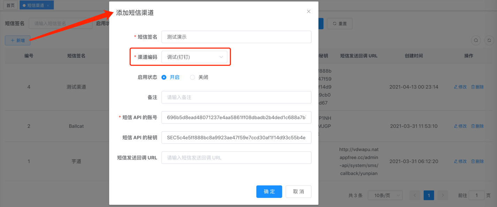

```yaml
短信 API 的账号: 696b5d8ead48071237e4aa5861ff08dbadb2b4ded1c688a7b7c9afc615579859
短信 API 的密钥: SEC5c4e5ff888bc8a9923ae47f59e7ccd30af1f14d93c55b4e2c9cb094e35aeed67

```

疑问 1：为什么选择渠道编码为【调试（钉钉）】？

该类型使用钉钉机器人来模拟短信发送，用于日常调试。

*   短信 API 的账号，对应机器人的 Webhook 的 `access_token` 参数
*   短信 API 的密钥，对应机器人的安全设置的加签

上图使用的配置，是艿艿自己的钉钉机器人。正式使用时，必须参考 [《钉钉开放平台 —— 自定义机器人接入 》 (opens new window)](https://open.dingtalk.com/document/group/custom-robot-access) 文档，申请自己的专属机器人。

疑问 2：可以选择其它渠道编码吗？

当然可以，这里主要考虑部分同学暂时没有申请短信平台，所以使用【调试（钉钉）】渠道编码。

不同短信平台的配置，可见 [「6. 短信平台附录」](#_6-%E7%9F%AD%E4%BF%A1%E5%B9%B3%E5%8F%B0%E9%99%84%E5%BD%95) 小节。

### [#](#_2-2-新建短信模板) 2.2 新建短信模板

① 点击 \[系统管理 -> 消息中心 -> 短信管理 -> 短信模板\] 菜单，查看短信模板的列表。如下图所示：

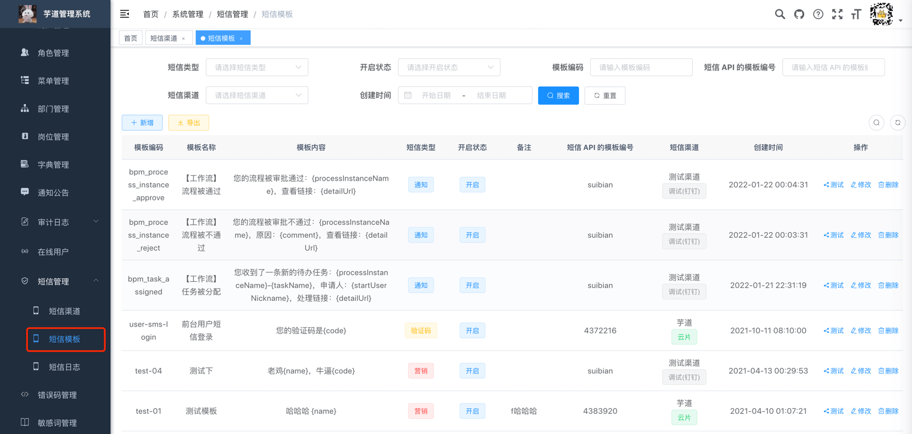

② 点击 \[新增\] 按钮，选择刚创建的短信渠道，并填写信息如下图：

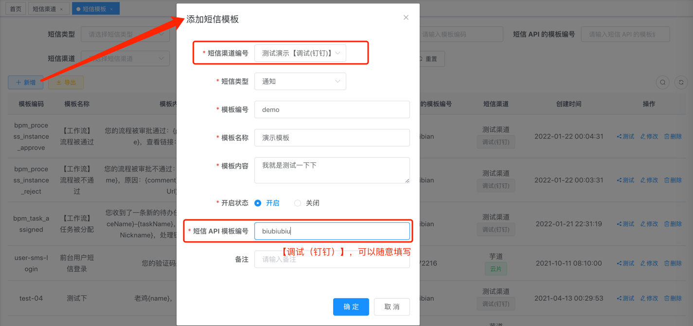

*   短信渠道编号：发送该短信模板时，使用的短信渠道，即使用哪个短信平台进行发送
*   模板编号：短信模板的唯一标识，使用短信 API 时，通过它标识使用的短信模板
*   模板内容：短信模板的内容，使用 `{var}` 作为占位符，例如说 `{name}`、`{code}` 等
*   短信 API 模板编号：短信平台的短信模板的编号，需要保证该模板在短信平台已经审核通过
*   开启状态：短信模板被禁用时，该短信模板将不发送短信，只记录短信日志

疑问：为什么设计短信模板的功能？

在一些场景下，需要修改短信模板所使用的短信平台。例如说：短信平台出现故障，或者切换短信平台等等。

此时，只需要修改短信模板的两个属性：短信渠道编号、短信 API 模板编号，无需重启应用。

### [#](#_2-3-查看短信日志) 2.3 查看短信日志

① 使用钉钉，扫码 [图片](/img/%E7%9F%AD%E4%BF%A1%E9%85%8D%E7%BD%AE/07.jpg) 加入机器人所在的【ruoyi-vue-pro 短信测试群】，查看测试短信的模拟发送。

② 点击 \[测试\] 按钮，输入任一手机号，进行该短信模板的模拟发送。如下图所示：

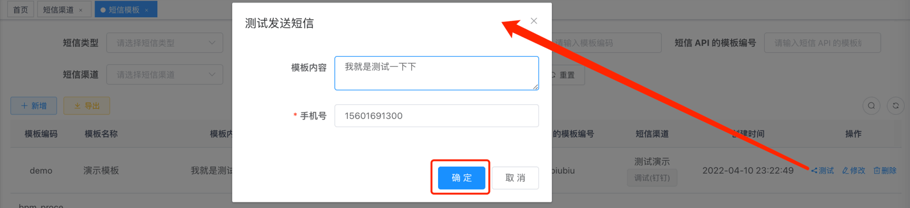

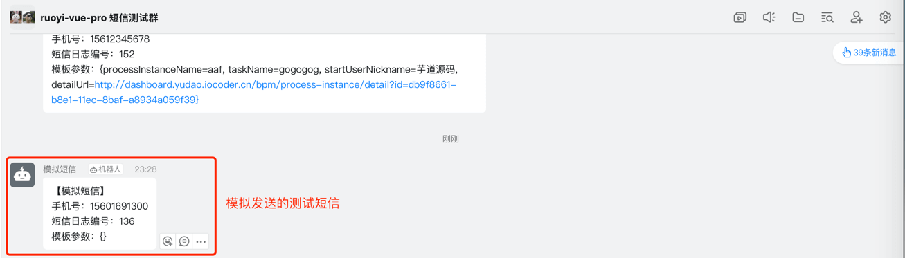

友情提示：如果使用的短信渠道是阿里云、腾讯云等正式的短信平台，则会发送到填写的手机号中。例如说：

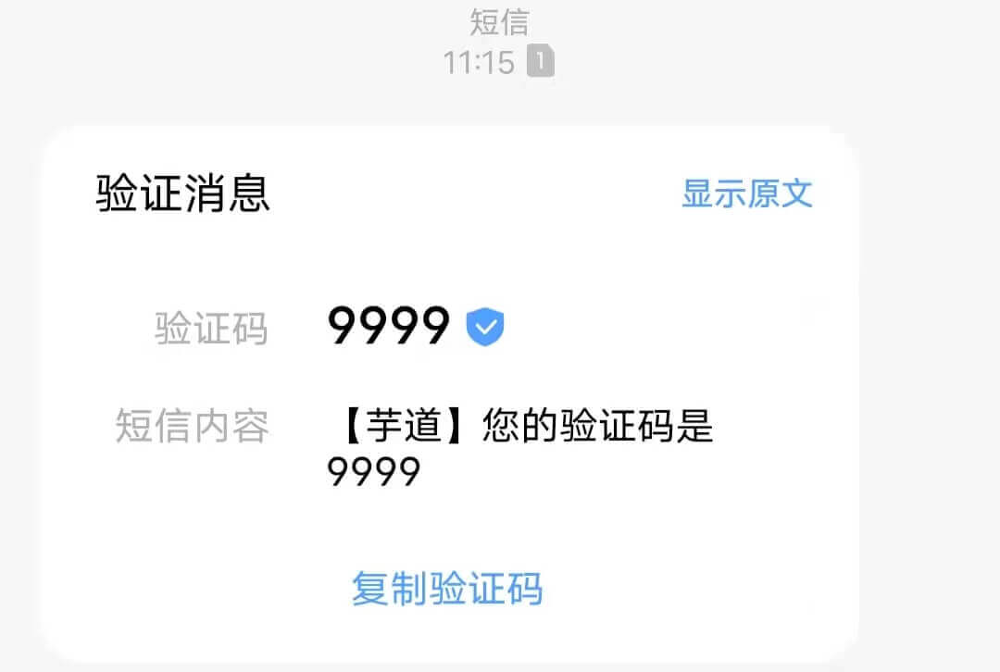

③ 点击 \[系统管理 -> 消息中心 -> 短信管理 -> 短信日志\] 采单，可以查看到每条短信的发送状态、接收状态。如下图所示：

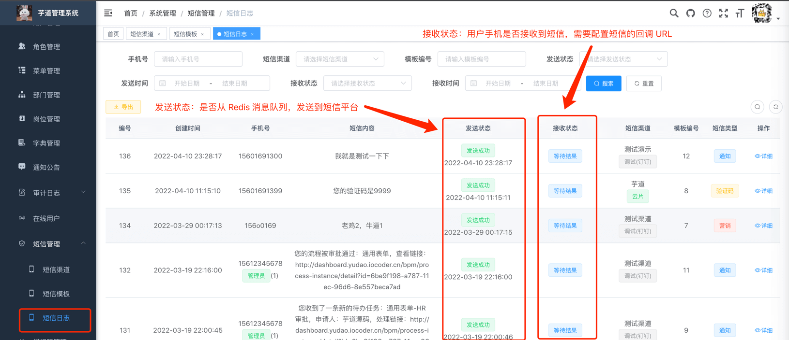

常见问题：为什么日志的接受状态，一直处理“等待结果”？

因为你没配置短信回调 URL，导致短信平台无法回调我们的系统，所以一直等待结果。具体怎么配置，可见 [短信平台附录](#_6-%E7%9F%AD%E4%BF%A1%E5%B9%B3%E5%8F%B0%E9%99%84%E5%BD%95) 小节。

## [#](#_3-短信发送) 3. 短信发送
### [#](#_3-1-smssendapi) 3.1 SmsSendApi

使用 [SmsSendApi (opens new window)](https://github.com/YunaiV/yudao-cloud/blob/master/yudao-module-system/yudao-module-system-api/src/main/java/cn/iocoder/yudao/module/system/api/sms/SmsSendApi.java) 进行短信的发送，支持多种用户类型。它的方法如下：

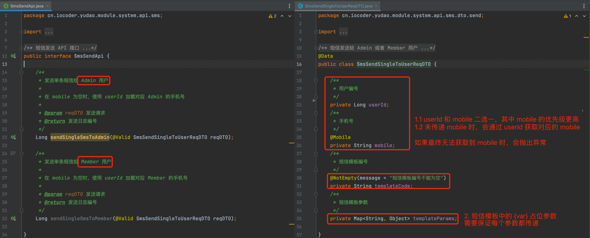

### [#](#_3-2-实战案例) 3.2 实战案例

以工作流申请通过时，发送短信为例子，讲解 SmsSendApi 的使用。

① 引入 `yudao-module-system-api` 依赖，如下图所示：

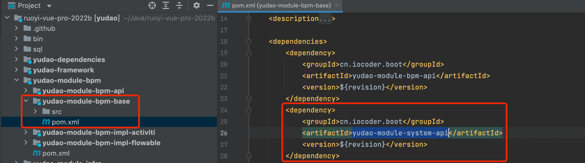

② 新建对应的短信模板，如下图所示：

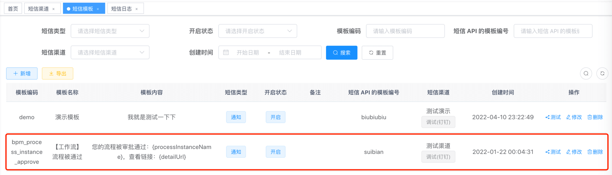

③ 使用 Spring 注入 SmsSendApi Bean，调用对应的短信发送方法。如下图所示：

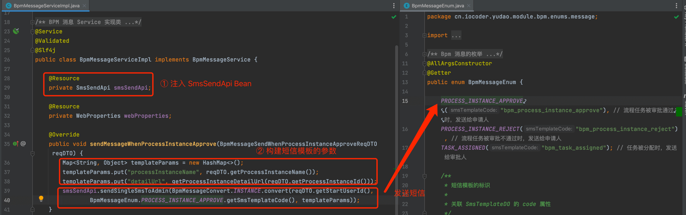

## [#](#_4-验证码发送) 4. 验证码发送
### [#](#_4-1-smscodeapi) 4.1 SmsCodeApi

使用 [SmsCodeApi (opens new window)](https://github.com/YunaiV/yudao-cloud/blob/master/yudao-module-system/yudao-module-system-api/src/main/java/cn/iocoder/yudao/module/system/api/sms/SmsCodeApi.java) 进行【验证码】短信的发送，例如说：用户手机验证码登录、用户忘记密码等等。它的方法如下：


验证码使用 [`system_sms_code` (opens new window)](https://github.com/YunaiV/yudao-cloud/blob/master/yudao-module-system/yudao-module-system-biz/src/main/java/cn/iocoder/yudao/module/system/dal/dataobject/sms/SmsCodeDO.java) 表进行存储，默认每天最多发送 10 条，每分钟发送 1 条，有效期为 10 分钟，可通过 `yudao.sms-code` 配置项进行自定义：

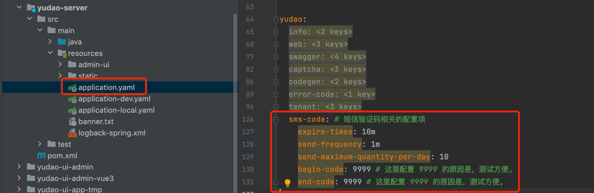

### [#](#_4-2-实战案例) 4.2 实战案例

以会员用户手机验证码登录为例子，讲解 SmsCodeApi 的使用。

① 引入 `yudao-module-system-api` 依赖，如下图所示：

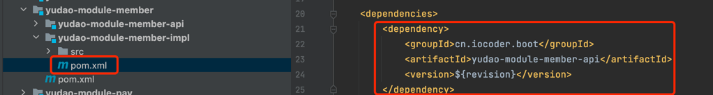

② 新建对应的短信模板，如下图所示：

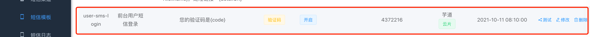

③ 在 [SmsSceneEnum (opens new window)](https://github.com/YunaiV/yudao-cloud/blob/master/yudao-module-system/yudao-module-system-api/src/main/java/cn/iocoder/yudao/module/system/enums/sms/SmsSceneEnum.java) 中，枚举会员用户的手机号登录的场景，如下图所示：

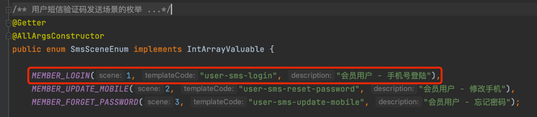

④ 使用 Spring 注入 SmsCodeApi Bean，调用对应的短信验证码的发送与使用方法。如下图所示：

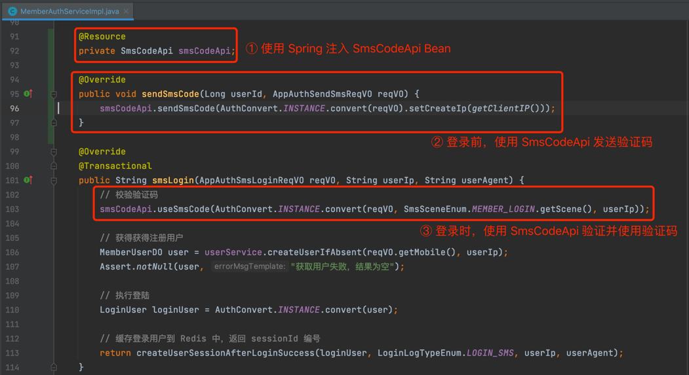

## [#](#_5-短信客户端) 5. 短信客户端

[`frameowrk/sms` (opens new window)](https://github.com/YunaiV/yudao-cloud/tree/master/yudao-module-system/yudao-module-system-biz/src/main/java/cn/iocoder/yudao/module/system/framework/sms) 短信【组件】，对接阿里云、腾讯云等短信平台，提供统一的短信客户端，提供给 [`service/sms` (opens new window)](https://github.com/YunaiV/yudao-cloud/blob/master/yudao-module-system/yudao-module-system-biz/src/main/java/cn/iocoder/yudao/module/system/service/sms/) 短信【业务】模块来调用。

### [#](#_5-1-smsclient) 5.1 SmsClient

[SmsClient (opens new window)](https://github.com/YunaiV/yudao-cloud/blob/master/yudao-module-system/yudao-module-system-biz/src/main/java/cn/iocoder/yudao/module/system/framework/sms/core/client/SmsClient.java) 接口，定义短信客户端的方法。代码如下：

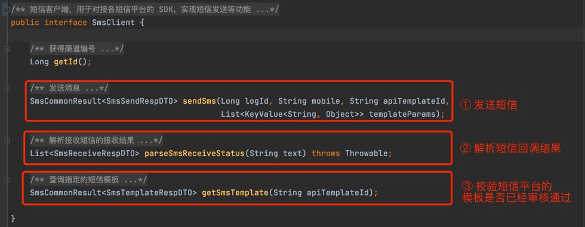

每个短信平台，都对应一个 SmsClient 实现类。

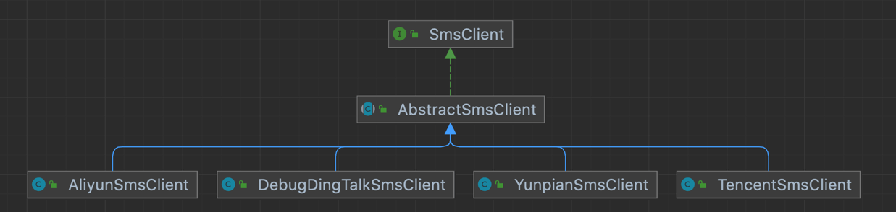

### [#](#_5-2-对接其它短信平台) 5.2 对接其它短信平台

如果你想要对接其它短信平台，自定义一个 SmsClient 实现类，并使用 [SmsClientFactoryImpl (opens new window)](https://github.com/YunaiV/yudao-cloud/blob/master/yudao-module-system/yudao-module-system-biz/src/main/java/cn/iocoder/yudao/module/system/framework/sms/core/client/impl/SmsClientFactoryImpl.java#L73-L85) 进行创建。代码如下：

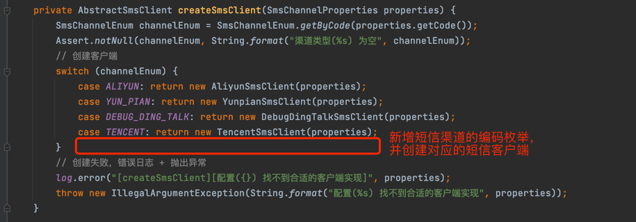

## [#](#_6-短信平台附录) 6. 短信平台附录

一般情况下，建议接入 2-3 个短信平台，避免某个短信平台故障时，影响业务的正常运行。

例如说，手机验证码的短信平台 A 故障时，赶紧将短信验证码切换到短信平台 B 上，否则用户将无法正常登录或是注册。

### [#](#_6-1-阿里云) 6.1 阿里云

① 短信 API 的账号、密钥，可通过 [阿里云 —— AccessKey (opens new window)](https://ram.console.aliyun.com/manage/ak) 获取。

② 短信发送回调 URL，可通过 [阿里云 —— 短信服务 —— 通用设置 (opens new window)](https://dysms.console.aliyun.com/general/upward) 配置。它对应的是 SmsCallbackController 的 `#receiveAliyunSmsStatus(...)` 地址。

### [#](#_6-2-腾讯云) 6.2 腾讯云

① 短信 API 的账号、密钥，可通过 [腾讯云 —— API 密钥管理 (opens new window)](https://console.cloud.tencent.com/cam/capi) 获取。

注意！！！

腾讯云需要额外使用 [SDKAppID (opens new window)](https://console.cloud.tencent.com/smsv2/app-manage) 参数，它的账号需要采用 `secretId SDKAppID` 格式。

例如说：在“API 密钥管理”获得了 `SecretId` 为 `A`，`SecretKey` 为 `B`，在“SDKAppID”获得了 `SDKAppID` 为 `18`，则配置短信 API 的账号为 `A 18`，短信 API 的密钥为 `B`。

② 短信发送回调 URL，可通过 [腾讯云 —— 短信 —— 基础配置 (opens new window)](https://console.cloud.tencent.com/smsv2/app-setting) 配置。它对应的是 SmsCallbackController 的 `#receiveTencentSmsStatus(...)` 地址。

### [#](#_6-3-华为云) 6.3 华为云

① 短信 API 的账号、密钥，可通过 [华为云 —— 访问密钥 (opens new window)](https://console.huaweicloud.com/iam/?#/mine/accessKey) 获取。

注意！！！

华为云需要额外使用 sender 通道号，它的账号需要采用 `AccessKeyId sender` 格式。

例如说：在“华为云访问密钥”获得了 `AccessKeyId` 为 `A`，`SecretAccessKey` 为 `B`，在“华为云签名”获得了 `sender` 为 `8824060312575`，则配置短信 API 的账号为 `A 8824060312575`，短信 API 的密钥为 `B`。

② 短信发送回调 URL，可以通过我们项目的 \[系统管理 -> 消息中心 -> 短信管理 -> 短信渠道\] 菜单，配置它的“短信发送回调 URL”字段即可。它对应的是 SmsCallbackController 的 `#receiveHuaweiSmsStatus(...)` 地址。

### [#](#_6-4-七牛云) 6.4 七牛云
### [#](#_6-4-七牛云-2) 6.4 七牛云

① 短信 API 的账号、密钥，可通过 [七牛云 —— 密钥管理 (opens new window)](https://portal.qiniu.com/developer/user/key) 获取。

② 短信发送回调 URL，可通过 [七牛云 —— 云短信 —— 设置 (opens new window)](https://portal.qiniu.com/sms/settings) 配置。它对应的是 SmsCallbackController 的 `#receiveQiniuSmsStatus(...)` 地址。

### [#](#_6-5-更多短信平台) 6.5 更多短信平台

短信平台非常的多，欢迎给我们 pull request 贡献。

例如说：合一、云片、京东云、容联云、亿美软通、天翼云、网易云等等。

如果你想参与，可以添加 `wangwenbin-server` 微信好，备注“短信”即可。