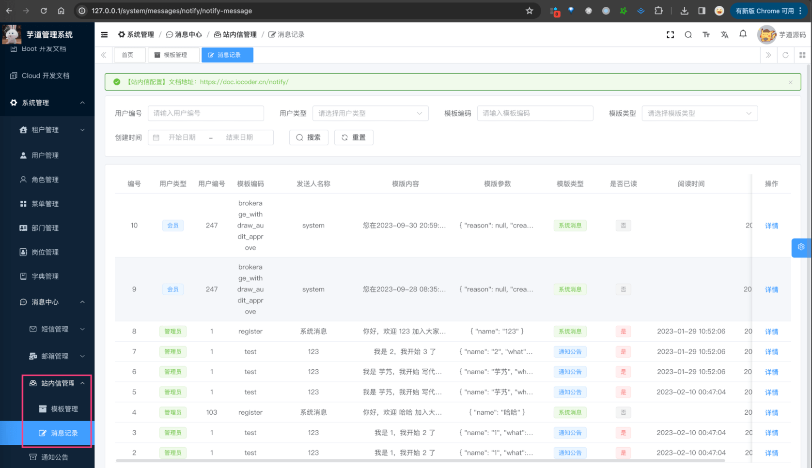
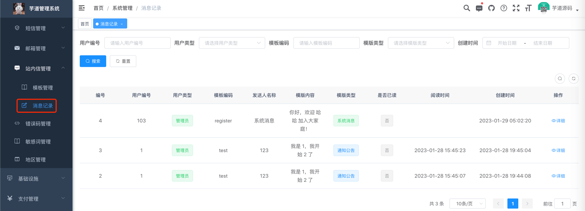
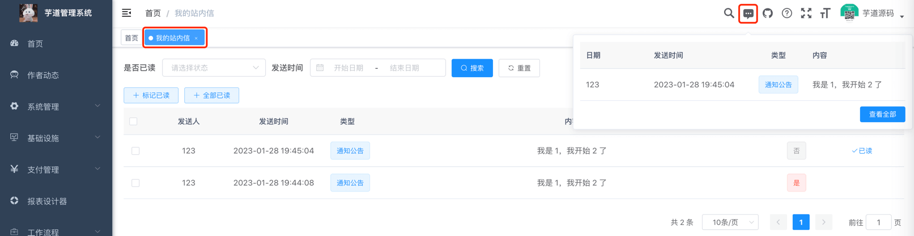
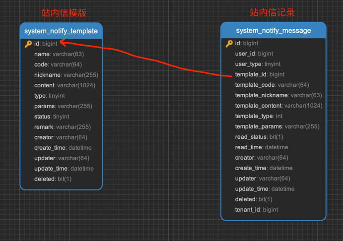
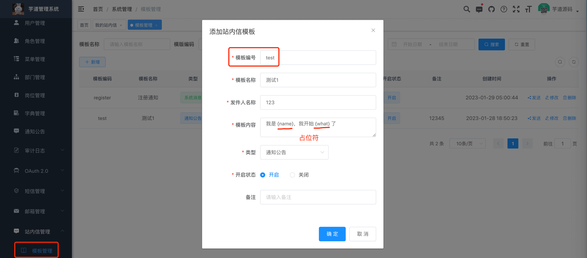
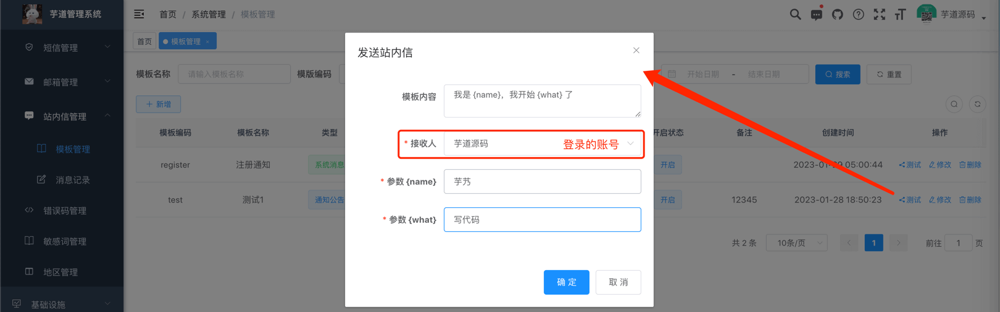
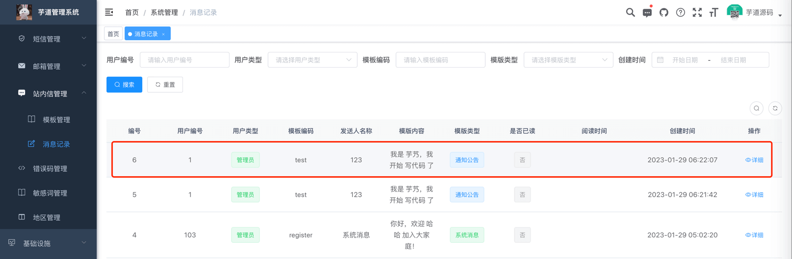
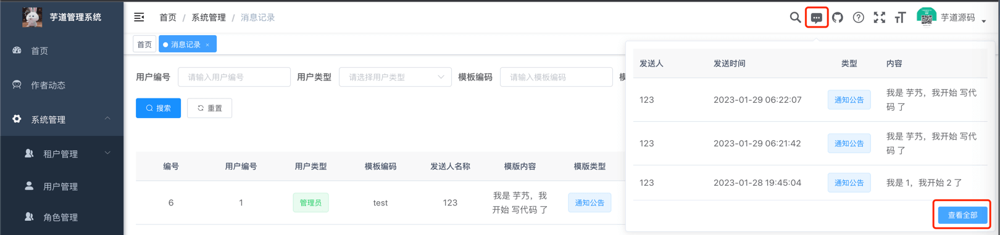
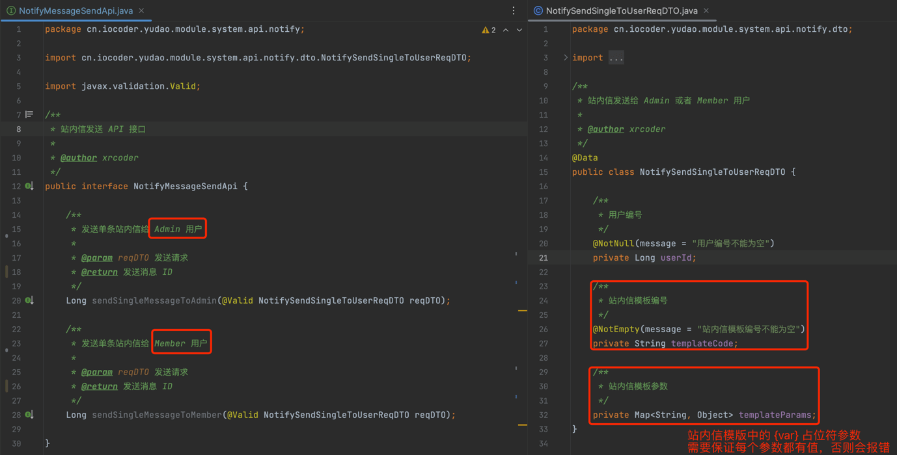

目录

# 站内信配置

本章节，介绍项目的站内信功能。它在管理后台有三个菜单，分别是：

**① 站内信模版：管理站内信的内容模版**



**② 站内信管理：查看站内信的发送记录**



**③ 我的站内信：查看发送给我的站内信**



## [#](#_1-表结构) 1. 表结构



## [#](#_2-实现代码) 2. 实现代码

*   前端代码：[views/system/notify (opens new window)](https://github.com/yudaocode/yudao-ui-admin-vue2/blob/master/src/views/system/notify/)
*   后端代码：[controller/admin/notify (opens new window)](https://github.com/YunaiV/yudao-cloud/blob/master/yudao-module-system/yudao-module-system-biz/src/main/java/cn/iocoder/yudao/module/system/controller/admin/notify/)

## [#](#_3-站内信配置) 3. 站内信配置

本小节，讲解如何配置站内信功能，整个过程如下：

1.  新建一个站内信【模版】，配置站内信的内容模版
2.  测试该站内信模板，查看对应的站内信【记录】，确认是否发送成功

### [#](#_3-1-新建站内信模版) 3.1 新建站内信模版

① 点击 \[系统管理 -> 消息中心 -> 站内信管理 -> 模板管理\] 菜单，查看站内信模板的列表。如下图所示：


② 点击 \[新增\] 按钮，填写信息如下图：



*   模版编号：站内信模板的唯一标识，使用站内信 API 时，通过它标识使用的站内信模板
*   发件人名称：发送站内信显示的发件人名字
*   模板内容：站内信模板的内容，使用 `{var}` 作为占位符，例如说 `{name}`、`{code}` 等
*   模版类型：站内信的分类，可使用 `system_notify_template_type` 字典进行自定义
*   开启状态：站内信模板被禁用时，该站内信模板将不发送站内信，只打印 logger 日志

疑问：为什么设计站内信模板的功能？

在一些场景下，产品会希望修改发送站内信的内容、发送人昵称，此时只需要修改站内信模版的对应属性，无需重启应用。

### [#](#_3-2-测试站内信模版) 3.2 测试站内信模版

① 点击 \[测试\] 按钮，选择接收人为「芋道源码」，进行该站内信模板的模拟发送。如下图所示：



② 点击 \[系统管理 -> 消息中心 -> 站内信管理 -> 消息记录\] 菜单，可以查看到刚发送的站内信。如下图所示：



③ 点击右上角的 \[消息\] 图标，也可以查看到刚发送的站内信。如下图所示：



## [#](#_4-站内信发送) 4. 站内信发送
### [#](#_4-1-notifymessagesendapi) 4.1 NotifyMessageSendApi

[站内信配置](/#_3-站内信配置)完成后，可使用 [NotifyMessageSendApi (opens new window)](https://github.com/YunaiV/yudao-cloud/blob/master/yudao-module-system/yudao-module-system-api/src/main/java/cn/iocoder/yudao/module/system/api/notify/NotifyMessageSendApi.java) 进行站内信的发送，支持多种用户类型。它的方法如下：



### [#](#_4-2-接入示例) 4.2 接入示例

以 `yudao-module-infra` 模块，需要发站内信为例子，讲解 SmsCodeApi 的使用。

① 在 `yudao-module-infra-biz` 模块的 [`pom.xml` (opens new window)](https://github.com/YunaiV/yudao-cloud/blob/master/yudao-module-infra/yudao-module-infra-biz/pom.xml) 引入 `yudao-module-system-api` 依赖，如所示：

```xml
<dependency>
    <groupId>cn.iocoder.cloud</groupId>
    <artifactId>yudao-module-system-api</artifactId>
    <version>${revision}</version>
</dependency>

```

② 在代码中注入 NotifyMessageSendApi Bean，并调用发送站内信的方法。代码如下：

```java
public class TestDemoServiceImpl implements TestDemoService {

    // 0. 注入 NotifyMessageSendApi Bean
    @Resource
    private NotifyMessageSendApi notifySendApi;

    public void sendDemo() {
        // 1. 准备参数
        Long userId = 1L; // 示例中写死，你可以改成你业务中的 userId 噢
        String templateCode = "test_01"; // 站内信模版，记得在【站内信管理】中配置噢
        Map<String, Object> templateParams = new HashMap<>();
        templateParams.put("key1", "奥特曼");
        templateParams.put("key2", "变身");

        // 2. 发送站内信
        notifySendApi.sendSingleNotifylToAdmin(new NotifySendSingleToUserReqDTO()
                .setUserId(userId).setTemplateCode(templateCode).setTemplateParams(templateParams));
    }
    
}

```