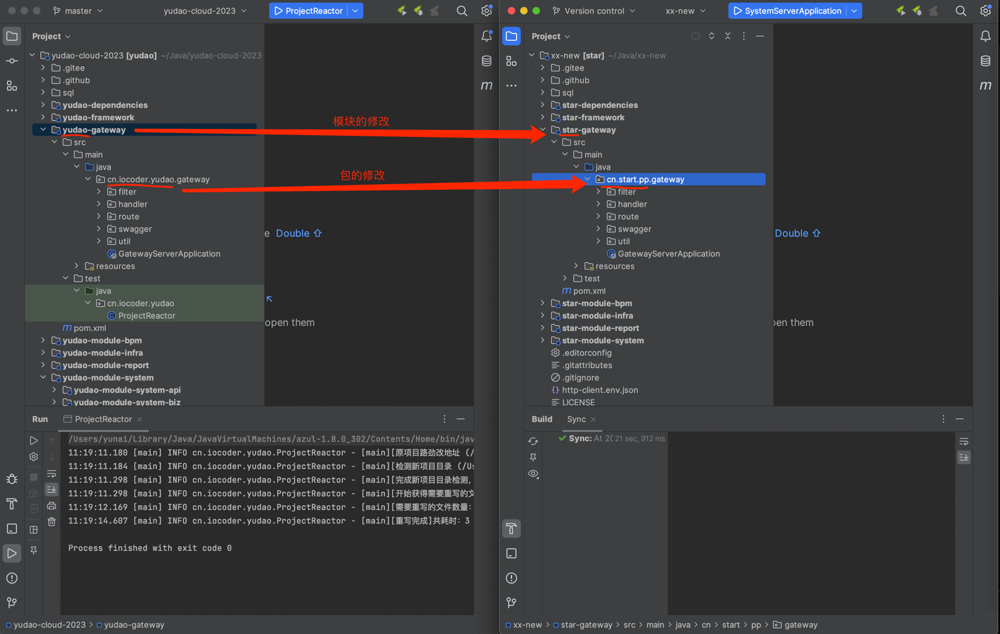
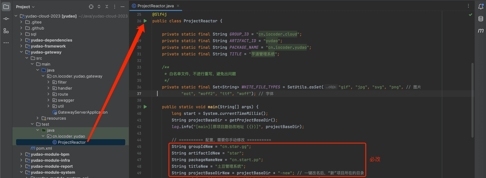

目录

# 一键改包

项目提供了 [ProjectReactor (opens new window)](https://github.com/YunaiV/yudao-cloud/blob/32ea8f5278d3de01f3e7af280a0b73c08d31d6e8/yudao-gateway/src/test/java/cn/iocoder/yudao/ProjectReactor.java) 程序，支持一键改包，包括 Maven 的 `groupId`、`artifactId`、Java 的根 `package`、前端的 `title`、数据库的 SQL 配置、应用的 `application.yaml` 配置文件等等。效果如下图所示：



友情提示：修改包名后，未来合并最新的代码可能会有一定的成本。

主要有两点原因：

*   ① 改包后，无法继续通过 git pull 拉取最新代码
*   ② 市面上没有合适的工具，合并改包后的代码

这个存在于所有开源项目，不属于本项目的问题，希望可以理解！

## [#](#👍-相关视频教程) 👍 相关视频教程

*   [08、如何实现一键改包？ (opens new window)](https://t.zsxq.com/07yzBuZFu)

## [#](#操作步骤) 操作步骤

① 第一步，使用 [IDEA (opens new window)](http://www.iocoder.cn/categories/IDEA/?self) 克隆 [https://github.com/YunaiV/yudao-cloud (opens new window)](https://github.com/YunaiV/yudao-cloud) 仓库的最新代码，并给该仓库一个 [Star (opens new window)](https://github.com/YunaiV/yudao-cloud)。

② 第二步，打开 ProjectReactor 类，填写 `groupIdNew`、`artifactIdNew`、`packageNameNew`、`titleNew` 属性。如下图所示：



另外，如下两个属性也必须修改：

*   `projectBaseDir` 属性：修改为你 `yudao-cloud` 所在目录的绝对地址
*   `projectBaseDirNew` 属性：修改为你想要的新项目的绝对地址。注意，不要有 `yudao` 关键字。

③ 第三步，执行 ProjectReactor 的 `#main(String[] args)` 方法，它会基于当前项目，**复制**一个新项目到 `projectBaseDirNew` 目录，并进行相关的改名逻辑。

```bash
11:19:11.180 [main] INFO cn.iocoder.yudao.ProjectReactor - [main][原项目路劲改地址 (/Users/yunai/Java/yudao-cloud-2023)]
11:19:11.184 [main] INFO cn.iocoder.yudao.ProjectReactor - [main][检测新项目目录 (/Users/yunai/Java/xx-new)是否存在]
11:19:11.298 [main] INFO cn.iocoder.yudao.ProjectReactor - [main][完成新项目目录检测，新项目路径地址 (/Users/yunai/Java/xx-new)]
11:19:11.298 [main] INFO cn.iocoder.yudao.ProjectReactor - [main][开始获得需要重写的文件，预计需要 10-20 秒]
11:19:12.169 [main] INFO cn.iocoder.yudao.ProjectReactor - [main][需要重写的文件数量：1573，预计需要 15-30 秒]
11:19:14.607 [main] INFO cn.iocoder.yudao.ProjectReactor - [main][重写完成]共耗时：3 秒

```

④ 第四步，使用 IDEA 打开 `projectBaseDirNew` 目录，参考 [《开发指南 —— 快速启动》](/quick-start) 文档，进行项目的启动。**注意**，一定要重新执行 SQL 的导入！！！

* * *

整个过程非常简单，如果碰到问题，请添加项目的技术交流群。

> ↓↓↓ 技术交流群，一起苦练技术基本功，每日精进 30 公里！↓↓↓

