目录

# 删除功能（以租户为例）

项目内置[功能](/feature)较多，会存在一些你可能用不到的功能。一般的情况下，建议通过设置该功能对应的菜单为【**禁用**】，实现功能的“删除”。如下图所示：

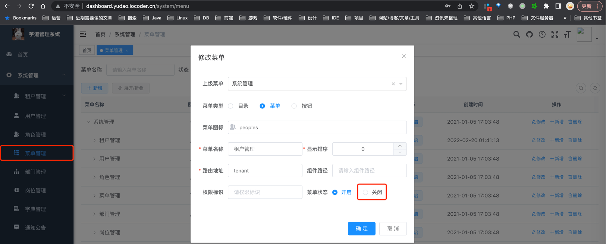

后续，如果你又需要使用到该功能，只需要设置该功能对应的菜单为【**开启**】即可。

🙂 当然，如果你希望彻底删除功能，那么就需要采用删除代码的方式。整个过程如下：

① 【菜单】第一步，使用管理后台的菜单管理，删除对应的菜单、按钮。  
② 【数据库表】第二步，删除对应的数据库表。  
③ 【后端代码】第三步，删除对应的 Controller、Service、数据库实体等后端代码；然后启动后端项目，若存在代码报错，则继续删除相关联的代码，之后如此反复，直到成功。  
④ 【前端代码】第四步，删除对应的 View 和 API 等前端代码；然后启动前端项目，若存在代码报错，则继续删除相关联的代码，之后如此反复，直到成功。

下面，我们来举一些例子。

## [#](#👍-相关视频教程) 👍 相关视频教程

*   [从零开始 07：如何有效的删除不用的功能？ (opens new window)](https://t.zsxq.com/07EUrZrNV)

## [#](#删除「多租户」功能) 删除「多租户」功能

*   对应功能的文档：[多租户](/saas-tenant/)
*   对应的关键字是 `tenant`

### [#](#第一步-删除菜单) 第一步，删除菜单

删除“租户管理“下的所有菜单，从最里层的按钮开始。如下图所示：

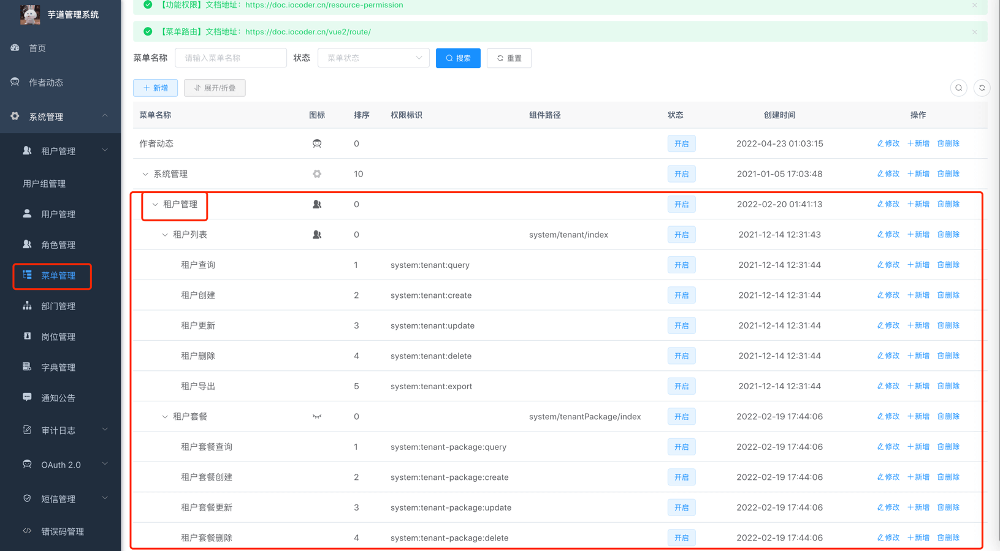

### [#](#第二步-删除数据库表) 第二步，删除数据库表

删除 `system_tenant` 和 `system_tenant_package` 表。如下图所示：

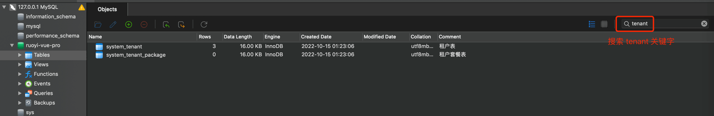

### [#](#第三步-删除后端代码) 第三步，删除后端代码

① 删除 `yudao-module-system-api` 模块的 [`api/tenant` (opens new window)](https://gitee.com/zhijiantianya/yudao-cloud/tree/master/yudao-module-system/yudao-module-system-api/src/main/java/cn/iocoder/yudao/module/system/api/tenant) 包。

② 删除 `yudao-module-system-api` 模块的 [ErrorCodeConstants (opens new window)](https://gitee.com/zhijiantianya/yudao-cloud/blob/master/yudao-module-system/yudao-module-system-api/src/main/java/cn/iocoder/yudao/module/system/enums/ErrorCodeConstants.java) 类中，和租户、租户套餐相关的错误码。如下图所示：

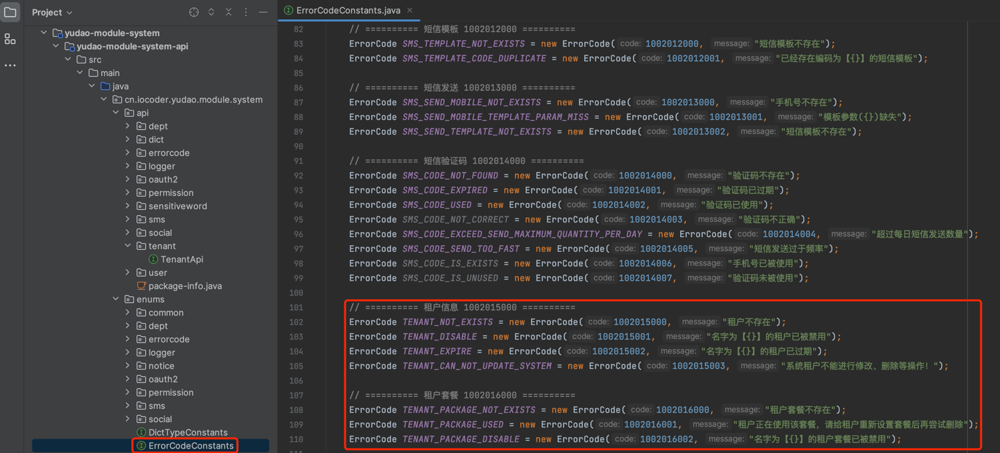

如果想删除的更干净，可以把 `system_error_code` 表中，对应编号的错误码也都删除一下。

③ 删除 `yudao-module-system-biz` 模块的如下包：

*   [`api/tenant` (opens new window)](https://gitee.com/zhijiantianya/yudao-cloud/tree/master/yudao-module-system/yudao-module-system-biz/src/main/java/cn/iocoder/yudao/module/system/api/tenant)
*   [`controller/admin/tenant` (opens new window)](https://gitee.com/zhijiantianya/yudao-cloud/tree/master/yudao-module-system/yudao-module-system-biz/src/main/java/cn/iocoder/yudao/module/system/controller/admin/tenant)
*   [`service/tenant` (opens new window)](https://gitee.com/zhijiantianya/yudao-cloud/tree/master/yudao-module-system/yudao-module-system-biz/src/main/java/cn/iocoder/yudao/module/system/service/tenant)
*   [`test/service/tenant` (opens new window)](https://gitee.com/zhijiantianya/yudao-cloud/tree/master/yudao-module-system/yudao-module-system-biz/src/test/java/cn/iocoder/yudao/module/system/service/tenant)
*   [`dal/dataobject/tenant` (opens new window)](https://gitee.com/zhijiantianya/yudao-cloud/tree/master/yudao-module-system/yudao-module-system-biz/src/main/java/cn/iocoder/yudao/module/system/dal/dataobject/tenant)
*   [`dal/mysql/tenant` (opens new window)](https://gitee.com/zhijiantianya/yudao-cloud/tree/master/yudao-module-system/yudao-module-system-biz/src/main/java/cn/iocoder/yudao/module/system/dal/mysql/tenant)
*   [`convert/tenant` (opens new window)](https://gitee.com/zhijiantianya/yudao-cloud/tree/master/yudao-module-system/yudao-module-system-biz/src/main/java/cn/iocoder/yudao/module/system/convert/tenant)

④ 删除 [`yudao-spring-boot-starter-biz-tenant` (opens new window)](https://gitee.com/zhijiantianya/yudao-cloud/tree/master/yudao-framework/yudao-spring-boot-starter-biz-tenant) 模块。

然后，使用 IDEA 搜索 `yudao-spring-boot-starter-biz-tenant` 关键字，删除 Maven 中所有对它的定义与引用。如下图所示：

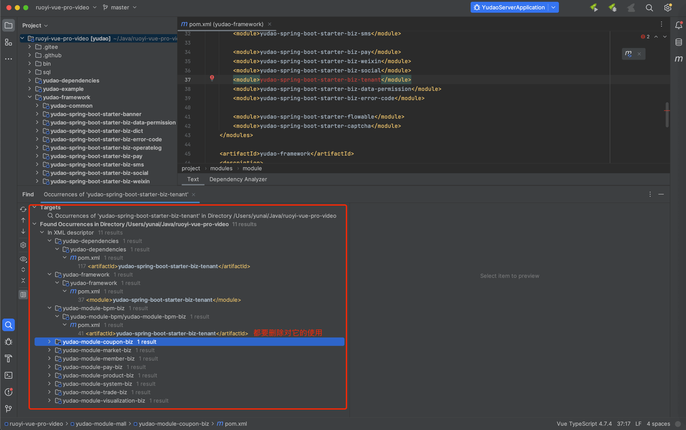

之后，使用 IDEA 刷新下 Maven 依赖。如下图所示：

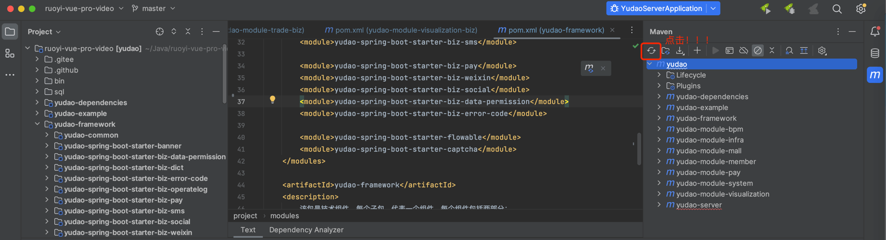

⑤ 运行 YudaoServerApplication 启动类，会报 `cn.iocoder.yudao.framework.tenant.core.db` 不存在的错误，需要将继承 TenantBaseDO 的数据库实体，都改成继承 BaseDO 基类。

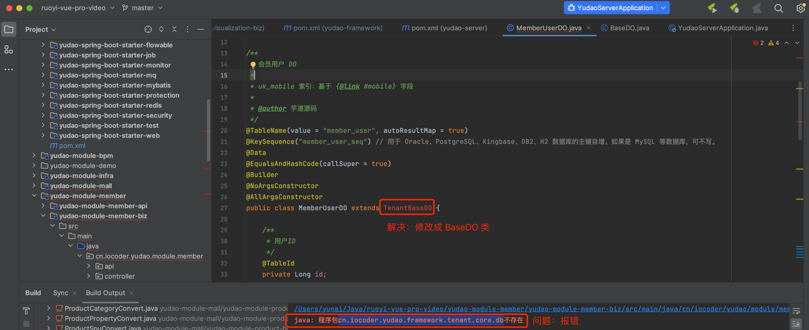

⑥ 运行 YudaoServerApplication 启动类，会报 `cn.iocoder.yudao.framework.tenant.core.aop` 不存在的错误，需要去除对 `@TenantIgnore` 注解的使用。如下图所示：

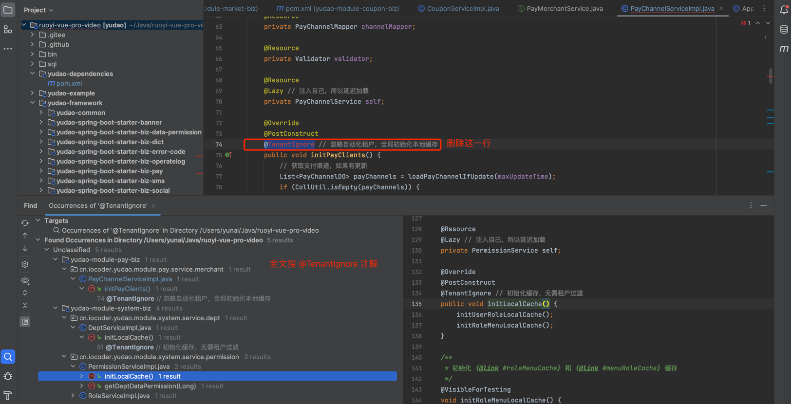

⑦ 运行 YudaoServerApplication 启动类，会报 `cn.iocoder.yudao.module.system.service.tenant` 不存在的错误，需要去除对 TenantService 的使用。如下图所示：

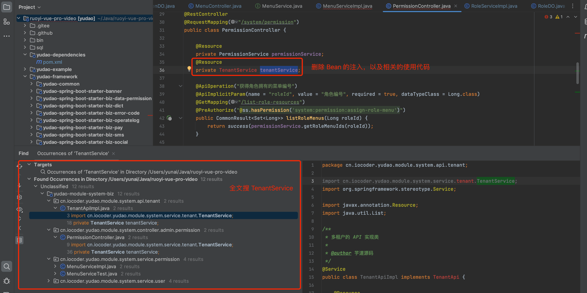

⑧ 运行 YudaoServerApplication 启动类，会报 `cn.iocoder.yudao.framework.tenant.core.context` 不存在的错误，需要去除对 TenantContextHolder 的使用。如下图所示：

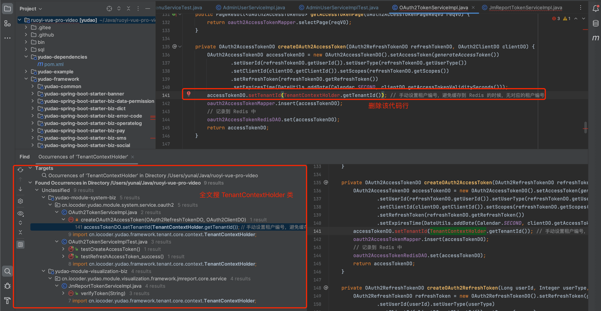

⑨ 运行 YudaoServerApplication 启动类，终于成功了！！！

ps：可以将 `application.yaml` 配置文件中，对应的 `yudao.tenant` 配置项给进一步删除。

### [#](#第四步-删除前端代码) 第四步，删除前端代码

以 `yudao-admin-ui` 为示例~

① 删除 View 和 API 的前端代码：

*   [`views/system/tenant` (opens new window)](https://gitee.com/yudaocode/yudao-ui-admin-vue2/tree/master/src/views/system/tenant)
*   [`views/system/tenantPackage` (opens new window)](https://gitee.com/yudaocode/yudao-ui-admin-vue2/tree/master/src/views/system/tenantPackage)
*   [`api/system/tenant.js` (opens new window)](https://gitee.com/yudaocode/yudao-ui-admin-vue2/blob/master/src/api/system/tenant.js)
*   [`api/system/tenantPackage.js` (opens new window)](https://gitee.com/yudaocode/yudao-ui-admin-vue2/blob/master/src/api/system/tenantPackage.js)

② 在 `yudao-admin-ui` 目录下，执行 `npm run local` 成功。访问登录页，结果访问白屏。需要清理 `login.vue` 页，涉及 `tenant` 关键字的代码。例如说：

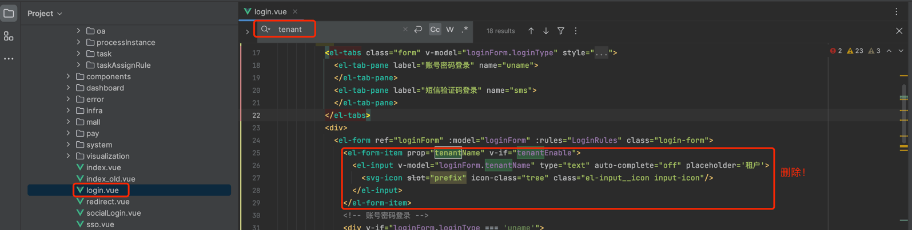

刷新，成功访问登录界面。

③ 在 `yudao-admin-ui` 目录下，搜索 `tenant` 或 `Tenant` 关键字，可进一步清理多租户的代码。例如说：

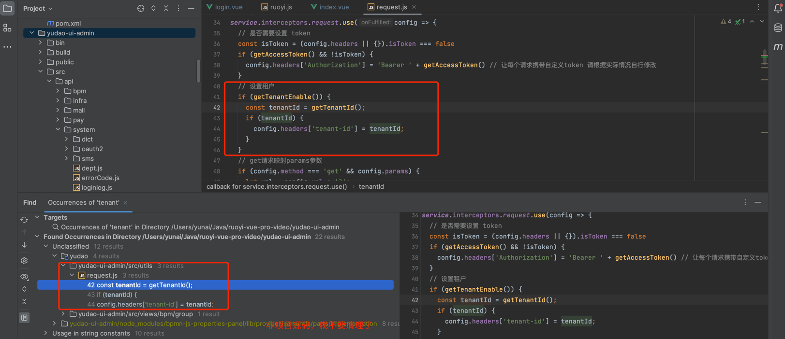

### [#](#第五步-测试验收) 第五步，测试验收

至此，我们已经完成了多租户的代码删除，还是蛮艰辛的~

后续，你可以简单测试一下，看看是不是删除代码，导致一些小问题。

## [#](#更多) 更多...

如果你有其它功能想要删除，可以在 [Issue (opens new window)](https://gitee.com/zhijiantianya/ruoyi-vue-pro/issues) 留言，可以不断补充到该文档。