目录

# 接口文档

项目使用 Swagger 实现 RESTful API 的接口文档，提供两种解决方案：

\*【推荐】 [Apifox (opens new window)](http://mtw.so/62me9n)：强大的 API 工具，支持 API 文档、API 调试、API Mock、API 自动化测试

*   Knife4j：简易的 API 工具，仅支持 API 文档、API 调试

为什么选择 Swagger 呢？

Swagger 通过 Java 注解实现 API 接口文档的编写。相比使用 Java 注释的方式，注解提供更加规范的接口定义方式，开发体验更好。

如果你没有学习 Swagger，可以阅读 [《芋道 Spring Boot API 接口文档 Swagger 入门 》 (opens new window)](https://www.iocoder.cn/Spring-Boot/Swagger/?yudao) 文章。

每个服务都会启动 Swagger 的接口文档，方便开发者进行 API 调试。下述的内容，使用 `system-server` 系统服务举例子，它的端口是 48081。

注意！注意！注意！文章部分图中，看到的是 48080 端口，实际你都填写 48081。

## [#](#_1-apifox-使用) 1. Apifox 使用

本小节，我们来将项目中的 API 接口，一键导入到 Apifox 中，并使用它发起一次 API 的调用。

### [#](#_1-1-下载工具) 1.1 下载工具

点击 [Apifox (opens new window)](http://mtw.so/62me9n) 首页，下载对应的 Apifox 桌面版。如下图所示：

为什么要下载 Apifox 桌面版？

艿艿已经卸载 Postman，使用 Apifox 进行替代。国产软件，yyds 永远滴神！

国内很多互联网公司，包括百度、阿里、腾讯、字节跳动等等在内，都在使用 Apifox 作为 API 工具。

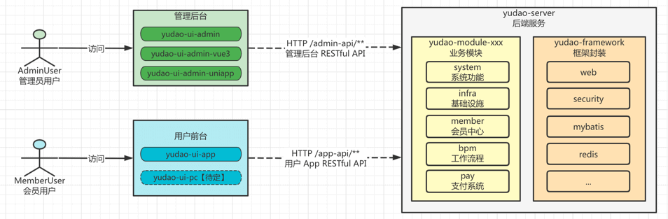

解压后，双击进行安装即可。黑色界面，非常酷炫。

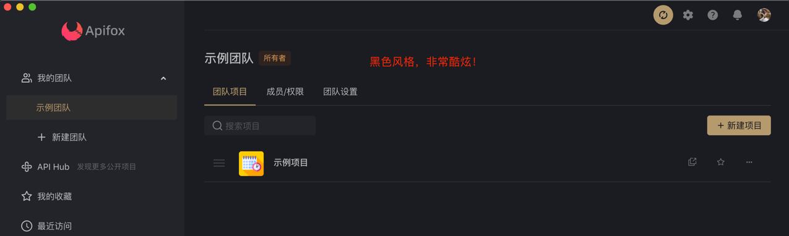

### [#](#_1-2-api-导入) 1.2 API 导入

① 先点击「示例项目」，再点击「+」按钮，选择「导入」选项。

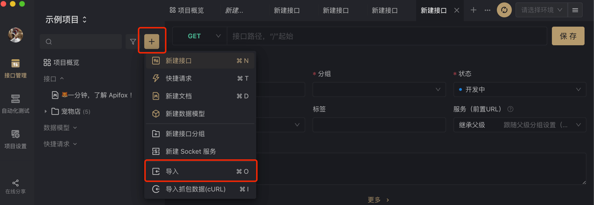

② 先选择「URL 导入」按钮，填写 Swagger 数据 URL 为 `http://127.0.0.1:48081/v3/api-docs` 。如果失败，则可以尝试 `http://127.0.0.1:48080/v3/api-docs/all` 解决。

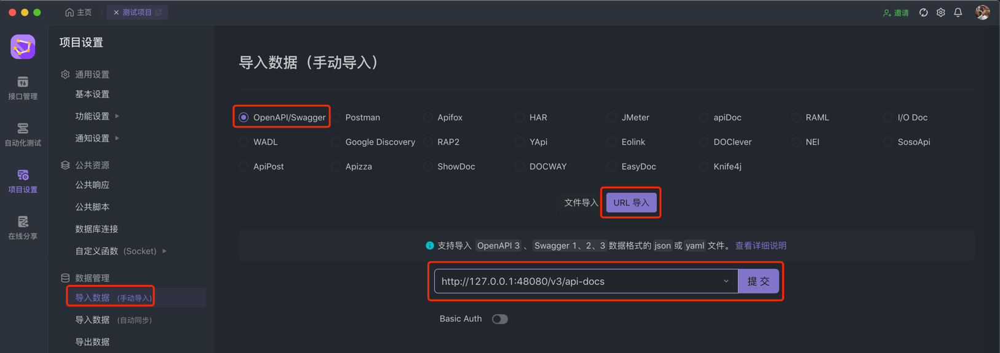

③ 先点击「提交」按钮，再点击「确认导入」按钮，完成 API 接口的导入。

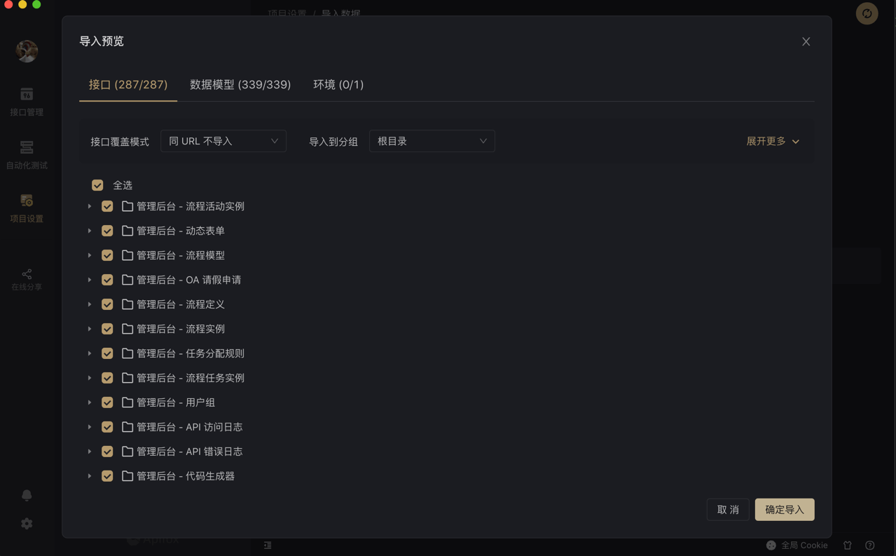

④ 导入完成后，点击「接口管理」按钮，可以查看到 API 列表。

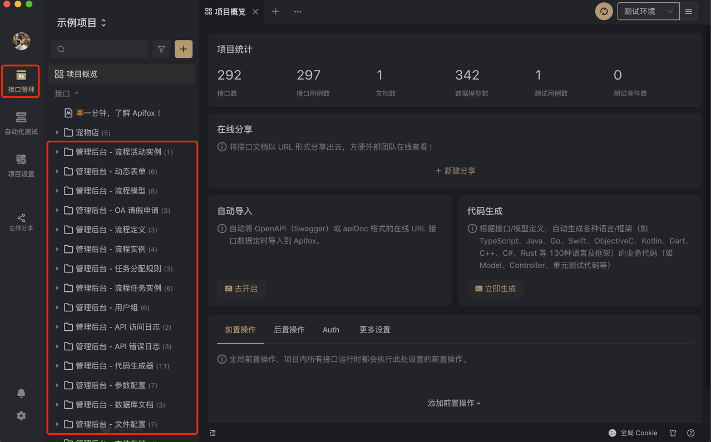

### [#](#_1-3-api-调试) 1.3 API 调试

① 先点击右上角「请选择环境」，再点击「管理环境」选项，填写测试环境的地址为 `http://127.0.0.1:48081`，并进行保存。

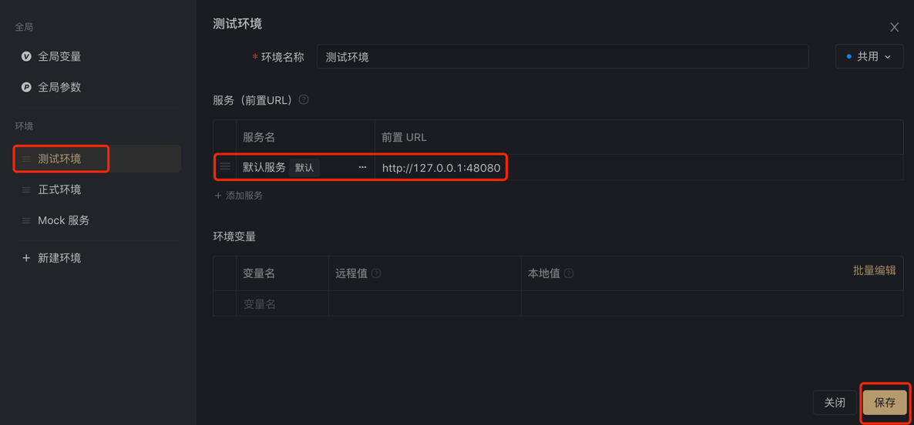

② 点击「管理后台 —— 认证」的「使用账号密码登录」接口，查看该 API 接口的定义。

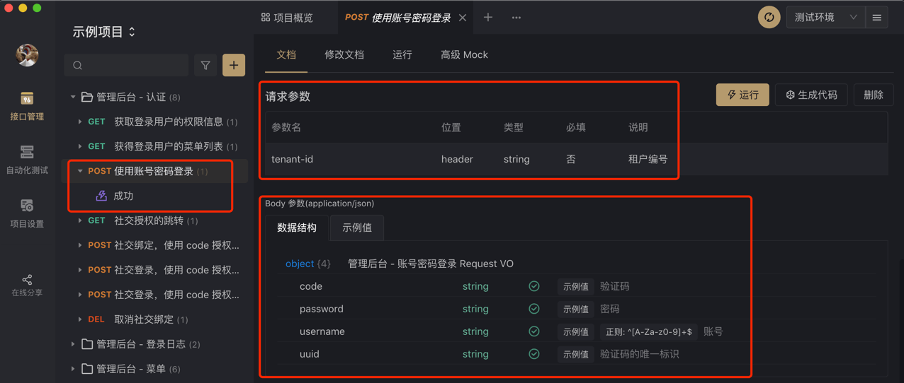

③ 点击「运行」按钮，填写 Headers 的 `tenant-id` 为 1，再点击 Body 的「自动生成」按钮，最后点击「发送」按钮。

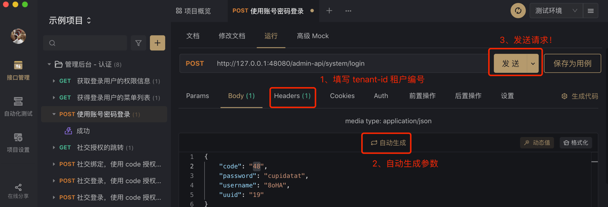

### [#](#_1-4-常见问题) 1.4 常见问题

问题 ①：分页 GET 请求时，如果有 `createTime` 这种时间类型的数组参数，会报错。如下图所示：

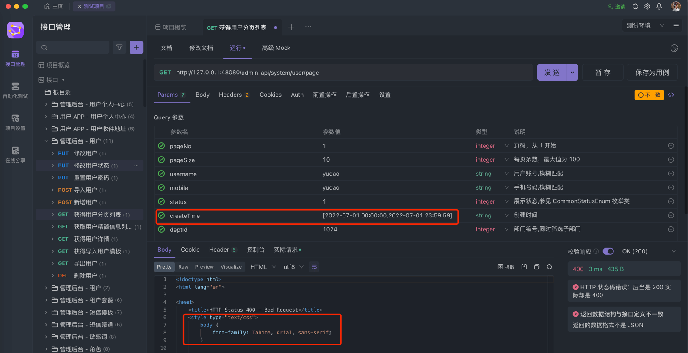

答：把 `createTime` 左右两边的 `[]` 去掉，即可解决。

## [#](#_2-knife4j-使用) 2. Knife4j 使用

友情提问：Knife4j 在 \`master\` 分支（即 JDK8 版本呢），存在 POST 请求不能生成 JSON 的问题？！

反馈来源：

*   [https://t.zsxq.com/Urhsr (opens new window)](https://t.zsxq.com/Urhsr)
*   [https://github.com/YunaiV/ruoyi-vue-pro/issues/639 (opens new window)](https://github.com/YunaiV/ruoyi-vue-pro/issues/639)

这个是 Knife4j 自带的 bug，目前只在 `master-jdk17` 分支（即 JDK17/21）版本可解决。

比较无奈，没有完美解：

*   ① 如果你把 `springdoc.default-flat-param-object` 设置为 `true` 时（目前是这个配置），就会出现这个问题。
*   ② 如果你把 `springdoc.default-flat-param-object` 设置为 `false` 时，就不会出现这个问题，但是 GET 请求的参数格式又会不正确。

\= = 所幸，未来大家慢慢都会迁移到 JDK17/21 的版本，这个问题就会自然解决了。

### [#](#_2-1-如何使用) 2.1 如何使用？

浏览器访问 [http://127.0.0.1:48081/doc.html (opens new window)](http://127.0.0.1:48081/doc.html) 地址，使用 Knife4j 查看 API 接口文档。

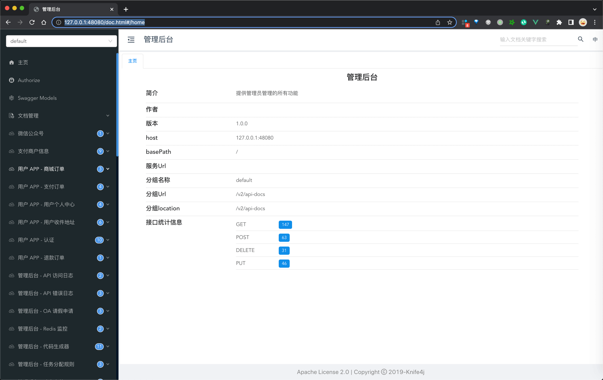

① 点击任意一个接口，进行接口的调用测试。这里，使用「管理后台 - 用户个中心」的“获得登录用户信息”举例子。

② 点击左侧「调试」按钮，并将请求头部的 `header-id` 和 `Authorization` 勾选上。

其中，`header-id` 为租户编号，`Authorization` 的 `"Bearer test"` 后面为用户编号（模拟哪个用户操作）。

③ 点击「发送」按钮，即可发起一次 API 的调用。

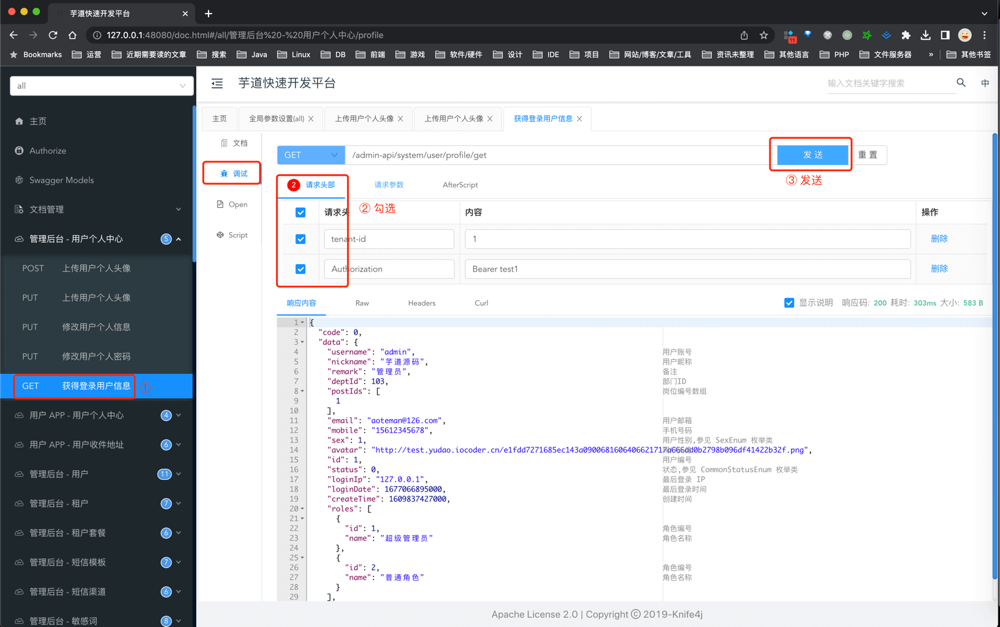

如何使用 Gateway 网关，聚合各个服务的接口文档？

参见 [《微服务手册 —— 服务网关》](/gateway/) 文档

### [#](#_2-2-如何开启登录) 2.2 如何开启登录？

生产环境下，建议 Knife4j 接口界面开启“安全认证”的功能，避免出现安全事故。

只需要在 `knife4j.basic` 配置项中，额外添加 Basic Auth 认证即可，如下所示：

```yaml
knife4j:
  basic:
    enable: true
    username: admin # Basic 认证用户名
    password: admin # Basic 认证密码

```

## [#](#_3-swagger-技术组件) 3. Swagger 技术组件

① 在 [`yudao-spring-boot-starter-web` (opens new window)](https://github.com/YunaiV/yudao-cloud/blob/master/yudao-framework/yudao-spring-boot-starter-web/pom.xml) 技术组件的 [`swagger` (opens new window)](https://github.com/YunaiV/yudao-cloud/blob/master/yudao-framework/yudao-spring-boot-starter-web/src/main/java/cn/iocoder/yudao/framework/swagger/package-info.java) 包，实现了对 Swagger 的封装。

② 如果想要禁用 Swagger 功能，可通过 `springdoc.api-docs.enable` 配置项为 `false`。一般情况下，建议 prod 生产环境进行禁用，避免发生安全问题。

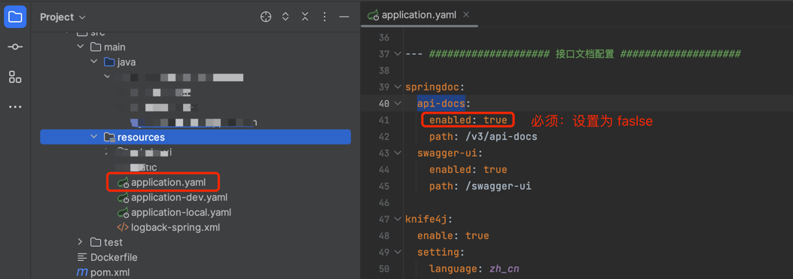

友情提示：除了通过 enable 进行关闭外，更建议的是通过 knife4j 提供的 \`knife4j.production = true\` 来实现

*   可见星球：[https://wx.zsxq.com/group/88858522214142/topic/4844122558542458 (opens new window)](https://wx.zsxq.com/group/88858522214142/topic/4844122558542458)
*   可见文档：[《Knife4j 文档 —— 访问权限控制》 (opens new window)](https://doc.xiaominfo.com/docs/features/accessControl)