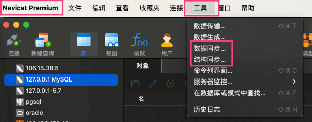
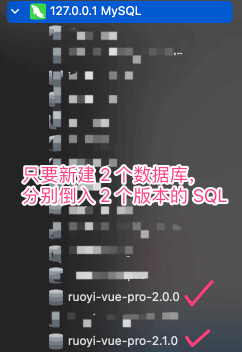
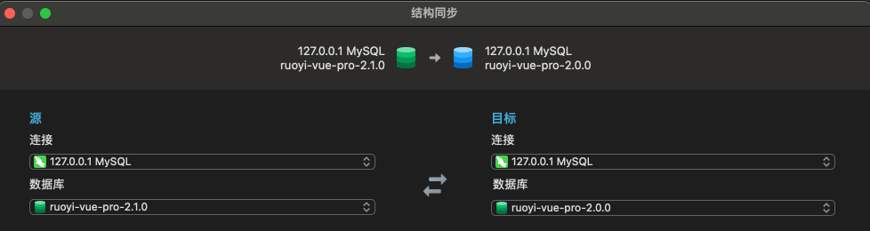
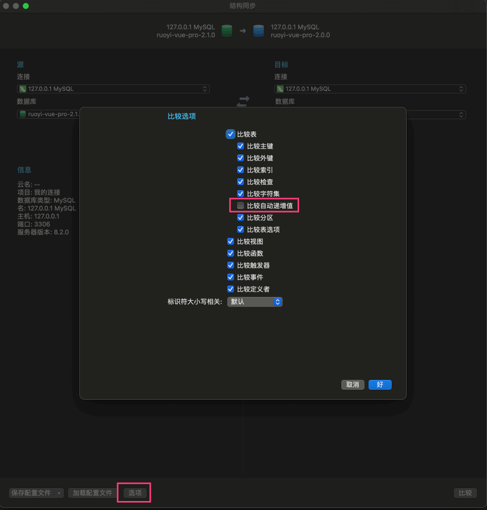
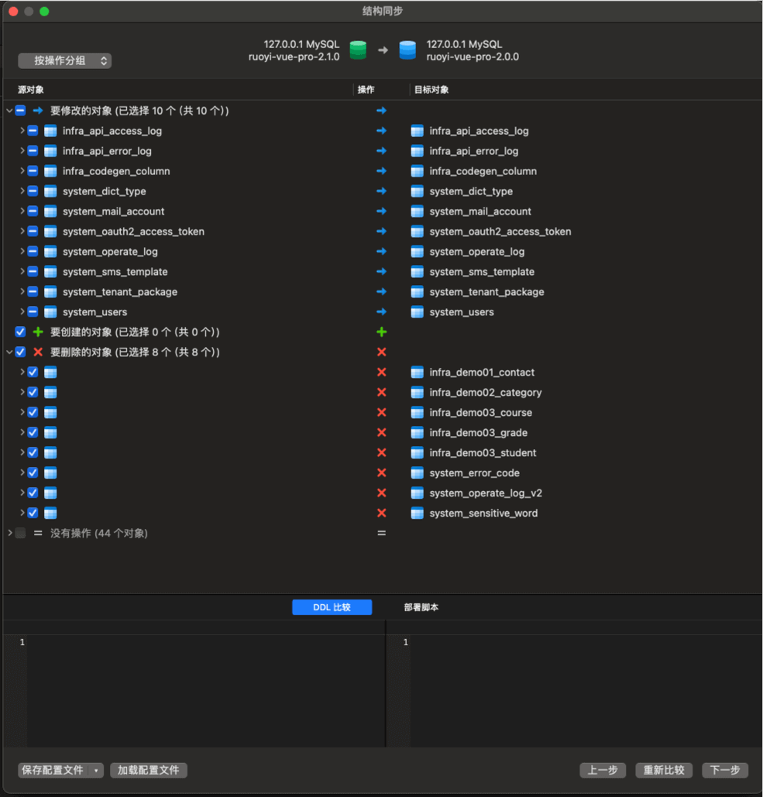
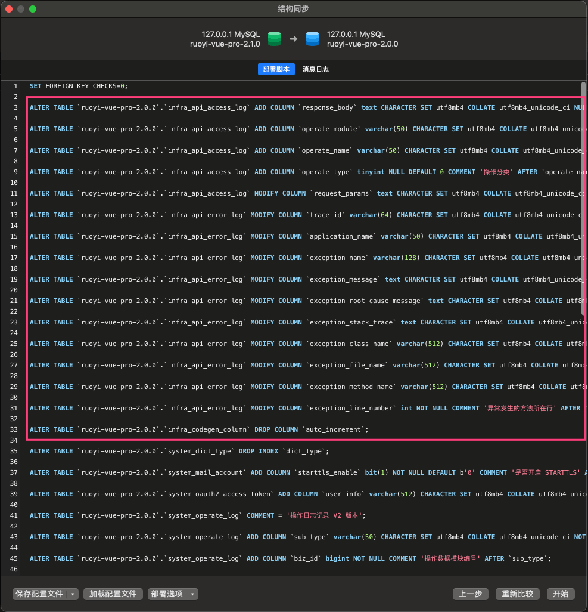
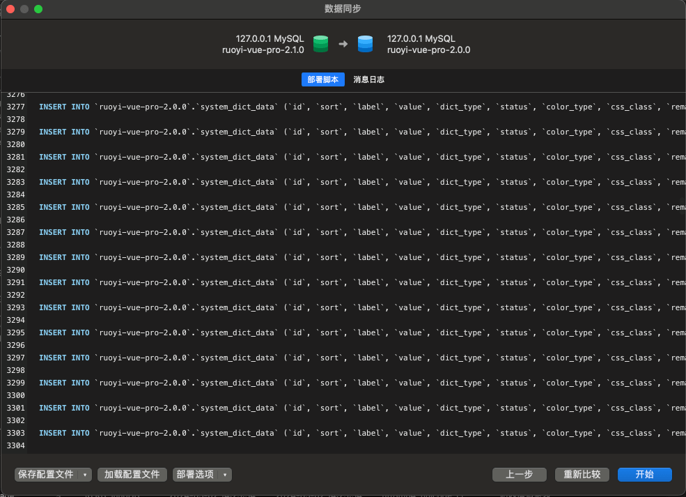

目录

# 表结构变更（版本升级）

系统每次发新版本，会伴随着数据库表结构、数据的变更。这个时候，我们可以通过 Navicat 提供的「结构同步」「数据同步」功能，来进行数据库的升级。



友情提示：

你自己的项目发布上线，如果涉及到数据库表结构的变更，也可以试试 Navicat 的「结构同步」「数据同步」功能。

我们之前项目，蛮多同学都是这么干的，避免漏字段！

## [#](#_1-结构同步) 1. 结构同步

本小节，我们以 `2.0.0` 版本升级到 `2.1.0` 版本为例。需要先自己初始化对应的两个数据库，如下图所示：



① 点击 Navicat 的 \[工具 -> 结构同步\] 菜单，配置源数据库是 `2.1.0`，目标数据库是 `2.0.0`，因为是将“新”应到“老”数据库。如下图所示：



② 点击左下角的 \[选项\] 按钮，取消掉“比较自动递增值”，因为我们不希望自增值也同步。如下图所示：



③ 点击右下角的 \[下一步\] 按钮，可以看到每个表的表更情况（新增、修改、删除）。如下图所示：



此时，如果你只想看部分表的变更，可以点击“源对象”下的选项，取消掉不需要同步的表。

④ 继续点击右下角的 \[下一步\] 按钮，可以看到具体的 SQL 变更语句。如下图所示：



注意，不要点击有效的 \[开始\] 按钮，而是将 SQL 语句复制出来，二次检查后，选择你需要的部分，手动执行变更！

友情提示：DataGrip 也提供类似功能，后面也可以尝试下。

[《使用 datagrip 实现不同数据库表之间的结构同步》 (opens new window)](https://blog.csdn.net/qq_43780340/article/details/125872609)

## [#](#_2-数据同步) 2. 数据同步

Navicat 的「数据同步」功能，和「结构同步」同步是一致的，只是在最后一步，会展示数据的变更情况（新增、修改、删除），这里就不重复演示了。



系统绝大多数表的数据变更不用关注，只需要关注偏 **全局配置** 的表，例如说：

*   字段相关：`system_dict_type`、`system_dict_data`
*   权限相关：`system_menu`
*   邮件相关：`system_mail_template`
*   短信相关：`system_sms_template`
*   站内信相关：`system_notify_template`

## [#](#_3-数据库转换) 3. 数据库转换

项目提供了 `sql/tools/convertor.py` 脚本，支持将 MySQL 转换为 Oracle、PostgreSQL、SQL Server、达梦、人大金仓、OpenGauss 等数据库的脚本。

疑问：什么时候需要转换数据库？

场景一：项目主要使用 MySQL 开发，其它数据库可能滞后，此时可以自己转换下。

场景二：项目类似 mall、bpm、ai、member、pay、crm、erp 等其它模块的数据库，只提供了 MySQL 的数据库脚本，此时也可以自己转换下。

### [#](#_3-1-实现原理) 3.1 实现原理

通过读取 MySQL 的 `sql/mysql/ruoyi-vue-pro.sql` 数据库文件，转换成对应的数据库脚本。

疑问：如果我想转换 mall、bpm、ai、member、pay、crm、erp 等其它模块的数据库，怎么办？

第一步，将对应的 SQL 拷贝到 `ssql/mysql/` 目录下。

第二步，将 `convertor.py` 脚本中的 `ruoyi-vue-pro.sql` 变量，修改为对应的 SQL 文件。

### [#](#_3-2-如何使用) 3.2 如何使用？

① 安装依赖库 `simple-ddl-parser`

```bash
pip install simple-ddl-parser
# pip3 install simple-ddl-parser

```

② 在 `sql/tools/` 目录下，执行如下命令打印生成 postgres 的脚本内容，其他可选参数有：`oracle`、`sqlserver`、`dm8`、`kingbase`、`opengauss`：

```bash
python3 convertor.py postgres
# python3 convertor.py postgres > tmp.sql

```

程序将 SQL 脚本打印到终端，可以重定向到临时文件 `tmp.sql`。

确认无误后，可以利用 IDEA 进行格式化。当然，也可以直接导入到数据库中。