目录

# 视频教程

## [#](#大纲) 大纲

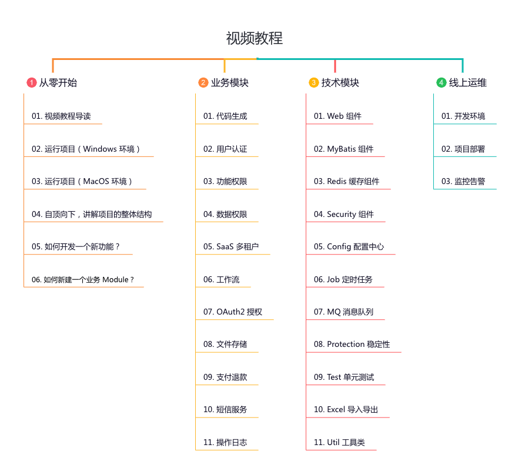

每个点都是大章节，包含 10-20 小节的视频。

*   每个视频，控制在 10 分钟左右，问题驱动，全程无废话，保证高质量的学习。
*   视频的内容，会带你理解整个系统的设计思想，每一个组件和模块的代码实现。

知其然，知其所以然！让你走出只会 CRUD 的困局~

支持手机、平板、电脑设备，随时随地在线观看，无需下载！

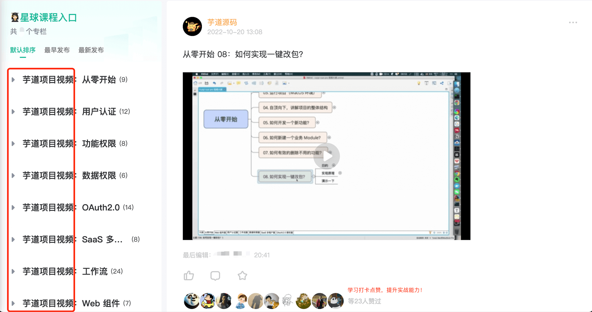

## [#](#技术架构图) 技术架构图

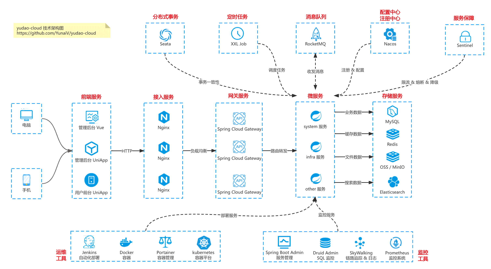

## [#](#为什么学习该视频) 为什么学习该视频？

学习的过程中，往往会碰到如下的问题：

*   一个人瞎摸索，走弯路，效率低
*   一脸懵逼，不知道如何学习
*   遇到问题，无人解答，信心备受打击
*   遇到一些难题，自己无法透彻理解
*   知识面狭窄，不知道的太多

而通过这套视频，可以实现 **“系统全面，效率高”** 的效果。

👍🏻 目前评价非常不错，点赞人数非常多。

学完之后，可以将项目写到简历里噢。如下图所示：

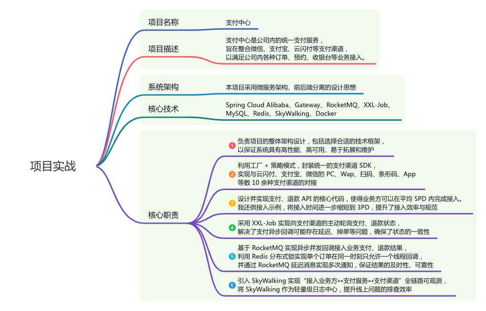

## [#](#获取方式) 获取方式

使用微信扫描下方二维码，即可获取~

## [#](#项目答疑) 项目答疑

如果你在使用 ruoyi-vue-pro 或 yudao-cloud 项目中碰到问题，可以直接发帖提问，并打上“项目答疑”标签。如下图所示：

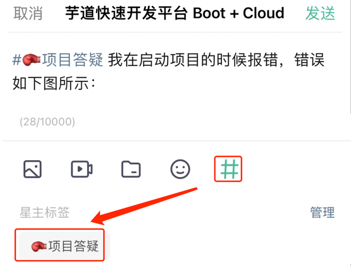

一般 6 小时内可以获得解答。解答的时间。一般在早通勤（9-10 点）、午饭（12-13 点）、晚饭（18 点）、晚通勤（21-22 点）。

例如说：

*   [【订单领域】你的订单系统如何从单体项目，演进微服务架构？主要解决什么问题？ (opens new window)](https://t.zsxq.com/103hhQe6S)
*   [【组件设计】基于 Redis 实现高性能、低延迟的延时消息的方案演进 (opens new window)](https://t.zsxq.com/11cwHMQVn)

## [#](#从零开始) 从零开始

*   [01、视频课程导读：项目简介、功能列表、技术选型 (opens new window)](https://t.zsxq.com/07rbyjM7A)
*   [02、在 Windows 环境下，如何运行前后端项目？ (opens new window)](https://t.zsxq.com/07BeiEA6Q)
*   [03、在 MacOS 环境下，如何运行前后端项目？ (opens new window)](https://t.zsxq.com/07FUNnYFm)
*   [04、自顶向下，讲解项目的整体结构（上） (opens new window)](https://t.zsxq.com/07FiIaQr3)
*   [04、自顶向下，讲解项目的整体结构（下） (opens new window)](https://t.zsxq.com/07yNfE6un)
*   [05、如何 5 分钟，开发一个新功能？ (opens new window)](https://t.zsxq.com/07Jm2vrzJ)
*   [06、如何 5 分钟，创建一个新模块？ (opens new window)](https://t.zsxq.com/07EUrZrNV)
*   [07、如何有效的删除不用的功能？ (opens new window)](https://t.zsxq.com/07Qr7ImIq)
*   [08、如何实现一键改包？ (opens new window)](https://t.zsxq.com/07yzBuZFu)

## [#](#用户认证) 用户认证

*   [01、如何实现管理后台和微信小程序的用户？ (opens new window)](https://t.zsxq.com/04vNfeY3V)
*   [02、如何实现用户的创建？ (opens new window)](https://t.zsxq.com/04AiUBiYr)
*   [03、如何实现用户的账号密码登录？ (opens new window)](https://t.zsxq.com/04rNbIUbi)
*   [04、如何实现用户的手机验证码登录？ (opens new window)](https://t.zsxq.com/04aQrjmAU)
*   [05、如何实现用户的退出？ (opens new window)](https://t.zsxq.com/04aqrFqRj)
*   [06、如何生成用户认证 Token 令牌？ (opens new window)](https://t.zsxq.com/04V3RFAmm)
*   [07、如何校验用户认证 Token 令牌？ (opens new window)](https://t.zsxq.com/04EqnuVz3)
*   [08、如何刷新用户认证 Token 令牌？ (opens new window)](https://t.zsxq.com/047uZj2vB)
*   [09、如何模拟用户认证 Token 令牌？ (opens new window)](https://t.zsxq.com/04QJuVB23)
*   [10、如何实现 URL 是否需要登录？ (opens new window)](https://t.zsxq.com/04vBiEyNR)
*   [11、如何实现微信、钉钉等第三方登录？ (opens new window)](https://t.zsxq.com/04Fyzbqb6)
*   [12、如何实现微信小程序的一键登录？ (opens new window)](https://t.zsxq.com/04NNbqNna)

## [#](#功能权限) 功能权限

*   [01、如何设计一套权限系统？ (opens new window)](https://t.zsxq.com/07nYzrfyz)
*   [02、如何实现菜单的创建？ (opens new window)](https://t.zsxq.com/07IuNBmAq)
*   [03、如何实现角色的创建？ (opens new window)](https://t.zsxq.com/07f6AuJuZ)
*   [04、如何给用户分配权限 —— 将菜单赋予角色？ (opens new window)](https://t.zsxq.com/07uJqV7Y3)
*   [05、如何给用户分配权限 —— 将角色赋予用户？ (opens new window)](https://t.zsxq.com/07YBe6QjA)
*   [06、后端如何实现 URL 权限的校验？ (opens new window)](https://t.zsxq.com/072ZVJurz)
*   [07、前端如何实现菜单的动态加载？ (opens new window)](https://t.zsxq.com/07rnMRRn2)
*   [08、前端如何实现按钮的权限校验？ (opens new window)](https://t.zsxq.com/072JeIUfY)

## [#](#数据权限) 数据权限

*   [01、如何实现数据权限（内核）—— 原理剖析？ (opens new window)](https://t.zsxq.com/06ZneEYZZ)
*   [02、如何实现数据权限（内核）—— 源码实现：MyBatis 如何重写 SQL？ (opens new window)](https://t.zsxq.com/06YFAeYR3)
*   [03、如何实现数据权限（内核）—— 源码实现：如何基于（数据规则）生成 WHERE 条件？ (opens new window)](https://t.zsxq.com/06yfYfQRZ)
*   [04、如何实现【部门级别】的数据权限 —— 入门使用？ (opens new window)](https://t.zsxq.com/06VzVRFqJ)
*   [05、如何实现【部门级别】的数据权限 —— 源码实现？ (opens new window)](https://t.zsxq.com/06fmq3Vrj)
*   [06、如何实现【自定义】的数据权限 —— 案例实战？ (opens new window)](https://t.zsxq.com/06zrFmQ7Q)

## [#](#oauth2-模块) OAuth2 模块

*   [01、快速入门 OAuth 2.0 授权？ (opens new window)](https://t.zsxq.com/06vb2bYvB)
*   [02、基于授权码模式，如何实现 SSO 单点登录？ (opens new window)](https://t.zsxq.com/06fUne6yZ)
*   [03、请求时，如何校验 accessToken 访问令牌？ (opens new window)](https://t.zsxq.com/06iuNRvjM)
*   [04、访问令牌过期时，如何刷新 Token 令牌？ (opens new window)](https://t.zsxq.com/06jAqFimu)
*   [05、登录成功后，如何获得用户信息？ (opens new window)](https://t.zsxq.com/06ne6e6aE)
*   [06、退出时，如何删除 Token 令牌？ (opens new window)](https://t.zsxq.com/06fUJIUfq)
*   [07、基于密码模式，如何实现 SSO 单点登录？ (opens new window)](https://t.zsxq.com/06rrrzBAu)
*   [08、如何实现客户端的管理？ (opens new window)](https://t.zsxq.com/06ubEmeII)
*   [09、单点登录界面，如何进行初始化？ (opens new window)](https://t.zsxq.com/06qjm2rbQ)
*   [10、单点登录界面，如何进行【手动】授权？ (opens new window)](https://t.zsxq.com/06AEQfA2j)
*   [11、单点登录界面，如何进行【自动】授权？ (opens new window)](https://t.zsxq.com/06JIQvrrN)
*   [12、基于【授权码】模式，如何获得 Token 令牌？ (opens new window)](https://t.zsxq.com/06jEQZNfE)
*   [13、基于【密码】模式，如何获得 Token 令牌？ (opens new window)](https://t.zsxq.com/06aEynUZF)
*   [14、如何校验、刷新、删除访问令牌？ (opens new window)](https://t.zsxq.com/06MbM3n2v)

## [#](#工作流) 工作流

*   [01、如何集成 Flowable 框架？ (opens new window)](https://t.zsxq.com/04aqfIiY3)
*   [02、如何实现动态的流程表单？ (opens new window)](https://t.zsxq.com/04nun2RRz)
*   [03、如何实现流程表单的保存？ (opens new window)](https://t.zsxq.com/04uneeaUb)
*   [04、如何实现流程表单的展示？ (opens new window)](https://t.zsxq.com/04jiMrjAm)
*   [05、如何实现流程模型的新建？ (opens new window)](https://t.zsxq.com/04iynUF6e)
*   [06、如何实现流程模型的流程图的设计？ (opens new window)](https://t.zsxq.com/04rNVbEQB)
*   [07、如何实现流程模型的流程图的预览？ (opens new window)](https://t.zsxq.com/042neybYz)
*   [08、如何实现流程模型的分配规则？ (opens new window)](https://t.zsxq.com/04uburRvZ)
*   [09、如何实现流程模型的发布？ (opens new window)](https://t.zsxq.com/04jUBMjyF)
*   [10、如何实现流程定义的查询？ (opens new window)](https://t.zsxq.com/04MF6URvz)
*   [11、如何实现流程的发起？ (opens new window)](https://t.zsxq.com/04jyvNfqj)
*   [12、如何实现我的流程列表？ (opens new window)](https://t.zsxq.com/046UFqRzz)
*   [13、如何实现流程的取消？ (opens new window)](https://t.zsxq.com/04aM72rzv)
*   [14、如何实现流程的任务分配？ (opens new window)](https://t.zsxq.com/04rNvFI2f)
*   [15、如何实现会签、或签任务？ (opens new window)](https://t.zsxq.com/04yFUVZvF)
*   [16、如何实现我的待办任务列表？ (opens new window)](https://t.zsxq.com/04QZzjAme)
*   [17、如何实现我的已办任务列表？ (opens new window)](https://t.zsxq.com/04uj6AQJE)
*   [18、如何实现任务的审批通过？ (opens new window)](https://t.zsxq.com/04Q7UbqBM)
*   [19、如何实现任务的审批不通过？ (opens new window)](https://t.zsxq.com/04BQvJM7y)
*   [20、如何实现流程的审批记录？ (opens new window)](https://t.zsxq.com/04Ie2v7m2)
*   [21、如何实现流程的流程图的高亮？ (opens new window)](https://t.zsxq.com/04R72rzzN)
*   [22、如何实现工作流的短信通知？ (opens new window)](https://t.zsxq.com/04eyRRJ2f)
*   [23、如何实现 OA 请假的发起？ (opens new window)](https://t.zsxq.com/04rFUjIei)
*   [24、如何实现 OA 请假的审批？ (opens new window)](https://t.zsxq.com/04fMJiufQ)

## [#](#saas-多租户) SaaS 多租户

*   [01、如何实现多租户的 DB 封装？ (opens new window)](https://t.zsxq.com/06ufyFAeM)
*   [02、如何实现多租户的 Redis 封装？ (opens new window)](https://t.zsxq.com/067eQfAQN)
*   [03、如何实现多租户的 Web 与 Security 封装？ (opens new window)](https://t.zsxq.com/06Nnm6QBE)
*   [04、如何实现多租户的 Job 封装？ (opens new window)](https://t.zsxq.com/06AYJUR3V)
*   [05、如何实现多租户的 MQ 与 Async 封装？ (opens new window)](https://t.zsxq.com/06aq3nuNF)
*   [06、如何实现多租户的 AOP 与 Util 封装？ (opens new window)](https://t.zsxq.com/06vFQVJIe)
*   [07、如何实现多租户的管理？ (opens new window)](https://t.zsxq.com/063bqRrNZ)
*   [08、如何实现多租户的套餐？ (opens new window)](https://t.zsxq.com/06rBI66yV)

## [#](#web-组件) Web 组件

*   [01、如何实现统一 API 前缀？ (opens new window)](https://t.zsxq.com/04mQr7aa6)
*   [02、如何实现统一 API 响应？ (opens new window)](https://t.zsxq.com/04Yj2JAqR)
*   [03、如何实现 API 全局异常处理？ (opens new window)](https://t.zsxq.com/04IyjYNFe)
*   [04、如何实现全局错误码？ (opens new window)](https://t.zsxq.com/04rVZVrzz)
*   [05、如何实现 API 接口文档？ (opens new window)](https://t.zsxq.com/04JQ3ZVVb)
*   [06、如何记录 API 访问日志？ (opens new window)](https://t.zsxq.com/04byrJaMF)
*   [07、如何校验 API 请求参数？ (opens new window)](https://t.zsxq.com/04NjQjIqb)

## [#](#更多学习内容) 更多学习内容

除了上述上述视频，还有面试招聘、源码解析、学习路线等内容。

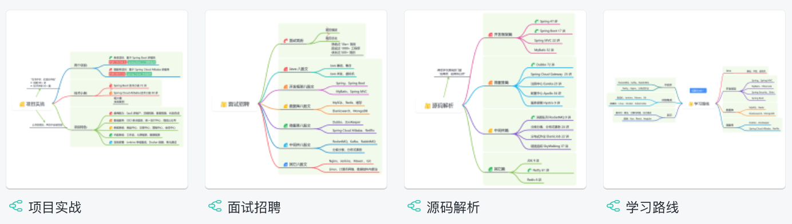

使用微信扫描下方二维码，即可获取~

### [#](#面试招聘) 面试招聘

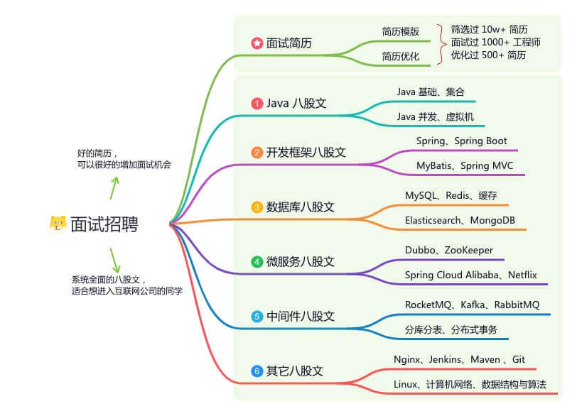

我是 11 年开始工作，之前在某互联网公司做基础架构的负责人，现在在某大厂做基础架构的技术主管。

“个人觉得，今年确实挺难的，但是互联网依然是国内最 top3 的职业选择”

#### [#](#简历优化) 简历优化

简历优化、简历模版、简历案例：帮助你获得更多面试机会，支持大厂专属内推，Offer 选择建议！

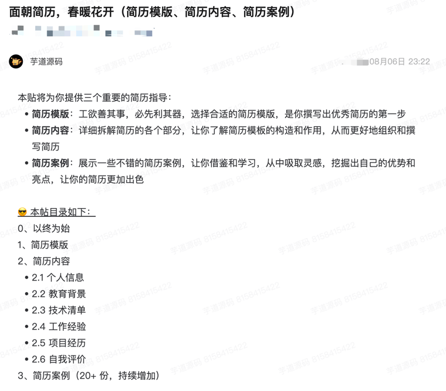

如下是一个简历优化的优化示例：

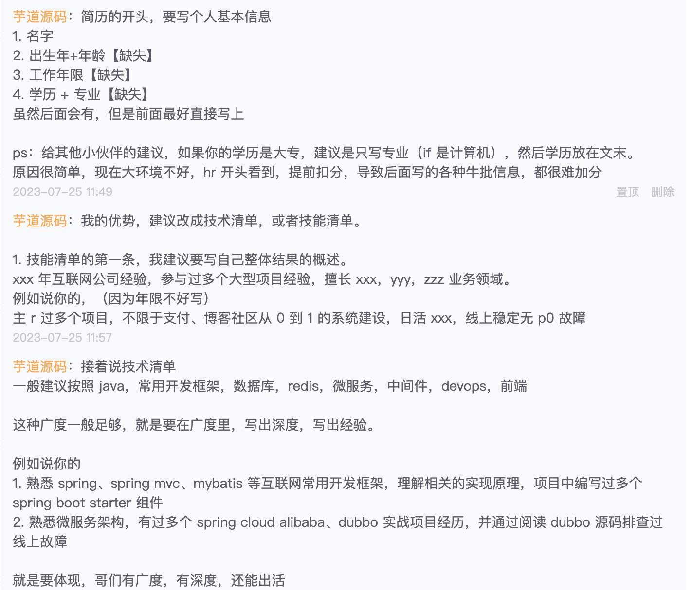

*   [《职业空窗 4 年，最近想找 Java 开发，简历要怎么包装工作经历、项目经验》 (opens new window)](https://t.zsxq.com/10yr34EXu)
*   [《23 届毕业生，现在在深圳连一个面试都约不到，简历应该怎么优化？》 (opens new window)](https://t.zsxq.com/10rzNEFKj)
*   [《硕二毕业生，成功拿到大厂 SP Offer！》 (opens new window)](https://t.zsxq.com/11UmuWH4e)
*   [《工作 2 年，学历一般，已经离职两个月，怎么提升简历？》 (opens new window)](https://t.zsxq.com/111NkfnoH)
*   [《杭州求职，毕业 2 年，第一次跳槽，如何完善项目经历？》 (opens new window)](https://t.zsxq.com/11SkXI7cn)

#### [#](#面试题库) 面试题库

涉及 20+ 技术栈，覆盖互联网主流问题，助你斩获心仪的 Offer

### [#](#源码解析) 源码解析

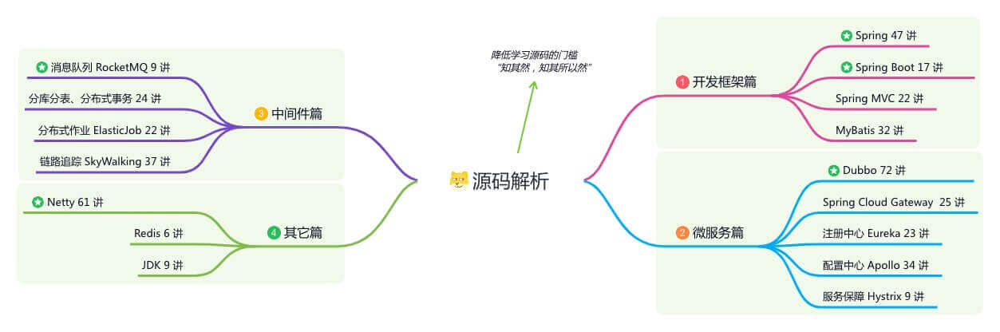

我阅读过 20+ 套优秀框架的源码，收获非常非常非常大。只有通过阅读源码，才能真正做到“知其然，知其所以然”。

从前我看很多技术的原理会很困惑，看过源码后豁然开朗。所以才有“原理让技术抽象化，源码让技术具象化”一说。

第一次阅读源码肯定不是一件容易的事情，但这是成为优秀工程师必备的技能之一。不过个人感觉，其实也就 1-2 个月痛苦下，后面真的没那么难~

#### [#](#开发框架篇) 开发框架篇

*   Spring 47 讲
*   Spring Boot 17 讲
*   Spring MVC 22 讲
*   MyBatis 32 讲

如果你是个源码萌新，建议按照“由易入难”的顺序来看：MyBatis => SpringMVC => Spring => Spring Boot 。

千万千万千万不要干看源码，而是要通过 Debug 调试的方式！！！

#### [#](#微服务篇) 微服务篇

*   Dubbo 72 讲
*   Spring Cloud Gateway 25 讲
*   注册中心 Eureka 23 讲
*   配置中心 Apollo 34 讲
*   服务保障 Hystrix 9 讲

建议阅读 Dubbo 源码解析，它是微服务架构的通信基石，可能是最值得死磕学习的。Dubbo 这种框架，是足够升多个 P8 工程师的。

#### [#](#中间件篇) 中间件篇

*   消息队列 RocketMQ 9 讲
*   分库分表 17 讲
*   分布式事务 7 讲
*   分布式作业 ElasticJob 22 讲
*   链路追踪 SkyWalking 37 讲

建议阅读 RocketMQ 源码解析，它是一个集大成者，包括了数据存储、高可用（主从同步）、RPC 通信、注册中心、配置中心等等方面的知识与代码实现。

如果说什么源码让我收获最大（可能没有之一），那真的就是 RocketMQ，当然它的挑战也非常大。

### [#](#学习路线) 学习路线

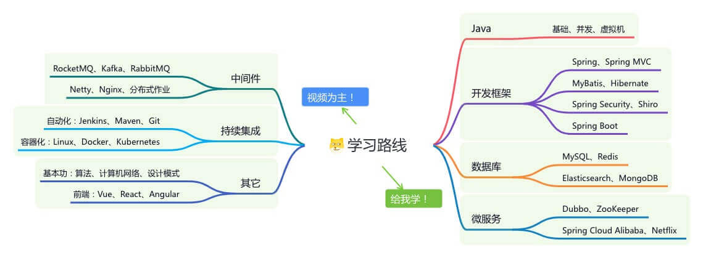

优质视频资源，涵盖互联网主流技术栈，全面系统学习，不走弯路。