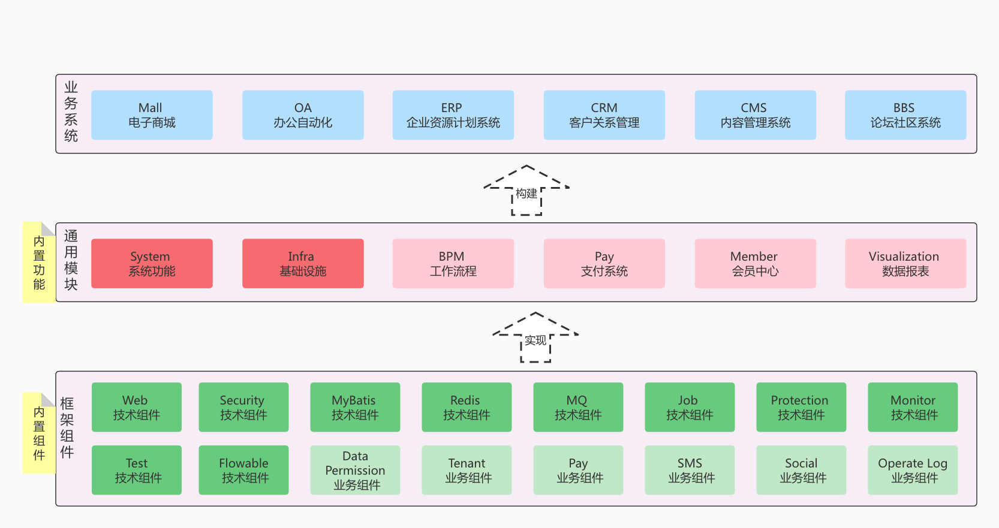
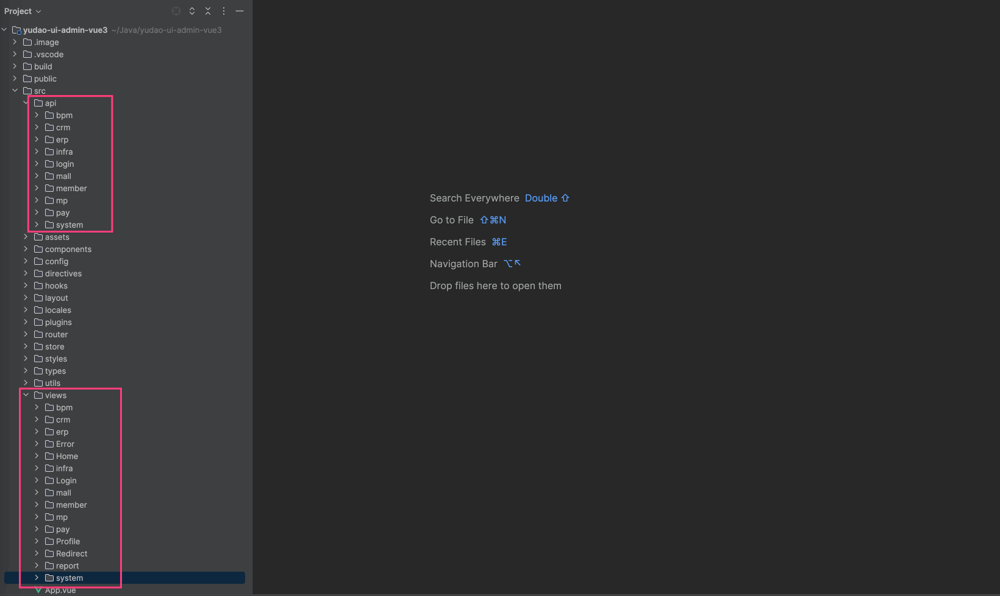
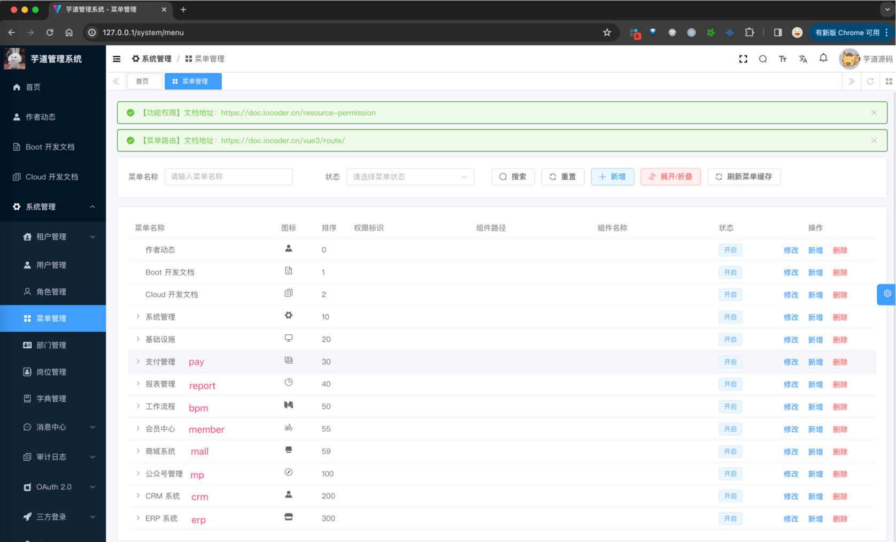

目录

# 迁移模块（适合新项目）

系统内置多种多种业务功能，可以用于快速你的业务系统：



*   通用模块（必选）：系统功能、基础设施
*   通用模块（可选）：工作流程、支付系统、数据报表、会员中心
*   业务系统（按需）：ERP 系统、CRM 系统、商城系统、微信公众号

系统分成两个版本：

版本

JDK 8 + Spring Boot 2.7

JDK 17/21 + Spring Boot 3.2

【完整版】[yudao-cloud (opens new window)](https://gitee.com/zhijiantianya/yudao-cloud)

[`master` (opens new window)](https://gitee.com/zhijiantianya/yudao-cloud/tree/master/) 分支

[`master-jdk17` (opens new window)](https://gitee.com/zhijiantianya/yudao-cloud/tree/master-jdk17/) 分支

【精简版】[yudao-cloud-mini (opens new window)](https://gitee.com/yudaocode/yudao-cloud-mini)

[`master` (opens new window)](https://gitee.com/yudaocode/yudao-cloud-mini/tree/master/) 分支

[`master-jdk17` (opens new window)](https://gitee.com/yudaocode/yudao-cloud-mini/tree/master-jdk17/) 分支

*   【完整版】：包括系统功能、基础设施、会员中心、数据报表、工作流程、商城系统、微信公众号、CRM、ERP 等功能
*   【精简版】：只包括系统功能、基础设施功能，不包括会员中心、数据报表、工作流程、商城系统、微信公众号、CRM、ERP 等功能

参考本文档，只需要 5-10 分钟，即可将【完整版】按需迁移到【精简版】。只需要完成以下 3 个步骤：

*   第一步，后端代码迁移
*   第二步，前端代码清理
*   第三步，数据库清理

友情提示：虽然有 3 个步骤，实际只要第一步做完就可以看到效果，候选两步只是为了清理的更干净

## [#](#_1-后端代码迁移) 1. 后端代码迁移

后端代码迁移，指的是将【完整版】的代码，复制张贴到【精简版】。

项目

说明

`yudao-module-member`

会员中心的 Module 模块

`yudao-module-pay`

支付系统的 Module 模块

`yudao-module-mall`

商城系统的 Module 模块

`yudao-module-erp`

ERP 系统的 Module 模块

`yudao-module-crm`

CRM 系统的 Module 模块

`yudao-module-mp`

微信公众号的 Module 模块

`yudao-module-report`

大屏报表 Module 模块

### [#](#_1-1-迁移步骤) 1.1 迁移步骤

① 第一步，选择一个你想要迁移的 Maven 模块的代码，复制粘贴过去。例如说：


② 第二步（可选），如果迁移的模块有 test 单元测试，需要删除对应的 `test` 目录，和 `yudao-spring-boot-starter-test` 依赖，如下图所示：

疑问：为什么要删除 test 目录和依赖呢？

因为【精简版】考虑到大家可能不需要单元测试，所以一并清理了。

* * *

下面，可以按照你的场景，进行一下操作。

注意！不需要每个场景都操作，只需要你需要的！！！

### [#](#_1-2-场景-我要做-bpm-工作流) 1.2 场景：我要做 BPM 工作流

将 `yudao-module-bpm` 模块，从【完整版】复制到【精简版】。然后参考 [《工作流手册》](/bpm/) 文档，测试迁移的正确性。

### [#](#_1-3-场景-我要做-crm-系统) 1.3 场景：我要做 CRM 系统

① 将 `yudao-module-bpm` 模块，从【完整版】复制到【精简版】。然后参考 [《工作流手册》](/bpm/) 文档，测试迁移的正确性。

② 将 `yudao-module-crm` 模块，从【完整版】复制到【精简版】。然后参考 [《CRM 系统手册》](/crm/build/) 文档，测试迁移的正确性。

### [#](#_1-4-场景-我要做-erp-系统) 1.4 场景：我要做 ERP 系统

将 `yudao-module-erp` 模块，从【完整版】复制到【精简版】。然后参考 [《ERP 系统手册》](/erp/build/) 文档，测试迁移的正确性。

### [#](#_1-5-场景-我要做-mall-商城) 1.5 场景：我要做 MALL 商城

① 将 `yudao-module-member` 模块，从【完整版】复制到【精简版】。然后参考 [《会员中心手册》](/member/build/) 文档，测试迁移的正确性。

② 将 `yudao-module-pay` 模块，从【完整版】复制到【精简版】。然后参考 [《支付系统手册》](/pay/build/) 文档，测试迁移的正确性。

③ 将 `yudao-module-mall` 模块，从【完整版】复制到【精简版】。然后参考 [《商城系统手册》](/mall/build/) 文档，测试迁移的正确性。

友情提示：因为 MALL 商城需要的模块比较多，我们其实也可以基于【完整版】，删除不需要的 Module 模块。

只需要删除 `yudao-module-erp`、`yudao-module-report`、`yudao-module-mp`、`yudao-module-bpm`、`yudao-module-crm` 模块，也是蛮方便的！

### [#](#_1-6-场景-我要做-report-大屏报表) 1.6 场景：我要做 REPORT 大屏报表

将 `yudao-module-report` 模块，从【完整版】复制到【精简版】。然后参考 [《大屏手册》](/report/) 文档，测试迁移的正确性。

### [#](#_1-7-其它场景补充) 1.7 其它场景补充

① 【会员】如果你要给你 C 端（会员）做一个 App 或者 H5，需要使用到「会员」功能，可以将 `yudao-module-member` 模块，从【完整版】复制到【精简版】。然后参考 [《会员中心手册》](/member/build/) 文档，测试迁移的正确性。

② 【支付】如果你的系统需要使用到支付宝、微信等支付功能，可以将 `yudao-module-pay` 模块，从【完整版】复制到【精简版】。然后参考 [《支付系统手册》](/pay/build/) 文档，测试迁移的正确性。

③ 【公众号】如果你的系统需要使用到微信公众号功能，可以将 `yudao-module-mp` 模块，从【完整版】复制到【精简版】。然后参考 [《公众号手册》](/mp/build/) 文档，测试迁移的正确性。

## [#](#_2-前端代码清理) 2. 前端代码清理

前端仓库，不区分【完整版】【精简版】，因为它本身就比较简单。只需要删除 `api` 和 `views` 下面对应的模块即可。如下图所示：



前端 `api` 和 `views` 下面的模块，对应后端的 `yudao-module-xxx` 模块。所以后端没有迁移的模块，前端也需要删除。

如果碰到 `remaining.ts` 路由报错，可见 [https://t.zsxq.com/69GWJ (opens new window)](https://t.zsxq.com/69GWJ) 帖子！

## [#](#_3-数据库清理) 3. 数据库清理

数据库的迁移，只设计到两份“配置”表：

*   菜单相关：`system_menu`
*   字典相关：`system_dict_data`、`system_dict_type`

### [#](#_3-1-清理菜单) 3.1 清理菜单

系统的菜单划分，也是按照模块来的。所以只需要删除没迁移的模块的菜单即可。如下图所示：



```sql
# 删除顶级菜单：name 需要换成想要删除模块的菜单名
DELETE FROM system_menu WHERE name = '支付管理';

# 删除子菜单：多次执行，直到 Affected rows: 0 影响条数为 0
DELETE FROM system_menu WHERE parent_id NOT IN (SELECT id FROM (SELECT id FROM system_menu) AS TEMP) AND parent_id > 0

# 删除关联表
DELETE FROM system_role_menu WHERE menu_id NOT IN (SELECT id FROM system_menu)

```

### [#](#_3-2-字典清理) 3.2 字典清理

字典的清理，可以通过 SQL 完成。

```sql
# 删除 `yudao-module-member` 不要的字典数据
DELETE FROM system_dict_type WHERE type LIKE 'member_%';
DELETE FROM system_dict_data WHERE dict_type LIKE 'member_%';

# 删除 `yudao-module-pay` 不要的字典数据
DELETE FROM system_dict_type WHERE type LIKE 'pay_%';
DELETE FROM system_dict_data WHERE dict_type LIKE 'pay_%';

# 删除 `yudao-module-mall` 不要的字典数据
DELETE FROM system_dict_type WHERE type LIKE 'product_%';
DELETE FROM system_dict_data WHERE dict_type LIKE 'product_%';
DELETE FROM system_dict_type WHERE type LIKE 'trade_%';
DELETE FROM system_dict_data WHERE dict_type LIKE 'trade_%';
DELETE FROM system_dict_type WHERE type LIKE 'promotion_%';
DELETE FROM system_dict_data WHERE dict_type LIKE 'promotion_%';
DELETE FROM system_dict_type WHERE type LIKE 'brokerage_enabled_condition_%';
DELETE FROM system_dict_data WHERE dict_type LIKE 'brokerage_enabled_condition_%';

# 删除 `yudao-module-erp` 不要的字典数据
DELETE FROM system_dict_type WHERE type LIKE 'erp_%';
DELETE FROM system_dict_data WHERE dict_type LIKE 'erp_%';

# 删除 `yudao-module-crm` 不要的字典数据
DELETE FROM system_dict_type WHERE type LIKE 'crm_%';
DELETE FROM system_dict_data WHERE dict_type LIKE 'crm_%';

# 删除 `yudao-module-mp` 不要的字典数据
DELETE FROM system_dict_type WHERE type LIKE 'mp_%';
DELETE FROM system_dict_data WHERE dict_type LIKE 'mp_%';

# 删除 `yudao-module-report` 不要的字典数据
DELETE FROM system_dict_type WHERE type LIKE 'report_%';
DELETE FROM system_dict_data WHERE dict_type LIKE 'report_%';

```