目录

# 服务监控

系统使用 Spring Boot Admin 和 SkyWalking 实现后端服务的监控。

## [#](#_1-spring-boot-admin) 1. Spring Boot Admin

阅读 [《芋道 Spring Boot 监控工具 Admin 入门》 (opens new window)](https://www.iocoder.cn/Spring-Boot/Admin/?yudao) 文章，入门 Spring Boot Admin。

注意，Spring Boot Admin 是内嵌在 `yudao-server` 后端项目中，无需单独启动。

### [#](#_1-1-如何配置) 1.1 如何配置？

在 [`application-local.yaml` (opens new window)](https://github.com/YunaiV/ruoyi-vue-pro/blob/master/yudao-server/src/main/resources/application-local.yaml#L136-L146) 配置文件中，通过 `spring.boot.admin` 配置项，设置 Spring Boot Admin 的配置。如下图所示：

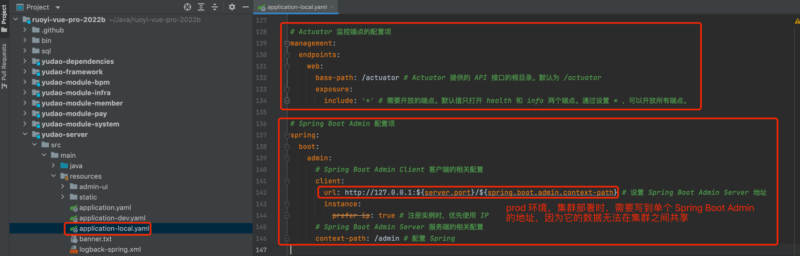

疑问：prod 生产环境下，后端部署多个 JVM 进程时，spring.boot.admin.client.url 填写哪个 IP？

*   第一步，在 Nginx 中配置 `/admin` 路径，转发到多个 JVM 的 IP 上，使用 [`backup` (opens new window)](https://blog.csdn.net/bolg_hero/article/details/73382117) 参数实现主备。注意，该转发只允许内网访问，避免安全问题！！！
*   第二步，设置 `spring.boot.admin.client.url` 配置项，为 Nginx 的 `内置 IP/admin` 地址。

重要！！！考虑到项目的启动速度，`local` 本地开发环境下，默认禁用了 Spring Boot Admin 的启动，可以参考下图进行开启：

① 在 `infra` 服务，删除这 3 行配置，开启 Spring Boot Admin 的 Server 和 UI 界面：

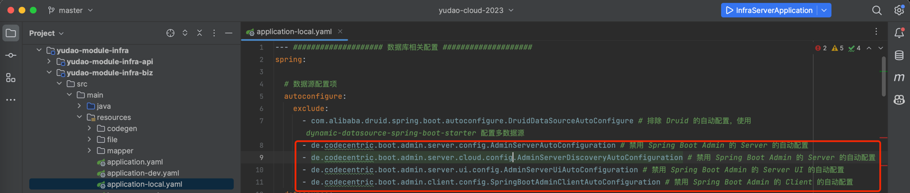

② 在 `system`、`pay` 等其它服务，删除这 1 行配置，开启 Spring Boot Admin 的 Client 注册：

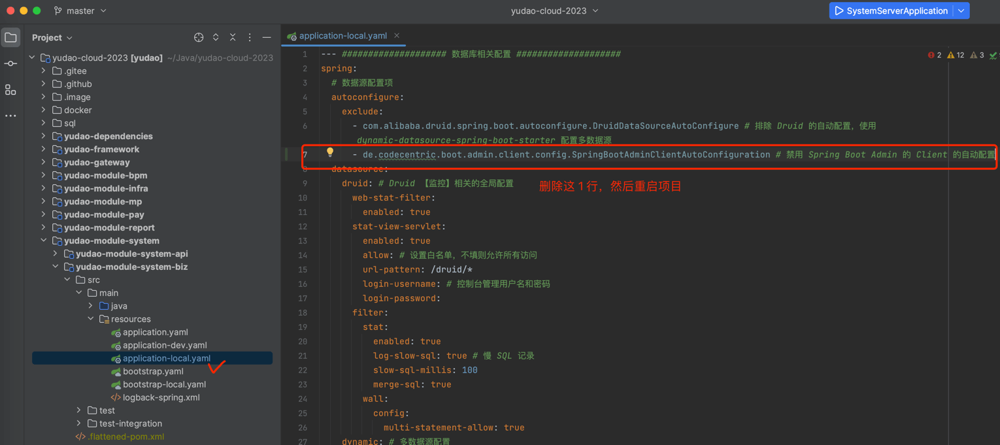

### [#](#_1-2-如何使用) 1.2 如何使用？

① 访问 [http://127.0.0.1:48080/admin/applications (opens new window)](http://127.0.0.1:48080/admin/applications) 地址，可以在 Spring Boot Admin 中，查看到应用与实例的列表。如下图所示：

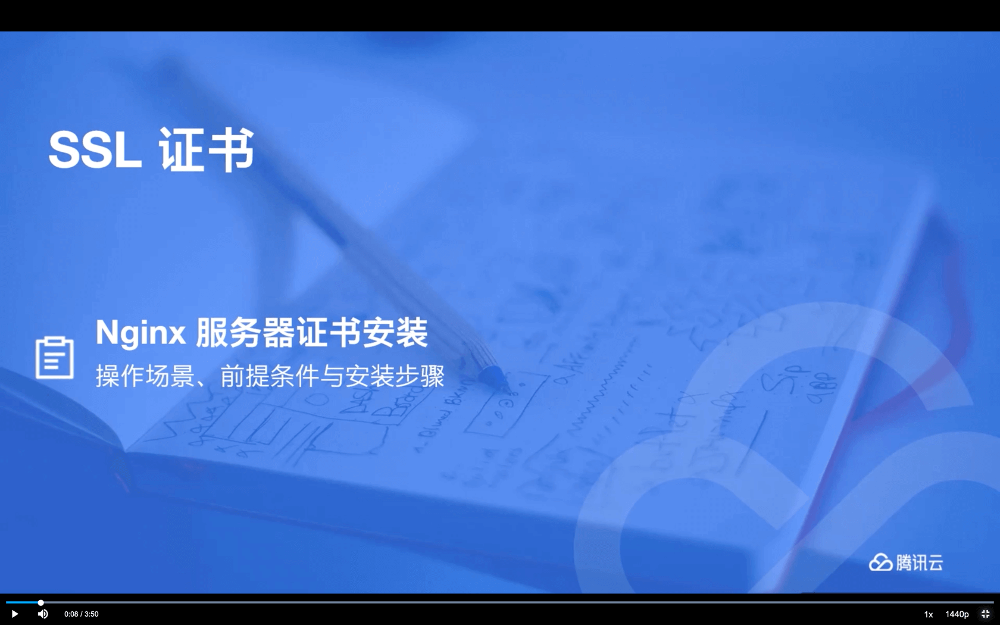

② 点击 `yudao-server` 应用，再点击实例，可以查看到该实例的细节信息。如下图所示：

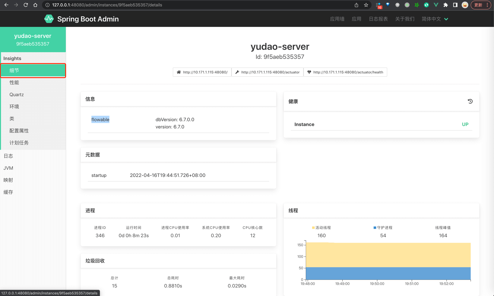

③ 点击 \[日志 -> 日志文件\] 菜单，查看该示例的日志内容。如下图所示：

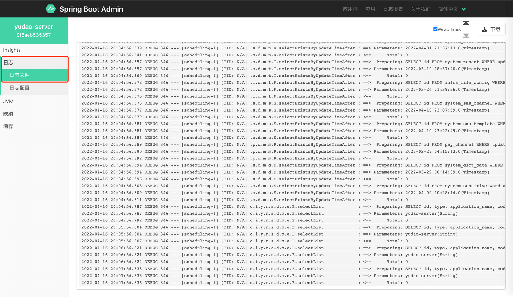

点击 \[日志 -> 日志文件\] 菜单，可动态修改 Logger 的日志级别，方便排查线上的某些 BUG。如下图所示：

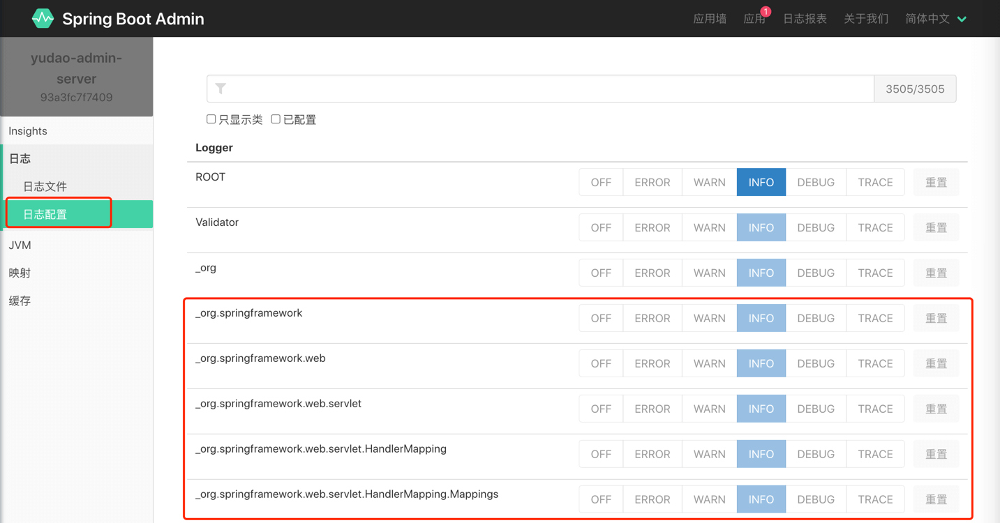

补充说明：也可以通过前端的 \[基础设施 -> 监控中心 -> Java 监控\] 菜单。

前端 \[基础设施 -> 监控中心 -> Java 监控\] 菜单，通过 iframe 内嵌后端 `/admin/applications` 路径。

如果你想自定义地址，可以前往 \[基础设置 -> 配置管理\] 菜单，设置 key 为 `url.spring-boot-admin` 配置项。

友情提示：CORS 跨域问题！

如果使用 [http://127.0.0.1:48080/admin/applications (opens new window)](http://127.0.0.1:48080/admin/applications) 访问时，它会存在跨域问题，类似 [https://wx.zsxq.com/dweb2/index/topic\_detail/1522481281485252 (opens new window)](https://wx.zsxq.com/dweb2/index/topic_detail/1522481281485252) 反馈。

目前的解决方案，使用 [http://127.0.0.1:48082/admin/applications (opens new window)](http://127.0.0.1:48082/admin/applications) 替代，不经过 Spring Cloud Gateway 转发。

未来的解决方案，可能会考虑把 Spring Boot Admin 从 `infra` 服务独立出去，作为一个纯粹的监控服务。

* * *

产生的原因是，在访问 `infra` 服务的 `admin/instances/6af44c477baf/actuator/metrics` 时，会返回多个 `Access-Control-Allow-Origin` 头，导致浏览器报 `has been blocked by CORS policy: The 'Access-Control-Allow-Origin' header contains multiple values` 错误。

进一步分析，因为 Spring Boot Admin 在 `infra` 服务中，它自己有跨域处理，然后请求别的 `system` 等服务获取监控数据的时候，又做了一次跨域处理，导致重复了！！！

### [#](#_1-3-如何开启登录) 1.3 如何开启登录？

生产环境下，建议 Spring Boot Admin 开启“安全认证”的功能，避免出现安全事故。

由于项目本身已经使用 Spring Security 做安全认证，再额外配置 Spring Boot Admin 的“安全认证”有点麻烦。我自己是拓展 Spring Security 解决，预计[需要改 2-3 个类 (opens new window)](https://yunai1024.notion.site/druid-admin-9d856cf606a74e5e9f07438b03b0142b?pvs=4)，不是很建议。

那么怎么办呢？可以参考 [《芋道 Spring Boot 监控工具 Admin 入门》 (opens new window)](https://www.iocoder.cn/Spring-Boot/Admin/) 文档，额外搭建一个 Spring Boot Admin 进程，然后项目接入它使用！

## [#](#_2-skywalking) 2. SkyWalking

阅读 [《芋道 SkyWalking 极简入门》 (opens new window)](https://www.iocoder.cn/SkyWalking/install/?yudao) 文章，入门 SkyWalking。

注意，SkyWalking 需要单独启动，预计需要 4 核 8G 的硬件资源。

### [#](#_2-1-如何配置) 2.1 如何配置？

① 在 [`logback-spring.xml` (opens new window)](https://github.com/YunaiV/ruoyi-vue-pro/blob/master/yudao-server/src/main/resources/logback-spring.xml) 配置文件中，添加 SkyWalking 收集日志的 appender 配置。如下图所示：

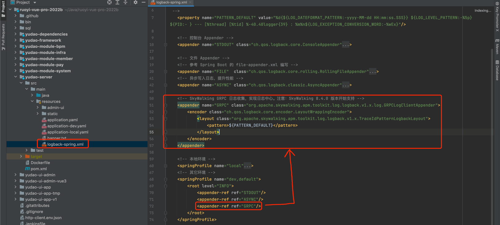

② 修改 SkyWalking 在前端项目的 \[基础设施 -> 监控中心 -> 链路追踪\] 对应的 [`skywaling/index.vue` (opens new window)](https://github.com/yudaocode/yudao-ui-admin-vue2/blob/master/src/views/infra/skywalking/index.vue#L11) 文件，调整为你 SkyWalking 的访问地址。如下图所示：

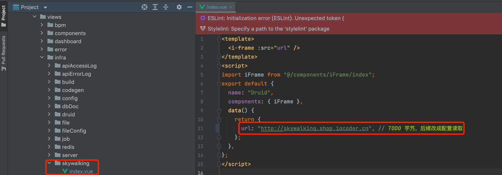

### [#](#_2-2-如何使用) 2.2 如何使用？

① 点击 \[基础设施 -> 监控中心 -> 链路追踪\] 菜单，可以看到 SkyWalking 提供的链路追踪。如下图所示：

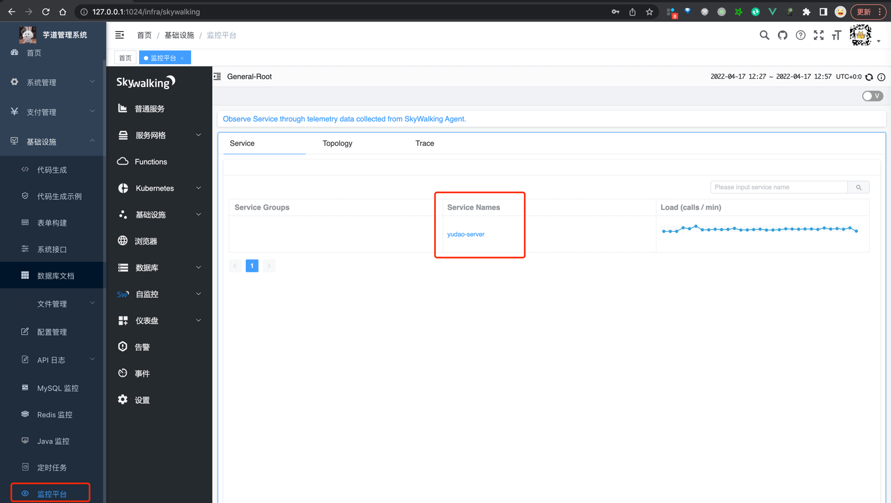

② 点击 `yudao-server` 服务，查看该服务的监控信息。如下图所示：

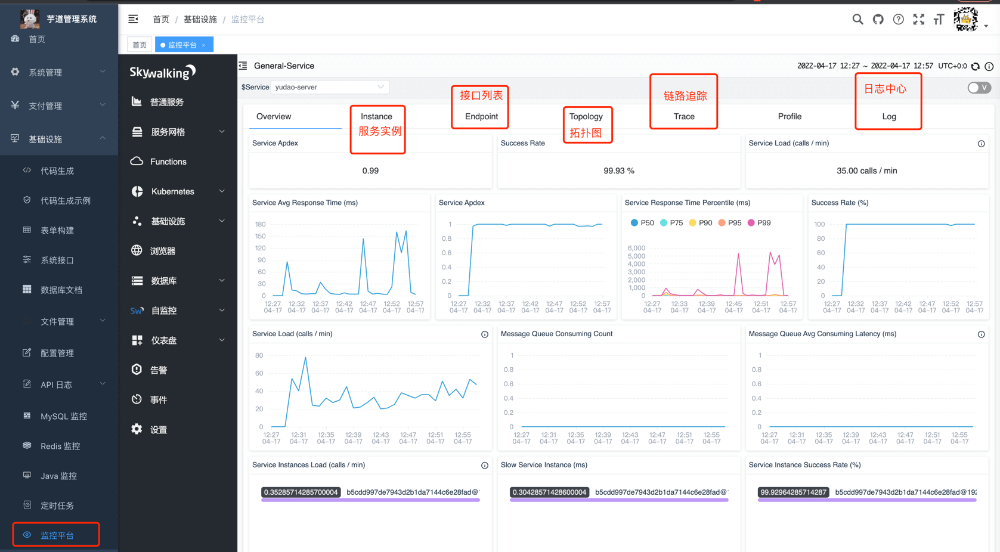

补充说明：

前端 \[基础设施 -> 监控中心 -> 链路追踪\] 菜单，通过 iframe 内嵌 `http://skywalking.iocoder.cn` 路径。

如果你想自定义地址，可以前往 \[基础设置 -> 配置管理\] 菜单，设置 key 为 `url.skywalking` 配置项。

## [#](#_3-更多监控系统) 3. 更多监控系统
### [#](#_3-1-prometheus) 3.1 Prometheus

参见 [《芋道 Prometheus + Grafana + Alertmanager 极简入门 》 (opens new window)](https://www.iocoder.cn/Prometheus/install/?yudao) 文章。

### [#](#_3-2-elk) 3.2 ELK

参见 [芋道 ELK(Elasticsearch + Logstash + Kibana) 极简入门 (opens new window)](https://www.iocoder.cn/Elasticsearch/ELK-install/?yudao) 文章。

### [#](#_3-3-sentry) 3.3 Sentry

参见 [《Sentry 极简入门 》 (opens new window)](https://www.iocoder.cn/Sentry/install/?yudao) 文章。