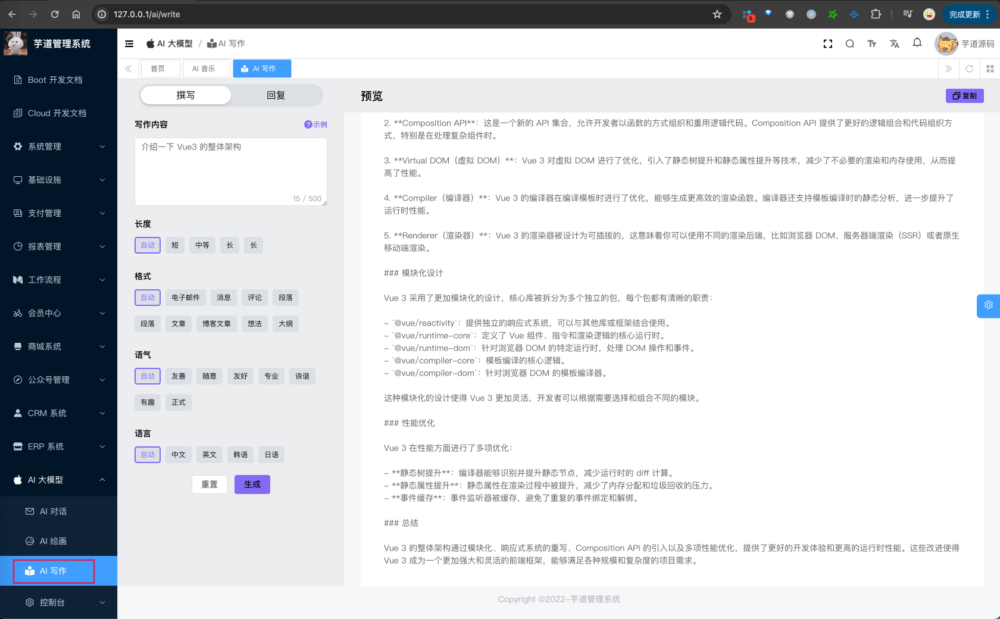
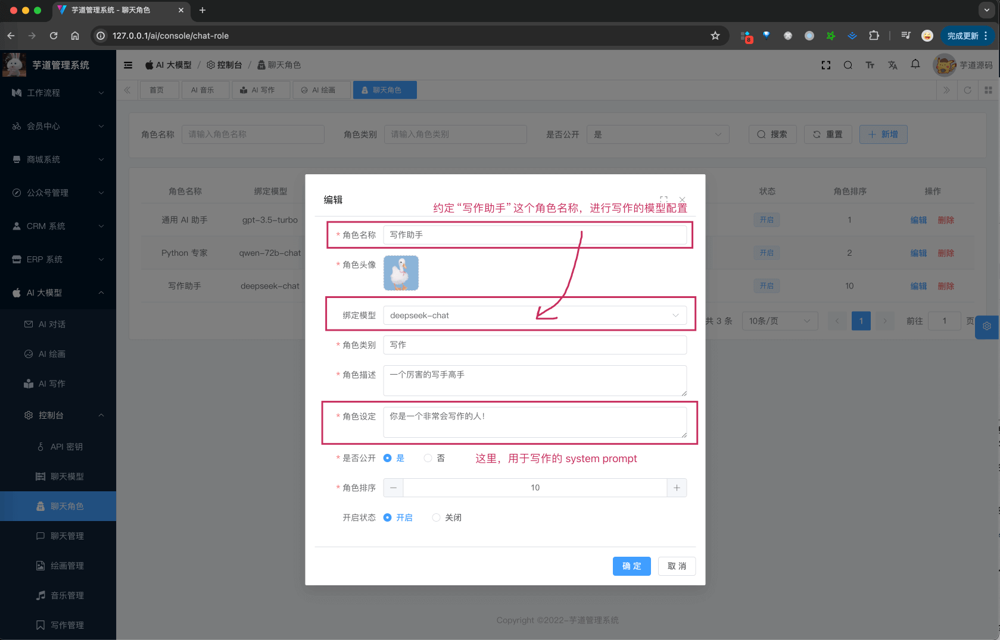
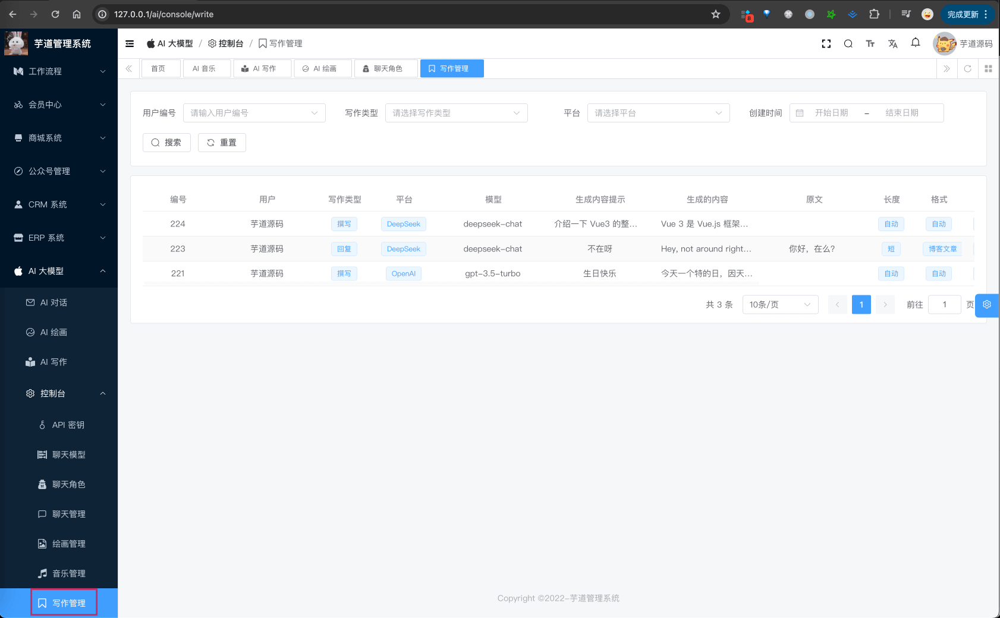

目录

# AI 写作助手

AI 写作，基于 LLM 大模型，实现文章的撰写、回复的功能。



整个功能，涉及到 2 个表：

*   【配置】`ai_api_key`：API 秘钥表
*   【写作】`ai_write`：写作记录表

下面，我们逐个表进行介绍，这个过程中也会讲讲对应的功能。

> 省略 creator/create\_time/updater/update\_time/deleted/tenant\_id 等通用字段

## [#](#_1-api-秘钥表) 1. API 秘钥表

在 [《AI 对话》](/ai/chat/) 中，我们已经介绍了 API 秘钥表，这里就不再赘述了。

你想使用哪个模型写作，可以参考对应的文档，进行配置：

*   国内模型：[《通义千问》](/ai/tongyi)、[《文心一言》](/ai/yiyan)、[《讯飞星火》](/ai/xinghuo)、[《智谱 GLM》](/ai/glm)、[《DeepSeek》](/ai/deep-seek)
*   国外模型：[《OpenAI（ChatGPT）》](/ai/openai)、[《LLAMA》](/ai/llama)、[《【微软 OpenAI】ChatGPT》](/ai/azure-openai) 、[《谷歌 Gemini》](/ai/gemini)

友情提示：

一般情况下，建议先使用 [《DeepSeek》](/ai/deep-seek) 模型，因为免费送了一些 tokens，可以先体验一下。

### [#](#_1-1-补充说明) 1.1 补充说明

AI 写作时，使用什么模型和 system prompt 呢？它分成两种情况：

① 情况一：通过【聊天角色】中的“写作助手”进行配置。如下图所示：



② 情况二：如果没有配置，那就会使用 `ai_chat_model` 表中的第一个模型（排序 `sort` 最小的）。同时，它对应的 system prompt 在 AiChatRoleEnum 的 `AI_WRITE_ROLE` 进行配置。

## [#](#_2-写作记录表) 2. 写作记录表

写作记录表，用户每发起一次写作，都会记录一条记录。

### [#](#_2-1-表结构) 2.1 表结构

```sql
CREATE TABLE `ai_write` (
  `id` bigint NOT NULL AUTO_INCREMENT COMMENT '编号',
  `user_id` bigint NOT NULL COMMENT '用户编号',
  
  `type` int DEFAULT NULL COMMENT '写作类型',
  `original_content` varchar(5120) CHARACTER SET utf8mb4 COLLATE utf8mb4_0900_bin DEFAULT NULL COMMENT '原文',
  
  `platform` varchar(255) CHARACTER SET utf8mb4 COLLATE utf8mb4_0900_bin NOT NULL COMMENT '平台',
  `model` varchar(255) CHARACTER SET utf8mb4 COLLATE utf8mb4_0900_bin NOT NULL COMMENT '模型',
  
  `prompt` varchar(512) CHARACTER SET utf8mb4 COLLATE utf8mb4_0900_bin NOT NULL COMMENT '生成内容提示',
  `generated_content` varchar(5120) CHARACTER SET utf8mb4 COLLATE utf8mb4_0900_bin DEFAULT NULL COMMENT '生成的内容',
  
  `length` tinyint DEFAULT NULL COMMENT '长度提示词',
  `format` tinyint DEFAULT NULL COMMENT '格式提示词',
  `tone` tinyint DEFAULT NULL COMMENT '语气提示词',
  `language` tinyint DEFAULT NULL COMMENT '语言提示词',
  
  `error_message` varchar(255) CHARACTER SET utf8mb4 COLLATE utf8mb4_0900_bin DEFAULT NULL COMMENT '错误信息',
  PRIMARY KEY (`id`) USING BTREE
) ENGINE=InnoDB AUTO_INCREMENT=225 DEFAULT CHARSET=utf8mb4 COLLATE=utf8mb4_0900_bin COMMENT='AI 写作表';

```

① `user_id` 字段：对应 `system_users` 表的 `id` 字段，表示哪个用户生成的写作。

② `type` 字段：表示写作类型，对应 AiWriteTypeEnum 枚举，目前有两个类型：撰写文章、回复文章。

当回复文章时，`original_content` 字段表示原文（被回复文章）。

③ `platform` 字段：表示平台，对应 AiPlatformEnum 枚举，目前支持多个 AI 大模型。

`model` 字段：表示模型标识，对应不同的平台的模型标识，例如说 OpenAI 的 `gpt-3.5-turbo`、`gpt-4-turbo`，通义千问的 `qwen-plus`、`qwen-max` 等等。

④ `prompt` 字段：表示生成内容提示，用户输入的文本。

`generated_content` 字段：表示生成的内容，AI 生成的文本。

⑤ `length`、`format`、`tone`、`language` 字段：表示长度、格式、语气、语言提示词。它们是有数据字典枚举，分别对应 `ai_write_length`、`ai_write_format`、`ai_write_tone`、`ai_write_language`。

⑥ `error_message` 字段：表示错误信息。由于写作是 stream 流式生成，所以可能会出现错误，这时会记录错误信息。

## [#](#_2-2-管理后台) 2.2 管理后台

① 前端对应 \[AI 大模型 -> AI 写作\] 菜单，对应 `yudao-ui-admin-vue3` 项目的 `@/views/ai/write/index` 目录，提供给普通用户使用，生成写作。


它的后端 HTTP 接口，由 `yudao-module-ai` 模块的 `write` 包的 AiWriteController 实现。

最最最关键的代码！！！大家可以重点看看！！！

AiWriteController 提供的 `#generateWriteContent(...)` 写作接口。

它的内部，调用 Spring AI 的 StreamingChatClient 来实现大模型的调用。

② 前端对应 \[AI 大模型 -> 控制台 -> 写作管理\] 菜单，对应 `yudao-ui-admin-vue3` 项目的 `@/views/ai/write/mananger` 目录，提供给管理员使用，查看写作记录。

