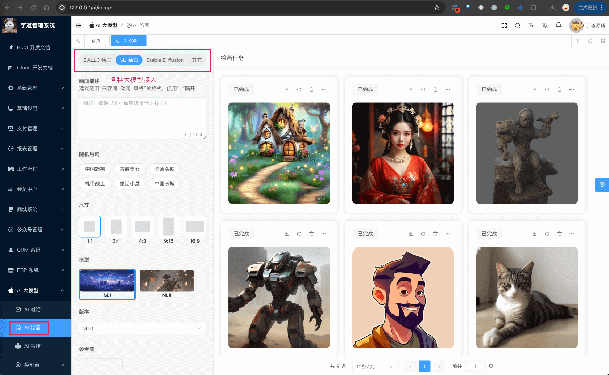

目录

# AI 绘画创作

AI 绘画，基于 LLM 大模型，实现使用文本生成图片的功能。目前接入的是：

*   OpenAI 的 DALL 模型
*   StabilityAI 的 Stable Diffusion 模型
*   Midjourney 的 Midjourney 模型



整个功能，涉及到 2 个表：

*   【配置】`ai_api_key`：API 秘钥表
*   【绘画】`ai_image`：绘画记录表

下面，我们逐个表进行介绍，这个过程中也会讲讲对应的功能。

> 省略 creator/create\_time/updater/update\_time/deleted/tenant\_id 等通用字段

补充说明：

AI 绘画只是 AI 在 Image 图片中的一种场景，实际还有图片解析（识别）、图片合并等等，后续根据情况接入。

不过有一点比较尴尬，项目所使用的 Spring AI 库，目前只支持“文本生成图片”的功能，其它功能貌似没有计划，这样导致后续需要自己逐个集成！

## [#](#_1-api-秘钥表) 1. API 秘钥表

在 [《AI 对话》](/ai/chat/) 中，我们已经介绍了 API 秘钥表，这里就不再赘述了。

你想使用哪个模型绘画，可以参考对应的文档，进行配置：

*   通义千问的万象模型：[《【模型接入】通义千问》](/ai/tongyi)
*   文心一言的 ernie\_Vilg 模型：[《【模型接入】文心一言》](/ai/yiyan)
*   智谱 GLM 的 CogView 模型：[《【模型接入】智谱 GLM》](/ai/glm)
*   OpenAI 的 DALL 模型：[《【模型接入】OpenAI》](/ai/openai)
*   StabilityAI 的 Stable Diffusion 模型：[《【模型接入】Stable Diffusion》](/ai/stable-diffusion)
*   Midjourney 的 Midjourney 模型：[《【模型接入】Midjourney》](/ai/midjourney)

另外，文心一言、星火等模型，也可以用来绘画，后续会看情况接入！

友情提示：

一般情况下，建议先使用 [《【模型接入】通义千问》](/ai/tongyi) 模块，因为免费送了一些 tokens，可以先体验一下。

## [#](#_2-绘画记录表) 2. 绘画记录表

绘画记录表，用户每发起一次“文本生成图片”，都会记录一条记录。

### [#](#_2-1-表结构) 2.1 表结构

```sql
CREATE TABLE `ai_image` (
  `id` bigint NOT NULL AUTO_INCREMENT COMMENT '编号',
  `user_id` bigint NOT NULL COMMENT '用户编号',
  `public_status` bit(1) NOT NULL COMMENT '是否发布',

  `platform` varchar(64) CHARACTER SET utf8mb4 COLLATE utf8mb4_unicode_ci NOT NULL COMMENT '平台',
  `model` varchar(64) CHARACTER SET utf8mb4 COLLATE utf8mb4_unicode_ci NOT NULL COMMENT '模型',
  
  `prompt` varchar(2000) CHARACTER SET utf8mb4 COLLATE utf8mb4_unicode_ci NOT NULL COMMENT '提示词',
  `width` int NOT NULL COMMENT '图片宽度',
  `height` int NOT NULL COMMENT '图片高度',
  `options` json DEFAULT NULL COMMENT '绘制参数',
  
  `status` tinyint NOT NULL COMMENT '绘画状态',
  `pic_url` varchar(2048) CHARACTER SET utf8mb4 COLLATE utf8mb4_unicode_ci DEFAULT NULL COMMENT '图片地址',
  `error_message` varchar(1024) CHARACTER SET utf8mb4 COLLATE utf8mb4_unicode_ci DEFAULT NULL COMMENT '错误信息',
  
  `task_id` varchar(1024) CHARACTER SET utf8mb4 COLLATE utf8mb4_0900_bin DEFAULT NULL COMMENT '任务编号',
  `buttons` varchar(2048) CHARACTER SET utf8mb4 COLLATE utf8mb4_0900_bin DEFAULT NULL COMMENT 'mj buttons 按钮',
  PRIMARY KEY (`id`)
) ENGINE=InnoDB AUTO_INCREMENT=131 DEFAULT CHARSET=utf8mb4 COLLATE=utf8mb4_unicode_ci COMMENT='AI 绘画表';

```

① `user_id` 字段：对应 `system_users` 表的 `id` 字段，表示哪个用户生成的图片。

`public_status` 字段：表示是否发布，默认为 `false` 不发布（不公开）。管理员可以在后台操作，设置某个图片为发布（公开）。

② `platform` 字段：表示平台，对应 AiPlatformEnum 枚举，目前支持多个 AI 大模型。

`model` 字段：表示模型标识，对应不同的平台的模型标识，例如说 OpenAI 的 `dall-e-3`、`dall-e-2`，StabilityAI 的 `stable-diffusion-v1-6` 等等。

③ `prompt` 字段：表示提示词，用户输入的文本。

`width`、`height` 字段：表示图片的宽度、高度。

`options` 字段：表示绘制参数，JSON 格式，因为不同平台有不同的参数。例如说：OpenAI 的 OpenAiImageOptions、StabilityAI 的 StabilityAiImageOptions 拓展参数。

④ `status` 字段：表示绘画状态，对应 AiImageStatusEnum 枚举，目前有 10 进行中、20 生成成功、30 生成失败。因为绘图比较耗时，所以它的整体流程是：

*   用户发起绘画请求，先插入一条状态为 10 进行中的 `ai_image` 记录
*   后端异步调用 AI 大模型，生成图片。生成成功后，更新状态为 20 生成成功
*   前端轮询查询，如果状态为 20 生成成功，就显示图片

`pic_url` 字段：表示图片地址，生成成功后，会把图片地址存储在这里。

`error_message` 字段：表示错误信息，生成失败后，会把错误信息存储在这里。

⑤ `task_id` 字段：Midjourney 的生成图片是异步的，所以需要一个任务编号，用来查询生成状态。

`buttons` 字段：Midjourney 生成图片后，会返回一些按钮，用来操作图片。这个字段存储这些按钮。

### [#](#_2-2-管理后台) 2.2 管理后台

① 前端对应 \[AI 大模型 -> AI 绘图\] 菜单，对应 `yudao-ui-admin-vue3` 项目的 `@/views/ai/image/index` 目录，提供给普通用户使用，生成图片。


它的后端 HTTP 接口，由 `yudao-module-ai` 模块的 `image` 包的 AiImageController 实现。

最最最关键的代码！！！大家可以重点看看！！！

AiImageController 提供的 `#drawImage(...)` 生成图片接口。

它的内部，调用 Spring AI 的 ImageModel 来实现大模型的调用。

另外，通义千问、文心一言、智谱等模型的绘图，在【其它】里面使用。TODO 芋艿：重新截图

② 前端对应 \[AI 大模型 -> 控制台 -> 绘图管理\] 菜单，对应 `yudao-ui-admin-vue3` 项目的 `@/views/ai/image/mananger` 目录，提供给管理员使用，查看绘画记录。

