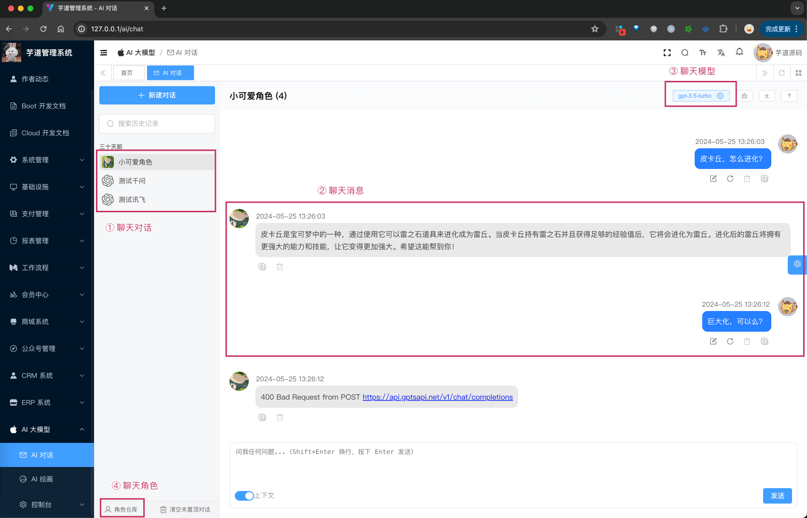
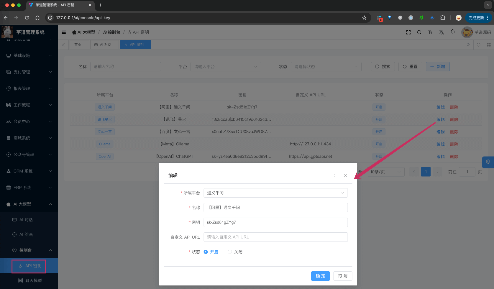
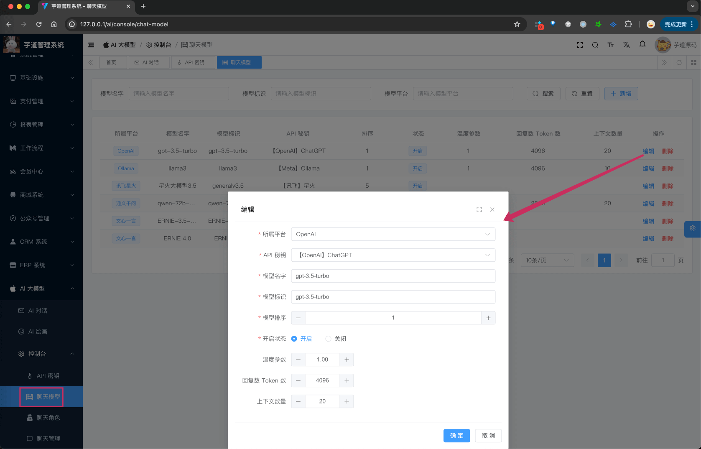
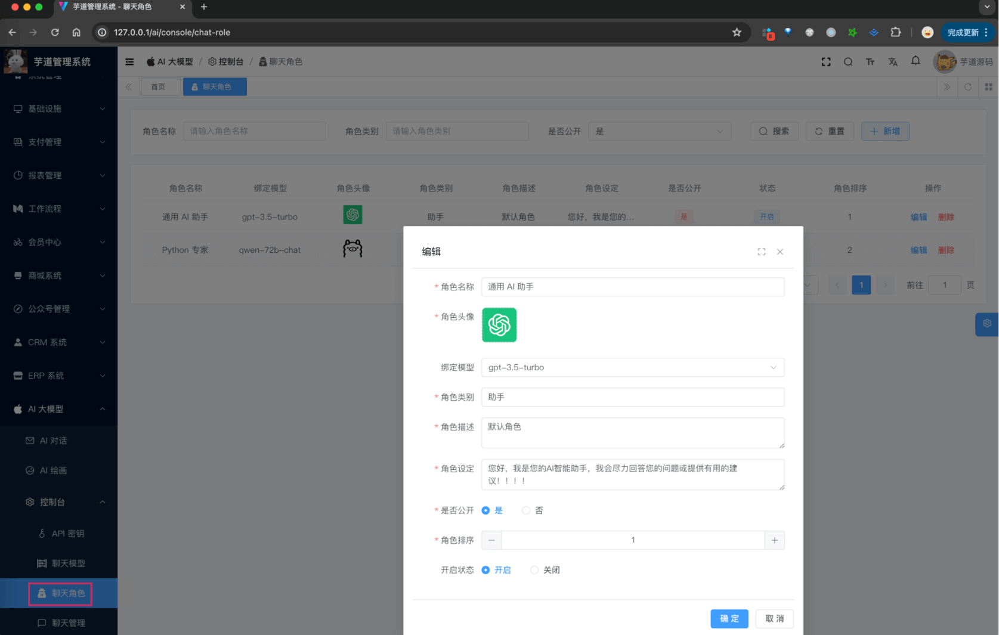
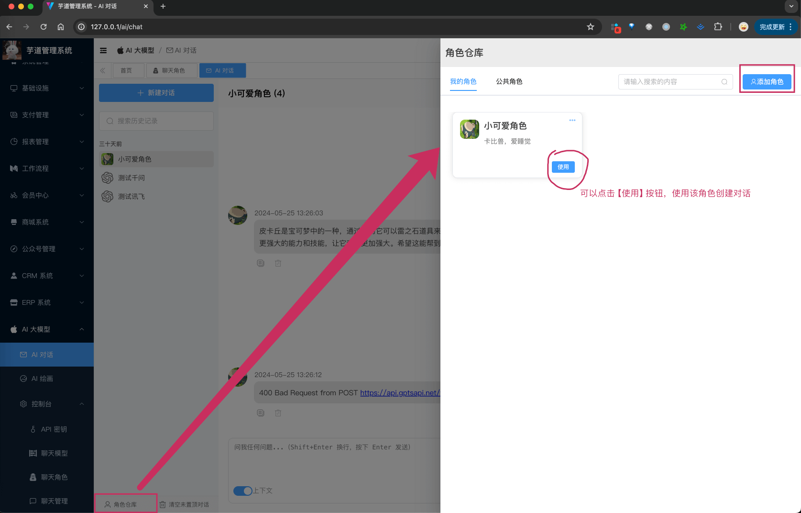
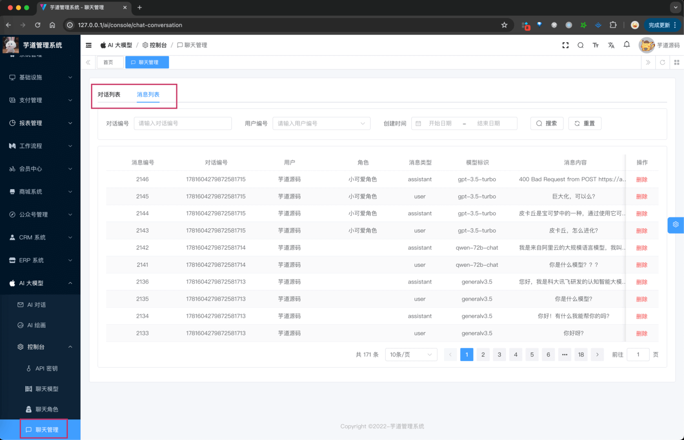

目录

# AI 聊天对话

AI 对话，基于 LLM 大模型，实现智能聊天的功能。

说白了，就是和机器人聊天。高级点，就是智能问答！



整个功能，涉及到 5 个表（上图可以看到 4 个）：

*   【配置】`ai_api_key`：API 秘钥表
*   【配置】`ai_chat_model`：聊天模型表
*   【配置】`ai_chat_role`：聊天角色表
*   【对话】`ai_chat_conversation`：聊天对话表
*   【对话】`ai_chat_message`：聊天消息表

下面，我们逐个表进行介绍，这个过程中也会讲讲对应的功能。

> 省略 creator/create\_time/updater/update\_time/deleted/tenant\_id 等通用字段

## [#](#_1-api-秘钥表) 1. API 秘钥表

API 秘钥表，顾名思义，就是存储 AI 大模型的 API 密钥的表。

### [#](#_1-1-表结构) 1.1 表结构

```sql
CREATE TABLE `ai_api_key` (
  `id` bigint NOT NULL AUTO_INCREMENT COMMENT '编号',
  `name` varchar(255) COLLATE utf8mb4_unicode_ci NOT NULL COMMENT '名称',
  `platform` varchar(255) COLLATE utf8mb4_unicode_ci NOT NULL COMMENT '平台',
  `api_key` varchar(255) CHARACTER SET utf8mb4 COLLATE utf8mb4_unicode_ci NOT NULL COMMENT '密钥',
  `url` varchar(255) CHARACTER SET utf8mb4 COLLATE utf8mb4_unicode_ci DEFAULT NULL COMMENT '自定义 API 地址',
  `status` int NOT NULL COMMENT '状态',
  PRIMARY KEY (`id`)
) ENGINE=InnoDB AUTO_INCREMENT=7 DEFAULT CHARSET=utf8mb4 COLLATE=utf8mb4_unicode_ci COMMENT='AI API 密钥表';

```

① `platform` 字段：表示平台，对应 AiPlatformEnum 枚举，目前支持多个 AI 大模型：

*   国内：【百度】文心一言、【阿里】通义千问、【讯飞】星火
*   国外：【OpenAI】GPT、【Meta】Llama、【Google】Gemini

② `api_key` 字段：表示 API 密钥，对应不同的平台的密钥，例如说 OpenAI 的 API KEY。但是要注意，有些平台是多个值，例如说文心一言是 `appKey` + `secretKey` 组合，那它在 `api_key` 就是 `${appKey}|${secretKey}`。

`url` 字段：表示自定义 API 地址。一般情况下不需要配置，除非你有自定义的需求，例如说 OpenAI 使用 API 中转。

具体它们怎么配置，或者怎么部署，可见对应的文档：

*   国内模型：[《通义千问》](/ai/tongyi)、[《文心一言》](/ai/yiyan)、[《讯飞星火》](/ai/xinghuo)、[《智谱 GLM》](/ai/glm)、[《DeepSeek》](/ai/deep-seek)
*   国外模型：[《OpenAI（ChatGPT）》](/ai/openai)、[《LLAMA》](/ai/llama)、[《微软 OpenAI（ChatGPT）》](/ai/azure-openai)、[《谷歌 Gemini》](/ai/gemini)

友情提示：

一般情况下，建议先使用 [《DeepSeek》](/ai/deep-seek) 模型，因为免费送了一些 tokens，可以先体验一下。

### [#](#_1-2-管理后台) 1.2 管理后台

前端对应 \[AI 大模型 -> 控制台 -> API 密钥\] 菜单，对应 `yudao-ui-admin-vue3` 项目的 `@/views/ai/model/apiKey` 目录。



它的后端 HTTP 接口，由 `yudao-module-ai` 模块的 `model` 包的 AiApiKeyController 实现。

## [#](#_2-聊天模型表) 2. 聊天模型表

聊天模型表，配置每个平台下有哪些可用的模型。

### [#](#_2-1-表结构) 2.1 表结构

```sql
CREATE TABLE `ai_chat_model` (
  `id` bigint NOT NULL AUTO_INCREMENT COMMENT '编号',
  `name` varchar(64) CHARACTER SET utf8mb4 COLLATE utf8mb4_unicode_ci NOT NULL COMMENT '模型名字',
  `sort` int NOT NULL COMMENT '排序',
  `status` tinyint NOT NULL COMMENT '状态',
  
  `key_id` bigint NOT NULL COMMENT 'API 秘钥编号',
  `platform` varchar(32) CHARACTER SET utf8mb4 COLLATE utf8mb4_unicode_ci NOT NULL COMMENT '模型平台',

  `model` varchar(64) CHARACTER SET utf8mb4 COLLATE utf8mb4_unicode_ci NOT NULL COMMENT '模型标识',

  `temperature` double DEFAULT NULL COMMENT '温度参数',
  `max_tokens` int DEFAULT NULL COMMENT '单条回复的最大 Token 数量',
  `max_contexts` int DEFAULT NULL COMMENT '上下文的最大 Message 数量',
  PRIMARY KEY (`id`)
) ENGINE=InnoDB AUTO_INCREMENT=15 DEFAULT CHARSET=utf8mb4 COLLATE=utf8mb4_unicode_ci COMMENT='AI 聊天模型表';

```

① `key_id` 字段：表示 API 秘钥编号，对应 `ai_api_key` 表的 `id` 字段。

`platform` 字段：表示模型平台，冗余 `ai_api_key` 表的 `platform` 字段。

② `model` 字段：表示模型标识，对应不同的平台的模型标识，例如说 OpenAI 的 `gpt-3.5-turbo`、`gpt-4-turbo`，通义千问的 `qwen-plus`、`qwen-max` 等等。

③ `temperature` 字段：表示温度参数，对应不同的平台的温度参数，例如说 OpenAI 的 `temperature`。

`max_tokens` 字段：表示单条回复的最大 Token 数量，对应不同的平台的最大 Token 数量，例如说 OpenAI 的 `gpt-3.5-turbo` 为 4096，`gpt-4` 为 8192。

`max_contexts` 字段：表示上下文的最大 Message 数量。因为模型的上下文是有上限的，所以和模型对话时，不会把历史的所有消息都发送过去，而是选择最近的 `max_contexts` 组消息。会有一些难理解，具体可以看看 AiChatMessageServiceImpl 的 `#filterContextMessages(...)` 方法。

疑问：为什么 ai\_api\_key 和 ai\_chat\_model 表是分开的？

一个平台有多个模型，它们会共用一个 API 密钥，所以是分开的，方便管理。

### [#](#_2-2-管理后台) 2.2 管理后台

前端对应 \[AI 大模型 -> 控制台 -> 聊天模型\] 菜单，对应 `yudao-ui-admin-vue3` 项目的 `@/views/ai/model/chatModel` 目录。



它的后端 HTTP 接口，由 `yudao-module-ai` 模块的 `model` 包的 AiChatModelController 实现。

## [#](#_3-聊天角色表) 3. 聊天角色表

聊天角色表，配置机器人扮演怎么样的角色，例如说：通用 AI 助手、Python 专家、客服小姐姐等等。

### [#](#_3-1-表结构) 3.1 表结构

```sql
CREATE TABLE `ai_chat_role` (
  `id` bigint NOT NULL AUTO_INCREMENT COMMENT '角色编号',
  `name` varchar(128) CHARACTER SET utf8mb4 COLLATE utf8mb4_unicode_ci NOT NULL COMMENT '角色名称',
  `avatar` varchar(256) CHARACTER SET utf8mb4 COLLATE utf8mb4_unicode_ci NOT NULL COMMENT '头像',
  `description` varchar(256) CHARACTER SET utf8mb4 COLLATE utf8mb4_unicode_ci NOT NULL COMMENT '角色描述',
  `status` tinyint DEFAULT NULL COMMENT '状态',
  `sort` int NOT NULL DEFAULT '0' COMMENT '角色排序',
  
  `user_id` bigint DEFAULT NULL COMMENT '用户编号',
  `public_status` bit(1) NOT NULL COMMENT '是否公开',
  `category` varchar(32) CHARACTER SET utf8mb4 COLLATE utf8mb4_unicode_ci DEFAULT NULL COMMENT '角色类别',
  
  `model_id` bigint DEFAULT NULL COMMENT '模型编号',

  `system_message` varchar(1024) CHARACTER SET utf8mb4 COLLATE utf8mb4_unicode_ci DEFAULT NULL COMMENT '角色上下文',
  PRIMARY KEY (`id`)
) ENGINE=InnoDB AUTO_INCREMENT=13 DEFAULT CHARSET=utf8mb4 COLLATE=utf8mb4_unicode_ci COMMENT='AI 聊天角色表';

```

① `user_id` 字段：对应 `system_users` 表的 `id` 字段，表示哪个用户创建的角色。

`public_status` 字段：表示是否公开。如果是公开，那么其他用户也可以使用这个角色，一般由管理员创建。如果是私有，那么只有创建者 `user_id` 可以使用。

`category` 字段：公开角色的所属类别，例如说：助手、编程开发、娱乐等等。

② `model_id` 字段：表示角色绑定的默认模型，对应 `ai_chat_model` 表的 `id` 字段。当然，也可以不绑定，此时使用 `ai_chat_model` 排序 `sort` 最小的模型。

③ `system_message` 字段：表示角色上下文，或者说角色设定。例如说 “Python 专家” 对应如下

> “ 我希望你能作为一名 python 专家。
> 
> 我将向你提供有关我的技术问题的所有信息，而你的角色是解决我的问题。
> 
> 你应该用你的计算机科学、网络基础设施和 IT 安全知识来解决我的问题。在你的回答中，使用聪明的、简单的、为各种层次的人所理解的语言会有帮助。
> 
> 逐步解释你的解决方案并使用要点是很有帮助的。尽量避免过多的技术细节，但在必要时使用它们。我希望你用解决方案来回答，而不是写任何解释。
> 
> ”

### [#](#_3-2-管理后台) 3.2 管理后台

① 前端对应 \[AI 大模型 -> 控制台 -> 聊天角色\] 菜单，对应 `yudao-ui-admin-vue3` 项目的 `@/views/ai/model/chatRole` 目录，提供给管理员使用，创建公开角色。



它的后端 HTTP 接口，由 `yudao-module-ai` 模块的 `model` 包的 AiChatRoleController 实现。

② 前端聊天界面的【角色仓库】，对应 `yudao-ui-admin-vue3` 项目的 TODO 目录，提供给用户使用，创建私有角色。



*   可以点击【使用】按钮，使用对应的角色创建对话
*   也可以点击【公共角色】标签，按分类查看公开角色列表，也支持【使用】按钮

## [#](#_4-聊天对话) 4. 聊天对话

聊天对话，一共有 2 个表，分别是 `ai_chat_conversation` 和 `ai_chat_message`。前者是对话的基本信息，后者是对话的消息列表。

### [#](#_4-1-表结构【聊天对话表】) 4.1 表结构【聊天对话表】

```sql
CREATE TABLE `ai_chat_conversation` (
  `id` bigint NOT NULL AUTO_INCREMENT COMMENT '对话编号',
  `title` varchar(256) CHARACTER SET utf8mb4 COLLATE utf8mb4_unicode_ci NOT NULL COMMENT '对话标题',
  `pinned` bit(1) NOT NULL COMMENT '是否置顶',
  `pinned_time` datetime DEFAULT NULL COMMENT '置顶时间',
  
  `user_id` bigint NOT NULL COMMENT '用户编号',
  
  `role_id` bigint DEFAULT NULL COMMENT '聊天角色',

  `model_id` bigint NOT NULL COMMENT '模型编号',
  `model` varchar(32) CHARACTER SET utf8mb4 COLLATE utf8mb4_unicode_ci NOT NULL COMMENT '模型标识',
  
  `system_message` varchar(1024) CHARACTER SET utf8mb4 COLLATE utf8mb4_unicode_ci DEFAULT NULL COMMENT '角色设定',
  `temperature` double NOT NULL COMMENT '温度参数',
  `max_tokens` int NOT NULL COMMENT '单条回复的最大 Token 数量',
  `max_contexts` int NOT NULL COMMENT '上下文的最大 Message 数量',
  PRIMARY KEY (`id`)
) ENGINE=InnoDB AUTO_INCREMENT=1781604279872581716 DEFAULT CHARSET=utf8mb4 COLLATE=utf8mb4_unicode_ci COMMENT='AI 聊天对话表';

```

① `user_id` 字段：对应 `system_users` 表的 `id` 字段，表示哪个用户创建的对话。

② `role_id` 字段：表示对话使用的角色，对应 `ai_chat_role` 表的 `id` 字段。如果没有使用角色，则为空，此时是点击聊天界面的【新建对话】产生的。

③ `model_id` 字段：表示对话使用的模型，对应 `ai_chat_model` 表的 `id` 字段。每个对话可以随时切换它所使用的模型。

`model` 字段：表示模型标识，冗余 `ai_chat_model` 表的 `model` 字段。


`system_message`、`temperature`、`max_tokens`、`max_contexts` 字段：就是对话的配置，上图也已经看到。

### [#](#_4-2-表结构【聊天消息表】) 4.2 表结构【聊天消息表】

```sql
CREATE TABLE `ai_chat_message` (
  `id` bigint NOT NULL AUTO_INCREMENT COMMENT '消息编号',

  `conversation_id` bigint NOT NULL COMMENT '对话编号',
  `user_id` bigint NOT NULL COMMENT '用户编号',
  `role_id` bigint DEFAULT NULL COMMENT '角色编号',

  `model` varchar(32) CHARACTER SET utf8mb4 COLLATE utf8mb4_unicode_ci NOT NULL COMMENT '模型标识',
  `model_id` bigint NOT NULL COMMENT '模型编号',  

  `type` varchar(16) CHARACTER SET utf8mb4 COLLATE utf8mb4_unicode_ci NOT NULL COMMENT '消息类型',  
  `reply_id` bigint DEFAULT NULL COMMENT '回复编号',

  `content` varchar(2048) CHARACTER SET utf8mb4 COLLATE utf8mb4_unicode_ci NOT NULL COMMENT '消息内容',
  `use_context` bit(1) NOT NULL DEFAULT b'0' COMMENT '是否携带上下文',
  PRIMARY KEY (`id`) USING BTREE
) ENGINE=InnoDB AUTO_INCREMENT=2147 DEFAULT CHARSET=utf8mb4 COLLATE=utf8mb4_unicode_ci COMMENT='AI 聊天消息表';

```

① `conversation_id`、`user_id`、`role_id` 字段：关联到 `ai_chat_conversation` 表的相关字段。

② `model`、`model_id` 字段：该消息所使用的模型。因为对话可以随时切换模型，所以消息也需要记录。

③ `type` 字段：消息类型，对应 Spring AI 提供的 MessageType 枚举类，目前表里有 `user` 用户发送、`assistant` 模型回复。

`reply_id` 字段：表示回复的消息编号。用户每次发送消息，会记录一条 `user` 类型的消息，然后模型回复的消息，会记录一条 `assistant` 类型的消息，这两条消息通过 `reply_id` 对应的。

④ `content` 字段：消息内容，对应用户发送的消息或者模型回复的消息。

⑤ `use_context` 字段：表示是否携带上下文。如果为 `true` 时，表示这条消息会携带上下文，此时调用模型时，会带该会话的最后 `max_contexts` 组消息。

注意，它是在消息发送框的左下角的蓝色 switch 【上下文】小按钮噢！

### [#](#_4-3-管理后台) 4.3 管理后台

① 前端对应 \[AI 大模型 -> AI 对话\] 菜单，对应 `yudao-ui-admin-vue3` 项目的 `@/views/ai/chat/index` 目录。上面已经有很多图了，就不重复截图了！

它的后端 HTTP 接口，由 `yudao-module-ai` 模块的 `chat` 包的 AiChatConversationController、AiChatMessageController 实现。

最最最关键的代码！！！大家可以重点看看！！！

AiChatMessageController 提供的 `#sendChatMessageStream(...)` 流式消息接口。

它的内部，调用 Spring AI 的 StreamingChatClient 来实现大模型的调用。

② 前端对应 \[AI 大模型 -> 控制台 -> 聊天管理\] 菜单，对应 `yudao-ui-admin-vue3` 项目的 `@/views/ai/chat/manager` 目录，提供给管理员使用，查看对话列表、消息列表。

