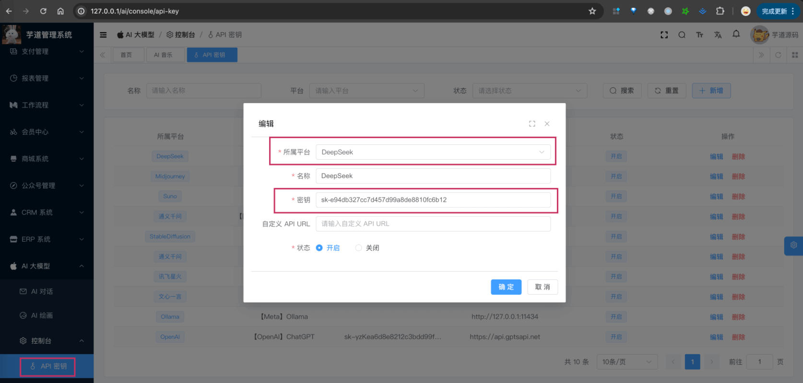

目录

# 【模型接入】DeepSeek

项目基于 Spring AI + 自己实现的 `models/deepseek`，实现 [DeepSeek (opens new window)](https://www.deepseek.com/) 的接入：

功能

模型

Spring AI 客户端

AI 对话

deepseek-chat、deepseek-coder

DeepSeekChatModel

AI 绘画

暂不支持

暂不支持

## [#](#_1-申请密钥) 1. 申请密钥

[DeepSeek (opens new window)](https://github.com/deepseek-ai) 是开源模型，可以私有化部署。

不过因为它的价格非常便宜，只有 OpenAPI 的 gpt-4-0125-preview 的 1/72 左右，所以我建议直接使用官方的服务。

### [#](#_1-1-申请-deepseek-密钥) 1.1 申请 DeepSeek 密钥

① 在 [DeepSeek 开放平台 (opens new window)](https://platform.deepseek.com/) 上，注册一个账号。目前，默认注册就送 500w tokens，还是蛮爽的。

② 在 [API keys (opens new window)](https://platform.deepseek.com/api_keys) 菜单，创建一个 API key 即可。

* * *

申请完成后，可以在我们系统的 \[AI 大模型 -> 控制台 -> API 密钥\] 菜单，进行密钥的配置。只需要填写“密钥”，不需要填写“自定义 API URL”（因为 Spring AI 默认官方地址）。如下图所示：



### [#](#_1-2-补充说明) 1.2 补充说明

如果后续你要体验 [《AI 对话》](/ai/chat/) ，需要在 \[AI 大模型 -> 控制台 -> 聊天模型\] 菜单，配置对应的聊天模型。注意，每个模型标识的 `max_tokens`（回复数 Token 数）可能没有限制，可以先填写 4096。

具体有哪些模型，可以去官方文档查看。例如说：`deepseek-chat`、`deepseek-coder` 等等。

## [#](#_2-如何使用) 2. 如何使用？

① 如果你的项目里需要直接通过 `@Resource` 注入 DeepSeekChatModel 等对象，需要把 `application.yaml` 配置文件里的 `yudao.ai.deep-seek` 配置项，替换成你的！

```yaml
yudao:
  ai:
    deep-seek:
      enable: true
      api-key: sk-e94db327cc7d457d99a8de8810fc6b12 # 你的 API Key
      model: deepseek-chat

```

② 如果你希望使用 \[AI 大模型 -> 控制台 -> API 密钥\] 菜单的密钥配置，则可以通过 AiApiKeyService 的 `#getChatModel(...)` 方法，获取对应的模型对象。

* * *

① 和 ② 这两者的后续使用，就是标准的 Spring AI 客户端的使用，调用对应的方法即可。

另外，DeepSeekChatModelTests 里有对应的测试用例，可以参考。