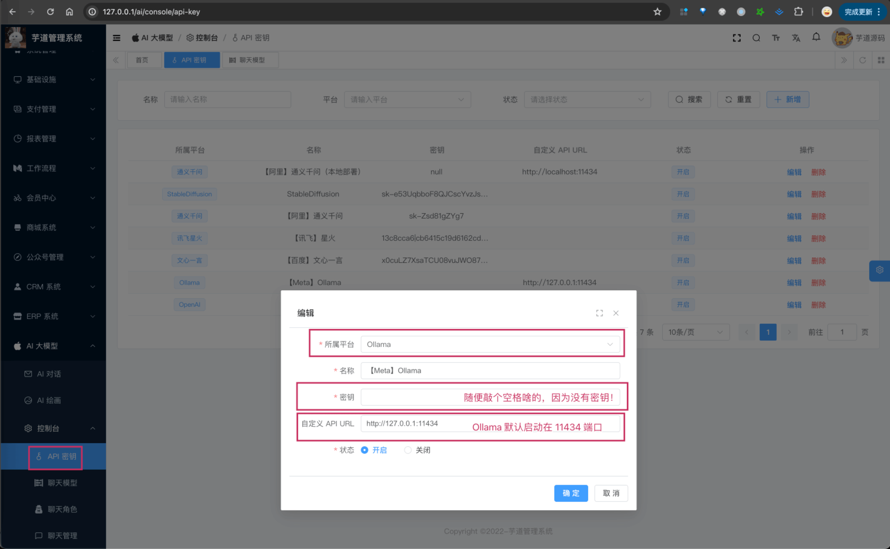

目录

# 【模型接入】LLAMA

项目基于 Spring AI 提供的 [`spring-ai-ollama` (opens new window)](https://github.com/spring-projects/spring-ai/tree/main/models/spring-ai-ollama)，实现 Llama 的接入：

功能

模型

Spring AI 客户端

AI 对话

llama3、llama2

[Ollama Chat (opens new window)](https://docs.spring.io/spring-ai/reference/api/chat/ollama-chat.html)

AI 绘画

[llama3 支持生成图片 (opens new window)](https://new.qq.com/rain/a/20240420A005CK00)

暂未支持

## [#](#_1-申请密钥-私有部署) 1. 申请密钥（私有部署）

Llama 是 Meta 开源的模型，所以可以私有化部署。

### [#](#_1-1-私有化部署) 1.1 私有化部署

① 访问 [Ollama 官网 (opens new window)](https://ollama.ai/download)，下载对应系统 Ollama 客户端，然后安装。

② 安装完成后，在命令中执行 `ollama run llama3` 命令，一键部署 `llama3` 模型。

* * *

部署完成后，可以在我们系统的 \[AI 大模型 -> 控制台 -> API 密钥\] 菜单，进行密钥的配置。需要填写“密钥” + “自定义 API URL”（因为让 Spring AI 使用该地址）。如下图所示：



### [#](#_1-2-补充说明) 1.2 补充说明

如果后续你要体验 [《AI 对话》](/ai/chat/) ，需要在 \[AI 大模型 -> 控制台 -> 聊天模型\] 菜单，配置对应的聊天模型为 `llama3`，然后它的 `max_tokens`（回复数 Token 数）填写 4096 即可。

## [#](#_2-如何使用) 2. 如何使用？

① 如果你的项目里需要直接通过 `@Resource` 注入 OllamaChatModel 等对象，需要把 `application.yaml` 配置文件里的 `spring.ai.ollama` 配置项，替换成你的！

```yaml
spring:
  ai:
    ollama:
      base-url: http://127.0.0.1:11434 # 你的私有化部署地址
      chat:
        model: llama3

```

② 如果你希望使用 \[AI 大模型 -> 控制台 -> API 密钥\] 菜单的密钥配置，则可以通过 AiApiKeyService 的 `#getChatModel(...)` 方法，获取对应的模型对象。

* * *

① 和 ② 这两者的后续使用，就是标准的 Spring AI 客户端的使用，调用对应的方法即可。

另外，LlamaChatModelTests 里有对应的测试用例，可以参考。