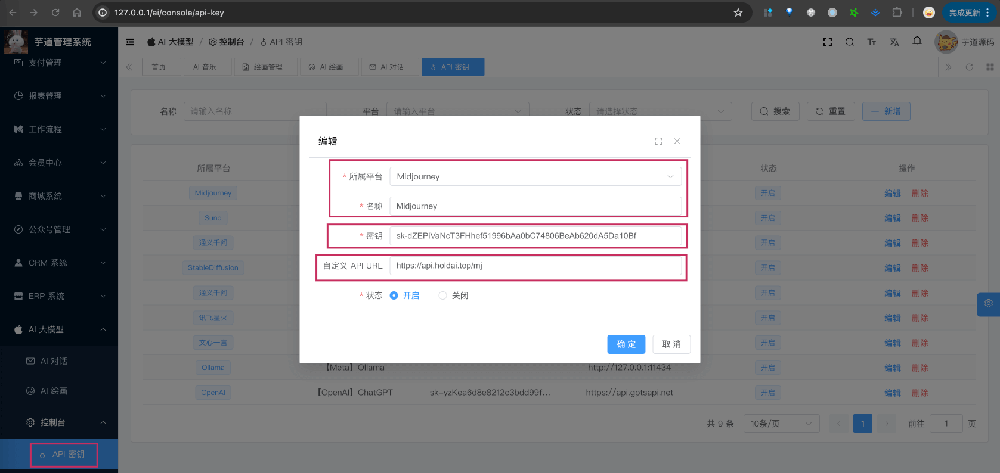

目录

# 【模型接入】Midjourney

Midjourney 是一个由位于美国加州旧金山的同名研究实验室开发之人工智能程序，可根据文本生成图像，于 2022 年 7 月 12 日进入公开测试阶段，用户可透过 Discord 的机器人指令进行操作。

由于 Midjourney 没有直接提供 API 接口，所以大家一般通过 [https://github.com/novicezk/midjourney-proxy/ (opens new window)](https://github.com/novicezk/midjourney-proxy/) 项目，代理 MidJourney 的 Discord 频道，实现 API 形式调用 AI 绘图。

也因此，Spring AI 肯定是不集成 Midjourney 的，所以我们实现的 `models/midjourney` 包下的 MidjourneyApi 类，基于上述的 `midjourney-proxy` 代理，调用 Midjourney 实现绘图的功能。

## [#](#_1-申请密钥) 1. 申请密钥

可参考 [https://github.com/novicezk/midjourney-proxy/blob/main/README\_CN.md (opens new window)](https://github.com/novicezk/midjourney-proxy/blob/main/README_CN.md) 文档，申请相关账号，并搭建 `midjourney-proxy` 代理。

不过这个方式比较麻烦，我自己暂时没跑通。我是在 [毫秒 API (opens new window)](https://api.holdai.top/register?aff=EcRu) 注册了一个账号，然后通过他们的 API 代理 Midjourney 的。这个是需要付费的，测试的话，建议只小额充值 1-10 块。

* * *

申请完成后，可以在我们系统的 \[AI 大模型 -> 控制台 -> API 密钥\] 菜单，进行密钥的配置。需要填写“密钥” + “自定义 API URL”。如下图所示：



## [#](#_2-如何使用) 2. 如何使用？

① 如果你的项目里需要直接通过 `@Resource` 注入 MidjourneyApi 对象，需要把 `application.yaml` 配置文件里的 `yudao.ai.midjourney` 配置项，替换成你的！

```yaml
yudao:
  ai:
    midjourney:
      enable: true
      base-url: https://api.holdai.top/mj
      api-key: sk-dZEPiVaNcT3FHhef51996bAa0bC74806BeAb620dA5Da10Bf
      notify-url: http://java.nat300.top/admin-api/ai/image/midjourney/notify

```

*   `base-url`：Midjourney 代理的地址，相关的接口文档可见 [https://gpt-best.apifox.cn/doc-3530863 (opens new window)](https://gpt-best.apifox.cn/doc-3530863)
*   `notify-url`：Midjourney 生成图片后的回调地址，因为 Midjourney 生成图片是异步的，所以需要回调通知。这个 URL 可以分成两个小部分：
    *   `http://java.nat300.top`：你的服务器地址。如果你没外网，可以通过 [《内网穿透》](/natapp) 解决
    *   `/admin-api/ai/image/midjourney/notify`：对应 AiImageController 的 `#midjourneyNotify(...)` 方法

另外，考虑到 Midjourney 回调失败的情况，可以把项目的 AiMidjourneySyncJob 定时器类，配置每 1 分钟执行一次，检查是否有未回调的图片。怎么使用定时器，可以参考 [《定时任务》](/job) 文档。

② 如果你希望使用 \[AI 大模型 -> 控制台 -> API 密钥\] 菜单的密钥配置，则可以通过 AiApiKeyService 的 `#getMidjourneyApi()` 方法，获取对应的 MidjourneyApi 对象。

另外，MidjourneyApiTests 里有对应的测试用例，可以参考。