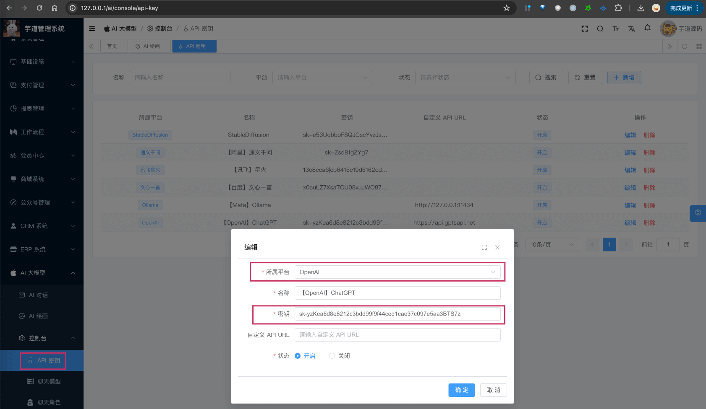
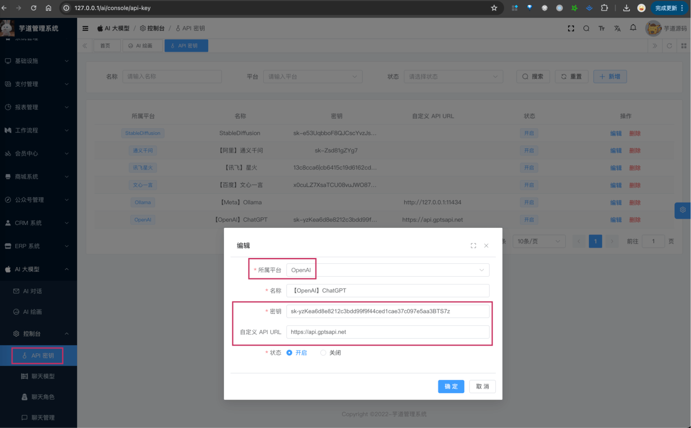

目录

# 【模型接入】OpenAI

项目基于 Spring AI 提供的 [`spring-ai-openai` (opens new window)](https://github.com/spring-projects/spring-ai/tree/main/models/spring-ai-openai)，实现 OpenAI 的接入：

功能

模型

Spring AI 客户端

AI 对话

gpt3.5、gpt4.0 等

[OpenAI Chat (opens new window)](https://docs.spring.io/spring-ai/reference/api/chat/openai-chat.html)

AI 绘画

[DALL (opens new window)](https://en.wikipedia.org/wiki/DALL-E)

[OpenAI Image Generation (opens new window)](https://docs.spring.io/spring-ai/reference/api/image/openai-image.html)

友情提示：

如果你使用的是微软 Azure 提供的 OpenAI 服务，可阅读 [《【模型接入】微软 OpenAI》](/ai/azure-openai/) 文档。

## [#](#_1-申请密钥) 1. 申请密钥

由于 OpenAI 是非开源的模型，所以无法私有化部署，需要去官网申请 API Key，然后通过 Spring AI 提供的客户端接入。

不过，目前市面上有很多 OpenAI 的中转 API 服务，通过购买这些服务，也能实现接入。

疑问：什么是“中转 API 服务”？

简单来说，就是有人通过一定的渠道，获取了大量的 OpenAI、MidJourney 等 API 账号，然后部署一个 API 池子（服务）。

中转人卖给你一个 API KEY 令牌，你就可以把 AI 请求发送到他的池子：池子采取一定的算法选取一个 API 账号帮你把请求发送到大模型后端，然后再把大模型返回的结果转发给你。

下面，我们来看看这两种方式怎么申请？

### [#](#_1-1-方式一-官方-api-申请) 1.1 方式一：官方 API 申请

可以参考 [《OpenAI API keys 的申请和测试小结 》 (opens new window)](https://www.cnblogs.com/klchang/p/17352911.html) 进行申请。

会略微麻烦一些，我自己是直接采用了“方式二：中转 API 申请”。

* * *

申请完成后，可以在我们系统的 \[AI 大模型 -> 控制台 -> API 密钥\] 菜单，进行密钥的配置。只需要填写“密钥”，不需要填写“自定义 API URL”（因为 Spring AI 默认官方地址）。如下图所示：



友情提示：官方的 API 禁止国内直接访问，需要有 VPN 代理~

### [#](#_1-2-方式二-中转-api-申请) 1.2 方式二：中转 API 申请

提供中转 API 服务的有很多，也可以 Google 直接搜索“openai API 中转”，例如说：

*   [GPT\_API\_free (opens new window)](https://github.com/chatanywhere/GPT_API_free) 【可以免费领取一定额度，不多】
*   [毫秒 API (opens new window)](https://api.holdai.top/register?aff=EcRu)
*   [Wildcard 的 API 随心用 (opens new window)](https://wildcard.com.cn/api) 【我买的这个，比较贵】

友情提示：少量购买，可以使用体验即可！

* * *

购买完成后，可以在我们系统的 \[AI 大模型 -> 控制台 -> API 密钥\] 菜单，进行密钥的配置。需要填写“密钥” + “自定义 API URL”（因为让 Spring AI 使用该地址）。如下图所示：



### [#](#_1-3-补充说明) 1.3 补充说明

如果后续你要体验 [《AI 对话》](/ai/chat/) ，需要在 \[AI 大模型 -> 控制台 -> 聊天模型\] 菜单，配置对应的聊天模型。注意，每个模型标识的 `max_tokens`（回复数 Token 数）是不同的。

例如说：`gpt-3.5-turbo` 是 4096，`gpt-4-turbo` 是 8192。

不确定的话，就填写 4096 先~跑通之后，再网上查查。

## [#](#_2-如何使用) 2. 如何使用？

① 如果你的项目里需要直接通过 `@Resource` 注入 OpenAiChatModel、OpenAiImageModel 等对象，需要把 `application.yaml` 配置文件里的 `spring.ai.openai` 配置项，替换成你的！

```yaml
spring:
  ai:
    openai:
      api-key: # 你的密钥
      base-url: # 如果是中转 API，这里填写中转 API 的地址；如果是官方的，这里不需要填写

```

② 如果你希望使用 \[AI 大模型 -> 控制台 -> API 密钥\] 菜单的密钥配置，则可以通过 AiApiKeyService 的 `#getChatModel(...)` 或 `#getImageModel(...)` 方法，获取对应的模型对象。

* * *

① 和 ② 这两者的后续使用，就是标准的 Spring AI 客户端的使用，调用对应的方法即可。

另外，OpenAIChatModelTests 和 OpenAiImageModelTests 里有对应的测试用例，可以参考。